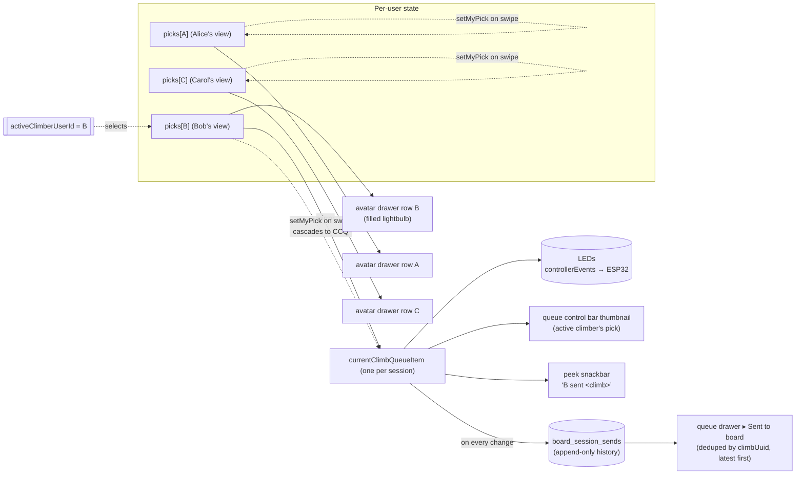

# Spec — Collaborative Sessions: Per-User Picks + Active Climber

## Context

Today's group session (3 climbers, mixed abilities) showed the Spotify-Jam–style
shared queue is the wrong model when each climber wants their own line. Two
specific failures came up:

- **One queue, many climbers.** Whatever I swipe to "becomes the climb" for
  everyone — the board changes whether or not it's my turn. Mixed-ability
  groups need to browse independently.
- **Accidental sends.** The current bar lets you swipe to a climb without
  enough friction; the LEDs change before anyone's actually ready.
- **Noisy history.** Users only care about what's _been on the board_, not the
  full queue history with duplicates and upcoming items.

We don't want to throw the shared queue out — it's mature, the wiring works,
and it matters more now that the workout generator can populate a session's
initial queue from the Start Session drawer.
What we're changing is the _binding_: instead of one shared `currentClimb`
that everyone mutates, each climber gets their own `pick`, plus exactly one
person at a time is the **active climber** whose pick is on the LEDs.

The pieces users liked stay (always-visible "what's on the board", peek
announcements). The shared queue stays (planning), but is reframed as
"plan ahead" and rescoped per-user.

## Mental Model (one diagram)



**Invariants**

1. Exactly 0 or 1 active climbers per session at a time.
2. `currentClimbQueueItem === picks[activeClimberUserId]` whenever
   `activeClimberUserId` is set. Server enforces this; clients never write
   `currentClimbQueueItem` directly via UI.
3. `setMyPick` from a non-active user changes only that user's pick.
4. `setMyPick` from the active user cascades to `currentClimbQueueItem` and
   appends a `board_session_sends` row.
5. `claimTurn` / `yieldTurn` set `activeClimberUserId` and re-mirror the new
   active user's pick to `currentClimbQueueItem`.

## Identity model

Picks and active climber are keyed by **session-user identity**, which the
codebase already models as `SessionUser.id` — that's `clientId` for anon
party joiners and a stable user ID for authenticated users. We follow the
same key the existing `addedBy` field uses (see `QueueItemUser.id` in
`packages/shared-schema/src/types/queue.ts`). No new identity primitive.

## Data Model

### New DB tables / columns (in `packages/db/src/schema/app/`)

**Add to `boardSessionQueues`** (`packages/db/src/schema/app/sessions.ts`):

- `activeClimberId TEXT NULL` — opaque session-user identity (`SessionUser.id`),
  no FK so it works for anonymous joiners. Cleared on disconnect (cleanup
  hook in `useSessionLifecycle` or server-side leave).

**New `boardSessionPicks` table** (new file
`packages/db/src/schema/app/session-picks.ts`):

```
sessionId   TEXT NOT NULL → boardSessions.id (cascade)
userId      TEXT NOT NULL                       -- SessionUser.id
pick        JSONB NOT NULL                      -- ClimbQueueItem
updatedAt   TIMESTAMP NOT NULL DEFAULT now()
PRIMARY KEY (sessionId, userId)
INDEX (sessionId)
```

Picks live in their own table (not in a `jsonb` map on `boardSessionQueues`)
so the existing optimistic-locking version on `boardSessionQueues` doesn't
serialise every per-user swipe. One pick update = one row upsert.

**New `boardSessionSends` table** (new file
`packages/db/src/schema/app/session-sends.ts`):

```
id              BIGSERIAL PRIMARY KEY
sessionId       TEXT NOT NULL → boardSessions.id (cascade)
climbUuid       TEXT NOT NULL
queueItemUuid   TEXT NULL                       -- ClimbQueueItem.uuid at time of send
sentByUserId    TEXT NOT NULL                   -- caller of the mutation
activeClimberId TEXT NOT NULL                   -- whose pick is on the board
mirrored        BOOLEAN NOT NULL DEFAULT false
createdAt       TIMESTAMP NOT NULL DEFAULT now()
INDEX (sessionId, createdAt DESC)
INDEX (sessionId, climbUuid)
```

Append-only. `boardSends` query reads `DISTINCT ON (climb_uuid)` ordered by
`created_at DESC` for the dedup'd history view.

Migrations via `vp exec drizzle-kit generate` from `packages/db/`. The journal
update is automatic (CLAUDE.md: "Never manually create migration SQL files").

### GraphQL schema (`packages/shared-schema/src/schema/queue.ts`)

Add types:

```graphql
type UserPick {
  userId: ID!
  pick: ClimbQueueItem!
  updatedAt: String!
}

type BoardSend {
  id: ID!
  climbUuid: ID!
  queueItemUuid: ID
  sentByUserId: ID!
  activeClimberId: ID!
  mirrored: Boolean!
  createdAt: String!
  climb: Climb! # joined for the history view
}
```

Extend `QueueState`:

```graphql
type QueueState {
  # ...existing fields...
  picks: [UserPick!]!
  activeClimberId: ID
}
```

Extend the `QueueEvent` union with three new event types:

```graphql
type PickChanged {
  sequence: Int!
  userId: ID!
  pick: ClimbQueueItem!
}
type PickCleared {
  sequence: Int!
  userId: ID!
}
type ActiveClimberChanged {
  sequence: Int!
  userId: ID
} # null when nobody active
type BoardSendAdded {
  sequence: Int!
  send: BoardSend!
}
```

These ride the existing `queueUpdates` subscription channel, so the
client-side fan-out machinery in `useEventProcessor` /
`use-session-subscriptions` doesn't need a new transport.

### GraphQL operations (`packages/shared-schema/src/operations.ts`)

Add three mutations and one query:

```graphql
setMyPick(item: ClimbQueueItemInput!, correlationId: ID): UserPick!
claimTurn(correlationId: ID): ClimbQueueItem!
yieldTurn(toUserId: ID!, correlationId: ID): ClimbQueueItem!
clearMyPick: Boolean!

boardSends(sessionId: ID!, deduplicate: Boolean = true, limit: Int = 50): [BoardSend!]!
```

Mark `setCurrentClimb` `@deprecated(reason: "Use setMyPick + claimTurn")` —
keep operational for solo mode and for programmatic callers (the
controller's BLE-initiated unknown-climb path). UI no longer calls it.

`EVENTS_REPLAY` and `QUEUE_UPDATES` documents in `operations.ts` extend
their inline fragments with `PickChanged`, `PickCleared`,
`ActiveClimberChanged`, `BoardSendAdded`. `FullSync` payload picks up the
new `picks` and `activeClimberId` fields on `QueueState`.

## Backend resolvers

### Mutations — `packages/backend/src/graphql/resolvers/queue/mutations.ts`

All three new mutations follow the existing patterns: `applyRateLimit`,
`requireSession`, `validateInput`, optimistic-lock retry against the
`boardSessionQueues.version`, then `pubsub.publishQueueEvent`. Reuse
`logMutationMetrics`, the `MAX_RETRIES` import, and the `VersionConflictError`
catch block from `setCurrentClimb`.

- **`setMyPick(item, correlationId)`**
  - Upsert `boardSessionPicks (sessionId, userId)` with the new item.
  - Read `boardSessionQueues.activeClimberId`.
  - If caller === activeClimberId: also update `boardSessionQueues.currentClimbQueueItem` (use `roomManager.updateQueueState` so `version`/`sequence` advance) and append a `boardSessionSends` row.
  - Publish `PickChanged`. If active, also publish `CurrentClimbChanged` (with `correlationId`, for echo suppression) and `BoardSendAdded`.

- **`claimTurn(correlationId)`**
  - Caller must have `picks[me]` set (else throw `ValidationError`).
  - Set `activeClimberId = me`, mirror `picks[me]` into `currentClimbQueueItem`, append `boardSessionSends`.
  - Publish `ActiveClimberChanged`, `CurrentClimbChanged` (with `correlationId`), `BoardSendAdded`.
  - Idempotent: if already active, re-mirror the same pick (re-publish `CurrentClimbChanged` so the LEDs re-light — recovery from a flaky BT reconnect).

- **`yieldTurn(toUserId, correlationId)`**
  - `picks[toUserId]` must be set.
  - Caller need NOT be the current active climber (matches "tap any peer's row" UX). Anyone can hand the wall to anyone; `sentByUserId = caller`, `activeClimberId = toUserId`.
  - Set `activeClimberId = toUserId`, mirror that user's pick to `currentClimbQueueItem`, append `boardSessionSends`.
  - Publish `ActiveClimberChanged`, `CurrentClimbChanged`, `BoardSendAdded`.

- **`clearMyPick()`** — delete `boardSessionPicks (sessionId, me)`. If I was the active climber, also clear `activeClimberId` and `currentClimbQueueItem`. Publish `PickCleared` (+ optional `ActiveClimberChanged(null)` / `CurrentClimbChanged(null)`).

`setCurrentClimb` resolver remains unchanged in behaviour; a one-line guard logs a deprecation warning when called by a non-controller client so we can track residual usage before removing.

### Queries — `packages/backend/src/graphql/resolvers/queue/queries.ts`

New `boardSends(sessionId, deduplicate, limit)`:

- Validate session membership (`requireSessionMember`).
- Drizzle query: when `deduplicate=true`, use `db.execute(sql`...`)` with `DISTINCT ON (climb_uuid) ... ORDER BY climb_uuid, created_at DESC` then re-sort by `created_at DESC` in JS (DISTINCT ON requires the discriminator to lead the ORDER BY). When `deduplicate=false`, plain `db.select().orderBy(desc(createdAt)).limit(limit)`. Both paths join `climbs` (or whichever per-board climb table the session's `boardPath` resolves to) for the `climb` field.
- This is one of the legitimate raw-SQL exceptions per CLAUDE.md (DISTINCT ON isn't expressible cleanly in Drizzle's query builder).

### Subscriptions — `packages/backend/src/graphql/resolvers/queue/subscriptions.ts`

No structural change. The new event types are added to the `QueueEvent`
union resolver in `type-resolvers.ts`. The eager-iterator subscription in
`queueUpdates.subscribe` relays them unchanged. The initial `FullSync`
payload picks up `picks` and `activeClimberId` automatically once
`roomManager.getQueueState` returns them.

`packages/backend/src/services/room-manager` needs:

- `getQueueState` to also load picks + activeClimberId.
- A new `updatePick(sessionId, userId, pick)` and `setActiveClimber(sessionId, userId | null)` helper, plus `appendBoardSend(sessionId, send)`.

### Controller subscription — `packages/backend/src/graphql/resolvers/controller/subscriptions.ts`

**No code change required.** The controller subscribes to `CurrentClimbChanged` and `FullSync` for LED updates. Because `setMyPick`/`claimTurn`/`yieldTurn` all update `currentClimbQueueItem` server-side when the active climber's pick changes, the existing event chain wires LEDs automatically. Verified against `subscriptions.ts:216–242`.

## Frontend state

### Reducer + types — `packages/web/app/components/queue-control/`

`types.ts`:

```ts
type UserPick = { userId: string; pick: ClimbQueueItem; updatedAt: string };

type QueueState = {
  // ...existing fields...
  picks: Record<string /* userId */, ClimbQueueItem>;
  activeClimberId: string | null;
  pendingPickUpdates: string[]; // correlation IDs (mirror pendingCurrentClimbUpdates)
  pendingActiveClimberUpdates: string[];
};

type QueueAction =
  // ...existing...
  | { type: 'SET_MY_PICK'; payload: { userId: string; pick: ClimbQueueItem; correlationId: string } }
  | {
      type: 'DELTA_PICK_CHANGED';
      payload: { userId: string; pick: ClimbQueueItem; isServerEvent?: boolean; serverCorrelationId?: string };
    }
  | { type: 'DELTA_PICK_CLEARED'; payload: { userId: string } }
  | {
      type: 'DELTA_ACTIVE_CLIMBER_CHANGED';
      payload: { userId: string | null; isServerEvent?: boolean; serverCorrelationId?: string };
    }
  | { type: 'DELTA_BOARD_SEND_ADDED'; payload: { send: BoardSend } }; // currently only used by analytics; history reads from React Query
```

`reducer.ts`:

- Add cases for the new actions, mirroring the echo-suppression pattern from `DELTA_UPDATE_CURRENT_CLIMB` (correlation-ID list, dedup by uuid, etc.).
- The existing `DELTA_UPDATE_CURRENT_CLIMB` stays as is — it now fires _as a consequence_ of `setMyPick(activeUser)` / `claimTurn` / `yieldTurn`, never directly from a UI swipe. No reducer-level branching needed.

### Mutation surface — `packages/web/app/components/persistent-session/hooks/use-queue-mutations.ts`

Add `setMyPick`, `claimTurn`, `yieldTurn`, `clearMyPick` using the existing
`executeWithLatestWins` serialize-and-supersede helper for `setMyPick`
(every swipe triggers it, so coalescing matters). `claimTurn` / `yieldTurn`
fire one-shot — plain `execute` is fine.

Client-side debouncing: 200ms trailing debounce on `setMyPick` for
non-active climbers (browse mode, no LED change → no need for snappy
feedback). Active climber's swipes go through immediately so the LEDs
follow. Implemented as a wrapper at the call site (the swipe handler in
the play view drawer) that reads `activeClimberId === me` and chooses
debounced vs. immediate. Server still ratelimits if the wrapper is
bypassed.

### Persistent session context — `packages/web/app/components/persistent-session/persistent-session-context.tsx`

Add `setMyPick`, `claimTurn`, `yieldTurn`, `clearMyPick` to
`PersistentSessionActionsType`. Add `picks` and `activeClimberId` to
`PersistentSessionStateType`. Wire them through `useEventProcessor`,
`useQueueMutations`, and the actions/state value `useMemo`s (mirror
the existing fields).

### QueueBridge — `packages/web/app/components/queue-control/queue-bridge-context.tsx`

Extend the solo/party fan-out adapter so `setMyPick` etc. are exposed
through `useQueueActions`. In solo mode (no active session), `setMyPick`
collapses to `setCurrentClimb` against the local-only queue and `claimTurn`
is a no-op — solo users never see the picks UI surfaces.

## Frontend UI

### Pre-requisite: revert the FAB cluster

`packages/web/app/components/queue-control/queue-control-fab.tsx` and the
`queueBarFab` experiment wiring (`useExperiment('queueBarFab')`,
`fabMinimisedEnabled` references inside `queue-control-bar.tsx:157–209`)
are removed. The bar reverts to always-`expanded`. The FAB unit tests
under `queue-control/__tests__/queue-control-fab.test.tsx` and the FAB
state-machine assertions in `queue-control-bar-state-machine.test.tsx`
are deleted (the latter retains only the always-expanded paths).

The peek snackbar moves from `queue-control-fab.tsx` back into
`queue-control-bar.tsx` (it was originally there pre-FAB; restore that
section). Copy becomes "<active climber username> sent <climb name>" —
attribution by `activeClimberId`.

### Queue control bar (`queue-control-bar.tsx`)

The always-visible session surface. Adapt:

- **Thumbnail** = active climber's pick (i.e. `currentClimbQueueItem`).
  Reuse `ClimbThumbnail` as today.
- **Active climber avatar** overlays the thumbnail (small, anchored
  bottom-right). Reuse `TickBadgeAvatar` (defined inline at line 104) —
  add a variant prop or a sibling `ActiveClimberAvatar` if the visual
  treatment diverges enough.
- **Tap target on bar body** → opens play view drawer. Mode resolution:
  - `me === activeClimberId` → `edit` (my pick is the active climb anyway).
  - else → `spectate` (the bar represents the active climb; opening it shows that).
- **Queue button** → opens the queue drawer. Defaults to "Sent to board" history tab.
- **Participant bar** (the existing `participantBar` block,
  `queue-control-bar.tsx:1194–1250`) is replaced by the new avatar
  drawer (see below). The collapsed avatar group at line 1148–1168
  stays as the entry-point chip.

### Play view drawer (`packages/web/app/components/play-view/play-view-drawer.tsx`)

Add a `mode: 'spectate' | 'edit'` state with these resolution rules at open time:

- I'm active → `edit`.
- Opened from the queue control bar → `spectate` (see invariants above).
- Opened from search results / climb detail / liked list / etc. → `edit` on my own pick.

**Spectate mode:**

- Renders the active climber's pick on the board canvas. Reuse
  `BoardRenderer` / the existing `SwipeBoardCarousel`'s static-render
  variant — but disable the swipe handlers (`useCardSwipeNavigation`
  hook gets `disabled: true`). Prev / next icons hidden.
- Bottom button row replaces the standard action bar with an avatar stack:
  active climber avatar in front, my avatar tucked partially behind, with
  a small transfer icon overlaid in the top-right of the stack.
- Tapping the transfer icon → switches `mode` to `edit`. The drawer
  transitions to my pick on the board canvas; from there swipe / prev /
  next changes my pick.
- Lightbulb is hidden (claiming requires switching to edit first).

**Edit mode:**

- Carousel/swipe handlers call `setMyPick` (via
  `useQueueActions().setMyPick`) — not `setCurrentClimb`. The server
  cascades to `currentClimbQueueItem` automatically when I'm active; the
  client doesn't branch.
- A prominent **lightbulb button** appears above the action bar.
  - Filled when `activeClimberId === me`. Tap = re-light (re-publish
    `claimTurn` with current correlationId; idempotent server-side path
    already re-mirrors the pick to LEDs).
  - Outlined otherwise. Tap = `claimTurn()`. If `useBluetoothContext()`
    reports neither me nor any peer is BT-connected (peer connection
    state isn't in the client today — see Open Decisions), open the
    `device-picker-dialog.tsx` from `board-bluetooth-control/` first;
    only run `claimTurn` after the dialog resolves.
- A small "Active climber" pill or accent border on the board canvas
  when `activeClimberId === me`, distinguishing "looking at my pick"
  (outlined lightbulb) from "this is on the board now" (filled
  lightbulb + accent).
- Bottom button row shows my own avatar. When someone else is active, a
  small "go back to spectate" button sits next to my avatar — symmetric
  with the spectate-mode transfer icon.

`SetActiveAction` (`packages/web/app/components/climb-actions/actions/set-active-action.tsx`)
is repurposed: tapping it now means **"set this climb as my pick"**
(`setMyPick`), not "send to board". It loses the BT pre-connect side-effect
(that lives on the lightbulb). Label changes from "Set Active" to
"Pick this climb"; "Currently active" stays for the case where it equals my
current pick.

### Avatar drawer (party-manager)

The expanded participant bar in `queue-control-bar.tsx:1194–1250` becomes
a richer per-user list — keep it inline in the bar (no new drawer is
strictly needed; the expand/collapse animation already exists). Per row:

- Avatar (reuse `TickBadgeAvatar`).
- Username + pick climb name + grade. (If no pick: "No pick yet" — row disabled.)
- Lightbulb icon next to the active climber's name (filled). No
  lightbulb on other rows.
- The whole row is the tap target.
  - My own row → `claimTurn()`.
  - Someone else's row → `yieldTurn(theirUserId)`.
  - Empty-pick row → no-op (disabled style).
  - BT pre-connect rule applies in both cases.
- No swipe-through-other-people's-state. The row only reflects their
  _current_ pick — there's no surface to navigate someone else's
  imagined queue.

### Queue drawer (`packages/web/app/components/queue-control/queue-list.tsx`)

Major refactor target. The drawer becomes two stacked surfaces controlled
by a top tab strip:

**Tab 1 — "Sent to board" (default)**

- Backed by a new `useBoardSends(sessionId)` React Query hook (in
  `queue-control/hooks/`) that issues the `boardSends` query with
  `deduplicate=true`. Subscribes to `BoardSendAdded` deltas via the
  existing `subscribeToQueueEvents` to invalidate / prepend.
- Server-side dedup'd, latest first, capped at 50.
- Reuse `QueueClimbListItem` for row rendering with a presentational
  variant that hides drag handles + swipe-to-remove + edit affordances
  (history is read-only).
- Replaces today's `history-divider` + `history-item` rows in the flat
  virtualizer. The reducer no longer needs to compute `historyItems`
  from the queue.

**Tab 2 — "Plan ahead" (existing shared queue, reframed)**

- A scope switcher at the top: **My queue** (default — `addedBy === me`),
  **All** (everyone, queue order), and one button per connected peer
  (filters to their items).
- Renders `QueueClimbListItem` rows from `queue` filtered by scope.
- **Tap any row** → `setMyPick(item.climb)`. Same handler regardless of
  scope. Confirms the spec invariant: tapping in the queue never
  affects the board for non-active climbers; for the active climber it
  cascades through `currentClimbQueueItem` → LEDs.
- Drag-and-drop reorder + swipe-to-remove are enabled only on
  `addedBy === me` rows. Other users' rows render the same content but
  without those affordances. Server-side enforcement (see Open
  Decision 8 below) backs this up.
- The active scope is local UI state (component-level `useState`), not
  synced.
- Existing `addQueueItem` / `removeQueueItem` / `reorderQueueItem`
  mutations are unchanged.

The "current item + future items" partitioning that
`queue-list.tsx:218–284` does today goes away — the active climb is
shown in the bar and in the play view, not in the queue drawer. The
queue drawer becomes purely planning + history.

### Files touched (summary)

Schema / DB:

- `packages/db/src/schema/app/sessions.ts` (add column)
- `packages/db/src/schema/app/session-picks.ts` (new)
- `packages/db/src/schema/app/session-sends.ts` (new)
- `packages/db/src/schema/app/index.ts` (re-export)
- `packages/db/drizzle/...` (generated via `vp exec drizzle-kit generate`)

Shared schema:

- `packages/shared-schema/src/schema/queue.ts`
- `packages/shared-schema/src/schema/mutations.ts`
- `packages/shared-schema/src/schema/queries.ts`
- `packages/shared-schema/src/schema/subscriptions.ts`
- `packages/shared-schema/src/types/queue.ts`
- `packages/shared-schema/src/operations.ts`

Backend:

- `packages/backend/src/graphql/resolvers/queue/mutations.ts`
- `packages/backend/src/graphql/resolvers/queue/queries.ts` (add `boardSends`)
- `packages/backend/src/graphql/resolvers/queue/type-resolvers.ts` (new union members)
- `packages/backend/src/services/room-manager` (pick + active-climber + send-append helpers; `getQueueState` extended)
- `packages/backend/src/validation/schemas.ts` (add `UserIdSchema`, etc.)
- `packages/backend/test/...` (new tests for `setMyPick`, `claimTurn`, `yieldTurn`, `boardSends`, dedup)

Frontend state:

- `packages/web/app/components/queue-control/types.ts`
- `packages/web/app/components/queue-control/reducer.ts`
- `packages/web/app/components/queue-control/__tests__/reducer.test.ts` (new pick action coverage)
- `packages/web/app/components/persistent-session/hooks/use-queue-mutations.ts`
- `packages/web/app/components/persistent-session/hooks/use-event-processor.ts`
- `packages/web/app/components/persistent-session/persistent-session-context.tsx`
- `packages/web/app/components/persistent-session/types.ts`
- `packages/web/app/components/queue-control/queue-bridge-context.tsx`
- `packages/web/app/components/graphql-queue/QueueContext.tsx`

Frontend UI:

- `packages/web/app/components/play-view/play-view-drawer.tsx`
- `packages/web/app/[board_name]/[layout_id]/[size_id]/[set_ids]/[angle]/play/[climb_uuid]/play-view-client.tsx`
- `packages/web/app/components/queue-control/queue-list.tsx`
- `packages/web/app/components/queue-control/queue-control-bar.tsx` (revert FAB; restore peek inline; new avatar overlay; new participant bar layout)
- `packages/web/app/components/queue-control/queue-control-fab.tsx` (deleted)
- `packages/web/app/components/queue-control/queue-control-fab.module.css` (deleted)
- `packages/web/app/components/queue-control/__tests__/queue-control-fab.test.tsx` (deleted)
- `packages/web/app/components/queue-control/__tests__/queue-control-bar-state-machine.test.tsx` (FAB-state assertions removed)
- `packages/web/app/components/climb-actions/actions/set-active-action.tsx` (repurpose; copy + analytics event)
- `packages/web/app/components/board-bluetooth-control/` (no code change; called from new sites)

i18n catalog:

- `packages/shared/i18n/locales/en-US/session.json` — new keys for "Pick this
  climb", "Take the wall", "No pick yet", "<user> sent <climb>", history
  tab labels, plan-ahead scope chips, transfer icon ARIA, etc.

### Reuse map (don't reinvent)

- `BoardRenderer` (`packages/web/app/components/board-renderer/board-renderer.tsx`) — already supports thumbnail / medium / full sizes; reused for the avatar-row pick thumb, the spectate canvas, and the edit canvas.
- `SwipeBoardCarousel` + `useCardSwipeNavigation` — drives `setMyPick` instead of `setCurrentClimb`.
- `device-picker-dialog.tsx` (`board-bluetooth-control/`) — reused as the pre-claim BT prompt.
- Echo-suppression / correlation-ID machinery in the reducer — same pattern, applied to picks + active climber.
- `executeWithLatestWins` in `use-queue-mutations.ts` — applied to `setMyPick`.
- `QueueClimbListItem` — variant prop hides drag/swipe/edit for history rows and other-users' plan-ahead rows.
- `TickBadgeAvatar` (`queue-control-bar.tsx:104`) — extended into the avatar drawer rows (avatar + check-badge + active-lightbulb-badge variant).
- `QueueBridgeContext` solo/party fan-out — extended to route pick mutations the same way it routes queue mutations.

## Behaviour matrix

| Scenario                        | UI surface tapped | Mutation                                | LEDs change?                | History append?    | Other clients see                                                        |
| ------------------------------- | ----------------- | --------------------------------------- | --------------------------- | ------------------ | ------------------------------------------------------------------------ |
| Non-active climber swipes       | Play view (edit)  | `setMyPick`                             | No                          | No                 | `PickChanged` for that user                                              |
| Active climber swipes           | Play view (edit)  | `setMyPick` (cascades)                  | Yes                         | Yes                | `PickChanged`, `CurrentClimbChanged`, `BoardSendAdded`                   |
| Tap own outlined lightbulb      | Play view (edit)  | `claimTurn` (BT prompt if needed)       | Yes                         | Yes                | `ActiveClimberChanged`, `CurrentClimbChanged`, `BoardSendAdded`          |
| Tap own filled lightbulb        | Play view (edit)  | `claimTurn` (idempotent re-light)       | Yes (re-light)              | Yes                | `CurrentClimbChanged`, `BoardSendAdded`                                  |
| Tap peer's row in avatar drawer | Bar               | `yieldTurn(peer)` (BT prompt if needed) | Yes                         | Yes                | `ActiveClimberChanged(peer)`, `CurrentClimbChanged`, `BoardSendAdded`    |
| Tap own row in avatar drawer    | Bar               | `claimTurn`                             | Yes (if not already active) | Yes                | same as outlined-lightbulb tap                                           |
| Tap row in plan-ahead queue     | Queue drawer      | `setMyPick`                             | only if I'm active          | only if I'm active | `PickChanged`, optional `CurrentClimbChanged` + `BoardSendAdded`         |
| Tap transfer icon (spectate)    | Play view         | local — switch mode to edit             | No                          | No                 | nothing                                                                  |
| Disconnect                      | (lifecycle)       | `clearMyPick` (or server-side cleanup)  | If I was active, yes        | No                 | `PickCleared`, `ActiveClimberChanged(null)`, `CurrentClimbChanged(null)` |

## Open decisions (need user input before build)

1. **Pick broadcast cadence.** Default proposal: 200ms trailing debounce on
   `setMyPick` for non-active climbers; immediate (no debounce) for the
   active climber so LEDs stay snappy. OK?
2. **LED strobe risk.** Hardware-side risk: rapid `CurrentClimbChanged`
   events while the active climber swipes fast. The controller resolver
   already serialises with an event queue
   (`controller/subscriptions.ts:191`), but it can backlog. Add a 100ms
   server-side debounce on the LED publish if observed; otherwise leave
   alone for v1.
3. **Hard-switch vs. confirm on `claimTurn`.** Default: hard-switch when
   tapping your own outlined lightbulb while someone else is active. Add a
   "Take the wall from <name>?" confirmation only if user testing flags
   accidental hand-offs. Confirm "no confirmation" is acceptable for v1.
4. **Filled-lightbulb tap.** Default: re-light (re-send LEDs, idempotent).
   Confirm.
5. **Server-side permission tightening on `removeQueueItem` /
   `reorderQueueItem`.** Today: anyone can mutate any item. Spec proposal:
   reject when caller `!== addedBy`. **Decision needed** — there may be
   valid "host cleans up the queue" cases. Recommended: enforce, with an
   explicit `host_can_override` capability for the session creator if
   that case ever materialises.
6. **Peer Bluetooth state in client.** The "if any peer is connected, no
   prompt" rule needs the client to know other peers' BT status. Today
   `useBluetoothContext` is per-client. Either (a) add a
   `bluetoothConnected: boolean` field to `SessionUser` and have each
   client publish their state via an existing presence event, or (b)
   simplify v1 to "prompt only if _I_ am not BT-connected". Recommended: (b)
   for v1 — it covers the dominant case (one phone is the LED driver) and
   skips a presence-protocol expansion.
7. **Active-climber identity for anonymous users.** Use `SessionUser.id`
   (i.e. `clientId` for anon, `userId` for auth) — consistent with
   existing `addedBy`. Note that this means anon picks/active state is
   ephemeral across reconnects (a reconnect creates a new `clientId`).
   Acceptable for v1.
8. **Solo mode behavior.** Picks UI hidden entirely when there's no
   active session — `setMyPick` collapses to today's `setCurrentClimb`,
   `claimTurn`/`yieldTurn` are unavailable, no avatar drawer / lightbulb
   surface, no spectate mode. Confirm.

## Migration & rollout

- Sessions in flight when this ships start with `picks={}` and
  `activeClimberId=null`. The existing `currentClimbQueueItem` keeps
  driving the LEDs as today. The first lightbulb tap initialises both
  the user's pick and the active-climber state. No backfill required.
- `boardSessionPicks` / `boardSessionSends` are new tables — empty until
  the first interaction.
- Single feature flag `sessionPicks` (add to the existing experiments
  registry — same machinery as `queueBarFab`). Backend can accept the
  new mutations without the flag; the UI only surfaces the new flow when
  the flag is on. Internal dogfood for one week with the testing crew,
  then flat rollout.

## Verification

### Manual end-to-end (the sequence to run after build)

1. `vp run dev`. Three browser profiles signed in as
   `test@boardsesh.com` and two seeded social users. All three join the
   same party session on the same board.
2. **Drawer mode resolution.** With User A active, User B taps the queue
   control bar. Expect: play view opens in spectate mode, A's avatar in
   front, B's avatar tucked behind, transfer icon top-right, swipe
   disabled. B taps transfer icon → drawer switches to edit on B's
   pick. From A's device, A taps the bar → opens directly in edit mode.
3. **Browse isolation.** B and C swipe in edit mode. A's LEDs and A's
   board view are unchanged. All three see picks update in the avatar
   drawer. B and C see outlined lightbulbs.
4. **Claim flow.** B taps outlined lightbulb. Expect: LEDs change to B's
   climb; B's lightbulb fills; A's lightbulb flips to outlined; avatar
   drawer marks B as active; peek snackbar shows "B sent <climb>".
5. **Active swipe → board follows.** B (now active) swipes in edit mode.
   LEDs update with no extra action; new climb appended to history; A
   and C see B's new pick reflected.
6. **No-BT case.** Disconnect Bluetooth. C taps outlined lightbulb. BT
   dialog appears before the claim completes.
7. **Yield via avatar row.** A taps C's row in the avatar drawer. Wall
   switches to C's pick; C is marked active; C's pick state unchanged;
   A's pick state unchanged; no swipe-through-others surface present.
8. **History dedup.** After 5 distinct active-pick changes with two
   repeats, open the queue drawer. History tab shows 3 unique rows,
   latest first; no upcoming/queued items.
9. **Plan-ahead per-user views.** A adds 3 climbs, B adds 2, C adds 0.
   Open queue drawer.
   - A's device: My queue = 3, All = 5, B = 2, C = 0.
   - B's device: My queue = 2, A = 3.
   - C's device: My queue = 0, All = 5.
   - Tapping any climb in any view sets that user's pick. Shared queue unchanged. LEDs unchanged unless tapper is active.
   - A cannot drag/remove B's items (UI affordance hidden, server rejects if attempted via dev tools).
10. **Solo regression.** Sign out into a solo session. Old behaviour
    preserved: `setCurrentClimb` flows, no picks UI, no avatar drawer.

### Automated

- `vp check` and `vp run typecheck` pass across web / backend / db / shared.
- `vp test run --reporter=agent` passes.
- New backend tests in `packages/backend/test/`:
  - `setMyPick` (active vs. non-active caller cascade, version conflict retry, echo correlation IDs).
  - `claimTurn` (no pick → reject; idempotent on already-active; emits the correct three events).
  - `yieldTurn` (caller need not be active; target with no pick → reject).
  - `boardSends` (dedup correctness; non-dedup latest-first; pagination cap).
  - `setCurrentClimb` deprecation warning fires on non-controller callers.
- New reducer tests in `packages/web/app/components/queue-control/__tests__/reducer.test.ts`:
  - `DELTA_PICK_CHANGED` — local correlation echo suppression.
  - `DELTA_ACTIVE_CLIMBER_CHANGED` — null transition; mid-session change.
  - `SET_MY_PICK` — pending correlation tracking.
- New Playwright spec `packages/web/e2e/session-picks.spec.ts`:
  drives two browser contexts through the claim flow + a yield handoff.
