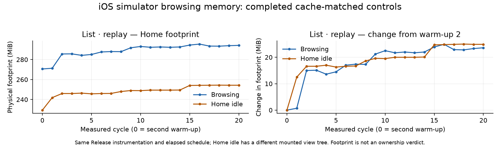
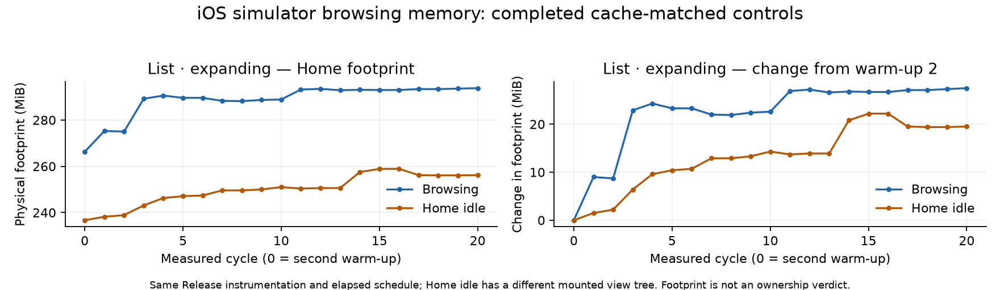
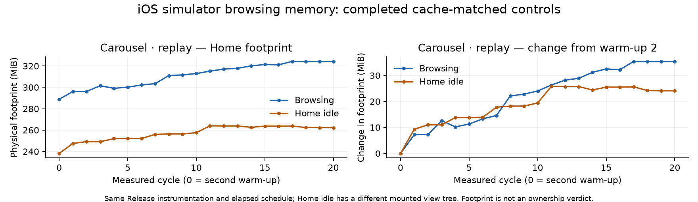
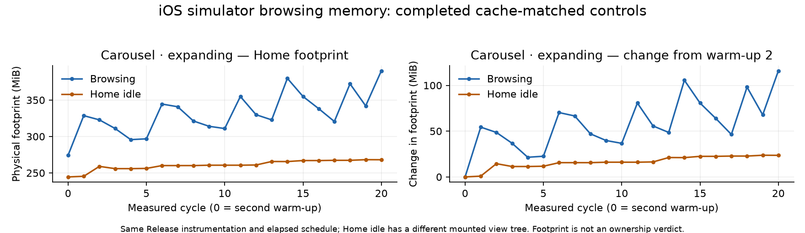

# iOS browsing memory investigation — 9 September 2026

This investigation uses the reviewed app at `c84dfacc8` with opt-in memory
instrumentation. It preserves readiness gates, app data, and cache limits. No
application retention defect has been established. Simulator observations do not
establish physical-device memory or performance budgets.

The delivery branch preserves newer changes on `main`, including #5334's list
thumbnail preservation. These captures describe the frozen reviewed source at
`c84dfacc8`; they do not measure that newer application behavior.

## Controlled setup

- Simulator: **Boardsesh Performance Comparison 2026-09-08**, iPhone 17 Pro,
  iOS 26.5, `EF3B3CC1-A130-4254-82A6-6ADCA7423106`.
- Source: dedicated `/private/tmp/boardsesh-memory-profile-baseline` checkout;
  Release executable with an embedded Hermes bundle. Instrumentation is enabled
  with `EXPO_PUBLIC_PROFILE_MEMORY=1` and startup readiness observation with
  `EXPO_PUBLIC_PROFILE_STARTUP=1`.
- Account: local seeded `test@boardsesh.com`; its actual backend user ID is checked
  against the manifest. Tokens are never exported by memory diagnostics.
- Board: The Pump Station, Tension layout 10, size 6, sets 12 and 13, at 40°.
  Actual runtime configuration and effective Aura rendering are checked.
- Workload: 400 unique, compatible climbs frozen from the production Drizzle
  search against the local catalogue, ordered by ascents descending. The first
  is **Masquerade**, the last **A Fine Line**. Frame hashes accompany UUIDs as
  source provenance; runtime observations check UUIDs and configuration, not
  the bytes of the currently loaded climb frames.
- Backend: the local seeded database and backend at `http://localhost:8198`.

The shared simulator lease covers installation, navigation, and captures. The
runner checks executable and bundle hashes, process start identity, runtime ID,
command identity, sequence, and checkpoint timestamps. No simulator erase,
application uninstall, keychain reset, or cache-policy adjustment is used.

OTA updates remain enabled in this local Release build. Its update checks fail
with HTTP 400 because no channel is configured; that startup work is present in
these measurements. A read-only audit found only embedded-update database entries.
The current entry matches the frozen embedded manifest, and the native launcher
resolves that entry to the embedded `main.jsbundle`. This supports embedded
execution retrospectively; the diagnostic snapshots do not directly export a
per-launch update ID. The actual embedded Expo runtime is
`296198af47a24bec0c7baa75f938038a8cc3bb70`, distinct from the separately recorded
native fingerprint `2bba2c60ae36f3d914afe10e996460d0aefa6c91`.

The [final OTA audit](ios-browsing-memory-2026-09-09/ota-provenance.json), collected
after all captures, used a SQLite online backup from a read-only connection and
parsed all 778 copied native-log lines. The database still contains only two
embedded status-5 entries; the current ID and runtime match the frozen bundle,
with 37 successful and zero failed launches recorded for that entry. Within the
capture window, 341 log entries contain 62 errors, all for the missing channel,
and no JSRuntimeError. No persisted updates-configuration override is present.
This supports the retrospective embedded-launch inference; it does not provide
a direct update ID for each launch or imply that OTA checking was disabled.

## Measurement contract

List and carousel workloads use the production list, row recycler, activation
path, drawer, renderer, and prefetch components. Profile-only scalar commands
scroll to UUID-checked production list indexes; carousel browsing uses native
swipes. They do not inject substitute climb objects or fixture views.

Replay revisits the first twenty climbs. Expanding cycles introduce twenty
additional target climbs each time. Viewport overlap and prefetch observations
are exported separately, so twenty targets do not imply only twenty rendered
climbs. `renderKeys` includes cache hits and cancelled requests; it is not an
allocation count.

The [observed identifiers](ios-browsing-memory-2026-09-09/observed-identifiers.json)
export each completed cycle's browsing-endpoint UUIDs and render keys separately.
Those arrays record the cycle's history, not objects still mounted at that instant.

Per-cycle growth exports pair the cumulative union of measured browsing UUIDs
with that cycle's Home footprint and its change from the second warm-up:
[list replay](ios-browsing-memory-2026-09-09/list-replay.distinct-growth.csv),
[list expanding](ios-browsing-memory-2026-09-09/list-expanding.distinct-growth.csv),
[carousel replay](ios-browsing-memory-2026-09-09/carousel-replay.distinct-growth.csv),
and [carousel expanding](ios-browsing-memory-2026-09-09/carousel-expanding.distinct-growth.csv).
Warm-up identifiers and later Home-only observations are excluded from those
unions. Repeated replay cycles intentionally have the same distinct-climb count;
these counts describe observed content, not surviving allocations.

Each workload warms disk artifacts through normal rendering in a separate
process. The measured Release process then runs two warm-up cycles followed by
twenty measured cycles, sampling settled surface, after browsing, confirmed
background/cache-clear completion, and settled Home. Incomplete rendering,
missing visibility, overflow, stale observations, and process replacement reject
the capture. Idle controls replay a completed run's elapsed checkpoint schedule,
with a two-second tolerance for both checkpoint requests and sample completion.

After the first expanding carousel preparation stopped near the original
sixty-second whole-flow deadline, a reviewed host-only option made that deadline
explicit and recorded each flow's completion status. The replacement expanding
capture uses ninety seconds prospectively; its idle reference must use the same
setting. The default remains sixty seconds. Per-target waits, render draining,
background clearing, cache matching, and the frozen app are unchanged. These
protocol versions are recorded separately rather than silently treating the
rejected attempt as complete.

The ninety-second idle retry later exposed a concrete runner defect: a child
reported `ETIMEDOUT` while returning status zero. The coordinator rejected the
capture and stopped its owned process group. The delivered runner now rejects
any memory Maestro flow spawn error independently of exit status, with regressions for timeout and
output overflow. The earlier successful ninety-second references have complete
[flow-result records](ios-browsing-memory-2026-09-09/flow-result-audit.json) independently checked for errors; older sixty-second runs
did not retain precise spawn results and cannot receive that same audit.

Because the failed control's preceding flows already took about 88 seconds, a
fresh reference/control pair used the existing 120-second option prospectively.
Both completed with the corrected runner and identical settings. The ninety-second
reference remains a solo observation; deadline equality is not waived to pair
it with the new control. The frozen application and all per-target, drain,
background, and cache-content gates remain unchanged.

Cache inventories include thumbnail/overlay PNGs, native SDImageCache files, and
Expo image assets. Comparisons check paths, sizes, and SHA256; raw timestamps are
retained but normal cache hits change them. Matching file hashes cannot establish
identical LRU ordering, decoded image state, or allocator state. A completed run
alone does not establish equivalence with another run's starting cache.

The simulator is exclusively leased on a shared development host. The workflow
does not isolate unrelated host activity or equalize thermal and scheduling
state. Longer successful browsing flows in later runs therefore do not identify
a code-level slowdown; timing-matched idle controls still have these limits.

The production list requests 30 climbs per page and retains fetched pages under
one infinite-query key, without a `maxPages` cap. Its mounted native tab continues
observing that query on Home. With full, stable, nonduplicate pages, reaching
target index 399 requires at least fourteen pages, or 420 fetched records;
incidental end-reach can fetch more. This is a source-derived expectation, not a
measured query-object count. Virtualized image counts need not track retained
catalogue records, and background image-cache clearing does not clear those pages.

Foregrounding can refetch previously loaded pages. The diagnostic drain checks
image rendering and cache-clear completion, not query fetching, so an accepted
Home sample does not establish that every query refetch has settled. Query data,
mounted images, disk files, and allocator memory are separate sources of growth;
this instrumentation cannot assign a byte cost to each of them.

The carousel activation path can additionally refresh suggestions in 100-record
pages, up to ten pages, aiming for at least 250 climbs after the activated climb.
For example, activation at index 380 can retain a 700-record prefix under that
policy. This is another source-derived expectation rather than a measured object
count. Its asynchronous refresh is also outside the image-render drain. Existing
preferences and suggestion limits are preserved; actual displayed UUIDs decide
capture validity, since climb-name text selectors can match substrings.

## Ownership capability

The first Instruments probe omitted the simulator target and could not locate
the app PID. It is a targeting failure, not an unavailable-tool conclusion.
With the explicit simulator target, Allocations attached but its ten-second
recording did not complete within thirty seconds. The owned recorder group was
stopped; the incomplete trace is retained and excluded from measurements.

`leaks --outputGraph` and `vmmap -summary` produced usable local artifacts.
An unrestricted live `heap --addresses=all` report exceeded the bounded output
limit and reported restricted process contents. Reading a bounded heap summary
from the saved memory graph succeeded instead.

The initial, unauthenticated pre-browse capability graph contained 331,952 malloc nodes and
77,989,754 allocated bytes; `leaks` reported zero unreachable leaks. This single
Home observation is setup evidence only, excluded from authenticated comparisons,
and does **not** establish absence of browsing retention. Comparing
surviving objects and inspecting their reference chains remains necessary before
attributing growth to an application owner. Allocation stack logging and Hermes
inspection are separate supplemental capabilities, not prerequisites silently
assumed to exist in an ordinary Release process.

## Completed ordinary measurements

The list replay completed all 88 checkpoints in one measured Release process
over 28.29 minutes. Its matched idle control also completed all 88 checkpoints.
The two warm-up cycles are excluded from the distributions below. Percentiles
use nearest rank: p50 is the tenth ordered observation out of twenty, not the
midpoint of the tenth and eleventh. The raw runner artifact names this p50 field
`median`. The expanding
list run and its idle control are also complete, along with carousel replay.
The warmed carousel replay's idle control is complete. The first completed expanding carousel
workload is a valid solo observation; its idle control failed cache matching.
Two completed expanding references remain solo observations after rejected controls.
The final 120-second reference and its matching idle control are complete. In total,
eleven ordinary runs are published, including four matched browsing/idle pairs
and three solo references. Separate list and carousel replay ownership
comparisons are complete below.

| List replay checkpoint | Minimum MiB | p50 MiB | p95 MiB | Maximum MiB |
| --- | ---: | ---: | ---: | ---: |
| Settled list | 270.2 | 291.6 | 294.6 | 295.9 |
| After browsing | 270.2 | 291.6 | 294.3 | 295.8 |
| Confirmed background | 266.8 | 288.2 | 291.0 | 292.5 |
| Settled Home | 271.3 | 292.3 | 294.5 | 295.5 |

Home rose from 271.3 MiB in measured cycle one to 294.2 MiB in cycle twenty
(+22.9 MiB). The first warm-up Home reading was 260.4 MiB. Replaying twenty
targets observed the same 27 distinct visible UUIDs, 30 mounted/prefetched UUIDs,
and 36 render keys including other Home art. The overlay index stayed at its
existing 200-entry limit. Measured foreground checkpoints reported 19 image
surfaces and 66 image layers; all background checkpoints reported zero. Pending
renders and cache clears were zero at every accepted checkpoint.

All 416 starting cache files (8,424,031 bytes) retained identical paths, sizes,
and hashes through cycle twenty. This excludes disk-cache population growth as
an explanation for this particular sequence; it does not attribute its footprint
growth to an application owner.

The idle process stayed on Home apart from matching background transitions. Its
starting 416 cache files matched the replay by path, size, and hash; 23 files
had modification-time-only differences. Across all 88 checkpoints, the largest
request-time difference was 79 ms and the largest sample-completion difference
was 943 ms, below the two-second rejection threshold.

| Matched idle checkpoint | Minimum MiB | p50 MiB | p95 MiB | Maximum MiB |
| --- | ---: | ---: | ---: | ---: |
| Settled Home | 230.1 | 248.8 | 254.3 | 254.3 |
| Scheduled browsing endpoint | 230.1 | 248.8 | 254.2 | 254.2 |
| Confirmed background | 226.9 | 245.5 | 250.9 | 251.0 |
| Returned Home | 241.9 | 249.0 | 254.3 | 254.4 |

From the second warm-up Home checkpoint through cycle twenty, replay increased
23.6 MiB and idle increased 24.9 MiB. From measured cycle one instead, those
increases were 22.9 MiB and 12.4 MiB: the idle process's initial step happened
earlier. Both starting points are shown to preserve that distinction.

This single pair does not establish browsing-specific retention. Idle and
browsing have different mounted view trees, and matching disk files does not
equalize decoded image caches, LRU order, or allocator state. The ownership graphs
below also do not establish an application defect.

The [individual samples](ios-browsing-memory-2026-09-09/list-replay.samples.csv)
include warm-ups, phase timing, run identity, UUID cardinalities, and counters.
The [formatted manifest](ios-browsing-memory-2026-09-09/climbs-manifest.json) records
all 400 targets and catalogue hashes. [Provenance](ios-browsing-memory-2026-09-09/provenance.json)
includes the original manifest's byte hash, source hashes, and executable identity.
The [idle samples](ios-browsing-memory-2026-09-09/list-idle-replay.samples.csv) and
[timing/cache comparison](ios-browsing-memory-2026-09-09/list-replay-idle-comparison.json)
retain the complete control evidence.

### Expanding list

All 88 checkpoints completed in one measured Release process over 28.19 minutes.
The twenty measured cycles covered 400 targets, with 407 distinct visible UUIDs,
410 mounted/prefetched UUIDs, and 416 render keys including Home art.

| Expanding list checkpoint | Minimum MiB | p50 MiB | p95 MiB | Maximum MiB |
| --- | ---: | ---: | ---: | ---: |
| Settled list | 266.1 | 289.3 | 293.0 | 293.2 |
| After browsing | 269.1 | 289.8 | 293.7 | 293.8 |
| Confirmed background | 266.3 | 286.4 | 290.3 | 290.4 |
| Settled Home | 275.0 | 290.6 | 293.6 | 293.8 |

Home rose from 266.3 MiB after the second warm-up to 293.8 MiB at cycle twenty
(+27.5 MiB); measured cycle one was 275.3 MiB (+18.5 MiB to the endpoint).
Every measured foreground checkpoint had 19 image surfaces and 66 image layers;
every background checkpoint had zero. The overlay index remained at 200 entries,
and accepted checkpoints had no pending render or cache-clear work.

The expanding run started and ended with the same 467 cache files, 9,323,916
bytes, with identical paths and hashes. Its preparation added 51 files relative
to the earlier replay's starting cache. Consequently, the replay-versus-expanding
comparison fails the starting-cache match requirement. Their absolute footprints
cannot be used as a controlled comparison of the two browsing patterns.

The [individual expanding samples](ios-browsing-memory-2026-09-09/list-expanding.samples.csv)
and [rejected cache comparison](ios-browsing-memory-2026-09-09/list-pattern-cache-comparison.json)
preserve those observations. Interpretation against the expanding run's own
matched idle control follows below.

The expanding run's idle control also completed 88 checkpoints. Its 467 starting
cache files matched by path, size, and hash; 365 modification times differed after
normal warming. The largest checkpoint-request difference was 129 ms and the
largest sample-completion difference was 1,590 ms, within the two-second gate.

| Expanding matched idle checkpoint | Minimum MiB | p50 MiB | p95 MiB | Maximum MiB |
| --- | ---: | ---: | ---: | ---: |
| Settled Home | 238.2 | 249.9 | 258.8 | 258.8 |
| Scheduled browsing endpoint | 238.1 | 249.9 | 258.8 | 259.0 |
| Confirmed background | 234.8 | 246.6 | 255.5 | 255.6 |
| Returned Home | 238.2 | 250.4 | 258.9 | 258.9 |

From warm-up zero to cycle twenty, Home increased 27.5 MiB with expanding
browsing and 19.5 MiB with idle. From measured cycle one, the increases were
18.5 and 18.0 MiB. The idle control also has a later step and a subsequent decline,
visible in the full timeline. These single runs, their different mounted view
trees, and the query/allocator limitations above do not establish a browsing leak.

The [expanding idle samples](ios-browsing-memory-2026-09-09/list-idle-expanding.samples.csv)
and [paired timing/cache observations](ios-browsing-memory-2026-09-09/list-expanding-idle-comparison.json)
retain all individual measurements and comparison checks.

### Initial carousel replay

All 88 checkpoints completed over 36.38 minutes in one measured Release process.
The same twenty target UUIDs were actually displayed each cycle. Across measured
cycles there were twenty distinct visible UUIDs, twenty-three mounted/prefetched
UUIDs, and forty-eight render keys including Home art.

| Carousel replay checkpoint | Minimum MiB | p50 MiB | p95 MiB | Maximum MiB |
| --- | ---: | ---: | ---: | ---: |
| Settled drawer | 287.9 | 320.7 | 331.0 | 332.1 |
| After swiping | 289.3 | 322.0 | 332.4 | 332.6 |
| Confirmed background | 285.1 | 317.9 | 328.3 | 328.5 |
| Settled Home | 290.8 | 321.6 | 330.9 | 331.9 |

Home rose from 288.3 MiB after the second warm-up to 330.4 MiB at cycle twenty
(+42.1 MiB), or +39.6 MiB from measured cycle one. Every measured drawer checkpoint
had three image surfaces and nine layers; background had zero, and Home had
nineteen surfaces and sixty-six layers. The overlay index remained at 200 entries
and no accepted checkpoint had pending render or cache-clear work.

The 490 starting cache files, 12,481,795 bytes, retained identical contents through
cycle twenty. This starting inventory differs from the earlier list replay's 416
files, so their absolute footprints fail the cache-match requirement for a
controlled comparison between surfaces. The
[individual carousel samples](ios-browsing-memory-2026-09-09/carousel-replay.samples.csv)
and [rejected starting-cache comparison](ios-browsing-memory-2026-09-09/replay-surface-cache-comparison.json)
retain the evidence. No matched idle comparison is available for this initial
490-file run; footprint growth alone does not establish a leak.

The first carousel idle attempt failed the starting-cache check after its two
warm-ups. Normal preparation created one additional 116,459-byte `wfull` PNG;
all original 490 files remained unchanged. That file has the same SHA256 as its
existing `w1110` variant. Source and saved observations support a pre-layout
current/peek image request with unspecified width, followed by measured width
1110; requested widths form separate keys even when the native output is clamped
to identical dimensions. The exact initiating surface/event order was not captured.

The solo replay above remains valid, but the failed idle attempt is excluded
from comparisons. Its files and eight warm-up samples are preserved. A fresh
replay/control pair was collected from the naturally warmed 491-file state;
no files were deleted and the matching requirement was not relaxed.

### Carousel replay from the warmed cache

The replacement replay completed all 88 checkpoints over 38.67 minutes. Its 491
cache files, 12,598,254 bytes, matched the preserved warmed inventory at the start
and retained identical contents through cycle twenty. App instrumentation and
the twenty-target replay protocol were unchanged.

| Warmed carousel replay checkpoint | Minimum MiB | p50 MiB | p95 MiB | Maximum MiB |
| --- | ---: | ---: | ---: | ---: |
| Settled drawer | 288.9 | 313.0 | 325.8 | 325.9 |
| After swiping | 292.2 | 313.4 | 324.8 | 324.8 |
| Confirmed background | 287.7 | 309.3 | 320.7 | 320.7 |
| Settled Home | 296.1 | 312.9 | 324.3 | 324.3 |

Home increased from 288.9 MiB after the second warm-up to 324.3 MiB at cycle
twenty (+35.4 MiB), or +28.2 MiB from measured cycle one. The
[replacement replay samples](ios-browsing-memory-2026-09-09/carousel-replay-warmed.samples.csv)
are retained separately from the initial solo replay.

The replacement idle control completed all 88 checkpoints. Its 491 starting files
matched by path, size, and hash; 31 modification times differed after normal
warming. Maximum checkpoint-request and sample-completion differences were
260 ms and 377 ms respectively, within the two-second gate.

| Matched carousel idle checkpoint | Minimum MiB | p50 MiB | p95 MiB | Maximum MiB |
| --- | ---: | ---: | ---: | ---: |
| Settled Home | 239.6 | 256.4 | 263.8 | 263.9 |
| Scheduled browsing endpoint | 239.7 | 256.4 | 263.8 | 263.8 |
| Confirmed background | 236.2 | 252.9 | 260.3 | 260.3 |
| Returned Home | 247.5 | 257.6 | 263.9 | 264.0 |

From the second warm-up to cycle twenty, Home grew 35.4 MiB during carousel
replay and 24.1 MiB during idle. From measured cycle one, growth was 28.2 and
14.8 MiB respectively. The time series shows changes in both processes. This
single pair cannot attribute the difference to an application owner. The separate
carousel ownership comparison below also does not establish an application defect.

The [matched carousel idle samples](ios-browsing-memory-2026-09-09/carousel-idle-replay.samples.csv)
and [paired timing/cache evidence](ios-browsing-memory-2026-09-09/carousel-replay-idle-comparison.json)
belong to the 491-file replacement pair only.

### Initial completed expanding carousel

The replacement expanding capture completed all 88 checkpoints in one Release
process over 46.42 minutes. Before that process started, all twenty cache-warming
flows completed normally; the longest took 65.8 seconds. Both preparation and
measurement used the explicitly recorded ninety-second whole-flow limit.

| Expanding carousel checkpoint | Minimum MiB | p50 MiB | p95 MiB | Maximum MiB |
| --- | ---: | ---: | ---: | ---: |
| Settled carousel | 287.2 | 328.7 | 361.2 | 362.0 |
| After browsing | 316.8 | 339.3 | 383.8 | 391.6 |
| Confirmed background | 308.3 | 330.9 | 375.0 | 382.8 |
| Settled Home | 279.7 | 327.0 | 370.2 | 378.6 |

Home rose from 280.6 MiB after the second warm-up to 329.7 MiB after cycle twenty
(+49.1 MiB), or +50.0 MiB relative to measured cycle one. The path was not
monotonic: Home reached 378.6 MiB in cycle seventeen before ending lower.
Measured browsing observations covered all 400 target UUIDs, 403 distinct
mounted/prefetched UUIDs, and 846 render keys. Increasing content counts and a
variable footprint do not by themselves identify retained objects.

The carousel reported three image surfaces and nine layers at every measured
checkpoint on the settled carousel or after browsing, zero while backgrounded,
and nineteen or twenty surfaces with 66 or 69 layers on Home. The overlay index remained at 200, with no pending
renders or cache clears at accepted checkpoints. These bounded mounted counts
remain distinct from retained query pages and native/JS allocation ownership.
Home had nineteen surfaces in cycle one and twenty in every later cycle; its
footprint continued to fluctuate while the image count stayed fixed. Snapshots
export aggregate counts, not a surface-to-UUID ownership map, so the exact
additional component cannot be identified from these records.

All 912 starting cache files, totaling 67,161,301 bytes, had identical paths,
sizes, and hashes at cycle twenty. The attempted idle control added one startup
thumbnail and failed its 913-versus-912 starting-cache check after its two warm-ups.
It has no accepted twenty-cycle measurement sequence. This expanding run remains
a valid solo observation; a future control from the 913-file state cannot validate
this pair retrospectively. The later reference/control pair below uses its own naturally warmed starting
state. The
[individual samples](ios-browsing-memory-2026-09-09/carousel-expanding.samples.csv)
and [growth against distinct climbs](ios-browsing-memory-2026-09-09/carousel-expanding.distinct-growth.csv)
preserve each observation.

### Warmed expanding carousel

The new reference completed all 88 checkpoints in one Release process over
52.96 minutes. All 42 preparation and measured browsing flows completed with
status zero, no reported spawn error or signal, and no timeout. The longest
took 87.8 seconds, below the unchanged ninety-second limit.

| Warmed expanding carousel checkpoint | Minimum MiB | p50 MiB | p95 MiB | Maximum MiB |
| --- | ---: | ---: | ---: | ---: |
| Settled carousel | 294.2 | 352.6 | 368.1 | 368.7 |
| After browsing | 307.2 | 351.7 | 361.8 | 362.1 |
| Confirmed background | 302.0 | 346.9 | 357.0 | 357.2 |
| Settled Home | 287.8 | 346.3 | 360.4 | 360.7 |

Home rose from 296.0 MiB after the second warm-up to 358.6 MiB after cycle twenty
(+62.6 MiB), or +46.0 MiB from measured cycle one. Measured browsing covered
400 visible UUIDs, 403 mounted/prefetched UUIDs, and 846 render keys. These
observations do not establish which allocations survived or why.

Measured carousel checkpoints stayed at three image surfaces and nine layers;
background checkpoints reported zero. Home reported nineteen surfaces and 66
layers in cycle one, then twenty and 69 in cycles two through twenty. The overlay
index stayed at 200, and all accepted checkpoints had no pending render or clear
work. The aggregate counters do not identify the additional Home component.

All 913 starting files, totaling 67,170,079 bytes, remained identical by path,
size, and hash at cycle twenty. Its attempted idle control reported a timeout
during warming and was rejected before ordinary measurement. This reference
remains a solo observation; it is not paired with a control using a different
deadline. The
[replacement samples](ios-browsing-memory-2026-09-09/carousel-expanding-warmed.samples.csv)
and [growth against distinct climbs](ios-browsing-memory-2026-09-09/carousel-expanding-warmed.distinct-growth.csv)
remain separate from the earlier 912-file solo observation.

### Expanding carousel with the 120-second flow deadline

The final reference, `carousel-expanding-06`, completed all 88 checkpoints in
one Release process over 62.28 minutes. It uses runner `25e78e5e1` with the same
frozen application and a prospectively selected 120-second whole-flow deadline.
All 42 preparation and measured browsing flows reported status zero, no spawn
error or signal, and no timeout. The longest took 113.05 seconds. These results
are retained in the [flow-result audit](ios-browsing-memory-2026-09-09/flow-result-audit.json).

| 120-second expanding carousel checkpoint | Minimum MiB | p50 MiB | p95 MiB | Maximum MiB |
| --- | ---: | ---: | ---: | ---: |
| Settled carousel | 282.1 | 330.9 | 367.5 | 381.7 |
| After browsing | 312.7 | 343.2 | 391.5 | 404.7 |
| Confirmed background | 307.4 | 338.3 | 386.6 | 399.7 |
| Settled Home | 295.7 | 328.6 | 379.8 | 390.1 |

Home rose from 274.2 MiB after the second warm-up to 390.1 MiB after cycle twenty
(+115.9 MiB), or +61.5 MiB from measured cycle one. The difference between these
starting points includes the initial step to 328.6 MiB in cycle one; neither
number is an allocation or leak count. Measured browsing observed 400 visible
UUIDs, 403 mounted/prefetched UUIDs, and 846 render keys.

Measured carousel checkpoints reported three image surfaces and nine layers;
background checkpoints reported zero. Home reported nineteen surfaces and 66
layers in cycle one, then twenty surfaces and 69 layers in cycles two through
twenty. The overlay index stayed at 200, and pending render and cache-clear
counters were zero at all accepted checkpoints. These counters do not identify
the owners or lifetimes of other native or JavaScript allocations.

The reference records its own normally warmed inventory: 915 files totaling
67,188,122 bytes. Paths, sizes, and hashes matched at cycle twenty. Its starting
inventory differs from the earlier 913-file reference, and its flow deadline
also differs; their absolute footprints are not a controlled comparison.

The matching idle control, `carousel-idle-expanding-03`, completed all 88
checkpoints over 62.28 minutes. Its separate preparation process completed twenty
carousel flows without a spawn error, signal, or timeout; the longest took
117.88 seconds. The measured process stayed on Home apart from its scheduled
background transitions. It used the same 120-second deadline and matched all
915 starting cache files by path, size, and hash. Modification times differed
for 830 files, consistent with normal cache access. Its own starting and ending
cache contents also matched.

Across all 88 paired checkpoints, the largest request-time difference was
265.24 ms and the largest completion-time difference was 279.61 ms, both below
the two-second gate.

| 120-second expanding matched idle checkpoint | Minimum MiB | p50 MiB | p95 MiB | Maximum MiB |
| --- | ---: | ---: | ---: | ---: |
| Settled Home | 244.5 | 260.5 | 267.2 | 268.2 |
| Scheduled browsing endpoint | 244.3 | 260.5 | 267.3 | 268.0 |
| Confirmed background | 240.7 | 257.0 | 263.8 | 264.6 |
| Returned Home | 245.4 | 260.6 | 268.1 | 268.2 |

Idle Home footprint rose from 244.5 MiB after the second warm-up to 268.1 MiB
after cycle twenty (+23.6 MiB), or +22.7 MiB from measured cycle one. Idle
foreground checkpoints consistently reported nineteen image surfaces and 66
layers; background checkpoints reported zero. The overlay index stayed at 200,
and all accepted checkpoints had no pending render or cache-clear work.

From the second warm-up, expanding carousel browsing grew 115.9 MiB versus
23.6 MiB during matched idle. From measured cycle one, growth was 61.5 MiB versus
22.7 MiB. This pair shows larger footprint growth during this browsing workload,
but does not establish an application retention defect. The mounted view trees
and query activity differ, disk matching does not equalize allocator or decoded
image state, and the separate ownership graphs cover replay rather than this
expanding workload. No surviving owner or JS object liveness has been established
for the additional growth.

The [reference samples](ios-browsing-memory-2026-09-09/carousel-expanding-120s.samples.csv),
[idle samples](ios-browsing-memory-2026-09-09/carousel-idle-expanding.samples.csv),
[paired timing and cache observations](ios-browsing-memory-2026-09-09/carousel-expanding-idle-comparison.json),
and [growth against distinct climbs](ios-browsing-memory-2026-09-09/carousel-expanding-120s.distinct-growth.csv)
preserve the completed comparison and its run and process provenance.

## List replay ownership comparison

A separate Release process completed the same two warm-ups and twenty replay
cycles, with all 88 diagnostic checkpoints valid. Saved native graphs were taken
at settled Home after warm-up cycle zero and measured cycle twenty. This process
is excluded from ordinary footprint distributions; graph collection can perturb
the process. Its starting cache contents matched the ordinary replay.

Native malloc summaries increased from 427,282 blocks / 107,807,543 bytes to
537,387 blocks / 146,918,237 bytes. These totals describe allocated blocks, not
resident footprint or live JavaScript objects. The exported
[selected class counts and graph hashes](ios-browsing-memory-2026-09-09/list-replay-ownership.json)
retain both endpoints.

The bounded `leaks --list --noContent` reports found zero unreachable leaks at
both endpoints. That conservative native scan does not establish absence of
retained application objects or garbage inside a JavaScript runtime.

| Native allocation class or counter | Home 0 | Home 20 |
| --- | ---: | ---: |
| Mounted board-image surfaces / image layers | 19 / 66 | 19 / 66 |
| ExpoImage `ImageView` | 66 | 66 |
| `SDAnimatedImageView` | 66 | 66 |
| `UIImage` / `CGImage` | 294 / 472 | 294 / 473 |
| `RCTViewComponentView` | 1,688 | 1,688 |
| React `ViewShadowNode` | 2,962 | 11,783 |
| `ExpoViewShadowNode` | 458 | 1,881 |
| `RNSTabsScreenIOS` shadow nodes | 45 | 560 |
| `FileSystemFile` / `FileSystemDirectory` | 8 / 10 | 436 / 70 |
| `SharedObjectNativeState` | 63 | 669 |
| Overlay index entries / pending renders | 200 / 0 | 200 / 0 |

Sampled growing view and tab shadow nodes have concrete native references from
`ShadowNodeWrapper` objects. Sampled reference paths above those wrappers reach
unnamed allocations and VM storage; another path includes worklet serializable
objects. This establishes native wrapper ownership, but does not identify a
specific application callback, subscription, or JavaScript root retaining obsolete
revisions. React's shadow nodes also represent immutable revisions, so their
counts cannot be read as counts of mounted screens.

Native `RNSScreen`, `RNSScreenView`, `RNSScreenStackView`, and navigation-controller
counts each remained six at both checkpoints; the tab host/controller remained
one and tab screen controllers remained five. The Boardsesh binary's shadow-node
family count also remained 351. These
[navigation allocation counts](ios-browsing-memory-2026-09-09/list-replay-navigation.json)
weigh against repeated deep links accumulating native navigation screens. They
do not measure JavaScript route-history depth or prove that old revisions are
only waiting for garbage collection.

Native image-view counts and the component-view registry's allocation size stayed
stable. Fifty-three of the 66 image-view address/class pairs appear in both
graphs. Address reuse prevents interpreting overlap as uninterrupted lifetime,
and object counts alone cannot establish unchanged pixel backing allocations.
The evidence does not support accumulating mounted image views in this replay.

Sampled file wrappers have named references from `SharedObjectNativeState.native`
and Expo's shared-object registry. The opt-in mailbox itself creates File and
Directory wrappers while polling every 250 ms and exporting snapshots. That can
contribute allocation and garbage-collection churn in both browsing and idle
processes, despite the diagnostic collector retaining only bounded scalar data.
The registry dictionary's allocation remained 20,480 bytes at both endpoints.

These graphs cannot distinguish reachable JavaScript wrappers from garbage
awaiting collection. No surviving-reference defect in application code has been
established, and no cache-policy correction is justified. Allocation-generation
and JavaScript reachability evidence remain limitations of this comparison.

A source/configuration capability check found no callable heap-snapshot or
forced-collection interface in this frozen Release build. Hermes provides native
instrumentation APIs, but the app exposes no corresponding command; the inspected
React Native Release debugger path is disabled. This was a source-level check,
not a failed live heap export. Worklet references can also belong to a separate
Hermes runtime. Enabling an inspector or adding a native entry point would require
a separately identified supplemental build and successful bounded export before
using its results.

### VM and allocator accounting

Saved `vmmap` reports from the separate ownership process show the following
printed sizes. The `M` units and rounding are preserved from the tool.

| Quantity | Home 0 | Home 20 |
| --- | ---: | ---: |
| Physical footprint | 273.3M | 295.3M |
| `VM_ALLOCATE` virtual / resident / dirty | 134.0M / 114.9M / 114.9M | 158.0M / 138.6M / 138.6M |
| Malloc zones: virtual / resident / dirty | 154.3M / 143.7M / 78.2M | 170.3M / 164.8M / 76.5M |
| Malloc zones: bytes allocated | 102.9M | 140.2M |
| CG raster residency | 16.6M | 16.5M |
| CoreAnimation residency | 16.3M | 16.3M |
| Writable regions: unallocated | 46.7M | 40.4M |

Footprint increased about 22.0M while `VM_ALLOCATE` residency and dirty memory
increased 23.7M. That broad VM tag is not a Hermes-only category. Malloc allocated
bytes, residency, and dirty memory changed by different amounts; they cannot be
used interchangeably or assigned directly to the growing shadow-node counts.
Virtual reservations also do not represent physical usage. The selected swapped
columns were zero, and image-related residency was essentially stable.

The [selected VM columns](ios-browsing-memory-2026-09-09/list-replay-vmmap.json)
retain the original categories. These VM captures occurred approximately 6.7 and
7.0 seconds after their respective memory graphs. Their malloc censuses are
therefore separate observations, not simultaneous totals that can be combined.
They support the distinction between allocator/VM growth and stable native image
populations, without proving an application leak.

## Separate carousel ownership comparison

The carousel replay inspection completed the same two warm-ups and twenty
measured cycles in a separate Release process, with all 88 diagnostic checkpoints
accepted. Its saved Home graphs contained 480,081 allocated blocks and 127,508,273
bytes at cycle zero, versus 472,770 blocks and 117,530,081 bytes at cycle twenty:
7,311 fewer blocks and 9,978,192 fewer allocated bytes. These native allocation
totals are not JS heap size or physical footprint.

Native image counts stayed bounded at both endpoints: 66 `ExpoImage.ImageView`,
66 `SDAnimatedImageView`, 299 `UIImage`, and 468 `CGImage` objects. Native screen
and navigation-controller counts also remained stable. `ViewShadowNode` decreased
from 6,188 to 3,817 and `ShadowNodeWrapper` from 6,461 to 5,110. FileSystem file
wrappers decreased from 22 to 10; directory wrappers decreased from 33 to 14.

Some worklet classes increased: `Synchronizable` from 731 to 1,580, `Shareable`
from 643 to 1,241, and `SerializableJSRef` from 6,150 to 7,935. Sampled
`Synchronizable` and `Shareable` references lead through `SerializableJSRef`,
then an untyped block and `VM_ALLOCATE`. That is concrete native ownership, but
the graph does not expose an application worklet closure, subscription, or JS
root that establishes improper retention. It also does not establish that
pending garbage collection explains the increase.

The separate VM reports show why allocation counts cannot substitute for
footprint. Printed units and rounding are preserved below.

| Quantity | Home 0 | Home 20 |
| --- | ---: | ---: |
| Physical footprint | 282.4M | 327.9M |
| `VM_ALLOCATE` virtual / resident / dirty | 146.0M / 122.5M / 122.5M | 190.0M / 168.0M / 168.0M |
| Malloc zones: virtual / resident / dirty | 178.3M / 167.0M / 78.7M | 198.3M / 192.7M / 78.7M |
| Malloc zones: bytes allocated | 121.4M | 112.1M |
| CG raster residency | 16.5M | 16.5M |
| CoreAnimation residency | 16.5M | 16.5M |

Footprint and `VM_ALLOCATE` resident/dirty memory each grew 45.5M at printed
precision, while native allocated bytes fell. The broad VM category does not
identify a Hermes-only owner. Malloc residency grew while allocated payload
decreased; capacity, residency, dirtiness, and allocated payload are different
measurements. The VM captures followed the graphs by about 6.5 and 7.0 seconds,
so their allocation censuses are separate observations. These findings support
further JS/reference investigation, without establishing an application defect
or justifying a cache-policy change.

The [selected object and reference evidence](ios-browsing-memory-2026-09-09/carousel-replay-ownership.json)
includes graph hashes and address-count intersections without raw graph contents.
Both conservative native scans reported zero unreachable leaks; this does not
establish absence of JS retention. The [selected VM columns](ios-browsing-memory-2026-09-09/carousel-replay-vmmap.json)
preserve the separate accounting observations.

## Disposition

No application retention defect has been established. The delivered change adds
profiling and capture validation; it does not change memory policy. An application
before/after/restored-baseline experiment and a defect regression test therefore
do not apply. Diagnostic bounds and runner failure handling have their own
regression coverage.

The final expanding carousel pair showed larger footprint growth than matched
idle: +115.9 versus +23.6 MiB from the second warm-up, or +61.5 versus +22.7 MiB
from measured cycle one. That observation warrants further ownership work,
without identifying an application owner or establishing a leak. The four matched
pairs and three solo references remain separate experiments; their different
starting caches and protocol versions do not form a single before/after result.

The available native graphs do not resolve JS object liveness or allocation-stack
ownership. Further investigation would need that evidence before selecting an
application correction. Newer application behavior on `main` and physical-device
memory remain unmeasured here.

## Implementation verification

The delivery branch is based on `main` at `fcab9e144`. Repository typechecking,
lint, 9,378 mobile tests in 866 files, fifty focused runner tests, and iOS/Android
and browser Metro bundle checks pass on that branch, including browser shell
and WASM assets.
The frozen instrumented capture build separately passed simulator startup smoke
and screenshot checks before measurement. No BLE code was changed.

The idle runner now requires the reference run's validated cycle-zero cache
inventory even when `--compare-cache` is omitted. That optional flag adds a
second constraint. All collected idle attempts already supplied the correct
explicit inventory, so this guard does not change their classification. The
new guard rejects missing or malformed inventories before launching the app.

## Rejected setup and control attempts

- The initial local build stopped because Sentry source-map upload required
  authentication. Local profiling was rebuilt with uploads disabled.
- The first two replay attempts rejected an absent authenticated account before
  measurement. The saved session used a different local backend signing key.
  The same fixture account was reauthenticated through the existing native
  credentials function in a temporary verified Debug shell, then the exact
  instrumented Release executable was restored. App data and other keychain
  entries were preserved; the temporary Metro was stopped before measurement.
- The first carousel idle control failed its starting-cache comparison because
  normal warming added the full-width variant described above. Its warm-up-only
  samples are excluded; the original replay remains a valid solo observation.
- The first expanding carousel attempt stopped during cache-warming batch five,
  after eighteen of nineteen successful swipes. Its log was written about 61
  seconds after the settled snapshot, consistent with the sixty-second host
  flow deadline. The original runner retained only a generic failure/timeout
  error, so the precise spawn result is unavailable. No ordinary measurements
  were accepted, and a read-only process check found no surviving Maestro flow.
  The replacement's same batch completed with status zero in 60.8 seconds under
  the explicitly recorded ninety-second limit.
- The first expanding idle control added one filled 400-pixel thumbnail before
  its first observed checkpoint. All original 912 cache files stayed identical,
  but the additional 8,778-byte file caused the required starting-cache rejection.
  A read-only catalogue lookup matches its classic-render frame hash to the
  final target, “A Fine Line,” within the 500 searched climbs. Its recorded
  modification time precedes the first observed checkpoint, consistent with
  startup rendering before Aura support resolves; the exact
  initiating component is not established. The file is preserved for a fresh
  comparison. No cache deletion or matching-rule exception is used.
- The second expanding idle control reported `ETIMEDOUT` during warming batch
  four after 90.44 seconds, despite exit status zero. The old host guard allowed
  a subsequent batch. Independent audit rejected the whole attempt, recorded
  an explicit coordinator verdict, and stopped the identity-verified runner
  group and its recorded helper descendant. No ordinary measurements were
  accepted. This directly reproduced the runner error guard regression; the
  corrected guard passed tests before the fresh 120-second pair started.
- The first 120-second reference was stopped during warming because the
  coordinator had unnecessarily required it to match the earlier ninety-second
  reference. A read-only filename check found an additional 9,349-byte startup
  thumbnail, which made that inherited gate impossible to pass. The owned runner
  and recorded helper were stopped, and no ordinary measurements were accepted.
  The next reference uses a fresh identity and records its own normally warmed
  starting inventory. Its idle control must match that inventory exactly;
  no cache file was removed and the comparison rule was not weakened.

- The second 120-second reference completed all twenty warming batches, then
  failed at measured cycle five's background checkpoint. It retained 26 partial
  samples and is excluded from ordinary comparisons. The same app process
  remained alive, but no fresh export arrived within the fixed 35-second limit.
  A later diagnostic-only foreground transition recovered an invalid export:
  background clear generation seven had started, generation six was the last
  completed clear, and no image surfaces or renders remained mounted/pending.
  The checkpoint timeout indicates earlier command adoption under a normal
  clock; it does not distinguish unfinished native clearing from a suspended JS
  promise continuation. This is an incomplete observation, not evidence of an
  app leak. The late export remains excluded. The final fresh reference and its
  matched idle control subsequently completed with the same native app and
  strict background checks.

## Evidence

Local raw evidence is retained under `.boardsesh/memory-profile-2026-09-09/`:
source and generated-input hashes, native fingerprint, build logs, executable
identities, frozen manifest, individual snapshots and samples, validity verdicts,
memory graphs, bounded tool reports, and screenshots. Invalid attempts remain in
separate directories. See [the profiling guide](ios-profiling.md) for the reusable
runner and capture contract.
