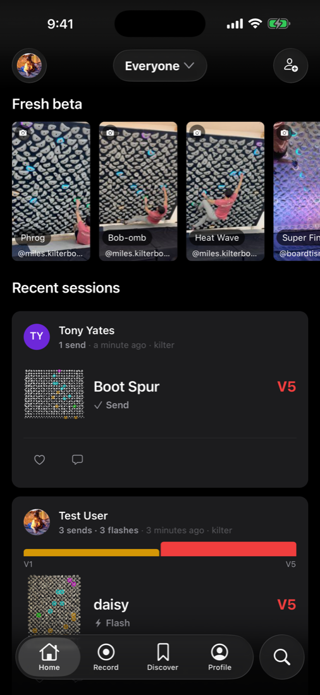

# iOS simulator screenshots (local, dev-client + Metro)

Quick screenshots of the live React Native app (`packages/mobile/`) on an iOS simulator,
for visually verifying a change or sharing the app in chat. `vp run mobile:ios-shots`
(`scripts/mobile-ios-shots.ts`) boots an iPhone simulator, installs a cached Debug
**dev-client** `.app`, starts Metro, launches the app (which auto-connects to Metro), and
captures with `xcrun simctl io screenshot`. The `.app` carries no JS — it loads from Metro —
so JS/TS changes show up without a rebuild.

This is the iOS twin of `vp run mobile:android-shots` (see `docs/android-emulator-screenshots.md`).
It is **macOS only**. For the full App Store capture matrix (all locales/devices, written to
`app-stores/apple/`), use `vp run mobile:screenshots` instead.

Example output — the Home feed captured with `screenshot --to home` (iPhone 16 Pro Max,
screenshot-mode auto-login):



## Requirements

- macOS with Xcode + Command Line Tools and an installed iOS simulator runtime.
- **Maestro** for navigation, `--to <screen>`, and `--flow`
  (`curl -Ls "https://get.maestro.mobile.dev" | bash`). A plain `home` capture doesn't need it.
- First run builds a Debug simulator `.app` (~30 min) unless you pass `--app-path`; it's cached
  at `packages/mobile/.app-cache/Boardsesh.app` and reused (only native changes force a rebuild).

## Take screenshots

Preferred "boot once, shoot many" flow — boot in the background, then capture in the foreground:

```bash
# 1. Boot (holds Metro). Run in the background; set the prod test password for real content.
SCREENSHOT_USER_PASSWORD=<prod test pw> vp run mobile:ios-shots

# 2. Capture named screens against the running simulator.
vp run mobile:ios-shots -- screenshot --to home --label home
vp run mobile:ios-shots -- screenshot --to discover --label discover
vp run mobile:ios-shots -- screenshot --to board-view --label board-view

# 3. Tear down.
vp run mobile:ios-shots -- shutdown
```

One-shot (boots, captures one screen, tears down — slower per shot, no reuse):

```bash
vp run mobile:ios-shots -- --to climbs --label climbs --shutdown
```

PNGs land in `.boardsesh/ios-screenshots/NN-<label>.png` (numbered, gitignored); the absolute
path is printed.

### Screens (`--to`)

Friendly names map to deep-link routes (kept in sync with the Android tool):

| Name             | Route                               |
| ---------------- | ----------------------------------- |
| `home`           | `home`                              |
| `climbs`         | `climbs`                            |
| `discover`       | `discover`                          |
| `profile`        | `profile`                           |
| `record`         | `record`                            |
| `board-view`     | `climbs?screenshotOpenFirst=1`      |
| `board-sheet`    | `climbs?screenshotOpenBoardSheet=1` |
| `session-detail` | `profile?screenshotTab=sessions`    |
| `logbook`        | `profile?screenshotTab=logbook`     |
| `progress`       | `profile?screenshotTab=progress`    |

Pass any raw route too, e.g. `--to 'climbs?screenshotBoardIndex=1'`. `home` (or no `--to`)
captures the current screen without navigating. The screenshot-mode query params are only
honoured when the JS bundle is in screenshot mode (the default).

## The `.app`

A Debug dev-client built by `vp run mobile:build-sim-app` and cached at
`packages/mobile/.app-cache/Boardsesh.app`. It bakes `DEV_CLIENT_DEFAULT_LAUNCHER_URL` to
`http://localhost:8081` (via `packages/mobile/plugins/with-screenshot-dev-menu.js`), so a plain
`simctl launch` auto-connects to Metro with no "Open in 'Boardsesh'?" dialog on initial load —
**but only when Metro is on port 8081** (there's no `adb reverse` on iOS to remap it). `run`
errors if `BOARDSESH_METRO_PORT` is anything else; unset it or rebuild the `.app` for that port.

## Login state

- **Prod test account (default):** export `SCREENSHOT_USER_PASSWORD`; the app auto-logs-in
  `test@boardsesh.com` (override the email with `SCREENSHOT_USER_EMAIL`). Without it the app
  stops on the login screen.
- **Local seeded data:** `vp run dev` first, then `--backend local` (seeded `test`/`test`).
- **Plain app:** `--no-screenshot-mode`. On iOS this only changes the JS/auth behaviour — the
  cached screenshot `.app` still auto-loads Metro; you just land on the login screen. A
  non-screenshot `--app-path` instead loses auto-load and can hit the scheme dialog.

`run` resets the simulator keychain by default (the shared `group.com.boardsesh.app` keychain
survives an app uninstall, so a stale token would auth against the wrong backend). Pass
`--keep-keychain` to preserve a manual login — note the reset is device-wide.

## The scheme dialog

iOS pops an "Open in 'Boardsesh'?" confirmation on the first in-session custom-scheme deep link
(inconsistently) and blocks navigation until tapped — and `simctl openurl` can't dismiss it. So
navigation goes through **Maestro** (`openLink` + an optional `tapOn "Open"`), and `run` primes
the dialog away once right after the fresh install. If you boot the simulator some other way,
the first `navigate` / `screenshot --to` may catch the dialog.

## Flags

| Flag                   | Default                      | Notes                                                            |
| ---------------------- | ---------------------------- | ---------------------------------------------------------------- |
| `--to <screen>`        | —                            | Friendly name or raw deep-link route.                            |
| `--label <name>`       | `--to` value                 | Screenshot filename label.                                       |
| `--out <dir>`          | `.boardsesh/ios-screenshots` | Output directory.                                                |
| `--device "<name>"`    | `iPhone 16 Pro Max`          | Simulator to boot/attach to.                                     |
| `--flow <name>`        | —                            | `app-store` / `onboarding` committed Maestro flow.               |
| `--backend <env>`      | `prod`                       | `prod` / `local` (`local` needs `vp run dev`).                   |
| `--app-path <app>`     | build/cached                 | Use a prebuilt `Boardsesh.app`.                                  |
| `--settle <seconds>`   | `3` (`5` heavy)              | Wait after navigation before capture.                            |
| `--no-screenshot-mode` | off                          | Plain app (login screen); JS/auth only — Metro still auto-loads. |
| `--keep-keychain`      | off                          | Skip the device-wide keychain reset.                             |
| `--shutdown`           | off                          | Tear down after the run instead of holding Metro.                |
| `--keep-alive`         | —                            | Inverse of `--shutdown` (hold Metro).                            |

## Subcommands

- `run` (default) — boot + install + Metro + launch, then hold Metro.
- `screenshot --to <screen> --label <name>` — navigate + capture on a running simulator.
- `navigate --to <screen>` — deep-link only, no capture.
- `shutdown` — shut the simulator down + stop Metro.

## Gotchas

- **macOS only**; no software-GPU/KVM story like Android — `simctl` runs the simulator natively.
- **Port 8081 is required** with the cached `.app` (baked launcher URL).
- **First run is slow** (~30-min `.app` build); cached afterward. Pass `--app-path` to skip it.
- The `screenshot` / `navigate` / `shutdown` subcommands attach to the **already-booted**
  simulator from a background `run`; they don't restart Metro. "No booted simulator" means you
  haven't started `run` yet (or it died — check its output).
