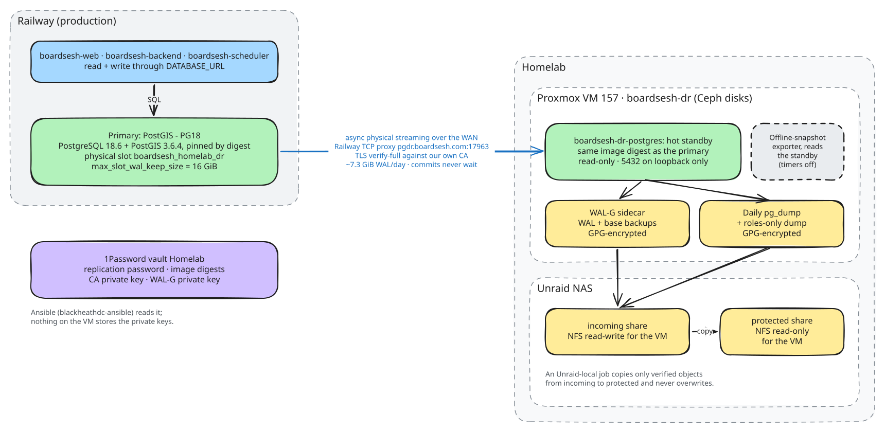
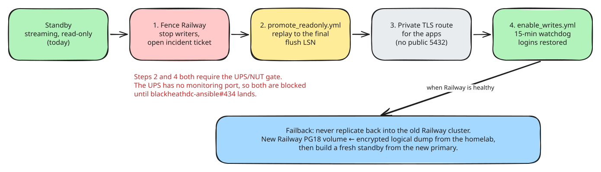

# PostgreSQL disaster recovery architecture

Production PostgreSQL runs on Railway. A homelab VM holds a streaming copy of
it and keeps encrypted backups on a NAS. This page gives the shape of the
system. The runbooks, playbooks and every safety gate live in the
`blackheathdc-ansible` repo, in `docs/BOARDSESH_POSTGRES_DR.md`.

## Components

| Part | Where | What it does |
|---|---|---|
| Primary | Railway service `PostGIS - PG18` | PostgreSQL 18.6 + PostGIS 3.6.4 from `ghcr.io/boardsesh/boardsesh-postgres-postgis`, pinned by digest (`docs/postgres-image-digests.json`). All app traffic goes here. |
| Replication link | Railway TCP proxy `pgdr.boardsesh.com:17963` | Physical streaming replication as role `boardsesh_standby`. TLS is `verify-full` against our own CA, not the system trust store. See `docs/pg-primary-tls-rollout.md`. |
| Slot | `boardsesh_homelab_dr` on the primary | Holds WAL until the standby receives it. `max_slot_wal_keep_size` is 16 GiB, about 2 days of WAL at 7.3 GiB/day. If the standby is down longer, the slot is lost and the standby needs a fresh base backup. |
| Standby | Proxmox VM 157 `boardsesh-dr`, container `boardsesh-dr-postgres` | Hot standby from the same image digest. Read-only, with port 5432 bound to loopback, so nothing outside the VM can connect. Disks are on Ceph. |
| Backups | WAL-G sidecar and daily `pg_dump` on the VM | GPG-encrypted with a public key. The WAL-G image is built here (`docs/walg-dr-image.md`). |
| Storage | Unraid NAS | The VM writes to the `incoming` share. An Unraid-local job copies verified objects to the `protected` share, which the VM can only read. |
| Secrets | 1Password vault `Homelab` | Replication password, image digests, CA private key, WAL-G private key. The private keys never live on the VM. |

## Guarantees

- **Railway never waits for the homelab.** Replication is asynchronous, so a
  homelab or WAN outage cannot slow production commits.
- **The standby cannot take writes.** It runs in recovery with
  `default_transaction_read_only=on`, and nothing automatic can promote it.
  Proxmox may restart or migrate the VM, but promotion is a manual playbook.
- **Backups survive a compromised VM.** The VM can write only to `incoming` and
  holds no decryption key.

Measured on 2026-09-25: a write on the primary was replayed on the standby in
about 1 s. A Proxmox live migration caused 26 ms of downtime. After a reboot
the standby was streaming again within 20 s.

## Failover

Failover is manual and happens in four separate steps, each with its own
confirmation token:

1. Fence Railway. Stop every writer and open an incident. A DNS change alone
   is not a fence.
2. Run `promote_readonly.yml`. It replays to Railway's final flush LSN. If
   Railway is unreachable, a degraded promotion is possible with a stated loss
   bound of at most 1 hour or 1 GiB.
3. Build a private, TLS-verified route for the apps. Port 5432 never goes
   public.
4. Run `enable_writes.yml`. A 15-minute watchdog rolls writes back to
   read-only if any proof fails.

Failback never replicates back into the old Railway cluster. It restores a
logical dump into a fresh Railway PG18 volume, then builds a new standby from
that primary.

**Known gap:** steps 2 and 4, and Proxmox HA registration, all require a
UPS/NUT readiness check. The homelab UPS has no monitoring port, so that check
cannot pass today. Until it is resolved (tracked in
`marcodejongh/blackheathdc-ansible#434`), recovery from the homelab copy is
possible, but not through the reviewed playbooks.

## Primary settings outside the image

The image's `postgresql.conf` holds the defaults. These settings are set with
`ALTER SYSTEM`, so they live in `postgresql.auto.conf` on the Railway volume.
A `pg_dump`/`pg_restore` move does not carry them, so re-apply them on any new
primary:

| Setting | Value | Why | Set (UTC) |
|---|---|---|---|
| `max_slot_wal_keep_size` | `16GB` | Caps WAL held for the homelab slot. The DR role asserts this exact value | 2026-09-24 |
| `log_connections` | `authorization` | One line per session with user, database and app, so unused credentials stay provable while `boardsesh_standby` is on a public port. PG18 made this a list setting. `all` logged 4 lines per session (98% of all log lines), and its client host is always Railway's proxy (`100.64.0.16`). Failed logins log as `FATAL` either way | 2026-09-25 |
| `wal_compression` | `lz4` | Full-page images were 12.3M of the WAL records in the 5 days after cutover. Compressing them cuts WAL egress and backup size | 2026-09-25 |
| `checkpoint_timeout` | `15min` | Was 5 min. Fewer checkpoints means fewer full-page images | 2026-09-25 |
| `max_wal_size` | `4GB` | Was 1 GB, which forced 101 extra checkpoints in 5 days | 2026-09-25 |
| `shared_preload_libraries` | `pg_stat_statements` | Per-query statistics. Needs a restart, then `CREATE EXTENSION pg_stat_statements` as superuser in `railway`. Not a migration, because the extension needs superuser | 2026-09-25 |
| `shared_buffers` | `1GB` | Sized for the 4 GB container cap. Was the initdb default of 128 MB. Needs a restart | 2026-09-26 |
| `effective_cache_size` | `2560MB` | What the planner may assume is cached under the 4 GB cap | 2026-09-26 |
| `work_mem` | `16MB` | Was 4 MB, and 3.2 TB of temp files had been written since initdb. Matches the standby | 2026-09-26 |
| `maintenance_work_mem` | `256MB` | Faster vacuum and index builds | 2026-09-26 |
| `random_page_cost` | `1.1` | The Railway volume is SSD, and more reads now come from disk | 2026-09-26 |
| `jit` | `off` | JIT spent memory and CPU compiling the 1–60 s catalogue queries | 2026-09-26 |
| `client_connection_check_interval` | `5s` | A query whose client has gone cancels itself instead of running to the end | pending |
| `tcp_keepalives_idle` / `_interval` / `_count` | `60` / `10` / `3` | Drops a dead peer after 90 s instead of about 2 h 11 min | pending |
| `track_io_timing` | `on` | I/O time in `pg_stat_statements` and `EXPLAIN` | pending |
| `log_lock_waits` | `on` | Logs lock waits over `deadlock_timeout` | pending |
| `log_temp_files` | `10MB` | Logs each temp file of 10 MB or more with its statement | pending |

`max_parallel_workers_per_gather = 0` is a database default (`ALTER DATABASE`),
not an `ALTER SYSTEM` setting. A plain `pg_dump` does not carry it either;
re-apply it with `vp run db:verify-serial-plan` (see "Serial plans" in
[railway-cost-reduction.md](./railway-cost-reduction.md)).

The memory settings assume the 4 GB cap described in
[railway-cost-reduction.md](./railway-cost-reduction.md). A new primary with a
different memory limit needs `shared_buffers` and `effective_cache_size` resized
to match.

Check any change against the pinned image digest in a local container before
applying it. A preload library that fails to load stops Postgres from starting.

## Editing the diagrams

The `.excalidraw` files in `docs/diagrams/` are the sources. Open one at
[excalidraw.com](https://excalidraw.com), edit it, then export an SVG with the
same base name, replacing the old one.
