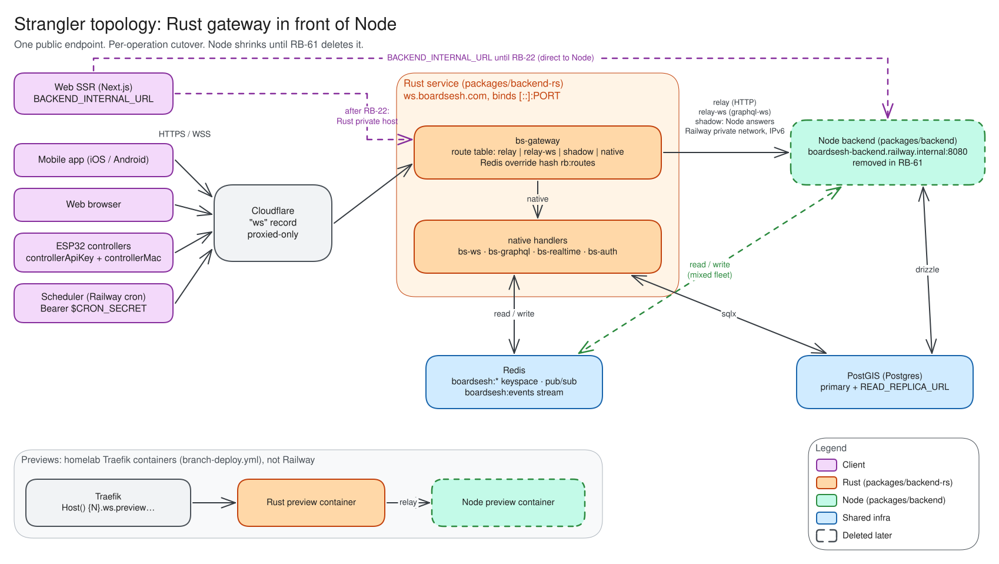
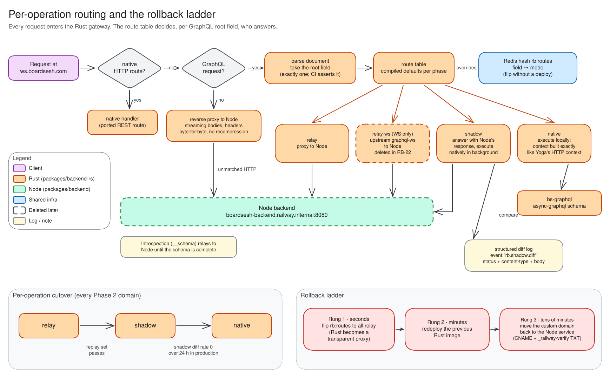
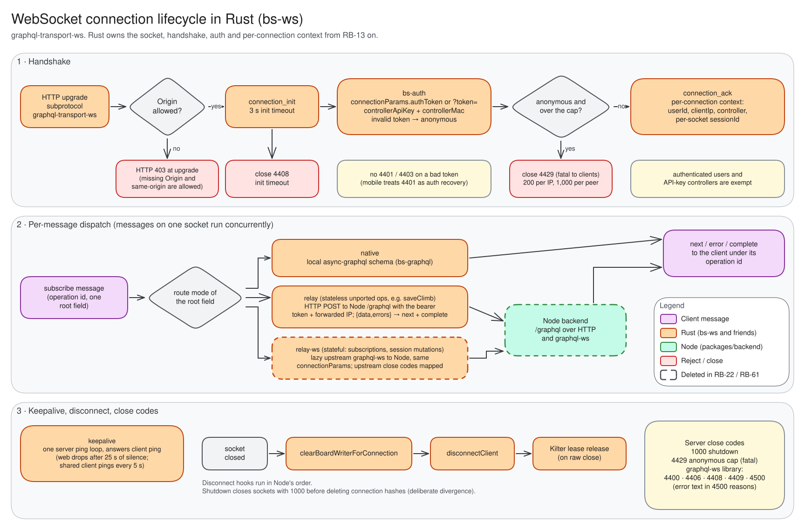
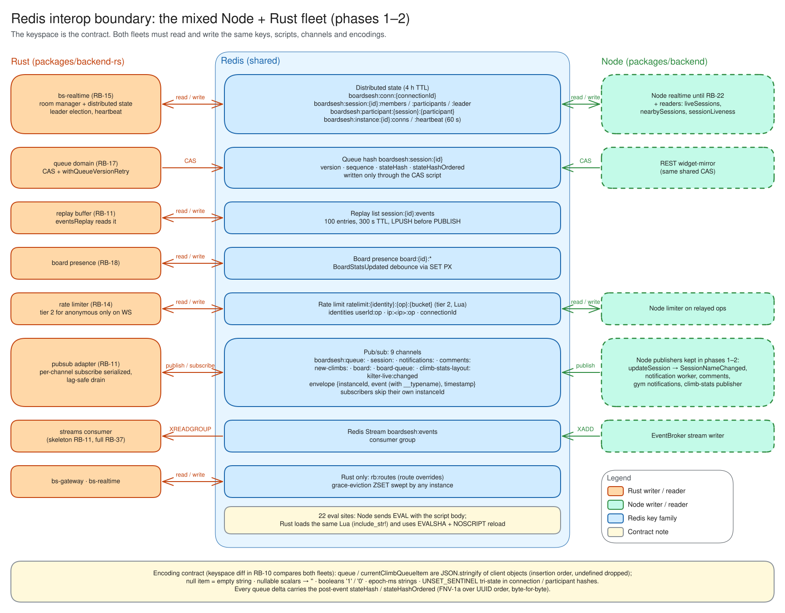
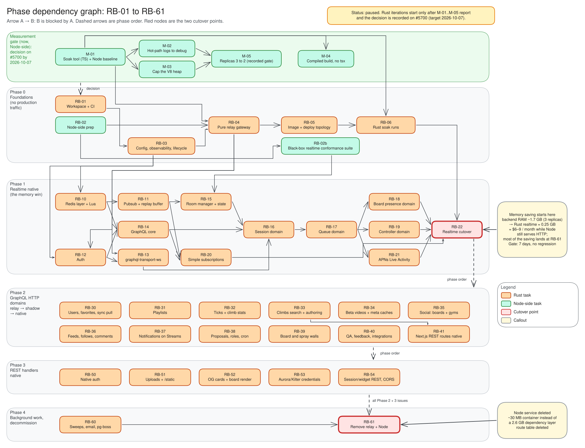
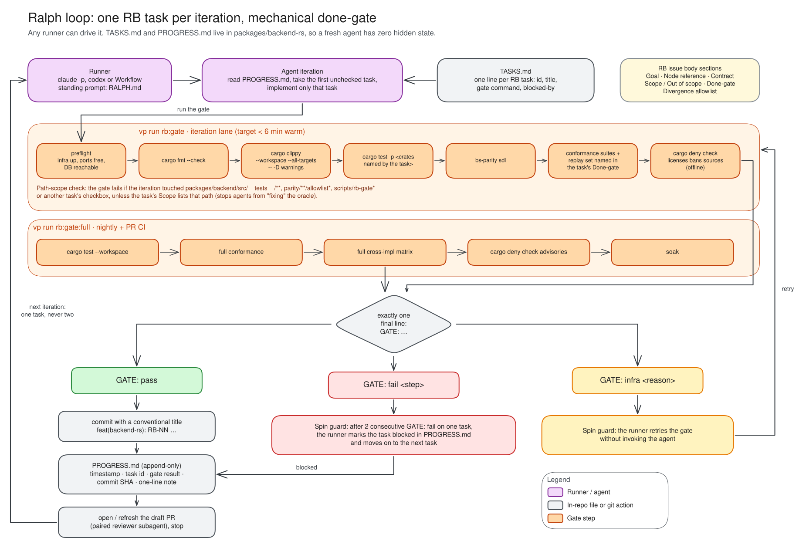

# Rust backend migration

The plan for replacing `packages/backend` (Node: GraphQL Yoga + graphql-ws + ioredis + drizzle) with a Rust service, one operation at a time, without changing anything a client can observe. Tracked by the `epic:rust-backend` GitHub epic (#5700); child issues are `RB-NN`, the measurement-gate issues are `M-NN`. This page is the architecture and the parity contract those issues point at. It is written for the agents and reviewers working the loop, so it states rules, not intentions.

> **Status (2026-09-23): paused at a measurement gate.** Two adversarial reviews corrected the cost picture and found gaps in the phase 1 gates (see "Corrections after adversarial review"). The decision was to measure first: M-01 to M-05 (#5740 to #5744) run on the Node backend now, and no Rust iteration starts until their numbers and the decision are recorded on #5700 (target 2026-10-07).

## Why

Railway bills by memory. On the September 7 baseline (`railway-cost-reduction.md`) the backend's five replicas averaged 2.84 GB RSS together, about 570 MB each, with 30-day spikes near 12 GB (`logging.md`, "Backend memory samples"). Replicas were cut to three the same day; each is capped at 6 vCPU and 8 GB. The backend line was $15.38 of the $89.69 incurred **12 days into** the cycle, so it runs at roughly $32–40 a month at five replicas and $20–24 at three. PostGIS ($57.48 in the same window) stays the largest line whatever happens here.

The WebSocket path is where Node spends that memory: one long-lived socket per climber, a graphql-ws context, an async-iterator queue per subscription, per-connection keepalive timers, and V8 overhead on top. The same work in Rust is a tokio task and a few kilobytes. So the migration starts with the realtime path, and the memory target is set there:

| Measure | Node today | Target (realtime-only service, RB-22) |
| --- | ---: | ---: |
| RSS per replica at production connection count | ~570 MB average | ≤ 128 MiB |
| RSS per idle authenticated socket | measured in M-01 | ≤ 20 KiB |
| Replicas | 3 (was 5) | 2 |
| Container image | 2.6 GB dependency layer, `tsx` at runtime | ~30 MB static binary |

The 128 MiB figure is the realtime-only target at RB-22; phase 3 rendering (tiny-skia surfaces, PNG and WebP encoding, caches) gets its own budget when it lands.

**Cost by phase, honestly.** Through phases 0 to 2 the bill goes up, because both services run. After RB-22 Node still serves the whole HTTP surface, so the saving is roughly $6–9 a month. Most of the saving lands at RB-61.

| Configuration | Approx. per month |
| --- | ---: |
| Node, 5 replicas (September 7 baseline) | $32–40 |
| Node, 3 replicas (today) | $20–24 |
| Node, 2 replicas + heap cap + compiled build + log level (M-02 to M-05) | $10–13 |
| Rust realtime native, Node still serving HTTP (after RB-22) | $6–9 less than today |
| Rust only, 2 replicas (after RB-61) | $3–4 |

Against a one-week Node tuning pass, Rust's marginal saving is roughly $6–10 a month. The case for the rewrite therefore rests on what tuning cannot buy: bounded memory instead of spikes, no sharp or WASM, a behavioural contract pinned by a conformance suite, a Redis keyspace diff and a soak harness (none of which exist today), five known realtime defects fixed, and a codebase built for agents. The measurement gate makes that trade explicit before any Rust code is written.

## Diagrams

Editable sources and exports live in `docs/diagrams/rust-backend/` (regenerate with `vp exec node scripts/render-excalidraw.mjs docs/diagrams/rust-backend`).

## Decisions

- **Topology: Rust strangler in front of Node.** The Rust service is the only public listener on `ws.boardsesh.com`. It executes what has been ported and relays everything else to Node at `boardsesh-backend.railway.internal:8080`. One public endpoint, per-operation cutover, Node shrinks until it is deleted (RB-61).
- **Node is the oracle.** Every ported operation is validated against the running Node implementation: a transport-level conformance suite, differential replay of recorded operations, a Redis keyspace diff, golden vectors for byte-exact functions, and a shadow mode in production. Nothing flips to native on the strength of unit tests alone.
- **The Redis keyspace is frozen.** Node and Rust share Redis during the whole migration and a rolling deploy always runs both. Key names, TTLs, value encodings, Lua script semantics and the pub/sub envelope are byte-compatible. Rust may use `EVALSHA`; Node sends plain `EVAL`, so there is no script-hash dependency.
- **Rust never owns the schema.** Drizzle in `packages/db` stays the single migration owner. Rust reads and writes the tables Node does today. The GraphQL SDL in `packages/shared-schema` stays the contract; Rust's schema is checked against it, never the other way round.
- **Behaviour first, fixes second.** Known Node defects are ported faithfully unless listed under "Deliberate divergences" below. A divergence is recorded in the replay allowlist and, where cheap, fixed in Node too.
- **The realtime domain flips as one set.** Node keys session membership per socket, so sessions, queue, board presence and controller go native together (RB-22) and the flip is followed by a paced socket drain. HTTP domains flip per root field.
- **Node change policy: same-PR rule plus a realtime freeze.** Node merges about 44 backend PRs per 60 days. A Node PR that changes a root field whose route default is `native` must land the Rust side in the same PR, enforced by a CI script that diffs the SDL per root field against the compiled route table; the realtime resolvers are frozen for non-urgent changes between RB-15 and RB-22. Unknown root fields default to `relay`, which keeps purely additive Node changes safe.
- **Agents work the epic in a loop.** Each child issue carries a mechanical done-gate. The loop contract (standing prompt, task list, progress ledger, gate lanes) is part of RB-01, not an afterthought.

## What the port has to reproduce

Numbers are from `packages/backend/src` without tests, September 2026.

| Area | Size | Notes |
| --- | ---: | --- |
| GraphQL resolvers | 46.4k lines | 154 Query, 140 Mutation, 9 Subscription root fields in the live schema (303 fields, each owned by exactly one RB issue). SDL about 9.7k lines and 453 types: 6 unions, no interfaces, one custom scalar `JSON`, about 40 enums with mixed-case values |
| Realtime core (`websocket/`, `services/room-manager/`, `services/distributed-state/`, `pubsub/`, `redis/`, `events/`) | ~10k lines | 22 `eval` call sites, about 20 Redis key families, 9 pub/sub channels, one Redis Stream |
| REST handlers (`server.ts` hand router + `handlers/`) | 8.7k lines | 27 routes: native auth, multipart uploads to S3, OG and board render (sharp + WASM), NDJSON import streams, Kilter and Strava OAuth, watch and widget endpoints, PostHog proxy |
| Shared TS executed by the backend | ~13k lines in `@boardsesh/db/queries` plus ~10k in small packages | queue state hash, session inference, spray-wall geometry, `@boardsesh/crypto` (AES-256-GCM + PBKDF2), Aurora and Kilter API clients |
| SQL style | 500+ raw `sql` fragments and ~800 drizzle builder chains | Mostly composed at run time: pushed conditions, `sql.raw` ORDER BY, cursor pagination, 63 filter fragments for climb search |
| Tests | 361 files, 122k lines | Exactly 11 files start a server or open a socket (`integration`, `graphql-resolvers`, `auth-transport`, `board-render`, `og-climb`, `websocket-anon-connection-cap`, `websocket-client-ip-context`, `media-stream-pipe`, `spray-wall-photos`, `upload-file-stream-guard`, plus the three headless-client suites `queue-client-session`, `session-roster-seed`, `session-subscription-auth`); every realtime suite (`board-presence`, `controller`, `distributed-state`, `queue-sequence-atomicity`, and friends) drives Node classes directly and cannot be pointed at a URL |

### Wire contract

Clients (mobile, web, ESP32 controllers, the scheduler) depend on all of this. None of it changes.

**WebSocket.** Subprotocol `graphql-transport-ws`. `connectionParams: { authToken }` or `?token=`; controllers send `controllerApiKey` and `controllerMac`. An invalid token silently downgrades the connection to anonymous. The server emits only two custom close codes, `4429` (anonymous connection cap, fatal to clients) and `1000` (shutdown); the graphql-ws library codes `4400`, `4406`, `4408`, `4409` and `4500` apply as in Node. The server must not start sending `4401` or `4403` on bad tokens; mobile treats `4401` as an auth-recovery trigger. A bad `Origin` is an HTTP 403 at upgrade; a missing Origin and a same-origin upgrade are allowed. Messages on one socket are handled concurrently. The server answers protocol `ping` promptly: the shared client pings every 5 s and the web client terminates a socket after 25 s of silence.

**The socket carries a full GraphQL API, not just subscriptions.** Sent over it today: every queue and session mutation (they require the per-socket `ctx.sessionId` that `requireSessionWithReconnectGrace` waits about 350 ms for), all nine subscriptions, the whole board-presence client surface (`boardRecentHistory`, `boardHistoryPage`, `boardRecentClimbs`, `boardHistory`, `boardClimbRecentSenders`, `boardPresenceStats`, `boardConnection`, `resolveBoardForSerial`, `resolveBoardForUuid`, `resolveBoardForConfig`, `resolveBoardCandidatesForSerial`, `chooseBoardForSerial`), and `saveClimb` / `updateClimb` (`packages/shared/board-react/src/use-save-climb.ts`). `createSession` goes over HTTP and its resolver branches on `ctx.transport`.

**HTTP GraphQL.** Yoga 5 semantics: batching off (an array body is a 400), GET accepted for queries, `application/graphql-response+json` content negotiation, 400 for parse and validation errors, 200 for execution errors. Mobile branches on `response.ok`. No document in the operations catalogue selects more than one root field (219 shared plus 53 mobile-only documents checked); RB-01 adds a test that keeps it that way.

**Errors.** Clients branch on `extensions.code`: `RATE_LIMITED` (with `retryAfterSeconds`), `NOT_SESSION_MEMBER` (with `reason`), `SESSION_ENDED`, `CLIMB_IS_DUPLICATE`, `INTERNAL_SERVER_ERROR`. Validation-error message text may differ between graphql-js and async-graphql; that is allowlisted. REST handlers answer `{ "error": "<text>" }` and mobile shows the text to the climber verbatim, so the strings are part of the contract.

**Auth.** Two token shapes, selected by dot count. Five segments: a NextAuth JWE, key = HKDF-SHA256(`NEXTAUTH_SECRET`, salt `""`, info `"NextAuth.js Generated Encryption Key"`, 32 bytes), `dir` + A256GCM, 60 s clock tolerance. Three segments: a mobile HS256 JWS with `iss=boardsesh`, `aud=boardsesh-mobile`. Only `sub` is used. Results are cached 60 s. Cron callers send `Authorization: Bearer $CRON_SECRET`. The HTTP context is `connectionId = http-<uuid>`, `transport: 'http'`, bad bearer → anonymous.

**Rate limiting.** `applyRateLimit` has two tiers: an in-process fixed window and a Redis Lua `INCR`+`EXPIRE` on `ratelimit:{identity}:{op}:{bucket}`. Identities are `userId:op`, `ip:<ip>:op` and `connectionId`. For anonymous callers tier 2 applies only when `ctx.transport === 'ws'`.

**Client IP.** `cf-connecting-ip`, then the last `x-forwarded-for` hop, then the socket peer; IPv6 truncated to /64 for the anonymous caps.

### Redis contract

The full key list is in `packages/backend/src/services/distributed-state/constants.ts`, `services/redis-session-store.ts`, `pubsub/redis-adapter.ts` and `pubsub/board-presence-store.ts`. The parts that bite:

- Session membership: `boardsesh:conn:{connId}`, `boardsesh:session:{id}:members`, `:participants`, `:leader`, `:boardSerial`, `:recentClimbs`, `boardsesh:participant:{sid}:{pid}` and `:connections`, `boardsesh:instance:{iid}:conns` and `:heartbeat`. TTL 4 h (the docs that say 1 h are stale), instance keys 2 h and 60 s.
- Queue state: hash `boardsesh:session:{id}` with `queue`, `currentClimbQueueItem`, `version`, `sequence`, `stateHash`, `stateHashOrdered` and more, written only through the compare-and-swap script. Replay buffer list `session:{id}:events` (no `boardsesh:` prefix), 100 entries, 300 s, and the `LPUSH` goes out before the `PUBLISH`.
- Board presence: `board:{id}:seq`, `:history`, `:writer`, `:lastReport`, `:session`, `session:{id}:board`, `presence:board:{id}:user:{uid}`.
- Pub/sub channels: `boardsesh:queue:{sessionId}`, `boardsesh:session:{sessionId}`, `boardsesh:notifications:{userId}`, `boardsesh:comments:{entityType}:{entityId}`, `boardsesh:new-climbs:{boardType}:{layoutId}`, `boardsesh:board:{boardId}`, `boardsesh:board-queue:{boardId}`, `boardsesh:climb-stats-layout:{boardType}:{layoutId}`, plus `boardsesh:kilter-live:changed`. Envelope `{ instanceId, event, timestamp }` where `event` is the resolver's raw result object including `__typename`; a receiver skips its own `instanceId` and never republishes.
- Encoding quirks the keyspace diff must know: `queue` and `currentClimbQueueItem` are `JSON.stringify` of client-supplied objects (insertion order, `undefined` dropped); a null current item is the empty string, not `"null"`; nullable scalars become `''`; booleans are `'1'`/`'0'`; timestamps are epoch-millisecond strings; connection and participant hashes use an `UNSET_SENTINEL` to tell "not provided" from "provided empty", which Rust models as `Option<Option<String>>`.
- Ordering: every queue delta carries the post-event `stateHash` and `stateHashOrdered` (`packages/shared/queue/src/state-hash.ts`, FNV-1a over UUID order; must match byte for byte). `setClimbFromLedPositions` publishes two events under the same sequence. Clients gap-check `sequence` and call `eventsReplay` when 100 or fewer events are missing.

### Operations contract

- `/health` fails only on Redis; `/health/db` fails on Postgres. Both return `deploymentId` and `release`. The production smoke (`scripts/production-backend-smoke.mjs`) asserts the exact Railway `deploymentId` of the service it just deployed, introspects the schema, and checks exact `Cache-Control` directives on `/render/board`.
- Shutdown order is fixed and fits inside the 10 s force timer under Railway's `drainingSeconds = 15`: stop the listener, clear intervals, stop jobs, flush room-manager writes, close sockets with `1000`, close Redis and Postgres, flush Sentry.
- Railway private networking is IPv6 only. The Rust service binds `[::]:PORT` and resolves Node's private hostname over AAAA.
- The web app's server-side GraphQL calls bypass the public URL (`BACKEND_INTERNAL_URL`); they reach Rust only once RB-22 repoints that variable.
- Preview environments are homelab Traefik containers (`branch-deploy.yml`), not Railway.
- Logs: Node emits JSON only when `NODE_ENV=production`, which Railway does not set. Rust always emits JSON and keeps the `event:"backend.memory"` sample line shape so `logging.md` still applies.
- The env contract is every variable Node reads (`bs-config` lists them with the same defaults). Nothing is renamed.

## Architecture

### Crates

`packages/backend-rs/` is its own Cargo workspace (edition 2024, `rust-toolchain.toml` pinned to the current stable, `[workspace.lints]` with a clippy pedantic subset and `unwrap_used`/`expect_used` denied outside tests, `deny.toml`). `board-renderer-core` from `packages/board-renderer` is a path dependency, so rendering runs natively without WASM or sharp.

| Crate | Owns |
| --- | --- |
| `bs-server` | binary: axum router, WebSocket upgrade, startup and shutdown orchestration |
| `bs-config` | the typed env contract |
| `bs-observability` | tracing (JSON), Sentry, `/health`, `/health/db`, `/metrics`, the `backend.memory` sampler |
| `bs-gateway` | HTTP reverse proxy, the per-root-field route table (`relay`, `relay-ws`, `shadow`, `native`), the Redis override hash |
| `bs-ws` | graphql-transport-ws state machine, keepalive, close codes, anonymous connection cap, per-connection context, disconnect hooks |
| `bs-graphql` | the async-graphql schema, one module per domain; rate limiter; cost and depth extensions |
| `bs-auth` | JWE and JWS validation, controller API key, cron secret, token cache, client-IP resolution |
| `bs-realtime` | room manager, distributed state (Lua via `include_str!`), write scheduler, heartbeat, pub/sub adapter, replay buffer, Streams consumer |
| `bs-redis` | client wrapper: publisher, subscriber and streams connections, script registry (`EVALSHA` with `NOSCRIPT` reload), key builders |
| `bs-db` | sqlx pools (primary and read replica), connect-retry semantics from `db-connectivity.md`, type-mapping goldens, sea-query builders, the prepare-test harness |
| `bs-climbs-read` | spray visibility, canonical-uuid and history readers shared by board presence (phase 1) and climbs (phase 2) |
| `bs-parity` | CLI: `sdl`, `replay`, `keyspace`, `soak` |
| `bs-testkit` | isolated test infrastructure (random ports or per-run database and Redis logical db), fixtures, fake clients |

Later phases add `bs-ticks`, `bs-climbs`, `bs-social`, `bs-media`, `bs-native-auth` and friends, one per domain.

### Libraries

| Concern | Choice | Rules |
| --- | --- | --- |
| Runtime, HTTP | tokio, axum 0.8, hyper 1, tower-http | Compression is disabled for relayed responses so headers and bodies pass through unchanged |
| GraphQL | async-graphql, code-first | The SDL can be expressed fully: unions via `#[derive(Union)]`, `JSON` as `serde_json::Value`, `#[graphql(default)]`, `deprecation`. Enum values default to SCREAMING_SNAKE, so every lowercase enum needs `#[graphql(name = "...")]`. The SDL gate catches drift. `dynamic::Schema` is the fallback only if code-first proves unworkable |
| Postgres | sqlx (`runtime-tokio`, `tls-rustls`) with sea-query for dynamic queries | See "SQL rule of thumb" |
| Redis | fred (redis-rs acceptable) | Both do per-channel subscribe, `XREADGROUP` on a dedicated connection, `EVALSHA` with reload, pipelines and RESP3 `SET ... GET`. fred's pub/sub broadcast drops on consumer lag: drain it into an unbounded mpsc immediately. Reconnect is unbounded with backoff |
| Auth crypto | josekit (JWE), jsonwebtoken (HS256, algorithm pinned), hkdf, bcrypt, aes-gcm + pbkdf2 | Must validate today's tokens and decrypt today's `@boardsesh/crypto` ciphertext |
| Observability | tracing, tracing-subscriber, sentry, sentry-tracing, sentry-tower, metrics, metrics-exporter-prometheus | Same Sentry environment-resolution rules as Node |
| Config | figment | One `Config` struct, same names and defaults |
| Errors | thiserror in crates, anyhow only in `main` | GraphQL errors carry `extensions.code` exactly as today |
| Images | image, board-renderer-core | Phase 3 |
| S3, APNs, SMTP, GitHub | aws-sdk-s3 (R2 and Tigris endpoints, path style), a2, lettre, octocrab | APNs in phase 1, the rest in phases 3 and 4 |
| Multipart | axum `Multipart` | Phase 3 |
| Supply chain | cargo-deny, cargo-about | Licenses, bans and sources in the iteration lane; advisories nightly; third-party notices as in #5134 |

### SQL rule of thumb

The Node code composes most queries at run time. sqlx's `query!` macros need a static string and an offline `.sqlx` snapshot that has to be regenerated against a migrated PostGIS database whenever a query changes; for an unattended loop that is the most likely source of "works on my machine". So:

1. Default to `sqlx::query_as::<_, Row>(&sql)` with `#[derive(FromRow)]` structs.
2. Anything with a dynamic WHERE, ORDER BY or cursor goes through `sea-query` (`PostgresQueryBuilder`, values bound via `sea-query-binder`), one builder function per Node query file.
3. No `query!` or `query_as!` and no `.sqlx` directory in phases 1 and 2. From phase 3, static single-statement hot-path queries may use `query!` only if a `.sqlx` freshness step is added to the gate.
4. Every query function gets a prepare test: `bs-db`'s test suite runs `PREPARE` or `EXPLAIN` on the generated SQL against the migrated test database.
5. RB-30 commits a type-mapping golden table (`timestamp`, `timestamptz`, `numeric` → string, `bigint` → string, `jsonb`, `geography`) serialised exactly as postgres-js plus drizzle emit them.
6. Pool settings: `.persistent(false)` and `statement_cache_capacity(0)` behind a `DB_POOLED` flag (Node runs `prepare: false` for PgBouncer), an explicit `acquire_timeout`, CA loaded via `ssl_root_cert_from_pem`, `READ_REPLICA_URL` optional with primary fallback, and the `DB_READ_DEADLINE_MS` → `DB_READ_TIMEOUT` semantics from `db-connectivity.md`. Each phase-2 issue lists which Node call sites use `readDb` so the same reads go to the replica.

### The strangler gateway

1. Rust is the only public listener. Node stays reachable at `boardsesh-backend.railway.internal:8080`.
2. **HTTP.** Any request not matched by a native route is reverse-proxied to Node: bodies stream both ways (NDJSON import streams, multipart uploads), redirects and `Set-Cookie` (the Kilter OAuth callback) pass through, any method is accepted. Response headers pass byte for byte (`Cache-Control`, `CDN-Cache-Control`, `Content-Type`, `ETag`, `Vary`) with no re-chunking or recompression. Rust appends the client to `x-forwarded-for`, sets `cf-connecting-ip` only when the peer is in Cloudflare's published ranges and strips it otherwise, and forwards `Origin` so Node's CORS keeps working until CORS is ported. Because every relayed socket's peer is now the gateway's private IPv6, Node gains a trusted-gateway rule in RB-02 (`TRUSTED_GATEWAY_CIDRS` or a signed peer header: take the hop before the gateway as the client and disable the socket-peer rate tiers), and Rust owns those tiers from RB-13.
3. **GraphQL over HTTP.** Parse the document, take the operation's root field, look it up in the route table. `relay`: proxy to Node. `shadow`: proxy to Node, answer with Node's response, execute natively in the background and log a structured diff (`event:"rb.shadow.diff"`, including status and content type). `native`: execute locally with a context built exactly like Yoga's.
4. **GraphQL over WebSocket.** Rust owns the socket, the handshake, auth and the per-connection context. For each `subscribe` message: a `native` root field runs against the local schema; an operation on the **relay-eligible allowlist** (generated by RB-02 from a grep of every resolver for `ctx.transport`, `ctx.connectionId`, `ctx.sessionId`, `ctx.participantId` and `ctx.socketPeerIp`; expected to be `saveClimb`, `updateClimb` and the seven board-presence read queries) uses `relay`, which is an HTTP POST to Node's `/graphql` carrying the connection's bearer token and forwarded IP headers, with `{data, errors}` mapped to `next` + `complete`; everything else that is unported (subscriptions, session-scoped mutations, and the board-presence mutations, which key writers on `ctx.connectionId`) uses `relay-ws`, a lazily opened upstream graphql-ws connection to Node that reuses the client's `connectionParams` and forwards `next`, `error` and `complete` under the client's operation id, mapping upstream close codes. The gateway never forwards a bearer equal to `CRON_SECRET` (Node's HTTP context checks the cron bearer before user auth). `relay-ws` exists only until RB-20 and is deleted in RB-22.
5. **Route table.** Compiled defaults per phase, overridable at run time through the Redis hash `rb:routes` (root field → mode), so a bad native HTTP operation flips back to `relay` in seconds without a deploy. The table validates domain sets: sessions, queue, board presence and controller flip together, and a partial realtime flip is rejected. Introspection relays to Node until the schema is complete.
6. **Rollback ladder.** First, flip `rb:routes` to all-`relay`: for HTTP domains Rust becomes a transparent proxy within seconds; for realtime the flip is followed by pace-closing every socket with `1000` so clients rejoin through Node (clients never re-send `joinSession` on an open socket), which takes minutes and is measured against the M-01 baseline. If Rust had persisted eviction deadlines in `boardsesh:evictions`, the runbook drains that set (or Node sweeps it; RB-15 decides). Second, redeploy the previous Rust image. Last, move the custom domain back to the Node service; that is a Railway domain re-verification (CNAME plus `_railway-verify` TXT) and takes tens of minutes. The runbook lives in `production-deploy.md` once RB-05 lands.

## Validation

1. **Conformance suite.** The 11 transport-level vitest files listed in the table above get a `BACKEND_UNDER_TEST_URL` switch. Unset, they start Node in-process as today; set, they hit the URL. `describe` blocks that depend on `vi.mock` or `process.env` toggles are marked `skipIf(BACKEND_UNDER_TEST_URL)` and a count assertion stops the URL-capable set shrinking silently. Their hard-coded ports (8082, 8084) become `TEST_PORT ?? 0`. Because none of the realtime suites are transport-level, **RB-02b** writes a black-box realtime suite over real graphql-ws against `startServer()` (sessions, queue, board presence, controller, the four simple subscriptions, anonymous cap, origin rejection, render headers, plus a two-instance variant on shared Redis); it is written against Node first, sized at two to three weeks, and is a prerequisite for RB-15 onward. The class-level Node suites (`distributed-state`, `queue-sequence-atomicity`, `board-presence`, and friends) are reproduced as cross-implementation scenarios (item 4), never pointed at a URL. The same suites run against Node (must stay green) and against Rust (the gate): `vp run test:backend:conformance [--suite <name>]`.
2. **SDL parity.** `bs-parity sdl` compares every type Rust declares ported against the reference SDL, regenerated by `scripts/print-schema.ts` (the committed `generated/schema.graphql` is stale and RB-02 adds a freshness check). Normalisation: drop descriptions, `schema {}` and built-ins; sort types, fields, arguments, enum values, union members and input fields by name; canonicalise type references (`[Int!]!`) and default literals and compare defaults together with nullability (`Int = 20` is not `Int! = 20`); keep `@deprecated(reason)` and drop every other directive; fail on any diff and fail if a ported type references an unported one.
3. **Differential replay.** `bs-parity replay --node <url> --rust <url> --cases packages/backend-rs/parity/<domain>/*.json`. A case is an operation from `packages/shared/graphql/src/operations`, variables, and an auth persona against the dev database image. Status code, content type and body are compared; the body is normalised for key order, timestamps within a tolerance, float formatting, allowlisted run-time ids and validation-error message text. A domain issue is done when its case set produces no unallowlisted diff.
4. **Redis cross-implementation tests.** For every `eval` site and every channel: Node writes and Rust reads, and the reverse, against the real Redis from `docker-compose.test.yml`, with Node driven through a small tsx harness (`packages/backend/src/__tests__/helpers/cross-impl-driver.ts`, RB-10). A scripted session scenario runs on both; the keyspace (`boardsesh:*`, `session:*`, `board:*`, `ratelimit:*`) is dumped and diffed, JSON-valued hash fields structurally with `null` equal to absent except for declared tri-state fields, scalar fields byte for byte, ids and timestamps normalised. Node-side readers (`liveSessions`, `nearbySessions`, `sessionLiveness`) and Node-side writers that keep publishing into realtime channels during phases 1 and 2 (`updateSession` → `SessionNameChanged`, the notification worker, comments, gym notifications, the climb-stats publisher, the REST widget mirror through the shared CAS) each get a case.
5. **Golden vectors.** Generated from the TypeScript implementation and committed: `computeQueueStateHash` (with a non-ASCII uuid to pin UTF-16 versus bytes), sync-pull row normalisation, `@boardsesh/crypto` decrypt, `mergeBoardHistory`, session-inference reconcile, spray-wall homography, graphql-armor cost and depth scores for 20 catalogue documents, and the Postgres type mappings.
6. **Load and soak.** The soak tool is TypeScript (`vp run backend:soak`, M-01) so that it has no Rust dependency and drives the shipped client stack: N connections, subscriptions, a mutation rate, protocol pings and reconnect churn. M-01 records Node's baseline; RB-04 uses it through the relay; RB-06 runs it against each native build. The targets in the table at the top are asserted against the `backend.memory` line.
7. **Shadow in production.** Read-only operations run in `shadow` for 24 h at the production traffic mix with a diff rate of 0 before they go `native`. Until RB-22 repoints `BACKEND_INTERNAL_URL`, SSR traffic is excluded from that coverage.
8. **Production smoke.** `production-backend-smoke.mjs` runs against Rust on `ws.boardsesh.com` and against Node on its direct Railway origin (`--base-url`), each asserting its own `deploymentId`.

## The loop

- **Standing prompt** `packages/backend-rs/RALPH.md`: read `PROGRESS.md`, take the first unchecked task in `TASKS.md`, implement only that task, run `vp run rb:gate -- --task RB-NN`, commit with a conventional title (`feat(backend-rs): RB-13 ...`), append a ledger entry, open or refresh the draft PR, stop. One task per iteration.
- **Two lanes.** `rb:gate` (iteration lane, under 6 minutes warm): preflight (infrastructure up, ports free, database reachable), `cargo fmt --check`, `cargo clippy --workspace --all-targets -- -D warnings`, `cargo test -p <crates the task names>`, `bs-parity sdl`, only the conformance suites and replay set the task names, `cargo deny check licenses bans sources`, and an assertion from the built binary that the task's root fields resolve `native` in the compiled route table. `rb:gate:full` (nightly and PR CI): full `cargo test --workspace`, full conformance, full cross-implementation matrix, `cargo deny check advisories`, soak. Each ends with exactly one line: `GATE: pass`, `GATE: wip <step>` (compiles and unit tests green, conformance not yet expected), `GATE: fail <step>` or `GATE: infra <reason>`.
- **Sub-tasks.** A `TASKS.md` row is a sub-task of at most about 400 Node reference lines with its own gate (RB-15 has eight, RB-18 seven); the parent RB issue closes when all its rows are checked. Rows whose gate needs production, a preview dispatch, a device or a Railway change carry a `human:` line and are marked `awaiting-human`, never `blocked`.
- **Isolation.** `bs-testkit` starts Postgres and Redis with random host ports, or on the shared compose uses a per-run database `rb_<worktree-hash>_<pid>` and a per-run Redis logical db. The binary under test binds port 0 and passes `BACKEND_UNDER_TEST_URL` to vitest. The fixed ports 5433, 6380, 8082 and 8084 are never assumed.
- **Spin guards.** The runner retries `GATE: infra` without invoking the agent. After three consecutive `GATE: fail` on one sub-task it marks the row `blocked` in `PROGRESS.md` and moves on; the third attempt is a diagnose-only iteration whose output is a ledger note. A path-scope check fails the gate if an iteration touched `packages/backend/src/__tests__/**`, `parity/**/allowlist*`, `scripts/rb-gate*`, `crates/bs-parity/src/normalize*`, the workspace `Cargo.toml` `[workspace.lints]`, `deny.toml`, `TASKS.md` (runner-owned) or `vite.config.ts`, added `#[ignore]` to a test, or grew an allowlist without a `divergence:` line in the PR body, unless the task's Scope names that path. That stops an agent from "fixing" the oracle.
- **PR hygiene.** `RALPH.md` tells the agent to fill the PR template (tick "No release note needed", `## Test plan` = `1. CI green.`, `Risk: N/5 —`); the runner spawns the paired reviewer subagent after `GATE: pass`.
- **Ledger.** `TASKS.md` has one line per task: id, title, gate command, blocked-by. `PROGRESS.md` is append-only: timestamp, task id, gate result, commit SHA, one-line note. Both are in the repo so a fresh agent has no hidden state.
- **Issues.** Every RB issue has the same sections: Goal, Node reference, Contract, Scope, Out of scope, Done-gate, Divergence allowlist. Every implementation PR is paired with a reviewer subagent.
- **CI.** A `backend-rust` job modelled on `renderer-rust` but reusing `test-backend`'s pinned PostGIS and Redis service block, gated on `packages/backend-rs/**`, wired into `ci-status`, with the commit-lint job gated on the same filter. Once any root field is `native`, the filter also matches `packages/shared-schema/**`, `packages/db/src/schema/**`, `packages/db/drizzle/**` and the ported resolver directories, `backend-rust` becomes a required check, and `scripts/rb-same-pr-check.ts` enforces the same-PR rule.
- **Decision log.** `packages/backend-rs/DECISIONS.md` records fred vs redis-rs, code-first vs dynamic schema, pg-boss insert vs SQL function, and which instance-id scheme each Redis key family uses (Node has three).

## Deliberate divergences

Fixed in Rust, recorded in the replay allowlist, and opened as Node follow-ups where cheap:

- Grace-eviction and reconnect timers live in Redis (a sorted set of due evictions swept by any instance) rather than in process memory, so a deploy or crash cannot leave a participant `RECONNECTING` for 4 h.
- Shutdown closes sockets with `1000` before deleting connection hashes.
- The Redis reconnect policy is unbounded with backoff, and `/health` reports the reconnecting state.
- Queue events publish in sequence order per session.
- Pub/sub unsubscribe and resubscribe are serialised per channel.
- graphql-armor's cost formula (same defaults, 5000) applies on the WebSocket path too; both depth checkers are ported.
- Logs are always JSON.
- The mobile HS256 algorithm is pinned.
- The anonymous connection cap stays per instance, so the effective fleet cap changes with the replica count.
- Anonymous WebSocket callers relayed over HTTP lose tier-2 IP rate limiting until the operation is native.
- Per-subscription queues are bounded by bytes as well as by count (Node caps at 1000 items only).

Everything else is ported as it behaves, including the odd parts clients rely on: the two keepalive loops collapsed into one server ping loop with the same effective timeouts, error text in `4500` close reasons, `?token=` accepted, an invalid token downgrading to anonymous, and `requireSessionWithReconnectGrace` still failing for HTTP callers after about 350 ms.

## Phases

| Phase | Issues | What lands |
| --- | --- | --- |
| Measurement gate (now) | M-01 #5740 soak tool + Node baseline, M-02 #5741 hot-path logs, M-03 #5742 heap cap, M-04 #5743 compiled build, M-05 #5744 replicas 3 → 2 | Node's real numbers, the cheap savings, and the decision on #5700 by 2026-10-07 |
| 0 Foundations | RB-01 #5701 workspace + CI, RB-02 #5702 Node-side prep, RB-02b black-box realtime suite (filed when the gate opens), RB-03 #5703 config + observability + lifecycle, RB-04 #5704 pure relay gateway, RB-05 #5705 image + deploy topology, RB-06 #5706 Rust soak runs | A Rust service that proxies everything, deployed beside Node, with the oracle wired up |
| 1 Realtime | RB-10 #5707 Redis + Lua, RB-11 #5708 pub/sub + replay + Streams, RB-12 #5709 auth, RB-13 #5710 graphql-transport-ws server, RB-14 #5711 GraphQL core, RB-15 #5712 room manager + distributed state, RB-16 #5713 sessions, RB-17 #5714 queue, RB-18 #5715 board presence, RB-19 #5716 controller, RB-20 #5717 simple subscriptions, RB-21 #5718 APNs, RB-22 #5719 cutover | Every socket terminates in Rust; the domain flips as one set; replicas 3 → 2 |
| 2 GraphQL HTTP domains | RB-30 #5721 users + favorites + sync, RB-31 #5722 playlists, RB-32 #5723 ticks, RB-33 #5724 climbs, RB-34 #5725 beta videos, RB-35 #5726 boards + gyms, RB-36 #5727 feeds + follows + comments, RB-37 #5728 notifications on Streams, RB-38 #5729 proposals + roles + cron, RB-39 #5730 spray walls, RB-40 #5731 qa + feedback + integrations, RB-41 #5732 the Next.js `/api/v1` routes | Each domain relay → shadow → native |
| 3 REST | RB-50 #5733 native auth, RB-51 #5734 uploads + static, RB-52 #5735 OG + board render on board-renderer-core, RB-53 #5736 Aurora and Kilter credentials + imports, RB-54 #5737 the remaining handlers | No sharp, no WASM |
| 4 Decommission | RB-60 #5738 sweeps + email + pg-boss duties, RB-61 #5739 remove the relay and Node | `packages/backend` deleted |

## Corrections after adversarial review

Two adversarial reviews (systems and operations; loop executability and return on investment) were run on 2026-09-23 against the plan and the filed issues. Their findings are folded into the sections above and into an "Amendments" section on every phase 0 and 1 issue. The ones that changed the design:

1. **Realtime cannot flip per root field.** `requireSessionWithReconnectGrace` checks membership against the process-local context map and `boardsesh:conn:{connectionId}`; a native `joinSession` with a relayed `addQueueItem` fails with `NOT_SESSION_MEMBER`. Hence the domain-set flip, the paced drain, and RB-16 to RB-19 no longer flipping individually.
2. **The HTTP relay for socket-sent operations must be allowlist-only.** Board-presence mutations key writers and emitters on `ctx.connectionId`; Node's HTTP context checks the cron bearer before user auth.
3. **The conformance oracle was overstated** (11 transport-level files, none of them realtime); RB-02b is the fix.
4. **The extra hop breaks Node's client-IP model**; trusted-gateway rule in Node, peer tiers in Rust.
5. **The loop would park itself at RB-10**; sub-tasks, `GATE: wip`, a three-fail budget, `human:` rows, wider path-scope guard.
6. **Dependency fixes**: the soak tool is M-01 (no Rust dependency), RB-12 is blocked by RB-04, RB-14's shadow smoke moved to RB-16, RB-18 depends on RB-17 hard.
7. **Hidden scope now owned**: the APNs instance-config marker and holder resolver (RB-21), the four session/widget REST writers (RB-11, RB-17), CORS on native HTTP GraphQL (RB-14, because Yoga runs with `cors: false` and the server applies headers on `/graphql`), `endSession`'s Strava call-back until RB-40 (RB-16), the eviction-set rollback hazard (RB-15), the Postgres connection budget across both fleets against `max_connections = 200` (RB-03, RB-22), Prometheus counters and a Sentry `service` tag (RB-01, RB-03, RB-05), preview `BACKEND_INTERNAL_URL` (RB-05), pg-boss supervision and the snapshot-export scripts that import from `packages/backend` (RB-60, RB-61).
8. **Facts corrected**: 154 / 140 / 9 root fields; `sessionLiveness` and `liveSessions` do not exist; the Aurora credential fields belong to RB-53; `/api/v1` has 10 documented routes.

Rough effort, from the reviews: phase 0 about 40–55 agent iterations, phase 1 about 110–160, phase 2 about 200–350, phases 3 and 4 about 60–100, plus roughly a month of mandated observation windows. That estimate is one of the inputs to the decision on #5700.

### What is not in this epic

The Next.js REST layer is not a prerequisite and is not moved through Node first. Of its 35 routes, the ones that belong on the backend (the 11 documented `/api/v1/*` read routes, `internal/profile*`, `internal/beta-link-thumbnail`) go straight to Rust in RB-41. The rest stay in Next.js by design: NextAuth and the account flows, `internal/ws-auth`, `internal/join/[sessionId]`, the ISR and cache hooks, `internal/dev-metadata`, `internal/feature-flags`, `internal/controllers`, `health` and `v1/spray-walls/[wall_uuid]/photo`.

## Known Node defects met along the way

For the record, so nobody re-discovers them: the grace-eviction timer runs only on the instance that held the socket; `distributedState.stop()` deletes connection hashes before sockets close; `PubSubChannel` has an unsubscribe/resubscribe race that loses cross-instance events; queue events can be published out of sequence order; `waitForRestoration` can never observe another instance's restore; the Redis client gives up after 10 reconnect attempts; the WebSocket path has no cost limit; `REFRESH_TTL_SCRIPT` and `cleanupEmptySession` are dead code; three different instance ids are in use (pub/sub, distributed state, APNs); `websocket-implementation.md` is stale on close codes, the replay key, the connection TTL and the keepalive interval (RB-02 fixes the doc).
