# WebSocket Implementation for Party Sessions

This document describes the WebSocket implementation used for real-time party session synchronization in Boardsesh. Party mode allows multiple climbers to collaborate on a shared queue of climbs, with real-time synchronization across all connected clients.

## Table of Contents

1. [Architecture Overview](#architecture-overview)
2. [Technology Stack](#technology-stack)
3. [Connection Flow](#connection-flow)
4. [Board Presence Wall Feed](#board-presence-wall-feed)
5. [Backend URL Resolution](#backend-url-resolution)
6. [Session Management](#session-management)
7. [Queue State Synchronization](#queue-state-synchronization)
8. [Multi-Instance Support](#multi-instance-support)
9. [Failure States and Recovery](#failure-states-and-recovery)
10. [Client-Side Connection Supervisor](#client-side-connection-supervisor)
11. [Data Persistence Strategy](#data-persistence-strategy)
12. [iOS Live Activity Integration](#ios-live-activity-integration)
13. [Live Activity Push Notifications (APNs)](#live-activity-push-notifications-apns)
14. [Activity Push Token Lifecycle](#activity-push-token-lifecycle)
15. [Widget REST Endpoints](#widget-rest-endpoints)

---

> **Status (W-16, #4435): every web-client section below is historical.**
> Climbing moved to the Expo app, and with it the entire web party-session
> client — `components/persistent-session/`, `components/graphql-queue/`,
> `components/queue-control/`, `app/lib/live-activity/` and the root
> `PersistentSessionWrapper`. Sections that describe those modules ("Context
> Split Pattern", "Shared queue-actions factory", "QueueBridgeProvider", "Web
> Root Event Processor") are kept because they document behaviour the **mobile**
> client still implements against the same protocol; the `packages/web/...`
> paths they cite no longer resolve. The protocol, the backend resolvers and the
> mobile client are unchanged. On www the only surviving `graphql-ws` consumers
> are `components/kiosk/presence/kiosk-presence-hub.tsx`,
> `social/comment-section.tsx` and `hooks/use-notification-subscription.ts`.

---

## Architecture Overview

The party session system uses a GraphQL-over-WebSocket architecture with the following key components:

```
┌─────────────────────────────────────────────────────────────────────────┐
│                              Frontend (Next.js)                          │
├─────────────────────────────────────────────────────────────────────────┤
│  ┌─────────────────────┐    ┌─────────────────────────────────────────┐ │
│  │ PersistentSession   │◄───┤ GraphQL Client (graphql-ws)             │ │
│  │ Context (split)     │    │ - Connection management                  │ │
│  │ ├ ActionsContext     │    │ - Subscription handling                  │ │
│  │ └ StateContext       │    │ - Reconnection with exponential backoff  │ │
│  └─────────┬───────────┘    └─────────────────────────────────────────┘ │
│            │                                                             │
│  ┌─────────▼───────────┐                                                 │
│  │ QueueContext (split) │                                                │
│  │ ├ ActionsContext     │                                                │
│  │ │  (stable callbacks)│                                                │
│  │ └ DataContext        │                                                │
│  │   - Local state      │                                                │
│  │   - Optimistic update│                                                │
│  └──────────────────────┘                                                │
└─────────────────────────────────────────────────────────────────────────┘
                                    │
                                    │ WebSocket (graphql-ws protocol)
                                    ▼
┌─────────────────────────────────────────────────────────────────────────┐
│                           Backend (Node.js)                              │
├─────────────────────────────────────────────────────────────────────────┤
│  ┌─────────────────────┐    ┌─────────────────────┐                     │
│  │ WebSocket Server    │    │ GraphQL Yoga        │                     │
│  │ (graphql-ws)        │◄───┤ - Schema            │                     │
│  │ - Auth validation   │    │ - Resolvers         │                     │
│  │ - Connection mgmt   │    └─────────────────────┘                     │
│  └─────────┬───────────┘                                                 │
│            │                                                             │
│  ┌─────────▼───────────┐    ┌─────────────────────┐                     │
│  │ RoomManager         │◄───┤ PubSub              │                     │
│  │ - Session state     │    │ - Local dispatch    │                     │
│  │ - Client tracking   │    │ - Redis pub/sub     │                     │
│  └─────────┬───────────┘    └─────────────────────┘                     │
│            │                                                             │
│  ┌─────────▼─────────────────────────────────────────────────────────┐  │
│  │ DistributedStateManager (multi-instance support)                   │  │
│  │ - Cross-instance connection tracking                               │  │
│  │ - Distributed leader election (Lua scripts)                        │  │
│  │ - Session membership across instances                              │  │
│  │ - Instance heartbeating & cleanup                                  │  │
│  └─────────┬─────────────────────────────────────────────────────────┘  │
│            │                                                             │
│  ┌─────────▼───────────┐    ┌─────────────────────┐                     │
│  │ RedisSessionStore   │    │ PostgreSQL          │                     │
│  │ - Hot cache (4h TTL)│    │ - Persistent storage│                     │
│  │ - User presence     │    │ - Session history   │                     │
│  │ - Distributed locks │    │ - Queue state       │                     │
│  └─────────────────────┘    └─────────────────────┘                     │
└─────────────────────────────────────────────────────────────────────────┘
```

### Context Split Pattern

> Removed from web in W-16 (#4435) — the mobile client keeps the split.

Both `PersistentSessionContext` and `QueueContext` are split into separate **Actions** and **Data** contexts to prevent unnecessary re-renders:

- **ActionsContext** — stable callback functions (`addToQueue`, `setCurrentClimb`, etc.). Uses a `latestRef` pattern so callbacks have empty `[]` dependency arrays and never change identity. Components that only call actions (e.g., list item "add to queue" buttons) subscribe here and avoid re-rendering when queue data changes.
- **DataContext** — frequently-changing state (`queue`, `currentClimb`, `playlistSuggestionSource`, `connectionState`, etc.). Only components that display this data subscribe here.
- **Combined Context** — merges both via `useMemo(() => ({ ...dataValue, ...actionsValue }))` for backward compatibility. Existing consumers using `useQueueContext()` or `usePersistentSession()` continue working unchanged.

Targeted hooks: `useQueueActions()`, `useQueueData()`, `usePersistentSessionActions()`, `usePersistentSessionState()`.

### Shared queue-actions factory

> Removed from web in W-16 (#4435); `queue-control/queue-actions-core.ts` no longer exists.

The queue-action surface itself (add/remove/set-current/navigate/mirror/replace/report-wall-disconnect) has a single implementation: `createQueueActionsCore(deps)` in `packages/web/app/components/queue-control/queue-actions-core.ts`. Both `GraphQLQueueProvider` (board routes) and the bridge's `usePersistentSessionQueueAdapter` (off-board) wire it with their own dependencies.

**`applyLocal` (single root reducer, W6).** Queue state (`queue`, `currentClimbQueueItem`, `playlistSuggestionSource`, `pendingCurrentClimbUpdates`) lives in exactly one place now: the root `persistent-session` provider's reducer (`persistent-session/hooks/use-event-processor.ts`), exposed as `dispatch` through `usePersistentSession()`/`usePersistentSessionActions()`. Both surfaces' `applyLocal` dispatch straight to it:

- `GraphQLQueueProvider` dispatches unconditionally, through a type-seam cast (`dispatchToRoot` — see the seam note in `QueueContext.tsx`).
- The bridge's `applyLocal` (`queue-bridge-context.tsx`) also dispatches to the root, for **both solo and party mode**. This is the one behavior change of this consolidation: **off-board party mutations are now optimistic.** Before W6, the bridge's `applyLocal` was a no-op while a party session was active — the UI waited for the server echo. Now it applies immediately, exactly like board-route mutations always have, and the real party mutation (`ps.addQueueItem`, `ps.setCurrentClimb`, ...) still follows. Correlation-id echo suppression (below) applies uniformly as a result — no bridge-specific handling needed.
- The bridge additionally layers two **solo-only** UX quirks on top of the shared dispatch (adding to an un-activated queue also activates the new item; removing the current item promotes the new head instead of clearing to null) — a second, immediate follow-up dispatch against the same reducer. These never applied in party mode, before or after W6: party's actual state has always reflected the server's echo, which has no such auto-activate/promote semantics, and extending the quirks to party would show a locally-fabricated "current climb" the party mutation never requested.

`discoverNext`/`discoverPrev` still differ in strategy: `GraphQLQueueProvider` walks `climbSearchResults` as a discovery fallback; the bridge delegates to the shared `findNextQueueItemWithSuggestions` (mobile parity). Every genuine per-surface behavioral difference is an explicit injected dep on `QueueActionsCoreDeps`, documented at the definition.

### QueueBridgeProvider — root-level QueueContext

> Removed from web in W-16 (#4435); `queue-control/queue-bridge-context.tsx` no longer exists.

`QueueBridgeProvider` (`packages/web/app/components/queue-control/queue-bridge-context.tsx`) is mounted once at the root inside `PersistentSessionWrapper` so a `QueueContext` value is always available, even off board routes (e.g. `/session/[sessionId]`, `/playlists/...`). It has two modes:

- **Injected mode** — when a board route mounts `GraphQLQueueProvider`, it injects its full context (with the GraphQL data fetcher and route-scoped search state) into the bridge. Consumers transparently see the board route's queue context. Since the queue itself is root-owned (W6), there's no queue data to copy back on injection/eject anymore — only board-context bookkeeping (`ps.setBoardContext(boardPath, boardDetails)`, on inject AND on eject) needs syncing.
- **Adapter mode** — off board routes, `usePersistentSessionQueueAdapter` reads `queue`/`currentClimbQueueItem`/`playlistSuggestionSource` straight from the root `persistent-session` provider, unconditionally (party or solo, no branching). Mutations still branch on `ps.activeSession` for where the _network_ call goes:
  - **Solo / no party**: the optimistic dispatch above is the only effect — no server round trip.
  - **Active party session**: mutations delegate to `ps.addQueueItem`, `ps.setCurrentClimb`, `ps.removeQueueItem`, `ps.setQueue`, `ps.mirrorCurrentClimb`, `ps.replaceQueueItem` — the same WebSocket-backed mutators `GraphQLQueueProvider` uses on board routes.
  - `setCurrentClimb` checks for an existing queue entry by `climb.uuid` first; if found it reuses that queue item via `ps.setCurrentClimb` without adding a duplicate.
  - When a playlist route activates a climb with a `playlistSuggestionSource`, the bridge dispatches `SET_PLAYLIST_SUGGESTION_SOURCE` so "next" can draw suggested climbs from the same playlist after the activated climb — reducer-owned now (see below), so `INITIAL_QUEUE_DATA`/`UPDATE_QUEUE` clear it for free on a full sync instead of needing a manual clear call at every full-queue-replacement path. In party mode this path uses `ps.setQueue` when it needs to insert the activated climb and remove stale future suggested items in one shared update.
  - Items created by the adapter populate `addedBy` / `addedByUser` from `usePartyProfile` so peers see consistent attribution regardless of which surface added the climb.

`playlistSuggestionSource` is client-side queue UI state, not a backend room field — but it's reducer-owned (root state) like the rest of the queue now, not a separate `useState` on the bridge. The backend still stores only queue items and the active queue item. The source is refreshed on the activating client from playlist data, and stale refreshes are dropped by matching playlist uuid, activated climb uuid, and board key before replacing the local source.

### Play-drawer swipe order (mobile)

When the current climb belongs to the active `playlistSuggestionSource`, swiping next/previous in the play drawer walks that list instead of the queue: the dedupe is symmetric, matching onto the adjacent queue item that already holds the same climb, so swiping back and then forward never inserts a duplicate. Swiping past either end of the list falls back to the queue's own neighbour item.

The source is dropped — swipes fall back to plain queue order — whenever a climb is opened from somewhere that means "walk the queue instead": the queue sheet, session history, or the board sheet all pass `{ playlistSuggestionSource: null }` to `setCurrentClimb` for exactly this reason. It's also dropped whenever the wall itself moves onto a climb outside the list — a peer's activation, a widget open, or joining a session already showing something else.

Climbs tapped from a list (search results, own climbs, a playlist) are queued with `suggested: true`, the same flag used for suggestion-driven adds. That's what lets the reducer's suggested-after-current prune (`pruneSuggestedQueueItemsAfterCurrent`, `packages/shared/queue/src/playlist-suggestions.ts`) clear out leftovers from an earlier list or board the next time a list activates a climb — without it, taps from two different lists (or the same list on two different boards) pile up in the queue instead of replacing each other. The prune never reaches the server, so the mobile provider runs it solo-only (`pruneSuggestedAfterCurrent: false` inside a session); a pruned party queue would only disagree with the room's and be pulled back by the ordered-hash watchdog. In a session the crew's queue stays as the server holds it and list-first swipes carry the fix on their own.

### Board-context bookkeeping (solo mode)

`persistent-session/hooks/use-queue-storage.ts` tracks which board the current (root-owned) solo queue belongs to: `soloBoardPath`, `soloBoardDetails`, `isSessionRestoreComplete` (the last of which flags whether mount-time session restore has been decided; `soloBoard*` were renamed from `localBoardPath`/`localBoardDetails` — `local*` implied a separate queue copy that no longer exists). `setBoardContext(boardPath, boardDetails)` replaces the old `setLocalQueueState`/`clearLocalQueue` pair and absorbs the board-config-change clear effect that used to live in the board route's (now-deleted) `use-queue-restoration.ts`: if the incoming `boardPath` differs from the previously-recorded `soloBoardPath`, it dispatches `CLEAR_QUEUE` before recording the new context — otherwise a solo queue built on board A would silently keep accepting adds meant for board B after navigating directly from A's route to B's. `QueueBridgeInjector` calls it on every injection (mount, and whenever the board route's own `boardDetails`/`angle` change) as well as on eject, so it's always current while a board route is mounted, not just at eject time.

**Solo queue persistence is unchanged** (root-owned, in-memory only): it survives SPA navigation because the root provider is mounted once and never unmounted across route changes, and does **not** survive a full page reload — the same behavior since IndexedDB persistence for the queue itself was deliberately removed (not part of this workstream; see the "Local queue management" comment in `persistent-session/types.ts`). Only `ActiveSessionInfo` (the party-session pointer) persists to IndexedDB via `user-preferences-db`.

### Cross-board ("spill") climbs and the BLE auto-sender

Party mode deliberately does **not** clear the queue on navigation (`setBoardContext` early-returns while a session is active), and the reducer applies peer `CurrentClimbChanged` broadcasts unconditionally — so a member connected to a different wall can legitimately receive a current climb their board can't light. Since issue #3193, both platforms' BLE auto-senders classify the current climb against the active board (`classifyClimbBoardCompatibility` in `@boardsesh/board-config`, boardType + layoutId only; missing metadata never blocks) and skip a known mismatch instead of dark-firing the wall. The invariant: **solo** advances the local queue to the next compatible item (or clears the wall); **party** only clears its own wall and never advances the shared current climb — the session state every peer sees is untouched, and members on the right wall keep climbing. Climb identity rides the wire via `boardType`/`layoutId` on `ClimbInput` (`toClimbQueueItemInput` on web, `toClimbInput` on mobile).

### Queue climb field contract (why fields "flap")

A queue climb crosses several independently-maintained field lists: the write paths (`toClimbInput` on mobile, `toClimbQueueItemInput` on web), the backend's Zod `ClimbInputSchema`, and the read paths (`CLIMB_FIELDS` in `@boardsesh/graphql`, `SUBSCRIPTION_CLIMB_FIELDS` on mobile, plus mobile's `toClimbQueueItem` rebuild). When one drifts, the field does not simply go missing — it **flaps**: a peer whose read path omits it rebuilds the item without it, and that peer's next full-queue write (`setQueue` / `joinSession`) pushes the gap back to everyone, so the originator loses it on the following FullSync. A flapping field is worse than a consistently absent one.

Two non-obvious narrowing points bit us in #3927: `climbToQueueItem` hand-picked a narrower set than `toClimbInput` sent, and `setQueue` / `joinSession` persist the **parsed** Zod output (the single-item mutations keep the GraphQL-coerced input instead), so any field missing from `ClimbInputSchema` is silently stripped server-side on a full-queue sync.

The contract is enforced by `packages/backend/src/__tests__/queue-climb-field-contract.test.ts`, which reads every list from its live source and compares by set equality against the GraphQL `ClimbInput` type. `userAscents` / `userAttempts` are the only deliberate exception — they are per-user tick counts and must never be broadcast, at the cost of behaving exactly like the bug the test guards against.

### Queue item field contract

The **item** wrapping that climb flaps for the same reason (#3995). `ClimbQueueItemInput` carries `addedBy`, `addedByUser`, `tickedBy` and `suggested` alongside `uuid`/`climb`, and each crosses its own write list (`toQueueItemInput` in `@boardsesh/queue-react`), the backend's Zod item schema, and each client's read selection (`QUEUE_ITEM_FIELDS` in `@boardsesh/graphql`, `SUBSCRIPTION_QUEUE_ITEM_FIELDS` on mobile, plus mobile's `toClimbQueueItem` rebuild). Item drift is louder than climb drift because attribution is rendered: the queue row's trailing avatar blinks in and out depending on who wrote last. Before #3995 mobile neither sent nor selected the four, so a phone in the session stripped attribution from climbs the crew had queued on web. The same contract test guards the item lists, by set equality against `ClimbQueueItemInput`.

The note above about the adapter populating `addedBy`/`addedByUser` from `usePartyProfile` describes **web**. Mobile stamps its own identity in `attributeNewItem` (`queue-provider.tsx`), which deliberately skips an item that already carries attribution and anything already sitting in this device's queue — a blanket wire-level fallback would let a phone claim authorship of a peer's item on its next full-queue write.

## Technology Stack

| Component          | Technology                        | Purpose                                                       |
| ------------------ | --------------------------------- | ------------------------------------------------------------- |
| WebSocket Protocol | `graphql-ws`                      | GraphQL subscriptions over WebSocket                          |
| Backend Framework  | GraphQL Yoga                      | HTTP + WS GraphQL server                                      |
| Frontend Client    | `graphql-ws` client               | Connection management                                         |
| Pub/Sub            | Redis (subscriber connection)     | Multi-instance event distribution                             |
| Hot Cache          | Redis (publisher connection)      | Real-time session state (4h TTL)                              |
| Stream Consumer    | Redis (streamConsumer connection) | Dedicated connection for blocking `XREADGROUP` in EventBroker |
| Persistent Storage | PostgreSQL                        | Durable session & queue history                               |

### Shared client primitives

The web and mobile queue providers are thin wrappers around a small stack of shared packages. The lower two are pure TS (no React, DOM, or React Native); the third is the renderer-agnostic React layer both platforms delegate to:

- **`@boardsesh/queue`** — the state machine: `queueReducer`, `mapQueueEventToAction`, `createQueueSyncCoordinator` (correlation-ID tracking + echo suppression), playlist suggestion helpers.
- **`@boardsesh/queue-runtime`** — transport-wiring helpers (pure TS):
  - **`mapSubscriptionEnvelopeToAction`** — wire-envelope normaliser, called directly by the subscription hooks (web `persistent-session/hooks/use-event-processor.ts` — the ONLY web queue-event consumer now, W6; mobile `queue-provider.tsx`). Each platform's subscription returns its own `ClimbQueueItem` shape (web: full `@boardsesh/shared-schema` type; mobile: slim `SubscriptionQueueItem`) and aliases (`addedItem`/`item`, `currentItem`/`item`, `mirroredUuid`/`uuid`); this helper takes an optional per-platform item lifter and emits a single `EventMappingResult`.
  - **`createSetCurrentClimbCoalescer`** — serialize-and-supersede. At most one `SET_CURRENT_CLIMB` in flight at a time; a newer call while one is pending overwrites the queued args. A superseded args that carried `shouldAddToQueue:true` still fires its `ADD_QUEUE_ITEM` (so the queue mutation reaches the server even when the setCurrent gets dropped). Prevents rapid swipes from stacking requests. Generic over the item type; consumed by `@boardsesh/queue-react` (below), not by the platform hooks directly.
  - **`createJoinSessionTracker`** — `(sessionId, epoch)`-keyed `JOIN_SESSION` promise cache. Callers bump the epoch from the socket's `closed` handler so a mutation racing between `closed` and `connected` doesn't await a stale-resolved promise from the dead connection and fire over the new socket before its own `JOIN_SESSION` lands. Mobile uses the tracker directly in `queue-provider.tsx`; web uses it via `session-connection.ts`'s `createSessionConnectionController` (below), which bumps the epoch at the top of its reconnect handler (web has no direct socket `closed` event to hook — see that module's "join-epoch mapping" doc comment).
  - **`createSessionConnectionController`** (`session-connection.ts`) — pure-TS connect → join → subscribe → reconnect (delta-replay vs. full-sync, picked by `createQueueSyncGate`) → subscription-error recovery with backoff → retry exhaustion state machine. Extracted from web's `use-session-lifecycle.ts` (Workstream W4), which used to own this whole orchestration inline across ~900 lines and a pile of `MutableRefObject`s that existed only to guard stale-async continuations. Ownership split: the controller owns client lifecycle, joining, delta-replay/full-sync selection, and subscription/retry bookkeeping; the hook (via `session-connection-ports.ts`) owns React state, session-event application (`applySessionEvent`/roster), IndexedDB persistence, and resetting the shared sync gate on teardown (the gate is shared with `use-event-processor.ts`/`use-session-subscriptions.ts`, so only its owner resets it). Mobile's `queue-provider.tsx` hasn't adopted the controller — it drives its own `wsClient.on('closed'/'connected', ...)` wiring — but shares the same `createJoinSessionTracker` and `createQueueSyncGate` primitives.
- **`@boardsesh/queue-react`** — the renderer-agnostic React layer (the first `@boardsesh/*-react` package; see the shared-packages rule in CLAUDE.md). It holds `useQueueMutations`, a thin hook over the pure `createQueueMutations` factory that owns the coalescer and issues every queue-session mutation (`ADD_QUEUE_ITEM`, `SET_CURRENT_CLIMB`, …). It lists `react` as a `peerDependency` and imports no DOM, `next`, MUI, React Native, or Expo — every platform input (GraphQL client, session id, item→wire mapper, error sink) is injected via a `QueueMutationsDeps` object. Web (`persistent-session/hooks/use-queue-mutations.ts`) and mobile (`queue-provider.tsx`) each wrap it: web injects a synchronous client + session and omits `ensureReady` (already-joined → throw on disconnect); mobile injects `getWsClient()` plus an `ensureReady` that joins an existing session and returns null otherwise (no-op on disconnect). Neither platform creates sessions lazily — on mobile the solo queue is purely local (persisted via `queue-snapshot-store`) and a session exists only after the explicit Start button or an explicit join, which seeds the new session with the locally-built queue via `SET_QUEUE` before the `queueUpdates` subscription mounts. New shared React for this layer belongs here, kept platform-neutral by injecting all I/O.

**Redis Connection Architecture:** The backend maintains 3 Redis connections:

1. **Publisher** — shared by RoomManager, RedisSessionStore, DistributedState, EventBroker (non-blocking ops like `xadd`, `xack`)
2. **Subscriber** — dedicated to ioredis pub/sub mode (enters special subscribe-only mode)
3. **Stream Consumer** — dedicated to EventBroker's blocking `XREADGROUP BLOCK 5000` loop, preventing it from starving the publisher connection

`RedisClientManager.onRedisReady` runs registered recovery handlers after all three connections are ready and before request handlers see Redis as connected. A handler registered during an in-flight readiness pass joins that same barrier; one registered after Redis is connected runs immediately. Failures are isolated so Redis can still become available. Duplicate-gym report claims drain generation-stamped snapshots through the end of readiness recovery, including claims accepted while an earlier Redis write is awaiting a response. Request-path retries remain opportunistic and back off to once per minute during a persistent partition.

### Live climb-stat stream

The Expo native/browser climbing surface holds one authenticated
`climbStatsUpdated(boardType, layoutId)` subscription for the active layout on
the existing mobile `graphql-ws` singleton. The backend caps this at eight
layout subscriptions per connection and validates both inputs before joining
the `boardsesh:climb-stats-layout:{boardType}:{layoutId}` Redis channel.

After a tick recompute commits, the publisher reads the complete canonical
`board_climb_stats` row and layout from the primary database, then publishes a
full snapshot. `syncSeq` is decimal text rather than a JavaScript number;
clients compare it with `BigInt` and discard duplicate/stale revisions. Redis
fan-out is multi-instance, while the existing fail-open recompute behavior is
preserved: if Redis coordination fails, duplicate recomputes/events are safe
because the revision gate makes them idempotent.

`@boardsesh/board-react` stores only exact keys retained by mounted selectors or
optimistic mutations, so a layout-wide stream cannot grow an unbounded client
map. Mobile microtask-coalesces mount/reconnect/error and post-ack repair work
into `climbStatsForClimbs` primary reads, with one physical batch in flight and
at most 50 deduplicated UUIDs per query. Forced post-ack work runs before normal
catch-up work. Rate limiting pauses the whole adapter-and-board lane behind one
server-directed timer, including chunks queued after the rejected batch. The
affected UUIDs retry in one coalesced batch exactly once; other boards and
adapter instances may use the global single-flight slot while that lane waits.
The retry is fenced by the auth generation, and a second rejection ends the
lane attempt instead of amplifying timers or immediately draining later chunks.
Same-auth reads that arrive during that retry end with the exhausted attempt;
reads from a newer auth generation wait for the old physical retry to settle,
then start independently without inheriting its terminal backoff.

The server-rendered base is bootstrap-only. Once a revision-gated canonical row
exists, the visible send count is `max(canonical, outstanding optimistic floor)`
even when canonical decreased to zero. Acknowledged optimistic mutations are
the durable repair obligations: cancellation or a failed post-ack request leaves
them discoverable by the next primary read. Each physical request snapshots the
exact acknowledged tokens immediately before dispatch, and only a successful
response retires that snapshot. A stale absolute floor therefore cannot stick
forever, while a later mutation cannot be cleared by an earlier response.
Canonical quality and community
difficulty update in memoized row/header children without re-rendering the
board art or gesture shell. Boardsesh-grade fields still win when that display
preference is active.

---

## Connection Flow

### Initial Connection Sequence

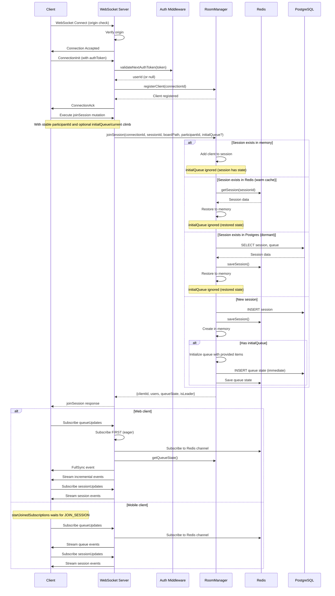

### Key Points

1. **Origin Validation**: WebSocket upgrades are validated against the allowed-origins list (`BOARDSESH_URL` + `www.` variant, Vercel/homelab preview patterns, dev origins). Two additional paths are accepted: connections with **no** `Origin` header (native/direct clients), and genuine **same-origin** upgrades where the `Origin`'s hostname equals the request's `Host` header (`isSameOriginUpgrade` in `handlers/cors.ts`). The same-origin path is why the React Native **Android** app connects — RN derives `Origin` from the `wss://` URL (`https://ws.boardsesh.com`, the backend's own host, never on the website allow-list) — and why preview WS hosts (`{N}.ws.preview.boardsesh.com`) work without per-PR config. It's safe against cross-site WebSocket hijacking because a cross-site attacker's `Origin` is its own domain, and WS auth is token-based (`connectionParams`), not cookie-based. Rejected upgrades log `{ origin, host, userAgent, forwardedFor, remoteAddress }` for attribution.
2. **Authentication**: Auth token passed in `connectionParams` — web supplies a static `authToken` string; mobile supplies an async `connectionParams` provider that **refreshes a soon-to-expire token (`ensureFreshToken`) before reading it from secure storage on every reconnect**, mirroring the HTTP path's up-front refresh in `authenticatedFetch`. Both paths and the `shouldRetry` predicate are handled by the shared `createGraphQLClient` factory in `@boardsesh/graphql-client`. On a **4401 auth-error close**, the mobile / Expo-web transport (`ws-client-core.ts`) does **not** tear the client down. It remaps the close to a retryable **4403** at the socket boundary, so graphql-ws keeps the singleton client and reconnects its active operations once a single-flight credential recovery settles. The recovery force-refreshes (not the expiry-gated `ensureFreshToken`, since a server-revoked token may still be unexpired) and shares its in-flight promise with the HTTP 401 path so a simultaneous 401 + 4401 hits the refresh endpoint once; a burst of 4401 closes (one per active subscription) collapses into that single recovery. See **[Failure States and Recovery](#failure-states-and-recovery) → #8** for the full mechanism, including the credential-generation guard, the `connection_init` gate, and the `authTransportRevision` restart.
3. **Joined Subscription Gate**: Mobile waits for `JOIN_SESSION` to resolve before opening queue/session subscriptions. On socket close it tears down subscription refs, bumps the join epoch, and requires the next connection to rejoin before `startJoinedSubscriptions` subscribes again. Web still uses the eager queue subscription flow documented in the sequence above.
4. **Session Restoration**: Sessions can be restored from Redis (warm cache) or PostgreSQL (dormant durable state)
5. **Stable Participant Identity (authenticated only)**: Authenticated clients bind `participantId` to their verified `userId`, so reconnects across socket drops update the same participant row (peers see `UserPresenceChanged`, not `UserLeft` + `UserJoined`). Anonymous clients bind `participantId` to their `connectionId` instead — a client-supplied participantId is intentionally rejected on the server (it would let any session member impersonate any other participant, since `SessionUser.id` is broadcast to peers). Each anonymous WebSocket drop therefore appears as a fresh participant.
6. **Initial Queue Seeding**: When creating a new session, clients can provide `initialQueue` and `initialCurrentClimb` to seed the session with an existing local queue (e.g., when starting party mode with climbs already queued)
7. **Atomic Join**: `JOIN_SESSION_SCRIPT` is a single Lua call that writes the connection hash, session-members set, participant hash, `sessionParticipants` set, `participantConnections` set, and leader election in one round-trip. Earlier code split this across a Lua script plus a follow-up `multi.exec()`, leaving a brief window where `getSessionMembers` returned `id: connectionId` (the connection-key fallback) before the multi populated `sessionParticipants` and the user reappeared as `id: participantId`.
8. **Grace Window**: When a WebSocket drops, an **authenticated** participant (stable `participantId = userId`) is kept in `RECONNECTING` state with a 60s grace timer. A new connection authenticated as the same `userId` before the timer fires resumes the existing participant. The timer's "spare" check is **any present participant** — `getSessionParticipants` already prunes truly-absent entries before returning, so anything we still see has at least one live connection or a reconnect in flight. The check used to be `connectionState === 'CONNECTED'` only, which expelled mid-reconnect participants under their in-flight rejoin. **Anonymous** participants get **no** grace: their identity is the per-connection `connectionId`, so a reconnect always arrives as a brand-new participant that can never resume the old one. On disconnect they are removed immediately (`UserLeft`, not `RECONNECTING`) — otherwise each reconnect would stack a ghost that lingers for the full 60s, inflating the roster and `peerCount`/`partyMode` into a false "party" (see `disconnectClient` in `room-manager/client-lifecycle.ts`).
9. **TTL Refresh**: `REFRESH_TTL_SCRIPT` runs on every connection-level refresh and bumps the TTL on the connection hash, the session-members set, the `sessionParticipants` set, the participant hash, the participant-connections set, **and the session-leader key**. The connection TTL is now aligned with the session-membership TTL (4h) so a long-idle leader's connection hash can't expire while the session keys still point at it. Without the leader-key refresh, a long-running session that's been quiet but never lost its leader would drop the leader key when the original election TTL expires and clients would see a surprise `LeaderChanged` mid-session.
10. **Authoritative Leader Check**: Authorization for destructive operations (e.g. `endSession`) compares the caller's `connectionId` against the leader-key value from Redis (`distributedState.getSessionLeader`). `SessionUser.isLeader` derived from `getSessionMembers` can be momentarily stale during handoff — a participant whose local entry still says `isLeader=true` would otherwise authorize the action after the leader has already moved on.

11. **Anonymous Rate-Limit Identity**: `onConnect` resolves a `clientIp` from the upgrade request (`websocket/client-ip.ts`) and stores it on the connection context, so `applyRateLimit` keys anonymous WebSocket callers on `ip:<clientIp>:<operation>` instead of the per-connection `connectionId`. Before this, every reconnect minted a fresh `uuidv4` connectionId and therefore a fresh bucket, which defeated the limiter for anonymous clients (issue #2863). The trusted-hop order is **`cf-connecting-ip` → the LAST `x-forwarded-for` hop → `req.socket.remoteAddress` → undefined** — the same order `handlers/og-climb.ts` uses, and deliberately **not** the first-hop derivation in `graphql/yoga.ts`: earlier `x-forwarded-for` entries are client-authored, so trusting them would let a scripted client mint a fresh bucket per upgrade (or pin a victim's IP to exhaust theirs). Candidates are normalized (brackets and `%zone` stripped, `::ffff:` unwrapped, validated with `node:net`'s `isIP`, IPv6 truncated to its `/64` prefix) so one client can't split into several buckets or, with a routed `/64`, mint unlimited ones. Consequences: every anonymous WS operation — and API-key controller connections, which never set `isAuthenticated` — now shares both a fast per-instance bucket and a Redis-backed per-IP bucket across rolling-deploy instances (#4037), so a whole gym behind one NAT shares it; `reportBoardClimb` / `reportBoardDisconnect` carry extra anon headroom for that reason. `onConnect` also records the normalized TCP peer independently of all headers. Anonymous WS operations spend a second Redis bucket keyed on that peer with at least 600 requests/minute (or five times the normal operation limit). This deliberately coarse ceiling is high enough for hosted proxy fan-in, but a client reaching Railway directly cannot evade it by rotating a forged `cf-connecting-ip` header (#4038). Redis failure leaves the already-applied per-client tier in place and falls the peer ceiling back to its own in-memory key. These limits bound the _rate_ of anonymous operations; the _count_ of concurrent anonymous sockets is bounded separately — see the next point.

12. **Anonymous Concurrency Cap**: `onConnect` also caps how many anonymous sockets one IP may hold open at once (`websocket/connection-cap.ts`, issue #4035), because each accepted connection costs a room-manager registration plus subscription bookkeeping that no operation-rate limit ever touches. Two tiers, reusing the `client-ip.ts` normalization so an IPv6 client can't rotate inside its `/64`: a **per-client-IP** cap (default 200, `WS_ANON_CONNECTIONS_PER_CLIENT_IP`) that enforces, and a **per-TCP-peer** backstop (default 1000, `WS_ANON_CONNECTIONS_PER_SOCKET_PEER`) that is **warn-only** unless `WS_ANON_CONNECTIONS_PER_SOCKET_PEER_ENFORCE=1` — in the hosted topology the TCP peer can be a shared Cloudflare/Railway edge address, which would turn that tier into an instance-global anonymous ceiling, so its overflow is logged and measured before it is allowed to reject. The rejection log line names the tier that tripped. Enforcement lives in `onConnect`, **not** `verifyClient` as the issue title suggests: anonymity is only knowable once `connectionParams` arrive with the ConnectionInit, which is after the upgrade. Authenticated users and validated API-key controllers are exempt — controllers never set `isAuthenticated`, so without the exemption a gym's wall controller could be evicted by phones browsing on the same NAT. A rejected connection is closed with **4429** rather than the 4403 that `return false` alone would emit: graphql-ws excludes 4403 from its client-side fatal list, our shared client retries 10 times with `shouldRetry: () => true`, and mobile overloads 4403 as its auth-refresh retry signal, so 4403 would produce a reconnect storm; 4429 is fatal client-side, at the cost that a legitimately capped client stays down until it reconnects deliberately. Slots are released from the **raw socket's `close` event**, not `onDisconnect`, which graphql-ws skips for any connection that never reached `acknowledged` (a socket that dies mid-handshake, or an `onConnect` that throws in `registerClient`) — stranding a slot would permanently shrink that IP's budget on the instance. The mirror image of that race is handled right after `roomManager.registerClient` resolves: `onConnect` re-checks the socket and unregisters the client it just registered if the socket died mid-handshake. Nothing else would — the connection was never acknowledged, so `onDisconnect` never runs, and the in-memory client map has no sweeper — so without it a caller could churn abandoned handshakes into unbounded room-manager state despite the cap, since the slot itself is freed the moment the socket closes. The registry is in-process like the tier-1 rate limiter, so the global ceiling is `cap × instance count`; a Redis-backed counter is deliberately avoided because crashed instances would leave counts that never self-heal. Residuals: an authenticated account can still hold unlimited sockets (consistent with rate limits keying authenticated traffic on `userId`), and a socket that never sends ConnectionInit never reaches `onConnect` at all — it is bounded only by graphql-ws's 3s `connectionInitWaitTimeout`, and costs no room-manager state.

### Expo web token path (`/app`)

The Expo app running on web can't use the mobile secure-store token path — the backend JWE lives in an HttpOnly NextAuth cookie that browser JS can't read. The web fork bridges it through three steps (all in `packages/mobile/src/lib`):

1. **Poll `/api/internal/ws-auth`.** `synchronizeWebSession` (`auth-store.web.ts`) reads `/api/auth/session` then `/api/internal/ws-auth`, which returns the same encrypted JWE the WebSocket backend expects plus the decoded `userId`/`authSessionId`. The token is held in **process memory only** (never web storage); `getAuthToken()` returns it and `ensureFreshToken` re-syncs when it's missing/stale. One request pair is shared across concurrent HTTP 401s and WS 4401s so they can't storm the endpoint.
2. **BroadcastChannel propagation.** Credential changes publish on the `boardsesh-expo-web-auth-v1` channel (shared with the Next.js `ExpoAuthSessionBridge`), so a sign-in/out or account switch in one tab invalidates the in-memory token in every other tab. A per-tab `sessionGeneration` fences stale reconnects against a newer login.
3. **`BrowserAuthWebSocket`** (`ws-client.web.ts`) is the `webSocketImpl` passed to `createGraphQLClient`. Its `connectionParams` awaits any in-flight recovery, checks the credential generation, calls `ensureFreshToken`, then supplies the in-memory JWE. On a **4401** fatal close it runs `recoverRejectedAuthentication` (re-sync) and, only if recovery succeeds under the same generation, remaps the close to a retryable **4403** so graphql-ws reconnects with a fresh token — the browser analogue of mobile's `refreshAuthAndRecreateClient`. Both close codes live in `ws-close-codes.ts`, shared by the native and web ws-client transports and the session-realtime consumer so the emit and compare sides can't drift.

`ws-auth` decrypts the cookie exactly once per request: `getToken({ raw: true })` reads the raw cookie bytes (no decrypt), then a single `decode()` validates it (a malformed/expired cookie decodes to `null` → anonymous, not a 500).

### Initial Queue Seeding

When a user starts party mode while they already have climbs in their local queue, the client sends the existing queue along with the `joinSession` mutation. This ensures users don't lose their queued climbs when transitioning to party mode.

**GraphQL Mutation Parameters:**

```graphql
mutation JoinSession(
  $sessionId: ID!
  $boardPath: String!
  $username: String
  $avatarUrl: String
  $participantId: ID                       # Optional: stable anonymous participant identity
  $initialQueue: [ClimbQueueItemInput!]    # Optional: existing queue items
  $initialCurrentClimb: ClimbQueueItemInput # Optional: current climb
  $sessionName: String                      # Optional: display name for the session
) {
  joinSession(
    sessionId: $sessionId
    boardPath: $boardPath
    username: $username
    avatarUrl: $avatarUrl
    participantId: $participantId
    initialQueue: $initialQueue
    initialCurrentClimb: $initialCurrentClimb
    sessionName: $sessionName
  ) { ... }
}
```

**Behavior:**

- `initialQueue`, `initialCurrentClimb`, and `sessionName` are **only applied when creating a new session**
- If joining an existing session (active, warm, or dormant), these values are ignored and the existing session state is used
- `participantId` is optional for backward compatibility, but current clients always send it for anonymous sessions so reconnects preserve identity
- The queue is persisted immediately to Postgres (not debounced) to ensure durability for new sessions
- All users who join after the initial seed will receive the seeded queue state

**Client Flow (PersistentSessionContext):**

1. User calls `startSession()` which generates a new session ID
2. Client stores current queue in `pendingInitialQueue` via `setInitialQueueForSession()`
3. On WebSocket connection, the `joinSession` mutation includes the initial queue data
4. Server initializes the new session with the provided queue items
5. Client clears `pendingInitialQueue` after successful join

### Session Path Continuity

The WebSocket connection should remain stable when users navigate within the same board configuration. This is controlled by the **base board path** concept.

**URL Structure:**

```
/{board}/{layout}/{size}/{sets}/{angle}/{view}/{climb}
  │       │        │      │      │       │       │
  └───────┴────────┴──────┴──────┴───────┴───────┴──── Dynamic segments
  │       │        │      │      │
  └───────┴────────┴──────┴──────┴──────────────────── Base board path (session identity)
```

**What triggers session reconnection:**
| Change Type | Reconnects? | Reason |
|-------------|-------------|--------|
| Different board (kilter vs tension) | ✅ Yes | Different physical board |
| Different layout | ✅ Yes | Different hold arrangement |
| Different size | ✅ Yes | Different board dimensions |
| Different sets | ✅ Yes | Different hold selection |
| Different angle | ❌ No | Board angle is adjustable during session |
| Different view (/list, /play, /create) | ❌ No | Just navigation state |
| Different climb (in /play view) | ❌ No | Just viewing different climb |

**Implementation:**
The `getBaseBoardPath()` utility in `url-utils.ts` extracts the stable board configuration path by stripping:

- `/play/[climb_uuid]` - climb being viewed
- `/view/[climb_slug]` - climbs list with the play drawer pre-opened on a specific climb
- `/list`, `/create` - view type
- `/{angle}` - board angle (numeric segment at end)

This ensures `BoardSessionBridge` only calls `activateSession()` when the actual board configuration changes, not when users swipe between climbs or adjust the board angle.

---

## Board Presence Wall Feed

Board presence powers the mobile "now on the wall" feed, board sheet history, and board sheet stats. It is independent of party-session join: the mobile app resolves a board id for the wall feed before subscribing to `boardNowPlaying` or fetching board-presence history/stats.

The web gym kiosk (`/kiosk/{gym-slug}`, `packages/web/app/components/kiosk/presence/kiosk-presence-hub.tsx`) is a second consumer of the same feed: one graphql-ws client per TV (`connectionName: 'kiosk'`) multiplexes one `boardNowPlaying` subscription per kiosk board through one `BoardPresenceProvider` each. It never resolves board ids itself — the `gymKiosk` query returns each board's presence-channel `boardId` pre-resolved (public boards only for anonymous viewers). Since #4408 that client is **login-less**: the default `KioskPresenceHub` the display routes mount connects with `authToken: null` and never touches `/api/internal/ws-auth` at all, and its presence client is read-only (writes reject with `KioskReadOnlyPresenceError`). The one authenticated consumer of the same hub is the gym-manage kiosk preview, which mounts `ViewerKioskPresenceHub` (`kiosk/presence/viewer-kiosk-presence-hub.tsx`) because `gymKiosk`'s edit branch hands it private gym boards that an anonymous read masks as `NOT_FOUND`. Kiosk reliability (5-minute manual catch-ups, config-poll reload) sits on top of the same reconnect/catch-up machinery described below. Since W-16 (#4435) the kiosk client is the only web graphql-ws consumer besides `social/comment-section.tsx` and `hooks/use-notification-subscription.ts` — the root `'session'` client that used to open a second socket on every route, kiosk TVs included, came out with `PersistentSessionWrapper`, so an anonymous kiosk TV now holds exactly one socket and an `/embed/…` page holds none. A _signed-in_ viewer additionally holds the notification socket: `NotificationSubscriptionManager` is mounted at the root on every route (`app/layout.tsx`) and `use-notification-subscription.ts` opens its own client whenever there is an auth token — unchanged by W-16, and irrelevant to the kiosk/embed case, which is anonymous.

Mobile resolves the feed board id in this order:

1. `resolveBoardForUuid(boardUuid)` for the selected named board. This is the default board-sheet path and binds to the actual `user_boards` row, so stats/history are available before Bluetooth connects and stay aligned with board-scoped ticks.
2. `resolveBoardForSerial(serial, boardType, layoutId, sizeId, setIds)` after a BLE connection when the controller exposes a serial. This keeps everyone at the same physical wall converged on the same board id.
3. `resolveBoardForConfig(boardType, layoutId, sizeId, setIds)` only when no serial is available, giving serial-less boards a per-config fallback feed.

Fresh board rows are created only for configurations in the hardware catalog. MoonBoard uses the static layout/size/set catalog shipped in `@boardsesh/board-config`; Aurora-family boards require every requested set to have an exact `board_product_sizes_layouts_sets` association for the submitted board type, layout, and product size. The create gate runs after an existing board lookup: a legacy row whose old configuration is no longer recognized can still be resolved, and an owner can still bind a newly seen serial to their existing legacy row, but a catalog miss cannot mint another user or system board. Anonymous `resolveBoardForConfig` remains bind-only and returns `NOT_FOUND` on a miss without consulting or mutating the catalog-backed create path.

Read-only surfaces (gym kiosk, embeds) do not use the resolve mutations: any query returning a `UserBoard` (e.g. `board`, `gymBoards`) also carries `boardId` — the numeric presence-channel id — populated only when the board is public or the viewer has board-level edit access, `null` otherwise. That gate (`boardPresenceChannelId` in `packages/backend/src/graphql/resolvers/social/boards.ts`) is the single rule for exposing a board's live channel, so a private board never leaks its `boardNowPlaying` feed to anonymous kiosk/embed viewers.

Each resolver stamps short-lived proof-of-presence for the authenticated user before `reportBoardClimb` will accept a wall-feed report. On the mobile client, starting a newer UUID/config/serial resolve clears the previous board id and stale async results are ignored by a resolve-generation guard, so the sheet does not temporarily show another selected board's feed.

Every board-presence event carries the board's shared `seq`. The client subscribes before its initial hot-feed backfill, then uses that backfill to establish the first sequence baseline. After that, any live event with `seq > lastObservedSeq + 1` is treated as a missed event: the client applies the live event immediately, then runs a coalesced hot-feed catch-up (`boardRecentClimbs`, `boardPresenceStats`, and `boardConnection`) for the active board. This intentionally uses the Redis-backed recent feed rather than durable `boardHistory`, because `boardHistory` is dwell-gated on the write side while the board sheet must repair anonymous and short-dwell sends too.

All board-presence reads (`boardNowPlaying`, `boardRecentClimbs`, `boardHistory`, `boardPresenceStats`, `boardConnection`) are auth-optional: anonymous viewers (e.g. a public gym kiosk TV) can read public and system-shared boards, while a private board is masked as NOT_FOUND for them — the same error as a nonexistent board, so its existence isn't revealed. Logged-in callers keep membership-free access to any active board. Only the durable-history WRITE stays gated: `reportBoardClimb` persists to `board_climb_events` solely for an authenticated sender with >= 60s of proven presence on the board (the dwell gate).

### Board Queue Preview ("Up next" for gym kiosks)

Party queues live in membership-gated sessions keyed by session UUID; a public gym kiosk is anonymous and only knows a boardId. The bridge is a **redacted, board-keyed queue preview**: `boardQueuePreview(boardId)` (query + subscription), implemented in `packages/backend/src/services/board-queue-preview.ts` and `graphql/resolvers/board-presence/queue-preview.ts`.

- **Double privacy gate** (applied identically by the query, the subscription seed, and the live producer): (1) the board must be anonymously readable — public or a system-owned shared per-config board, same `requireAnonReadableBoard` set as `boardNowPlaying`; (2) the bound session must be `board_sessions.is_public = true` and `status = 'active'`. Gate 2 deliberately widens `is_public`'s meaning from "appears in discovery" to "queue observable on public displays" (user-approved; documented in the SDL). Both gates are viewer-independent — a logged-in viewer of a private board also gets `null`.
- **Redaction is total**: preview items carry only climb-catalog display fields (`queueItemUuid, climbUuid, name, grade, gradeColor, frames, angle, setter`), constructed field-by-field (never spread) so new `ClimbQueueItem` fields can't leak. `addedBy`/`addedByUser`/`tickedBy` never leave the session boundary. `upNext` is capped at 10; `queueLength` is the uncapped total.
- **Board→session binding**: `commitBoardClimb` (the `reportBoardClimb` pipeline) writes the reverse key `board:{boardId}:session` alongside the existing `session:{id}:board`, same 12h proof-of-presence TTL, read via `pubsub.getBoardSession(boardId)`. When no live binding exists the resolvers fall back to the newest active public `board_sessions` row for the board (`board_id`, `last_activity DESC`). A live binding pointing at an **active** session decides the preview outright: public → its queue, private → null (it never falls through past an active private session — that would surface a different session's queue while a private one holds the wall). A binding pointing at an **ended/deleted** session is treated as stale (bindings are TTL'd, never cleared on session end) and falls through to the DB fallback, so a wall hand-off to a new session doesn't blank kiosks until the new session's first send. Redis-less single-instance deployments use an in-memory binding fallback in `BoardPresenceStore`.
- **Live channel**: new pub/sub domain on prefix `boardsesh:board-queue:` (no overlap with `boardsesh:board:`). Each event is a full snapshot (latest wins — no deltas, no replay); the subscription eagerly subscribes, then yields the query-path snapshot as a seed.
- **Producer**: `registerBoardQueuePreviewHook()` (wired in `server.ts`, unregistered in `shutdownServices` so pending debounce timers can't fire during teardown) listens on the queue-event hook registry — `pubsub.setQueueEventHook` was converted to a multi-hook `addQueueEventHook(hook): unregister`, so the APNs Live Activity hook and this producer coexist. On each queue event (skipping `PlaybackStateChanged`) it debounces ~250 ms per session (trailing), re-verifies the reverse binding still points at the emitting session (a superseded session must not clobber the wall's preview), applies both gates, and publishes the redacted snapshot. Publisher-side hook semantics are correct here because the board-queue channel itself Redis-fans-out to every instance's subscribers.
- **Seed on first bind**: the producer only fires on queue events, but the binding itself is created by `reportBoardClimb` — so after the first wall report of a session, kiosks would otherwise see nothing until the next queue mutation. `commitBoardClimb` therefore reports `sessionBindingChanged` (SET..GET on the reverse key; in-memory diff in the Redis-less fallback), and `reportBoardClimb` fires a one-off `publishBoardQueuePreviewForSession` when a send just bound a new session to the wall (first bind or a session hand-off). Same gates + superseded-binding re-check as every producer publish; fire-and-forget; publisher-instance-only.
- **Tombstone on session end**: the producer only re-gates on queue events, so a session that stops being previewable without a queue mutation would leave its last snapshot on kiosks indefinitely. Every session-end path (`RoomManager.endSession` behind the explicit `endSession` mutation, and the inactivity sweep) therefore calls `publishBoardQueuePreviewTombstoneForSession(sessionId)`, which publishes an **empty** preview (`current: null, upNext: [], queueLength: 0`) — but only while the board's reverse binding still points at that session (a superseded session must not clobber the new session's preview), only for anon-readable boards, and only when the session genuinely is no longer publicly previewable. There is currently no mutation that flips `board_sessions.is_public` after creation; if one is added it must call the same tombstone when flipping to private.

---

## Backend URL Resolution

The WebSocket backend URL is resolved at runtime by `packages/web/app/lib/backend-url.ts` rather than relying solely on the build-time `NEXT_PUBLIC_WS_URL` environment variable. This is necessary because production and branch deploy previews can serve a build whose baked fallback is missing or points at local development.

### Preview Domain Pattern

Branch deploy previews use per-PR subdomains:

| Service      | Domain pattern                 | Example (PR #42)              |
| ------------ | ------------------------------ | ----------------------------- |
| Web frontend | `{N}.preview.boardsesh.com`    | `42.preview.boardsesh.com`    |
| WS backend   | `{N}.ws.preview.boardsesh.com` | `42.ws.preview.boardsesh.com` |

The runtime resolver maps the frontend hostname to the backend:

```
42.preview.boardsesh.com  →  wss://42.ws.preview.boardsesh.com/graphql
```

### Client-Side Resolution Order

`getBackendWsUrl()` checks these sources in order and returns the first match:

1. **Host-derived URL** -- if the page hostname is `boardsesh.com` / `www.boardsesh.com` or matches `{N}.preview.boardsesh.com`, the backend URL is derived automatically. No build-time config needed.
2. **`NEXT_PUBLIC_WS_URL` build-time fallback** -- the standard env var baked into the Next.js client bundle at build time. Used for any hostname that doesn't match a known pattern.

On the server side (SSR), only the build-time env var is used.

### Preview Deploy Infrastructure

```
                                Internet
                                   │
                       ┌───────────▼───────────┐
                       │   Main Traefik Proxy   │
                       │  (boardsesh.com infra) │
                       └───────┬───────┬────────┘
                               │       │
        *.preview.boardsesh.com│       │*.ws.preview.boardsesh.com
                               │       │
                       ┌───────▼───────▼────────┐
                       │  Branch-Deploy VM       │
                       │  Traefik Proxy          │
                       └───────┬───────┬────────┘
                               │       │
                    ┌──────────▼──┐ ┌──▼──────────┐
                    │ PR #42 Web  │ │ PR #42 WS   │
                    │ Container   │ │ Container    │
                    └─────────────┘ └──────────────┘
```

The main Traefik instance routes `*.preview.boardsesh.com` and `*.ws.preview.boardsesh.com` traffic to a dedicated branch-deploy VM. A second Traefik instance on that VM routes to the per-PR containers using the numeric prefix as the routing key.

### Local dev: WSS via Tailscale cert

`vp run dev` will provision a TLS cert for your Tailscale hostname (one-time, via `tailscale cert`) and start both the Next.js web server and the backend over HTTPS/WSS. That lets real phones on your tailnet hit the dev backend in a secure context — required for shake-to-feedback (DeviceMotion), Web Bluetooth, clipboard, etc.

- Cert cache: `$XDG_CACHE_HOME/boardsesh-dev-certs/<host>.{crt,key}` (fallback `~/.cache/...`), refreshed after 24h.
- Backend flip: `packages/backend/src/server.ts` reads `DEV_HTTPS_CERT_FILE` / `DEV_HTTPS_KEY_FILE` and, when both are present, uses `https.createServer(...)` so WS upgrades ride `wss://` on the same server.
- Web flip: the orchestrator sets the same env vars + `TAILSCALE_HOSTNAME` for the web dev script, which switches `NEXT_PUBLIC_WS_URL` / `NEXTAUTH_URL` / `BASE_URL` to `https://` / `wss://` and passes `--experimental-https --experimental-https-cert --experimental-https-key` to `next dev`.
- Fallback: any failure (Tailscale not installed, not logged in, tailnet missing the HTTPS Certificates feature, operator-permission denied) prints a targeted hint and continues on plain HTTP, so non-Tailscale devs are unaffected. Prod/branch-preview flow above is unchanged.

---

## Session Management

### Session Lifecycle States

```
                    ┌─────────────────────────────────────┐
                    │              Created                │
                    │  - Optional: goal, color, boardIds │
                    │  - Optional: isPermanent flag      │
                    │  - startedAt set on creation       │
                    └──────────────┬──────────────────────┘
                                   │ First user joins
                                   ▼
    ┌──────────────────────────────────────────────┐
    │                   ACTIVE                     │
    │  - Users connected                           │
    │  - Real-time sync enabled                    │
    │  - Redis cache hot                           │
    │  - In-memory session state                   │
    └──────┬───────────────────────┬───────────────┘
           │ Last participant      │ Participant calls endSession
           │ leaves/expires        │
           ▼                       ▼
    ┌──────────────────────────┐   ┌──────────────────────────────┐
    │   GRACE PERIOD (60s)     │   │     ENDED (explicit)         │
    │  - No connected users    │   │  - endedAt set               │
    │  - In-memory state       │   │  - Summary generated         │
    │    retained              │   │  - SessionEnded event sent   │
    │  - Redis session kept    │   │  - Removed from Redis        │
    │  - Postgres row not ended│   │  - Postgres record kept      │
    └────────┬──────┬──────────┘   └──────────────────────────────┘
             │      │ 60s expires
             │      ▼
             │   ┌──────────────────────────────┐
             │   │      WARM (Redis only)       │
             │   │  - In-memory state deleted   │
             │   │  - Redis cache retained (4h) │
             │   │  - Rejoin restores from      │
             │   │    Redis back into memory    │
             │   └──────────┬───────────────────┘
             │              │ Redis TTL expires
             │              ▼
             │   ┌──────────────────────────────┐
             │   │    DORMANT (Postgres only)   │
             │   │  - Redis entry expired       │
             │   │  - Postgres row still active │
             │   │  - Rejoin restores from      │
             │   │    Postgres while status     │
             │   │    is not 'ended'            │
             │   └──────────────────────────────┘
             │
             │ User rejoins within grace
             ▼
    ┌────────────────────┐
    │  Back to ACTIVE    │
    │  (no restoration   │
    │   needed)          │
    └────────────────────┘
```

**Grace Period:** When the last socket on a backend instance drops unexpectedly, the instance enters a 60-second grace period where in-memory state and pending queue writes are preserved. An **authenticated** participant is marked `RECONNECTING`, not removed; if a client reconnects within this window (common during network flaps or page refreshes) the same `participantId` (= `userId`) is marked `CONNECTED` and the session is instantly available without the expensive lock + Redis/Postgres restoration cycle. An **anonymous** participant (`participantId = connectionId`) can't be resumed on reconnect, so it is removed immediately on disconnect rather than parked — see the Grace Window note above. The grace period duration is controlled by `SESSION_GRACE_PERIOD_MS` in `RoomManager`.

Explicit UI actions still leave or end sessions immediately: `leaveSession` removes the participant and emits `UserLeft`; `endSession` is restricted to the session creator or current leader. Passive WebSocket disconnects emit `UserPresenceChanged` first and only emit `UserLeft` if the reconnect timer expires.

#### Leave vs. end on the client (#3502)

Both platforms expose leave and end as distinct actions. Which one a surface _leads with_ is a client concern — the server authorizes each independently.

The subtlety: **one signed-in climber on two devices is a single participant.** `joinSession` resolves `participantId = client.userId || connectionId` (`room-manager/client-lifecycle.ts`), so two phones share one participant entry and one roster row. Every roster-derived signal is therefore participant-scoped and structurally cannot see the second device:

- `SessionUser.isLeader` is the OR of leadership across a participant's connections (`upsertLocalParticipant` keeps it sticky-true) — that roster row stays participant-scoped by design, so it still can't tell a second device apart from the leader's device. The top-level, connection-scoped `isLeader` the `SessionRosterSnapshot` branch in `@boardsesh/queue-runtime` hands back is no longer overwritten from that row for signed-in users (#3952) — it only re-derives from the snapshot when the connection is anonymous (`participantId === clientId`); authenticated connections keep relying on the JOIN response and `LeaderChanged`. **Still do not build device-level UI on the roster's `SessionUser.isLeader`** — use device provenance / the JOIN response instead.
- `LocalSessionParticipant.connectionIds` (and its Redis equivalent) does distinguish connections, but is deliberately not exposed over GraphQL. It answers "how many sockets does this human hold right now", which flaps with screen locks and reconnects — and a stale value degrades toward offering the _destructive_ action.

Mobile instead keys the **emphasis** on device provenance (`session-store.ts` records the id of the session this device created) and the **availability** of End on `Session.createdByUserId` (member-only; redacted for the non-member preview). Provenance decides which action leads, never which actions exist — so losing it to a reinstall costs a creator the End-first default and nothing else.

Mobile reads `createdByUserId` through its own `GET_SESSION_OWNER` document rather than as another field on `GET_SESSION`: that query also backs the join-by-link screen, and GraphQL validates whole documents, so a new-bundle/old-backend skew would otherwise break joining outright instead of just leaving ownership unknown.

If the grace period expires, the session is evicted from memory but remains restorable from Redis until the 4-hour TTL expires. After Redis TTL expiry, the session is still not ended; the next join restores it from Postgres as long as the durable row has not been explicitly marked `ended`.

**Multi-instance grace handling:** Because each instance tracks its own local clients, "the last user disconnected" is a per-instance event — another instance may still host active members. Before tearing down session state (cancelling pending Postgres writes, marking the session inactive in Redis), `leaveSession` in `room-manager/client-lifecycle.ts` queries `distributedState.getSessionMembers(sessionId)` and filters out the leaving connection. The dangerous side-effects (`writeScheduler.cancelPendingWrites`, `redisStore.markInactive`) only fire when no other instance has members. The local grace timer (memory cleanup for this instance's `sessionsMap`) still runs regardless. The filter relies on the invariant that `SessionUser.id` returned by `getSessionMembers` is the connection ID (see `distributed-state/session-ops.ts:181`); the regression test `leave-session-multi-instance.test.ts` pins this.

### Session Properties

Sessions support the following configurable properties set at creation time:

| Property      | Type      | Description                                                                            |
| ------------- | --------- | -------------------------------------------------------------------------------------- |
| `goal`        | `String?` | Free-text session goal (max 500 chars), displayed in the session header                |
| `color`       | `String?` | Hex color code for multi-session display (e.g., `#FF5722`)                             |
| `isPermanent` | `Boolean` | Optional flag for long-lived kiosk-style sessions, persisted with the session metadata |
| `isPublic`    | `Boolean` | Whether the session appears in discovery (default: true)                               |
| `boardIds`    | `[Int]?`  | Multi-board support — links session to specific boards within a gym                    |

### Session Ending and Summaries

Sessions end one of two ways: an explicit `endSession` call from a client, or the backend's inactivity sweep (see below). Last-user disconnects, grace-period expiry, and Redis TTL expiry do not mark a session as ended; they only evict hot state and force later restoration from Redis or Postgres.

When a session ends via `endSession`:

- `endedAt` timestamp is recorded in Postgres
- A `SessionEnded` event is broadcast to all connected clients
- A `SessionSummary` is generated and returned to the caller

#### Inactivity sweep (auto-finish)

`RoomManager.initialize()` starts a background interval (`INACTIVITY_SWEEP_INTERVAL_MS`, currently 1 minute) that calls `endStaleInactiveSessions(INACTIVITY_THRESHOLD_MS)` from `session-discovery.ts`. The sweep marks every session where `status='active' AND isPermanent=false AND lastActivity < NOW() - 1 hour` as `status='ended'` and stamps `endedAt`. Permanent sessions are exempt. The sweep does no Redis or `WriteScheduler` cleanup — by definition no clients are connected (otherwise `lastActivity` would have been refreshed via the debounced queue-write path), so there's no hot state to evict.

In multi-instance deploys the sweep wraps its `UPDATE` in a Postgres transaction-scoped advisory lock (`pg_try_advisory_xact_lock`) so only one instance runs the work per tick — losers see `locked=false` and return 0. The lock is a fan-out optimisation, not a correctness requirement (the `UPDATE` predicate is idempotent). Lock-key numbering convention: app-level advisory locks in the backend live in the reserved range `19550000–19559999` (seeded from issue #1955); `INACTIVITY_SWEEP_LOCK_KEY = 19551850` is the only slot in use today. New advisory locks should pick another unused integer in that range and document what they're for next to the constant.

Because the sweep mutates rows asynchronously to any connected clients, no `SessionEnded` broadcast is emitted. Instead, the client surfaces it lazily on the next app open:

1. `useQueueStorage.restoreState` waits for `useWsAuthToken` to resolve, then runs a pre-flight `GET_SESSION_SUMMARY` query against the persisted session.
2. If the response's `summary.endedAt` is truthy, `ACTIVE_SESSION_KEY` is cleared from IndexedDB and `setAutoFinishedSummary` opens the root `SessionSummaryDialog` in `autoFinished` mode.
3. The dialog title becomes "Session Finished"; HealthKit auto-sync and the save button behave the same as a manually-ended session — the workout happened regardless of how it was closed.

**Session Summary** includes:

- Total sends and attempts across all participants
- Grade distribution (sends grouped by difficulty grade)
- Hardest climb sent (with climb name and grade)
- Per-participant stats (sends, attempts, display name, avatar)
- Session duration (calculated from `startedAt` to `endedAt`)
- Session goal (if set)

The frontend displays the summary in a dialog when the session ends, and optionally as a feed item in the activity feed.

### Cold-Start Status Check (`sessionStatus`)

The mobile app persists the active session id (expo-secure-store) and tries to restore it on cold start. Before rejoining it must tell two states apart that look identical to the presence-gated `session` query: an **ended** session (drop the stored id) and a **dormant-but-active** one in the WARM or DORMANT lifecycle states above (restore it). `session` returns null for any empty roster, so it can't make that call — and blindly sending `JOIN_SESSION` against an ended id recreates the room as an empty zombie (#2683).

The `sessionStatus(sessionId)` query exists solely for this disambiguation:

- It is a plain SELECT of the durable `board_sessions` row on the read path — no Redis, no room-manager involvement, so it can never resurrect hot state. It returns the two-value `SessionStatus` enum directly (`active` | `ended`), or `null` for an unknown id.
- The resolver owns the ended-ness reading: a row is `ended` when `status = 'ended'` **or** `endedAt` is set (insurance against a manually skewed row — both writers set the two together). Everything else reads as `active`, including the `'inactive'` value the legacy DB CHECK from backend migration `0005_session_status_tracking.sql` still permits but nothing has ever written (presence moved to Redis) — a dormant row is the restore-safe case this query exists to preserve.
- It requires no auth by design: it exposes only existence + ended-state, and auth may not be restored yet at cold start. This is also why mobile can't reuse the web flow described above — the `GET_SESSION_SUMMARY` pre-flight requires an authenticated caller.
- Client behaviour (`packages/mobile/src/providers/queue-provider.tsx`): anything but `active` (so `ended` or `null`) → clear the stored id; `active` → restore; fetch failure (offline cold start) → restore optimistically so the queue still comes back, since a dead session stays escapable via End Session.

### Session Query Membership Gate (`session`)

The `session(sessionId)` query serves two audiences with one payload shape, split by membership:

- **Members** get the full payload: queue state, roster, `lastConnectedBoardSerial`, metadata. Membership is resolved by `isSessionMember` (`resolvers/shared/helpers.ts`) — a **single-shot, non-throwing** check, unlike the retrying `requireSessionMember` used by mutations/subscriptions. It short-circuits through: the connection's local context → `distributedState.isConnectionInSession` (cross-instance WS) → a durable `board_session_participants` row when `ctx.userId` is set (primary DB, same predicate as the widget guard). The durable fallback exists because HTTP GraphQL requests are stateless — each gets a fresh `http-<uuid>` connectionId (`yoga.ts`), so connection-based checks can never match an HTTP caller.
- **Non-members** get a redacted invite-preview instead of an error: session metadata plus the full `users` roster (mobile's join-confirmation screen shows who's climbing before the user commits — `GET_SESSION`), with `queueState: null`, `lastConnectedBoardSerial: null`, `isLeader: false`. The roster-in-preview contract applies to private (`isPublic: false`) sessions too — an invite link is the access token. An **anonymous** HTTP caller who is genuinely in the session also lands here (no stable identity to check durably) — accepted degradation, relevant to mobile's `GET_SESSION_QUEUE_STATE` resync, which already null-guards `session?.queueState`.
- **Empty live roster** returns `null` before any membership check runs (the dormant-session contract `sessionStatus` disambiguates, above).

The compat matrix is pinned by `packages/backend/src/__tests__/session-query-gate.test.ts`.

### Multi-Board Sessions

Sessions can be linked to multiple boards within the same gym via the `sessionBoards` junction table. This is validated at creation time:

- All `boardIds` must exist in the `userBoards` table
- All boards must belong to the same gym (different gyms are rejected)

### Leader Election

Leader state is retained for compatibility and UI flags, and it is an authorization boundary for ending sessions over WebSocket: `endSession` requires the caller to be the session creator or the current leader. HTTP callers must be the authenticated session creator.

Leader election uses Redis-backed atomic operations for consistency across instances:

**Single Instance Mode:**

- First client to join becomes leader
- On leader disconnect, earliest connected client is elected

**Multi-Instance Mode (Distributed):**

- Uses Lua scripts for atomic leader election
- Leader stored in Redis: `boardsesh:session:{id}:leader`
- Consistent across all backend instances

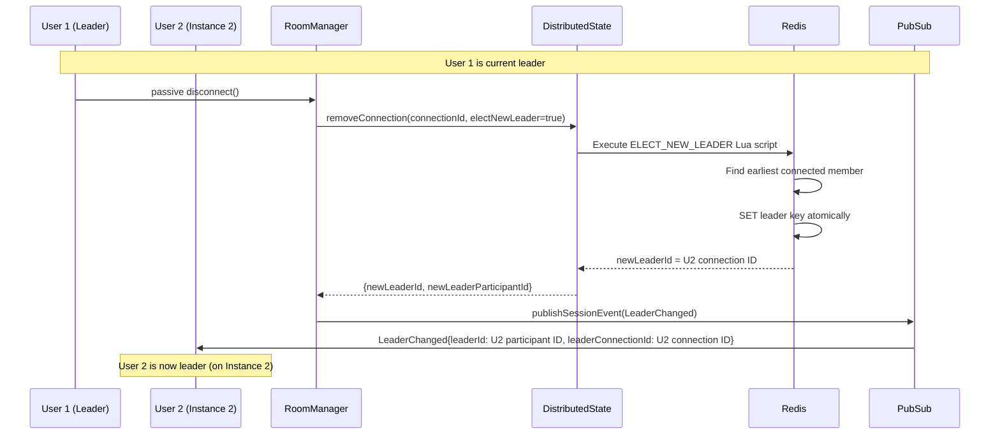

**Lua Script Atomicity:**

```lua
-- ELECT_NEW_LEADER_SCRIPT
-- Gets all session members, filters out leaving connection
-- Sorts by connectedAt, picks earliest
-- Atomically sets new leader
```

### Always-live wall control (the lightbulb)

Group sessions are **always-live**. There is no driver role and no preview-only gating: any session participant who changes the current climb or navigates the queue immediately updates the shared queue for everyone, and whoever holds a BLE connection relays that climb to the board — exactly like solo. `setCurrentClimb` / `navigateToQueueItem` broadcast `CurrentClimbChanged` to every member with no authority check. (The driver-role **behavior** and the `boardsesh:session:{id}:driver` Redis key were removed. Workstream B7 — reduced variant, 2026-07 — deleted the `takeControl` / `releaseControl` mutations outright. They were not pure no-ops: `takeControl` with a `climb` argument still propagated that climb via `setCurrentClimbAndPublish`, and stale bundles' party-mode lightbulb press routed through it. A stale client calling either now gets an unknown-mutation error: the go-live gesture degrades (the client's catch handler rolls back and resyncs) while everything else on that bundle keeps working. That degradation is an accepted, telemetry-bounded trade-off — the affected cohort is a shrinking stale-bundle tail whose fix is one app open (OTA). `Session.driverParticipantId` and the `DriverChanged` event stay as `@deprecated` shims for now — telemetry found a real tail of stale mobile JS bundles whose `JoinSession`/`sessionUpdates` documents still select/fragment on them, and whole-document GraphQL validation means removing those would break join or the whole subscription for those clients. Re-check via last-14d Session Joined/Started events grouped by `$app_build` + `ota_is_embedded`; remove once pre-2026-06-15 builds are ≈ 0.)

The "lightbulb" is no longer a driver claim. It is a **send / re-assert** affordance: pressing it re-sends the current climb to the board (connecting first if needed). Lit means our session's climb is confirmed on the wall; unlit means the relay dropped and we don't know that the board still shows our climb.

- **`WallConfirmedClimb` turns the lightbulb on.** When any phone successfully delivers a climb to the board over BLE it calls `confirmClimbOnWall`, and the backend broadcasts `WallConfirmedClimb` to every member. The original lightbulb model — a driver/preview-only claim — was retired in 2026-06; group sessions are always-live.
- **`WallDisconnected` turns the lightbulb off.** When the device relaying the climb drops its BLE link, it calls `reportWallDisconnect(): Session!`, which publishes a session-scoped `WallDisconnected { disconnectedByParticipantId: ID }` event. As a crash backstop, if that device's WebSocket closes without a clean disconnect, the room manager publishes `WallDisconnected { disconnectedByParticipantId: null }` on its behalf. Every member turns its lightbulb off on receipt.
- **The current climb is preserved.** `WallDisconnected` only flips the indicator — it never clears or changes the active climb. Pressing the lightbulb again re-asserts (re-sends) the current climb to the board.
- **`isLeader` is unaffected.** Leader stays a separate concept for `endSession` auth, the OG share-image headline, and presentation state; `LeaderChanged` still fires. Board-presence (`reportBoardClimb` / `reportBoardDisconnect` / `BoardConnectionChanged` / `BoardClimbCleared`) is a separate service and is also unaffected.

### Session boardPath sync (angle sharing)

The session's `boardPath` is the route string the host first joined / created on (`/{board}/{layout}/{size}/{sets}/{angle}/...`). Today the **angle** segment is the only piece that changes after creation — group-session feedback (tester quote: "the app seems to return to 40° as I navigate around") drove the move from "device-local angle" to "session-shared angle." The flow:

- **Mutation:** `setSessionBoardPath(boardPath: String!): Session!` accepts a full path, validates via `BoardPathSchema`, persists via `roomManager.updateSessionBoardPathIfChanged` (read-then-write, non-atomic — see the JSDoc in `session-discovery.ts` for the accepted contract), and publishes `SessionBoardPathChanged` only when the stored value actually moved (idempotent on no-op writes). Any participant may call — and in the always-live model any participant may change the climb too.
- **Optimistic-UI shape:** returns `Session!` for symmetry with `setSessionBoardSerial` and the other session mutations. The client's angle selector pushes the URL locally for instant feedback (`router.push(newPath)`) and then fires the mutation; the round-trip is best-effort, errors are swallowed.
- **Event:** `SessionBoardPathChanged { boardPath, changedByParticipantId }` fans out via `pubsub.publishSessionEvent` to every session subscriber. The `changedByParticipantId` lets the originating client suppress the echo (the local `router.push` already landed) — remote clients call `router.replace(newPath)` to follow. The replace (not push) is intentional: a remote-driven sync shouldn't add to the back-stack.
- **Client wiring:** `setSessionBoardPath` lives on `PersistentSessionApi` (`use-queue-mutations.ts`). The follow-up `router.replace` is wired in `BoardSessionBridge` — it subscribes to session events via `subscribeToSessionEvents`, filters on `__typename === 'SessionBoardPathChanged'`, and replaces the URL when the originator isn't the local participant. The existing pathname-watching effect in the bridge then re-activates `activeSession` with the new pathname, so `activeSession.boardPath` and downstream consumers (queue bridge angle, log paths) stay in sync.
- **Race contract:** the read-then-write helper trades atomicity for simplicity. Two concurrent angle taps can both publish (the client treats duplicate `router.replace` to the same URL as a no-op), and the realistic write pressure is one tap at a time per device. If a future caller can't tolerate double-publish, tighten to a single-statement CTE per the `session-discovery.ts` JSDoc.

### Session Update Events

`sessionUpdates(sessionId)` emits membership/lifecycle events and live stats updates.

| Event                     | When emitted                                                                                                                                                                         | Key fields                                                                                                                                                                                  |
| ------------------------- | ------------------------------------------------------------------------------------------------------------------------------------------------------------------------------------ | ------------------------------------------------------------------------------------------------------------------------------------------------------------------------------------------- |
| `UserJoined`              | A new participant joins the session                                                                                                                                                  | `user` with `connectionState`                                                                                                                                                               |
| `UserPresenceChanged`     | A known participant reconnects or drops                                                                                                                                              | `user` with `connectionState` (`CONNECTED` or `RECONNECTING`)                                                                                                                               |
| `UserLeft`                | A participant explicitly leaves or expires                                                                                                                                           | `userId`                                                                                                                                                                                    |
| `LeaderChanged`           | Leader election selects a new leader after explicit leave, passive disconnect, or stale-member cleanup                                                                               | `leaderId` is the stable `SessionUser.id`; `leaderConnectionId` is present for current-client connection checks                                                                             |
| `WallDisconnected`        | The device relaying the climb to the board drops its BLE link (`reportWallDisconnect`), or its WebSocket closes without a clean disconnect (room-manager crash backstop)             | `disconnectedByParticipantId` is the stable `SessionUser.id` of the device that dropped, or `null` for the crash backstop. Members turn the lightbulb off; the current climb is preserved   |
| `SessionBoardPathChanged` | Any participant changes the session's stored boardPath via the `setSessionBoardPath` mutation (today: angle changes through the angle selector — see "Session boardPath sync" below) | `boardPath` is the full route string (`/<board>/<layout>/<size>/<sets>/<angle>/...`); `changedByParticipantId` carries the originator so the sending client can echo-suppress its own event |
| `SessionEnded`            | Session is ended explicitly                                                                                                                                                          | `reason`, `newPath`                                                                                                                                                                         |
| `SessionStatsUpdated`     | A tick is saved for an active party session                                                                                                                                          | `totalSends`, `totalFlashes`, `totalAttempts`, `tickCount`, `participants`, `gradeDistribution`, `boardTypes`, `hardestGrade`, `durationMinutes`, `goal`, `ticks`                           |

`SessionStatsUpdated` payloads include full `ticks` rows so clients can update charts and climbs/attempt lists without issuing an extra session detail refetch. On the client, `useEventProcessor` patches the `SESSION_DETAIL_QUERY_KEY(sessionId)` React Query cache entry directly with the new stats and ticks — there is no separate `liveSessionStats` merge layer, so any component subscribed via `useSessionDetail` re-renders from the updated cache automatically.

**UserJoined / UserLeft identifier contract:** The `user.id` field in `UserJoined` and the `userId` field in `UserLeft` both carry the **WebSocket connection ID**, not the stable database user UUID. The schema-field name `userId` predates the distinction and is a misnomer — renaming it is a breaking change for clients and out of scope. The web client populates its participant list from `UserJoined.user.id` and filters on disconnect with `u.id !== event.userId` (`use-session-lifecycle.ts:562`), so the two events must agree on shape. If you need the stable user UUID downstream (auth checks, tick attribution), use `ctx.userId` on the backend — which auth middleware sets and resolvers must not overwrite — or include `SessionUser.userId` in the payload explicitly (it is a separate field).

**`ctx.userId` lifecycle:** Auth middleware sets `ctx.userId` once at connection time to the stable database user UUID (or `undefined` for unauthenticated clients). Session-related resolvers (`joinSession`, `createSession`) must not overwrite this field — they only update `ctx.sessionId`. An earlier bug clobbered `ctx.userId` with the connection ID inside `joinSession`, breaking every downstream resolver that read `ctx.userId` (ESP32 auto-authorize, climb / tick mutations, controller queries). The regression test `session-context.test.ts` pins the correct behaviour.

---

## Queue State Synchronization

### Event Types

| Event                 | Description             | Fields                                                       |
| --------------------- | ----------------------- | ------------------------------------------------------------ |
| `FullSync`            | Complete state snapshot | `sequence`, `state` (queue + currentClimb + `stateHash`)     |
| `QueueItemAdded`      | Item added to queue     | `sequence`, `stateHash`, `item`, `position`                  |
| `QueueItemRemoved`    | Item removed from queue | `sequence`, `stateHash`, `uuid`                              |
| `QueueReordered`      | Item moved in queue     | `sequence`, `stateHash`, `uuid`, `oldIndex`, `newIndex`      |
| `CurrentClimbChanged` | Active climb changed    | `sequence`, `stateHash`, `item`, `clientId`, `correlationId` |
| `ClimbMirrored`       | Mirror state toggled    | `sequence`, `stateHash`, `uuid`, `mirrored`                  |

Every delta event carries the post-event `stateHash`. Clients must store that hash after accepting the matching `sequence`; the periodic hash watchdog compares the local queue hash against this last accepted server hash. Updating the hash only on `FullSync` is incorrect and can create a resync loop after ordinary delta traffic.

### Sequence Assignment (atomic compare-and-swap)

A session's queue lives in one Redis hash, `boardsesh:session:{id}`, and Redis is the source of truth while the session is live (Postgres writes are debounced 30s). Sequence and version are allocated by a single Lua script, `UPDATE_QUEUE_STATE_CAS_SCRIPT` (`services/redis-session-store.ts`), invoked through `RedisSessionStore.casUpdateQueueState`.

The script reads the stored version, compares it to the caller's `expectedVersion`, and writes the new queue in one atomic step. Callers pass `CAS_ANY_VERSION` to skip the comparison. On mismatch it returns `CONFLICT` and writes nothing; `queue-state.ts` turns that into a `VersionConflictError`, and `withQueueVersionRetry` (`graphql/resolvers/shared/queue-retry.ts`) re-reads state and recomputes the mutation, up to `MAX_RETRIES` (3).

Why it has to be atomic: this was a read-modify-write until #3906 — HGETALL, compute `+1` in Node, HMSET the whole hash back. Two mutations overlapping anywhere in that window both read the same version and both wrote `+1`, and the later HMSET replaced the entire `queue` array, so a climb a party member had just added silently disappeared. `updateQueueState` also accepted an `expectedVersion` it never compared to anything, which made every `VersionConflictError` retry loop pointed at it dead code. The guarantee has to hold across _processes_, not just within one event loop: Redis is shared by every backend instance, and Railway's rolling deploys run two of them at once even at a single replica. An in-process mutex would not have helped.

Two further pieces of the contract:

- **Dormancy floor.** A session past the 4h Redis TTL still has durable counters in Postgres. When the hash is missing, the script returns `NEEDS_FLOOR` without writing; the caller reads Postgres and retries with `versionFloor`/`sequenceFloor`, and the script takes the max. Restarting the counter at 1 would rewind the sequence clients gap-check against. Same shape as the board-presence reseed in `allocateBoardSeqAtLeast`.
- **`setQueue` is versioned only on its merge path.** Without a `baselineSequence` its payload is entirely client-supplied, so there is nothing to recompute against a concurrent write and it passes `CAS_ANY_VERSION` — it needs a unique sequence, not a conflict. That was the whole story until #3933: a peer's `addQueueItem` landing inside a `setQueue` window was silently overwritten, and web's drag-to-reorder takes this path. Since #3933 a caller may send `baselineSequence` — the last sequence it had **applied** when it composed the payload. The resolver then replays the queue-event buffer over that window (`collectConcurrentAdds` in `graphql/resolvers/queue/set-queue-merge.ts`), re-appends peer adds the caller never saw, and writes through `withQueueVersionRetry` with a real `expectedVersion` so an add racing the merge conflicts and retries. It degrades to the legacy unversioned overwrite — deliberately, rather than merging on partial evidence — when the buffer cannot describe the window: the fire-and-forget LPUSH is still in flight after one 25 ms re-read, the window fell off the 100-entry / 5-minute buffer, Redis is off, or the CAS burned its retries. Mobile sends the baseline (`queue-provider.tsx`, read from the sync gate); web sends none and keeps the legacy behaviour. Residual, so #3933 narrows rather than closes: adds that reach the queue through a `FullSync`-publishing mutation (`replaceQueueItem`, controller navigation) carry no `QueueItemAdded` event and are still lost inside the window.

`stateHashOrdered` is now stored in the Redis hash alongside `stateHash` so the CAS can hand the prior pair back to `setQueue`'s redundant-resync diagnostic in the same round trip. Sessions written before this rollout have no stored value; reads fall back to recomputing it from the stored queue.

Note that duplicate sequence numbers remain legal on one specific path: `setClimbFromLedPositions` publishes a `FullSync` and a `CurrentClimbChanged` under the same sequence on purpose, so the ESP32 still receives the originating `clientId`. Peers drop the second as a stale duplicate. Sequence allocation is per state _write_, not per publish.

### Queue Mutations

| Mutation                   | Event emitted                       | Notes                                                                                                                                                                                                                                                                                                                                                                                                                                                                                                                                                                                                                                                               |
| -------------------------- | ----------------------------------- | ------------------------------------------------------------------------------------------------------------------------------------------------------------------------------------------------------------------------------------------------------------------------------------------------------------------------------------------------------------------------------------------------------------------------------------------------------------------------------------------------------------------------------------------------------------------------------------------------------------------------------------------------------------------- |
| `addQueueItem`             | `QueueItemAdded`                    | Appends to queue or inserts at `position`. Idempotent on `item.uuid` — duplicate adds are collapsed server-side during offline reconciliation.                                                                                                                                                                                                                                                                                                                                                                                                                                                                                                                      |
| `removeQueueItem`          | `QueueItemRemoved`                  | Removes by queue-item uuid and clears current climb if it removed the active item.                                                                                                                                                                                                                                                                                                                                                                                                                                                                                                                                                                                  |
| `reorderQueue`             | `QueueReordered`                    | Moves a queue item to a new index.                                                                                                                                                                                                                                                                                                                                                                                                                                                                                                                                                                                                                                  |
| `setCurrentClimbQueueItem` | `CurrentClimbChanged`               | Activates an existing queue item by uuid.                                                                                                                                                                                                                                                                                                                                                                                                                                                                                                                                                                                                                           |
| `setCurrentClimb`          | `CurrentClimbChanged` or `FullSync` | Emits `CurrentClimbChanged` when only the active climb changes. Emits `FullSync` when `shouldAddToQueue` adds a new queue item and activates it in the same mutation, because one sequence now represents both queue membership and current-climb state. Playlist activation may bypass this mutation and call `setQueue` instead when it needs to insert the active climb while replacing future suggested queue items.                                                                                                                                                                                                                                            |
| `replaceQueueItem`         | `FullSync`                          | Replaces the climb inside an existing queue slot in place, preserving position and the queue-item uuid. Used by the create-climb form to push saves of the currently-authored climb to peers without reshuffling the queue. Emits `FullSync` rather than a narrow delta because replace is infrequent and simpler to reconcile.                                                                                                                                                                                                                                                                                                                                     |
| `mirrorCurrentClimb`       | `ClimbMirrored`                     | Flips the mirror flag on the current climb and the matching queue item.                                                                                                                                                                                                                                                                                                                                                                                                                                                                                                                                                                                             |
| `setQueue`                 | `FullSync`                          | Bulk replaces queue + current climb. Used for offline → online reconciliation and playlist activation updates that must atomically preserve queue history, keep manually queued future items, and drop stale future suggested items. Also carries mobile's session generate: `appendGeneratedSession` (`queue-provider.tsx`) sends the existing queue with the generated items appended and the **current climb unchanged**, so peers see the session queued behind whatever's active rather than a wholesale replace that jumps everyone to climb #1. It falls back to the first generated climb only when nothing is current, matching web's `start-sesh-drawer`. |

### Deferred queue-adds from the setCurrentClimb coalescer

Rapid activations are coalesced client-side (`packages/shared/queue-runtime/src/set-current-climb-coalescer.ts`): one `setCurrentClimb` in flight, the most recent pending args win. A dropped `setCurrentClimb` costs two things, not one. The pointer move self-heals — the next activation or any peer broadcast re-establishes it — but a `shouldAddToQueue: true` payload's brand-new queue slot does not: the reducer already inserted it locally and no later activation retroactively adds it, so the climb would sit in that climber's queue and nobody else's.

So both ways a pending activation can lose its `setCurrentClimb` fire the content half on its own as a plain `ADD_QUEUE_ITEM`:

1. **superseded while pending** — a newer activation replaced it;
2. **drained and then rejected** — rate limit or socket blip (#3936).

The deferred add is fire-and-forget (awaiting it inside the drain would hold `inFlight` through a multi-second back-off and manufacture more supersedes) and carries the item's **live local index**, read at send time rather than at enqueue time. That index counts the items ahead of it the server already has, so the insert reproduces the sending client's order; an overshoot — an earlier item that has not landed yet — is clamped to an append by the resolver.

When the item is no longer in the local queue at send time, `packages/shared/queue-react/src/create-queue-mutations.ts` splits by cause:

| Cause of local absence                                                    | Behaviour           |
| ------------------------------------------------------------------------- | ------------------- |
| per-item remove / swipe / mobile clear-queue (one `removeQueueItem` each) | skip                |
| wholesale local replace — web's Clear, mobile's playlist replace-my-queue | skip                |
| wholesale **server** sync (`FullSync` → `INITIAL_QUEUE_DATA`)             | send, no `position` |
| a **peer** removed the item mid-back-off                                  | send, no `position` |

The last row is a known gap, not an oversight: a peer's removal arrives as a server delta and is indistinguishable from a sync at that layer, so the add fires and can resurrect a climb the peer just deleted. Closing it needs a delta-origin signal the mutations factory does not have.

The server-sync row is the one that matters most. The burst's head activation is itself an add, so the server answers it with `FullSync` (published with no `clientId`, so the origin cannot suppress its own echo), which `INITIAL_QUEUE_DATA` applies by **replacing** the local queue. A rate-limited drain rejects seconds later, by which time the pending item's optimistic slot is already gone. Skipping on mere absence would make the whole recovery inert in exactly the interleaving it exists for.

The burst _head_ — the call whose `enqueue` promise actually rejects — is not covered by the coalescer at all. Mobile recovers it caller-side (`recoverThrottledQueueAdd`); web does not. Tracked in #4009 and #4006.

### Tick Mode and Queue Bar Freeze

When a user opens the inline tick bar (to log a send/flash/attempt for the current climb), the queue control bar freezes navigation to prevent the active climb from changing mid-tick. This is implemented client-side in `queue-control-bar.tsx`:

- **Freeze trigger**: Opening tick mode sets `activeDrawer: 'tick'` in the queue bar state.
- **Frozen behaviour**: While tick mode is open, swipe navigation and prev/next buttons on the queue bar are disabled. The bar continues to display the climb being ticked, even if other participants change the current climb via WebSocket.
- **Unfreeze**: Closing tick mode (via the close button, swipe-to-dismiss, or after saving) unfreezes the bar and syncs back to the latest server state.
- **Unmount guarantee**: `QuickTickBar` unmounts when tick mode closes. Internal refs (e.g. `tickTargetTaken`) rely on this unmount to reset — they are not explicitly cleared.

This prevents data-loss scenarios where a user is mid-tick and a peer's navigation changes the climb, which would cause the tick to be saved against the wrong climb.

### Optimistic Updates with Correlation IDs

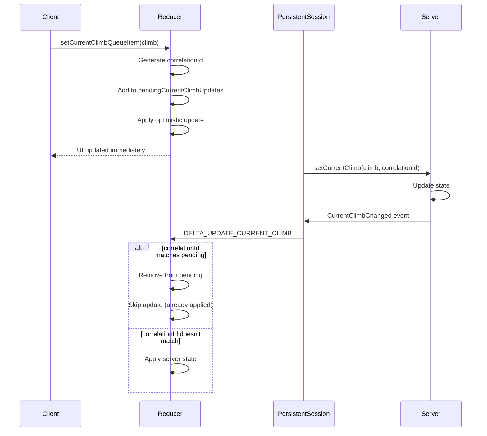

### Sequence Gap Detection

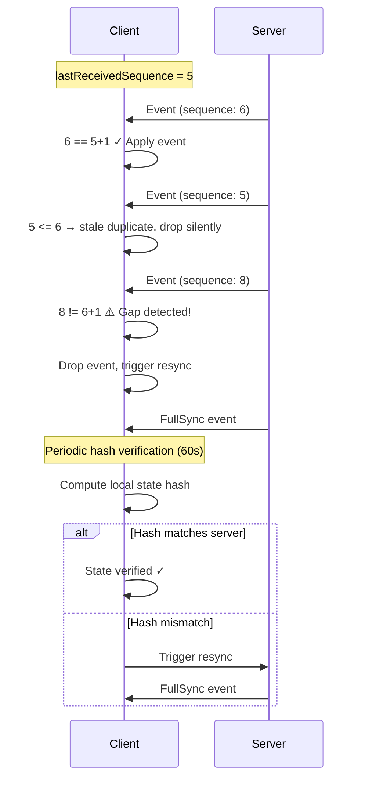

### Web Root Event Processor (the single queue-state owner, W6)

> Removed from web in W-16 (#4435) — the root `persistent-session/` provider went with the climbing UI. The reducer contract it describes is `@boardsesh/queue`, which the mobile client still owns.

The web app's queue state (`queue`, `currentClimbQueueItem`, `playlistSuggestionSource`, `pendingCurrentClimbUpdates`) lives in exactly one place: the root `persistent-session/hooks/use-event-processor.ts`, which runs every incoming queue event through the shared `queueReducer` (`@boardsesh/queue`) and exposes its `dispatch` through `usePersistentSession()`. Board routes (`graphql-queue/QueueContext.tsx`) and the off-board bridge (`queue-control/queue-bridge-context.tsx`) both read this state directly and dispatch local/optimistic actions into it — see "Shared queue-actions factory" above. There is no second reducer copy to keep in sync anymore; this consolidation is what workstream W6 did. Resync decisions — sequence gating, the reconnect strategy, the 60s hash watchdog's 3-strike backoff, and the corruption-resync cooldown — all live in one `createQueueSyncGate` instance (`@boardsesh/queue-runtime`, see `sync-gate.ts`) created by `PersistentSessionProvider` and shared by the event processor, `use-session-lifecycle` (which resets it on connection teardown), and `use-session-subscriptions`.

Root-processor specifics:

- **FullSync offline merge**: offline-buffered additions are merged into the FullSync payload before dispatch (visual continuity during reconciliation), but external subscribers receive the original unmerged event — `useOfflineReconciliation` compares the raw server queue against its buffer.
- **Reorder pre-validation**: a `QueueReordered` event is applied only when the item at `oldIndex` matches the uuid the server says it moved; on mismatch the client resyncs instead of guessing. Order drift is invisible to the sorted-uuid state hash, so a bad guess would never be caught by the watchdog.
- **No self-echo suppression for add/remove**: `handleQueueEvent` deliberately does not pass a `myClientId` hint to `mapSubscriptionEnvelopeToAction` — it must apply every broadcast, including echoes of this client's own mutations (idempotent inserts/removals are harmless to re-apply). Only `CurrentClimbChanged` carries a `clientId`/`correlationId` for echo suppression; `pendingCurrentClimbUpdates` tracks locally-dispatched correlation ids and clears them when the matching server echo arrives, so the optimistic dispatch never visibly flickers when the real confirmation lands (see `use-pending-update-cleanup.ts`, also root-owned now — it garbage-collects orphaned entries the server never confirmed).
- **Peer-broadcast analytics, board-route-gated**: `use-peer-broadcast-analytics.ts` fires `'Climb Added to Queue'`/`'Climb Removed from Queue'` for every `QueueItemAdded`/`QueueItemRemoved` this client's subscription receives (self or peer alike — same no-echo-suppression caveat as above), but only while the current route is a board route. This preserves the exact behavior of the deleted board-route hook it replaces (`graphql-queue/hooks/use-queue-event-subscription.ts`, which only ever ran inside board-route-scoped `GraphQLQueueProvider`) now that the equivalent logic runs at the always-mounted root.

---

## Multi-Instance Support

The backend supports horizontal scaling with multiple instances behind a load balancer. **No sticky sessions are required** - any instance can handle any client.

### Architecture

```
┌─────────────────────────────────────────────────────────────────┐
│                        Load Balancer                             │
│              (No sticky sessions required)                       │
└─────────────────────────────────────────────────────────────────┘
           │                    │                    │
    ┌──────▼───────┐    ┌──────▼───────┐    ┌──────▼───────┐
    │  Instance A  │    │  Instance B  │    │  Instance C  │
    │              │    │              │    │              │
    │ DistState ───┼────┼──────────────┼────┼─── Redis ◄──┤
    │  Manager     │    │              │    │              │
    └──────────────┘    └──────────────┘    └──────────────┘
```

### DistributedStateManager

The `DistributedStateManager` enables true horizontal scaling:

| Feature             | Description                                         |
| ------------------- | --------------------------------------------------- |
| Connection Tracking | All connections visible across instances via Redis  |
| Session Membership  | Aggregated user list from all instances             |
| Leader Election     | Atomic Lua scripts ensure consistent leader         |
| Instance Heartbeat  | 30s heartbeat detects dead instances                |
| WebSocket Ping/Pong | 30s ping detects dead connections on live instances |
| Graceful Cleanup    | Connections cleaned up on instance shutdown         |

### Redis Pub/Sub for Cross-Instance Events

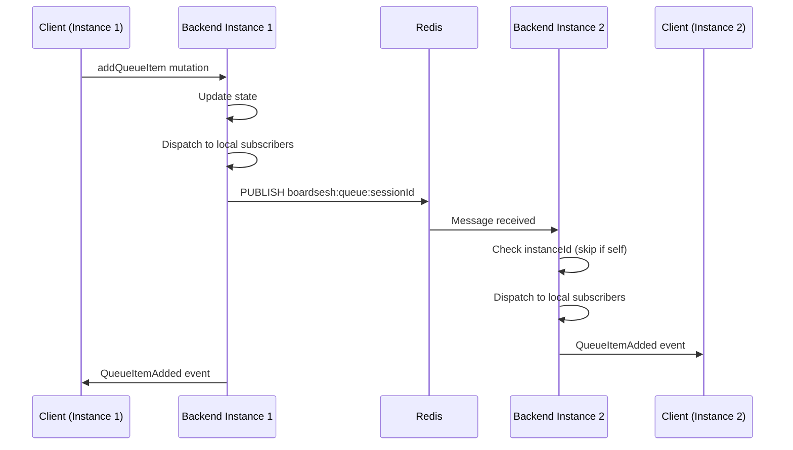

### Cross-Instance Session Membership Validation

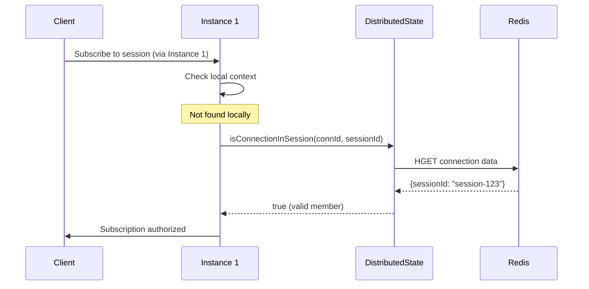

### Channel Naming Convention

- Queue events: `boardsesh:queue:{sessionId}`
- Session events: `boardsesh:session:{sessionId}`
- Notification events: `boardsesh:notifications:{userId}` (per-user, authenticated)
- Comment live updates: `boardsesh:comments:{entityType}:{entityId}` (per-entity, public)
- Board presence: `boardsesh:board:{boardId}` (per physical or shared board feed, authenticated publish)

### Event Buffer for Delta Sync

Events are buffered in Redis for reconnection recovery:

```
boardsesh:session:{sessionId}:events
├── Most recent event (index 0)
├── ...
└── Oldest event (max 100 events, 5 min TTL)
```

On reconnect, the web client calls `eventsReplay(sessionId, sinceSequence)` when the sequence gap is between 1 and 100 events. Replay is accepted only when the returned events cover every sequence from `sinceSequence + 1` through `currentSequence`, except that a `FullSync` event covers all earlier missing sequence numbers up to its own sequence. Empty or partial replay responses fall back to a fresh `FullSync`.

The `EVENTS_REPLAY` query uses the same GraphQL aliases as `queueUpdates` (`addedItem: item`, `currentItem: item`) so the event processor can apply live and replayed events through the same code path.

`PlaybackStateChanged` events are excluded from the buffer. They broadcast at up to 3600/min during variable-speed playback and reuse the room's current sequence number instead of incrementing it, so buffering them would evict real queue events within seconds and hand replaying clients duplicate/non-monotonic sequences that fail the contiguity check above. `publishQueueEvent` skips buffering them and `getEventsSince` filters any out on read (defence for mixed-version rollouts); the live `queueUpdates` subscription still forwards them normally.

---

## Failure States and Recovery

### 1. Client Disconnection

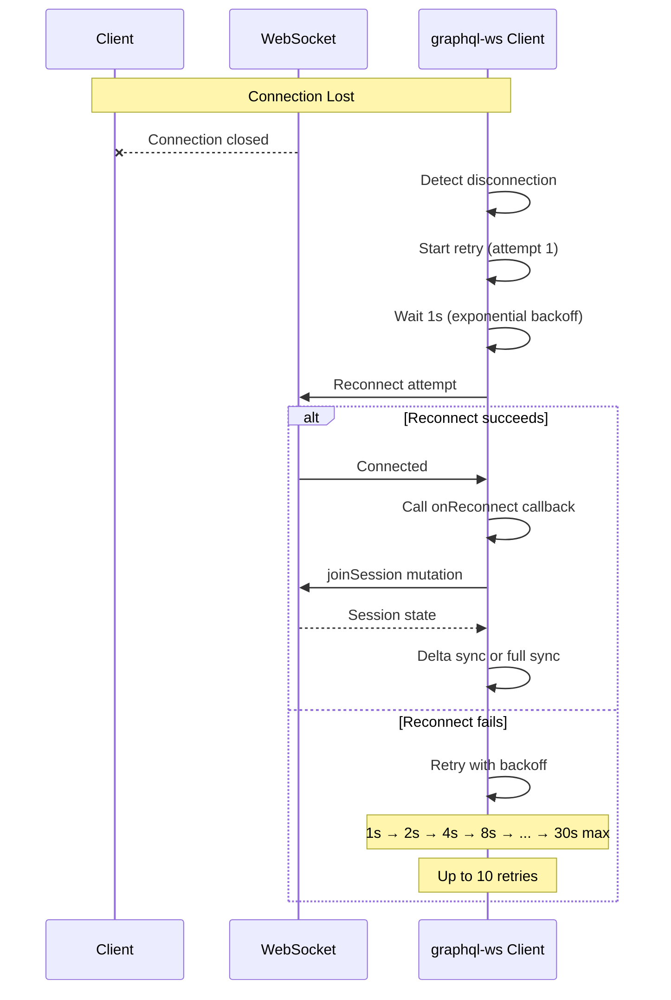

**Recovery mechanism:**

- Exponential backoff: 1s, 2s, 4s, 8s, 16s, 30s (max)
- Up to 10 retry attempts
- On reconnection: re-join session with the same `participantId` and sync state
- `graphql-ws` socket `closed`/`connected` events drive teardown and rejoin/resubscribe. Subscription `error`/`complete` handlers do not directly trigger reconnect; mobile clears subscription refs on socket close and reopens them only after the rejoin promise resolves.
- Delta sync attempted if gap ≤ 100 events and the replay buffer has contiguous coverage
- Falls back to full sync if the gap is too large, replay is incomplete, or the local hash disagrees despite no sequence gap
- Client-side supervisor detects stale connections and triggers reconnect (see [Client-Side Connection Supervisor](#client-side-connection-supervisor))

**Offline queue support:**

While disconnected (`isDisconnected` state in `useMutationGuard`), the client can continue operating on its local queue. The mutation guard allows local mutations once the session has been connected at least once:

- **All mutations** apply to local state immediately via the reducer
- **Additions** (addToQueue, setCurrentClimb) are buffered in a 500-item offline buffer (`useOfflineQueueBuffer`) for reconciliation on reconnect
- **Other mutations** (removeFromQueue, setQueue, setCurrentClimbQueueItem, mirrorClimb) apply locally only — they are not buffered because reconciling removals/reorders across multiple users is conflict-prone
- **Playlist suggestion source** changes are local-only UI state. Offline playlist activation can still replace local suggested items, but the source itself is not sent to the backend during reconciliation.
- **IndexedDB persistence** is enabled during offline party mode so the queue survives app restarts

On reconnect, the reconciliation hook (`useOfflineReconciliation`) waits for the FullSync event and then chooses a strategy:

- **Client wins** (full local state pushed via `setQueue`): when only 1 user is in the session, or when the server sequence number hasn't changed (no one else modified the queue while we were offline)
- **Server wins with additions merge** (default): server queue state is authoritative; only buffered additions are pushed via individual idempotent `addQueueItem` calls
- **Safety timeout**: if no FullSync arrives within 15 seconds, falls back to additions-only reconciliation against the current local queue

The FullSync handler in the event processor also merges offline-buffered items into the displayed queue for visual continuity — items the user added offline don't briefly disappear during the reconciliation window.

The UI shows the normal queue controls with a "Disconnected" indicator (CloudOff icon) instead of the blocking "Reconnecting..." spinner, so users can keep interacting.

### 2. Redis Connection Failure

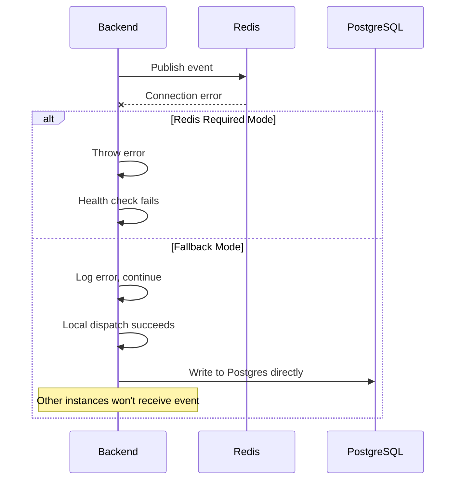

**Key behavior:**

- If `REDIS_URL` is configured, Redis is **required** (fail-closed)
- Without Redis config: local-only mode (single instance)
- Publish failures logged but don't block local dispatch
- Health endpoint reports Redis status

### 3. PostgreSQL Write Failure

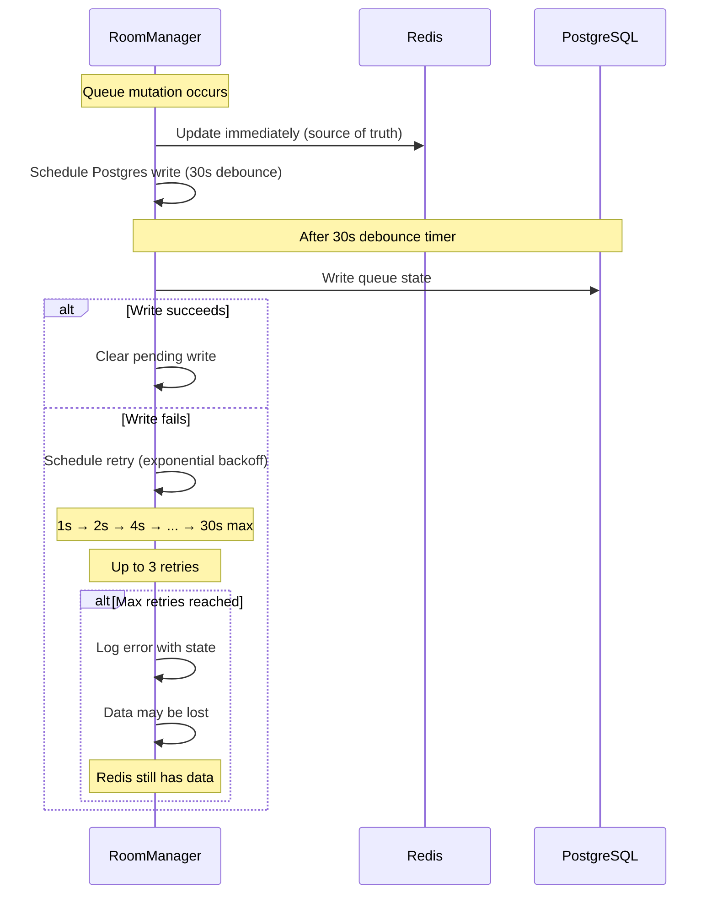

**Mitigation:**

- Redis is the real-time source of truth
- Postgres writes are debounced (30s) and retried
- Graceful shutdown flushes all pending writes
- Session can be recovered from Redis (4h TTL)

### 4. Session Restoration Race Condition

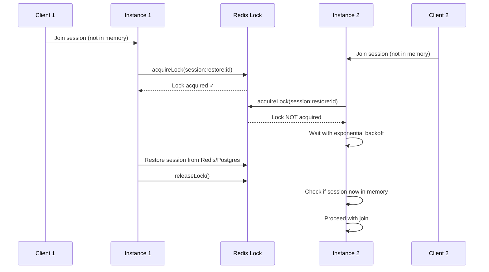

**Lock mechanism:**

- Redis-based distributed lock (10s TTL)
- Lua script ensures only owner can release
- Backoff waiting: 50ms → 100ms → 200ms → ... (5 attempts)

### 5. State Hash Mismatch (Drift Detection)

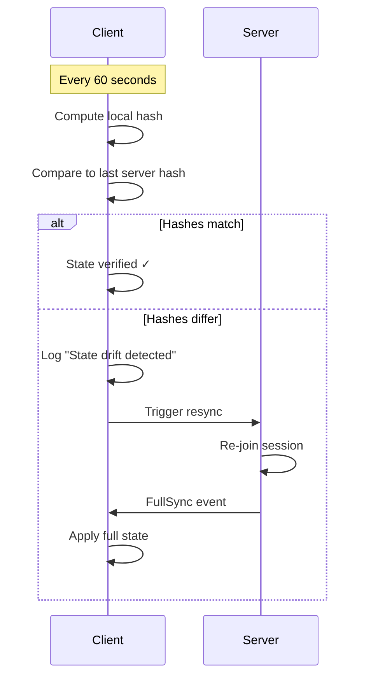

**Additional checks:**

- Current climb must exist in queue
- Sequence numbers must increment by 1
- Hash updated after each delta event
- The comparison and backoff live in the shared sync gate's `verifyLocalHash()`: after `RESYNC_LOOP_THRESHOLD` (3) consecutive resyncs against the _same_ unchanging server hash, the gate returns a `backoff` verdict — the client reports to Sentry once per drift streak and stops refiring the per-minute resync (issue #2359). The counter resets when the hashes agree again or the server hash changes.

### 6. Queue Item Corruption Detection

The client detects and recovers from corrupted queue items (null/undefined entries) that may occur due to server bugs, network issues, or state corruption.

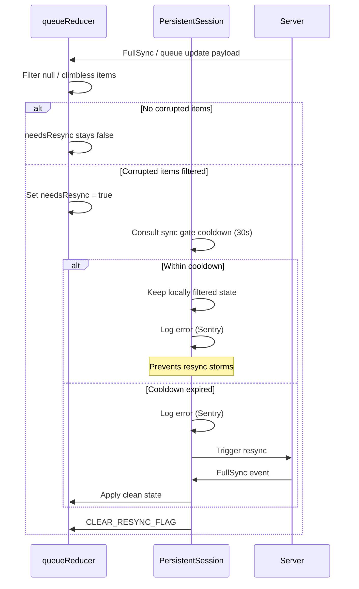

**Corruption sources:**

- Server sends malformed queue data
- State corruption during delta sync
- Race conditions in event handling

**Detection points:**

1. **Reducer (`INITIAL_QUEUE_DATA` / `UPDATE_QUEUE`)**: filters null/climbless items out of every incoming full payload and raises the `needsResync` flag when it filtered anything — reducer state can never contain nulls post-dispatch, so there is no separate local re-filtering step
2. **Action mapper**: `QueueItemAdded` events with no item payload are ignored (sequence tracking still advances)

**Resync cooldown:**

- 30 second cooldown between corruption-triggered resyncs, owned by the shared sync gate (`evaluateCorruption()` in `@boardsesh/queue-runtime`)
- Prevents infinite loop if server keeps returning corrupted data
- During cooldown: keep the reducer-filtered local state instead of resyncing
- All corruption events logged at `logger.error` level (see [Backend Logging](./logging.md)) for Sentry visibility

**Implementation:**

- `computeQueueStateHash()` defensively filters null/undefined items
- `useSessionSubscriptions` watches the reducer's `needsResync` flag, consults `syncGate.evaluateCorruption()`, then acknowledges the flag via `CLEAR_RESYNC_FLAG`
- The gate is reset on connection teardown, so a new session starts with a fresh cooldown

### 7. Subscription Error / Complete

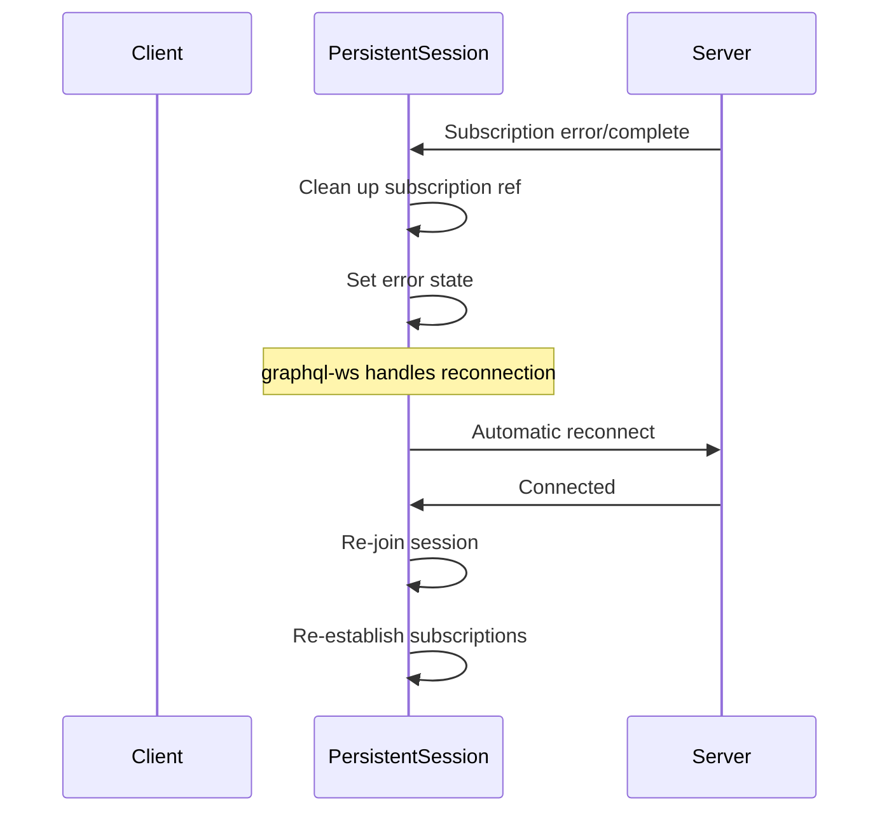

### 8. WebSocket Auth Rejection Recovery (mobile / Expo web)

The React Native app and its Expo-web build share one GraphQL-WS transport (`packages/mobile/src/lib/graphql/ws-client-core.ts`, `createWsClientModule`), forked per platform only in how the socket is built — `ws-client.ts` drops React Native's `Origin` header; `ws-client.web.ts` uses the standard browser `WebSocket` — and in which auth store / interceptor supplies the credential helpers. Everything security-sensitive below lives in the shared core so a fix lands once.

**Transport-boundary 4401→4403 remap.** The backend closes a rejected-auth handshake with **4401**. graphql-ws treats 4401 as fatal _before_ it calls `shouldRetry`, so a raw 4401 would abort every active subscription. The transport wraps the underlying socket in `AuthAwareWebSocket` (referenced in the platform tests by the aliases `NativeAppWebSocket` / `BrowserAuthWebSocket` — they are the same class, differing only by injected `createSocket`). It intercepts the socket's `onclose`: a 4401 is held back while a **single-flight** credential recovery (`recoverRejectedAuthentication`) runs, then delivered up to graphql-ws as **4403**. Because 4403 is not in graphql-ws' fatal-code list, the singleton client and its operations survive and reconnect through the normal retry + resubscribe loop. The two codes live in one module, `ws-auth-close-codes.ts` (`AUTH_REJECTED_CLOSE_CODE` = 4401, `AUTH_REFRESH_RETRY_CLOSE_CODE` = 4403), imported by both the transport and the session engine so they can never silently diverge. (`AuthAwareWebSocket` also forwards `addEventListener`/`removeEventListener` defensively; graphql-ws drives it only through the `on*` handlers today.)

**Credential-generation guard.** Each socket captures the current credential generation (`captureAuthCredentialGeneration`) when it opens. The recovery result is turned into a retryable 4403 only if that generation is still current when the recovery settles — a login/logout queued mid-recovery supersedes the old socket, whose close then stays fatal (4401) rather than resurrecting under a new account. The recovery uses `recoverAuthRejection` (a force-refresh, not the expiry-gated `ensureFreshToken`) because a server-revoked token can still be unexpired; its in-flight promise is shared with the HTTP 401 path so a simultaneous 401 + 4401 refreshes once.

**`connection_init` gate.** A retry created by a 4401 can open before the forced refresh finishes. `connectionParams` holds `connection_init` until any in-flight recovery for the current generation settles, then re-checks the generation and runs `ensureFreshToken`, so a reconnect never re-presents the rejected token.

**Subscription retention (`use-session-realtime.ts`).** Unlike an ordinary socket drop, the 4401→4403 retry must keep established graphql-ws operations alive — cancelling them would drop the lazy client's active-operation count to zero and abort the very retry the transport just initiated. The session engine's `closed` handler detects `AUTH_REFRESH_RETRY_CLOSE_CODE` and, when subscriptions are established, preserves them across the reconnect (rejoining via `JOIN_SESSION`, then releasing the retained handles only after the fresh subscriptions are in place so the count never reaches zero). The backend's authenticated durable-membership fast path re-authorizes the resubscription in parallel.

**`authTransportRevision` restart (Expo web only).** On native the token lives in secure storage and `connectionParams` re-reads a fresh one on every reconnect, so a credential change needs no effect restart — `useAuthTransportRevision` is a constant `0` there (`auth-transport-revision.ts`). On Expo web the session lives in the NextAuth cookie, so an in-memory browser credential change (a login, or a switch to a different account) can't be observed by the socket alone. The auth provider calls `bumpAuthTransportRevision()` on such a change (`auth-transport-revision.web.ts`, a `useSyncExternalStore` counter); that value is a dependency of `useSessionRealtime`'s effect, so bumping it tears the session effect down and re-runs it, re-establishing every subscription over a fresh transport bound to the new identity.

---

## Client-Side Connection Supervisor

The `WebSocketConnectionManager` (`packages/web/app/lib/realtime/websocket-connection-manager.ts`) is a singleton that sits between the raw `graphql-ws` clients and the React UI. It provides health monitoring, staleness detection, and a unified connection state for the reconnect UX.

### Architecture

```
graphql-ws Client(s)
        │
        │  on('connected' | 'closed' | 'ping' | 'pong' | 'error' | ...)
        ▼
┌──────────────────────────────┐
│  WebSocketConnectionManager  │  (singleton)
│                              │
│  - Registered clients map    │
│  - Primary name selection    │
│  - Health check interval     │
│  - Visibility change handler │
└──────────┬───────────────────┘
           │  subscribe(snapshot)
           ▼
┌──────────────────────────────┐
│  WebSocketConnectionProvider │  (React context)
│                              │
│  - Exposes state, error,     │
│    lastActivity, name        │
│  - forceReconnect() action   │
└──────────────────────────────┘
```

### Connection States

| State          | Meaning                                         |
| -------------- | ----------------------------------------------- |
| `idle`         | No clients registered                           |
| `connecting`   | Client is establishing a WebSocket connection   |
| `connected`    | Client connected and receiving keep-alive pongs |
| `reconnecting` | Connection lost — `graphql-ws` is retrying      |
| `stale`        | No activity received within `STALE_GRACE_MS`    |
| `error`        | Client reported an error event                  |

### Health Check

A 1-second interval (`HEALTH_CHECK_INTERVAL_MS`) monitors each registered client:

1. If `document.visibilityState !== 'visible'`, skip (avoid terminating background tabs).
2. If `Date.now() - lastActivity > STALE_GRACE_MS` (25s), mark the client as `reconnecting` and call `client.terminate()` to force a fresh connection.

This catches silent connection deaths that are common on iOS Safari when the app is backgrounded and the OS kills the socket without a close frame.

### Visibility Change Handler

When the page returns to the foreground (`visibilitychange` → `visible`):

- If the primary client's `lastActivity` exceeds `STALE_GRACE_MS`, or its state is `error`/`reconnecting`, immediately call `forceReconnect()`.

This provides instant recovery when users switch back to the Boardsesh tab.

### Multi-Client Support

Multiple `graphql-ws` clients can be registered simultaneously (e.g., one for queue subscriptions, one for session control). Each is tracked independently with its own state and activity timestamp. The `primaryName` determines which client's state is surfaced to the UI — it auto-promotes to `'session'` on registration and can be switched via `setPrimaryName()`.

### Lifecycle

- **Registration**: `registerClient(client, name)` attaches event listeners and returns an `unregister` function.
- **Unregister**: Removes all event listeners and deletes the client from the map. When the last client is removed, state returns to `idle`.
- **Dispose**: `dispose()` removes the `visibilitychange` listener and clears the health check interval. Used during HMR teardown.

### SSR Shim

On the server (`typeof window === 'undefined'`), the exported `connectionManager` is a no-op shim with the same interface, returning `idle` state. This allows importing in server components without conditional guards.

### Reconnect UX

The `QueueControlBar` reads connection state from the provider. When `state` is `reconnecting`, `stale`, or `error`:

1. The normal climb info is replaced with a spinner and "Reconnecting..." / "Connection error – retrying..." message.
2. A "Cancel" button reveals a confirmation row: "Leave session" (calls `endSession` or `disconnect`) vs "Keep reconnecting".
3. When the connection recovers, the bar automatically returns to normal.

---

## Data Persistence Strategy

### Hybrid Storage Architecture

```
┌─────────────────────────────────────────────────────────────────┐
│                         Write Path                               │
├─────────────────────────────────────────────────────────────────┤
│                                                                  │
│   Queue Mutation ──────► Redis (immediate)                       │
│         │                                                        │
│         └──────────────► Postgres (30s debounced)                │
│                                                                  │
└─────────────────────────────────────────────────────────────────┘

┌─────────────────────────────────────────────────────────────────┐
│                         Read Path                                │
├─────────────────────────────────────────────────────────────────┤
│                                                                  │
│   Get State ──► Redis (hot cache) ──► Postgres (cold storage)   │
│                      │                       │                   │
│                      ▼                       ▼                   │
│                 Active sessions         Dormant sessions         │
│                 (< 4 hours)             (> 4 hours)              │
│                                                                  │
└─────────────────────────────────────────────────────────────────┘
```

### Postgres-Only Fallback (Single Instance Mode)

When Redis is unavailable, RoomManager falls back to **Postgres-only mode**:

- Queue mutations write **directly to Postgres** (no debouncing, since there's no Redis to serve as a fast read layer)
- Session restoration from Redis is skipped; only Postgres restoration is available
- Distributed state (cross-instance leader election, connection tracking) is disabled
- This mode only supports a single backend instance (no horizontal scaling)

### Session State Tiers

| Tier     | Storage           | TTL        | Use Case                                                                           |
| -------- | ----------------- | ---------- | ---------------------------------------------------------------------------------- |
| **Hot**  | In-Memory + Redis | 4 hours    | Active sessions with connected users                                               |
| **Warm** | Redis only        | 4 hours    | No connected users, but fast restoration is still available                        |
| **Cold** | PostgreSQL        | Indefinite | Durable session rows, including dormant sessions restorable until explicitly ended |

### Participant Tracking (Postgres)

Session participation is tracked in two layers:

| Layer                     | Table / Key                           | Granularity               | Lifetime           |
| ------------------------- | ------------------------------------- | ------------------------- | ------------------ |
| **Real-time** (Redis)     | `boardsesh:session:{id}:participants` | Per stable participant ID | Ephemeral (4h TTL) |
| **Historical** (Postgres) | `board_session_participants`          | Per authenticated user    | Permanent          |

**`board_session_participants`** records one row per (session_id, user_id) with a `joined_at` timestamp. It is upserted (`ON CONFLICT DO NOTHING`) when an authenticated user joins a session. Rows are never deleted on disconnect — they serve as a permanent historical record of who participated.

> **Note:** The legacy `board_session_clients` table (one row per WebSocket connection) has been dropped. Leader state is managed exclusively in Redis via the `DistributedStateManager`.

### Key Redis Data Structures

**Session State (RedisSessionStore):**

```
boardsesh:session:{id}              # Hash - session data (queue, version, etc.)
boardsesh:session:{id}:users        # Hash - connected users (legacy)
boardsesh:session:{id}:events       # List - event buffer (delta sync)
boardsesh:session:active            # Set - active session IDs
boardsesh:session:recent            # Sorted Set - recent sessions (by time)
boardsesh:lock:session:restore:{id} # String - distributed lock (10s TTL)
```

**Distributed State (DistributedStateManager):**

```
boardsesh:conn:{connectionId}       # Hash - connection data (1h TTL, refreshed on activity)
boardsesh:session:{id}:members      # Set - connection IDs in session (4h TTL)
boardsesh:session:{id}:participants # Set - stable participant IDs in session (4h TTL)
boardsesh:participant:{id}:{pid}    # Hash - participant presence data and connectionState
boardsesh:participant:{id}:{pid}:connections # Set - live connection IDs for one participant
boardsesh:session:{id}:leader       # String - leader connection ID (4h TTL)
boardsesh:instance:{id}:conns       # Set - connections owned by instance (2h TTL, refreshed on heartbeat)
boardsesh:instance:{id}:heartbeat   # String - instance heartbeat timestamp (60s TTL, refreshed every 30s)
```

**Pub/Sub Channels:**

```
boardsesh:queue:{sessionId}         # Queue events (add, remove, reorder, etc.)
boardsesh:session:{sessionId}       # Session events (join, leave, leader change)
boardsesh:board:{boardId}           # Board-presence "now on the wall" events
```

**Board Presence (PubSub):**

These PubSub data keys are intentionally documented as implemented. Unlike the
pub/sub channels above and the `DistributedStateManager` keys, they currently
omit the `boardsesh:` namespace prefix.

```
board:{boardId}:history             # List - latest BoardPresenceClimb payloads, newest first
board:{boardId}:seq                 # String/integer - per-board monotonic event sequence
board:{boardId}:writer              # String - current connection-holder emitter id
board:{boardId}:lastReport          # String - "emitter|climb|angle" write-dedup marker (10s)
presence:board:{boardId}:user:{id}  # String - proof-of-presence stamp for report authorization
```

Board presence is a separate pub/sub domain from party sessions. `resolveBoardForSerial` maps a BLE serial to one active `user_boards.id`; `resolveBoardForConfig` maps serial-less hardware to one hidden system-owned board per normalized `(boardType, layoutId, sizeId, setIds)` config. `reportBoardClimb` requires a live proof-of-presence stamp for that board before it publishes a `BoardClimbSet` event. The report path is pipelined: `pubsub.getBoardReportGate` reads membership + first-seen + the dedup marker + the current writer in one round trip, and `pubsub.commitBoardClimb` writes the history append, the writer hand-off (atomic `SET ... GET`), the dedup marker, and the session→board mapping in another. An identical retry (same emitter, climb, and angle) within the 10 s dedup window is accepted as a no-op while that emitter still holds the wall.

Redis-backed deployments keep the last 50 climbs for 1 week (`BOARD_HISTORY_TTL`) so late subscribers can backfill before listening to `boardsesh:board:{boardId}`; the seq counter shares that TTL and reseeds itself past the durable `board_climb_events` floor when it comes back small after expiry. Local-only deployments dispatch live board-presence events in process and keep proof-of-presence in memory with scheduled TTL cleanup; they do not provide board history backfill across process restarts.

### Graceful Shutdown

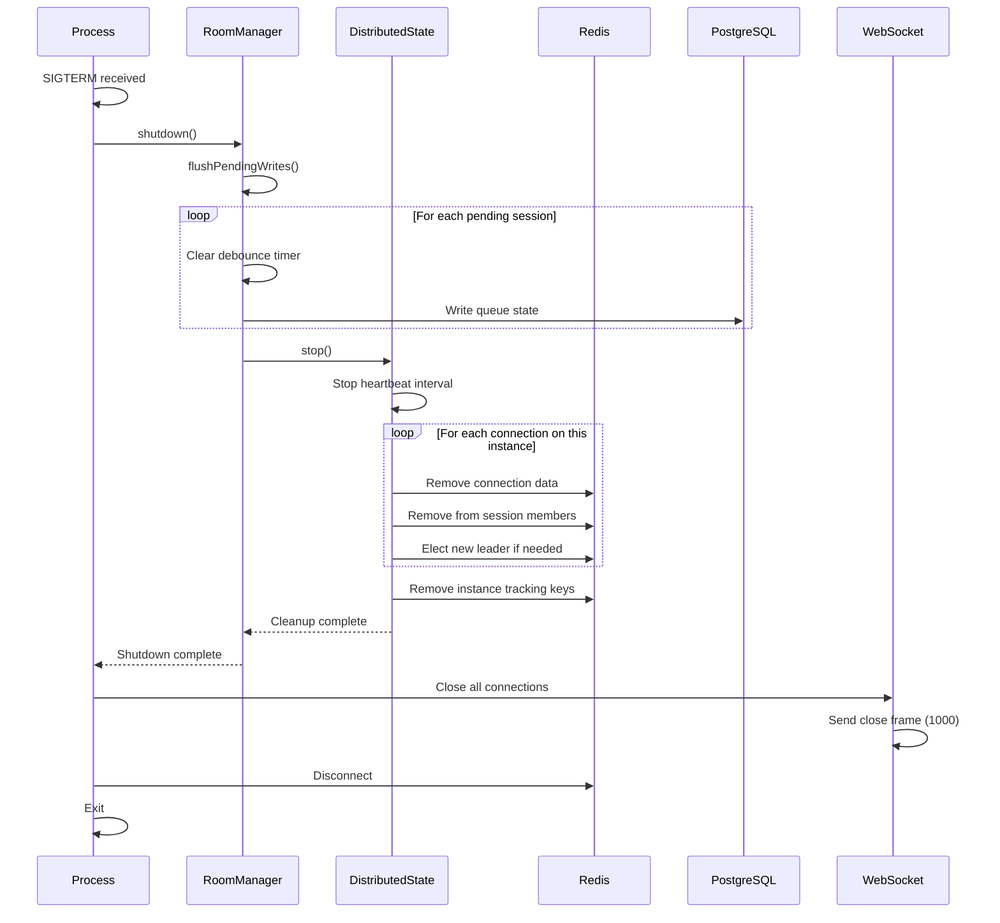

### Dead Connection and Instance Detection

The system uses multiple layers to detect and clean up dead connections:

**1. WebSocket Ping/Pong (30s interval)**

The WebSocket server pings every connected client every 30 seconds. If a client doesn't respond with a pong before the next ping cycle, the socket is terminated. This detects half-open TCP connections caused by network drops (phone sleep, WiFi switch, browser tab killed without close frame). When `terminate()` is called, the `ws` close event fires, graphql-ws triggers `onDisconnect`, and the existing Redis cleanup runs. Dead connections are detected within 30–60 seconds.

**2. Instance Heartbeat (60s TTL, refreshed every 30s)**

```
boardsesh:instance:{id}:heartbeat = timestamp (60s TTL)
```

When an instance dies unexpectedly, its heartbeat key expires after 60 seconds.

**3. Active Dead Instance Cleanup**

The `DistributedStateManager` actively discovers and cleans up dead instances:

- **On startup**: `cleanupDeadInstanceConnections()` runs asynchronously after the first heartbeat
- **Periodically**: Piggybacks on the 30s heartbeat cycle, running every 4th heartbeat (~2 minutes)

The cleanup process:

1. SCANs for `boardsesh:instance:*:conns` keys
2. Checks if the corresponding heartbeat key exists (skip current instance)
3. For each dead instance: fetches its connection IDs, groups by session
4. Deletes all orphaned connection hashes and instance tracking keys
5. Runs `PRUNE_STALE_SESSION_MEMBERS_SCRIPT` (Lua) per affected session to atomically remove stale members and re-elect leader if needed

**4. Active Session Stale Member Cleanup**

On the same ~2 minute cadence, each instance also prunes stale members from sessions it participates in. This catches edge cases where a connection on the current instance died between ping intervals (e.g., race between ping check and socket termination).

**5. Self-Healing Reads**

Even between cleanup cycles, stale entries never inflate participant counts:

- `getSessionMemberCount()` pipelines `EXISTS` checks against each member's connection hash — only live connections are counted
- `getSessionMembers()` filters out members whose connection data is missing **and** fires a background cleanup to remove stale IDs from the Redis set
- `hasSessionMembers()` delegates to the filtered count

**6. TTL Self-Healing (defense in depth)**

| Key                                 | TTL        | Refreshed                |
| ----------------------------------- | ---------- | ------------------------ |
| `boardsesh:conn:{id}`               | 1 hour     | On client activity       |
| `boardsesh:instance:{id}:conns`     | 2 hours    | On every heartbeat (30s) |
| `boardsesh:instance:{id}:heartbeat` | 60 seconds | Every 30s                |
| `boardsesh:session:{id}:members`    | 4 hours    | On join/leave/refresh    |

Even if all active cleanup fails, orphaned data expires naturally via these TTLs.

---

## Controller Events (ESP32 Integration)

The backend supports ESP32 controllers that bridge between official Kilter/Tension apps and BoardSesh sessions. Controllers receive LED updates and can send detected climbs back to the session.

### Authentication

Controllers authenticate using API keys passed in the WebSocket connection params (not in GraphQL variables):

```javascript
// graphql-ws protocol connection_init
{
  "type": "connection_init",
  "payload": {
    "controllerApiKey": "your-64-char-hex-key"
  }
}
```

The backend extracts this from `connectionParams.controllerApiKey` during the `onConnect` hook and stores `controllerId` and `controllerApiKey` in the connection context.

### Authorization Flow

1. **User Registration** (Web UI)
   - User visits Settings > ESP32 Controllers
   - Clicks "Add Controller" and configures board type, layout, size, sets
   - Receives a 64-character hex API key (shown once, must save it)

2. **Session Authorization** (Automatic)
   - When user calls `joinSession` mutation (authenticated)
   - Backend auto-authorizes all user's controllers for that session
   - Sets `authorizedSessionId` column in database

3. **Controller Connection** (ESP32)
   - ESP32 connects with API key in `connection_init` payload
   - Backend validates key and populates context with controller info

4. **Subscription Authorization**
   - Controller subscribes to `controllerEvents(sessionId)`
   - Backend verifies controller is authorized for that session
   - Throws error if not: "Controller not authorized for session"

5. **Mutation Authorization**
   - Controller calls `setClimbFromLedPositions(sessionId, frames)`
   - Backend verifies session authorization before processing

### Controller Subscription

```graphql
subscription ControllerEvents($sessionId: ID!) {
  controllerEvents(sessionId: $sessionId) {
    ... on LedUpdate {
      commands {
        position
        r
        g
        b
      }
      climbUuid
      climbName
      climbGrade
      boardPath
      angle
    }
    ... on ControllerPing {
      timestamp
    }
  }
}
```

### Events

| Event                 | Description                                                  |
| --------------------- | ------------------------------------------------------------ |
| `LedUpdate`           | LED commands for current climb (RGB values and positions)    |
| `ControllerQueueSync` | Full queue state sync (sent on connection and queue changes) |
| `ControllerPing`      | Keep-alive ping (not currently implemented)                  |

### LedUpdate Fields

| Field           | Type   | Description                                                                                                                                                                |
| --------------- | ------ | -------------------------------------------------------------------------------------------------------------------------------------------------------------------------- |
| `commands`      | Array  | LED positions with RGB values                                                                                                                                              |
| `queueItemUuid` | String | UUID of the queue item (for navigation)                                                                                                                                    |
| `climbUuid`     | String | Unique identifier for the climb                                                                                                                                            |
| `climbName`     | String | Display name of the climb                                                                                                                                                  |
| `climbGrade`    | String | The climb difficulty/grade (e.g., "V5", "6a/V3")                                                                                                                           |
| `gradeColor`    | String | Hex color for the grade (e.g., "#00FF00")                                                                                                                                  |
| `boardPath`     | String | Board configuration path for context-aware operations (e.g., "kilter/1/12/1,2,3/40")                                                                                       |
| `angle`         | Int    | Board angle in degrees                                                                                                                                                     |
| `clientId`      | String | Identifier of client that initiated the change (used by ESP32 to decide whether to disconnect BLE client - if clientId matches ESP32's MAC, it was self-initiated via BLE) |
| `navigation`    | Object | Navigation context with previousClimbs, nextClimb, currentIndex, totalCount                                                                                                |

### ControllerQueueSync Fields

| Field          | Type  | Description                                                        |
| -------------- | ----- | ------------------------------------------------------------------ |
| `queue`        | Array | Array of queue items with uuid, climbUuid, name, grade, gradeColor |
| `currentIndex` | Int   | Index of the current climb in the queue (-1 if none)               |

### LED Color Mapping

| Hold State | RGB Value             |
| ---------- | --------------------- |
| STARTING   | (0, 255, 0) Green     |
| FINISH     | (255, 0, 255) Magenta |
| HAND       | (0, 255, 255) Cyan    |
| FOOT       | (255, 170, 0) Orange  |

### Controller Mutations

```graphql
# Send detected climb from Bluetooth
mutation SetClimbFromLeds($sessionId: ID!, $frames: String) {
  setClimbFromLedPositions(sessionId: $sessionId, frames: $frames) {
    matched
    climbUuid
    climbName
  }
}

# Navigate queue via hardware buttons (previous/next)
# queueItemUuid is preferred for direct navigation (most reliable)
# direction is used as fallback when queueItemUuid not found
mutation NavigateQueue($sessionId: ID!, $direction: String!, $queueItemUuid: String) {
  navigateQueue(sessionId: $sessionId, direction: $direction, queueItemUuid: $queueItemUuid) {
    uuid
    climb {
      name
      difficulty
    }
  }
}

# Heartbeat to update lastSeenAt
mutation Heartbeat($sessionId: ID!) {
  controllerHeartbeat(sessionId: $sessionId)
}
```

### Queue Navigation

The `navigateQueue` mutation allows ESP32 controllers to browse the queue via hardware buttons:

| Parameter       | Type    | Description                                                |
| --------------- | ------- | ---------------------------------------------------------- |
| `sessionId`     | ID!     | Session to navigate within                                 |
| `direction`     | String! | "next" or "previous" (fallback if queueItemUuid not found) |
| `queueItemUuid` | String  | Direct navigation to specific queue item (preferred)       |

**Navigation Flow:**

1. ESP32 maintains local queue state from `ControllerQueueSync` events
2. On button press, ESP32 calculates the target item locally (optimistic update)
3. ESP32 sends `navigateQueue` with the target `queueItemUuid`
4. Backend updates current climb and broadcasts `CurrentClimbChanged`
5. ESP32 receives `LedUpdate` with new climb data

**Debounce Behavior:**

- Navigation mutations are debounced with a 100ms delay to prevent WebSocket disconnection from rapid button presses
- UI updates immediately (optimistic), but only ONE mutation is sent after 100ms of button inactivity
- Example: Pressing "next" 10 times quickly results in 10 immediate display updates but only 1 mutation (to the final position)
- During rapid navigation, incoming `LedUpdate` events skip queue index sync to preserve optimistic state
- Only one mutation can be in-flight at a time; new mutations wait for the previous to complete

### Manual Authorization

If auto-authorization doesn't apply (e.g., controller owner is not in session), use:

```graphql
mutation AuthorizeController($controllerId: ID!, $sessionId: ID!) {
  authorizeControllerForSession(controllerId: $controllerId, sessionId: $sessionId)
}
```

Requires user authentication and controller ownership.

---

## Configuration

### Environment Variables

| Variable        | Description             | Default                |
| --------------- | ----------------------- | ---------------------- |
| `REDIS_URL`     | Redis connection string | None (local-only mode) |
| `PORT`          | HTTP/WS server port     | 8080                   |
| `BOARDSESH_URL` | Allowed CORS origin     | https://boardsesh.com  |

### Timeouts and Limits

| Setting                 | Value                        | Purpose                                   |
| ----------------------- | ---------------------------- | ----------------------------------------- |
| Retry attempts          | 10                           | WebSocket reconnection                    |
| Max retry delay         | 30s                          | Exponential backoff cap                   |
| Keep-alive interval     | 10s                          | Connection health check                   |
| Mutation timeout        | 30s                          | Prevent hanging mutations                 |
| Redis TTL               | 4 hours                      | Session cache expiry                      |
| Postgres debounce       | 30s                          | Batch writes                              |
| Event buffer size       | 100                          | Delta sync limit                          |
| Event buffer TTL        | 5 min                        | Old events cleanup                        |
| Board history size      | 50                           | Board-presence backfill limit             |
| Board history TTL       | 1 week (`BOARD_HISTORY_TTL`) | Board-presence history expiry             |
| Board report dedup      | 10s                          | Write-side retry idempotency window       |
| Board membership TTL    | 12 hours                     | Proof-of-presence report window           |
| Hash verification       | 60s                          | State drift detection                     |
| Subscription queue      | 1000                         | Max pending events                        |
| Connection TTL          | 1 hour                       | Distributed connection expiry             |
| WebSocket ping interval | 30s                          | Dead connection detection                 |
| Instance heartbeat      | 30s                          | Heartbeat update interval                 |
| Instance heartbeat TTL  | 60s                          | Dead instance detection                   |
| Session members TTL     | 4 hours                      | Matches session TTL                       |
| Session grace period    | 60s                          | In-memory retention after last disconnect |

---

## iOS Live Activity Integration

> **Note (Capacitor retired):** the iOS Live Activity stack described here was first built
> in the Capacitor app at repo-root `mobile/`. That app has been removed from the repo; the
> live implementation now ships in the React Native app under
> `packages/mobile/modules/live-activity/ios/`. The `mobile/ios/App/...` paths below refer
> to the original Capacitor layout and have not all been reconciled to the RN file names
> (e.g. the Capacitor `LiveActivityPlugin.swift` is the Expo `LiveActivityModule.swift`, and
> the `.entitlements` are now generated from `app.config.ts`). Full reconciliation of this
> doc is tracked in issue #3176.

In the Capacitor app, the JavaScript webapp ran inside a single webview and owned the `graphql-ws` WebSocket connection (the same client as the browser path); the RN app is fully native and no longer loads the web UI. The native side carried over: a separate `SessionWebSocketManager` holds its own `URLSessionWebSocketTask` purely to feed the Live Activity widget — the JS-side WebSocket is suspended when the phone is locked, so without the native connection the lock-screen widget would freeze the moment the app goes to background. APNs push notifications carry the same queue updates to the Live Activity once both the app and the native WS are suspended (see [Live Activity Push Notifications](#live-activity-push-notifications-apns) below).

The earlier multi-webview + native-WebSocket bridge architecture (Capacitor plugin proxying the JS layer through `URLSessionWebSocketTask`) was removed when main reverted the multi-webview / native tab bar work (#1803). Today there is no `NativeWebSocketPlugin` and no JS-side `NativeWSClient`; iOS uses the same browser-based `graphql-ws` client as web and Android.

### Architecture

```
JS webview (graphql-ws Client)
  │ subscribes to queueUpdates(sessionId:)
  │ runs mutations + receives delta events
  ▼
GraphQL Backend ◄────────────────────────┐
  │                                      │
  │ in parallel, while the app is        │
  │ foregrounded:                        │
  ▼                                      │
SessionWebSocketManager (native)         │
  │ second graphql-ws connection         │
  │ same queueUpdates subscription       │
  │ onQueueStateChanged callback         │
  ▼                                      │
LiveActivityManager.updateActivity(...)  │
  │ Activity.update(content)             │
  ▼                                      │
Lock Screen / Dynamic Island             │
  ▲                                      │
  │ when the phone is locked, native     │
  │ WS dies; the Live Activity widget    │
  │ is refreshed instead by APNs pushes  │
  │ delivered to its ActivityKit         │
  │ pushType: .token callback ───────────┘
```

### Why a Second Connection (and Not a Bridge)

A bridge would be cheaper on the server side, but the trade-offs ended up favouring two independent connections:

- The webview can rebuild its WebSocket from JS state in milliseconds; the native side wakes from background separately and reuses a long-lived task. Coupling them through a bridge meant a webview reload could cascade into a native reconnect (or vice versa) and observed in production as bursts of disconnect / reconnect storms.
- Live Activity push tokens live on the native side. Keeping the ActivityKit lifecycle co-located with the connection that drives it is simpler than synchronising it across the bridge.
- The 2× server connection cost is bounded — only foregrounded iOS sessions pay it, and even then the second connection consumes only what's needed to drive Live Activity updates.

### Native Live Activity WebSocket — Scope

`SessionWebSocketManager` is purposely narrow:

- One `URLSessionWebSocketTask`, one `queueUpdates(sessionId:)` subscription, one `onQueueStateChanged` callback.
- No external-subscription registration API — the JS side does all of its own subscribing.
- The same `graphql-transport-ws` handshake (`connection_init` with optional `authToken`, `connection_ack`, `subscribe`, `next`, `complete`, ping/pong) as the JS client.
- Exponential reconnection backoff: 1s, 2s, 4s, 8s, 16s, capped at 30s. Reconnect stops on intentional disconnect (`endSession`, app termination).
- Stale-date handling: 3-minute stale window refreshed every 60s by the ping timer. After force-quit or crash, the Live Activity goes stale within 3 minutes instead of lingering for 30.

### Thread Safety

All mutable state in `SessionWebSocketManager` is protected by a serial `DispatchQueue` (`stateQueue`). Publicly exposed properties (`isConnected`, `reconnectAttempt`, `sessionId`, `authToken`, …) use thread-safe computed accessors that read through `stateQueue.sync`. Internal code on `stateQueue` accesses the backing `_`-prefixed properties directly to avoid reentrant deadlock (`DispatchQueue` is not reentrant). Delegate callbacks (`onQueueStateChanged`) are dispatched to the main queue so Capacitor / UIKit calls never block `stateQueue`.

### App Group + Keychain Shared State

The main app and widget extension share data through two channels:

**App Group (`group.com.boardsesh.app`) UserDefaults** — board details, queue, and ephemeral navigation state. Stored in plaintext on disk inside the App Group container; appropriate for non-secret data only.

| Key                                                         | Type       | Purpose                                           |
| ----------------------------------------------------------- | ---------- | ------------------------------------------------- |
| `bs_queue_items`                                            | JSON array | Serialized `SharedQueueItem` list                 |
| `bs_current_index`                                          | Int        | Current position in queue                         |
| `bs_session_id`                                             | String     | Active session identifier                         |
| `bs_server_url`                                             | String     | Backend URL for thumbnail fetching                |
| `bs_board_name`, `bs_layout_id`, `bs_size_id`, `bs_set_ids` | String/Int | Board details for thumbnail URL construction      |
| `bs_pending_action`                                         | String     | Widget→app navigation request ("next"/"previous") |

**Shared Keychain (`group.com.boardsesh.app` access group)** — Bearer credentials only. Encrypted at rest, hardware-backed, accessible only to processes that declare the `keychain-access-groups` entitlement. Accessibility is `kSecAttrAccessibleAfterFirstUnlockThisDeviceOnly` so the widget extension can read them while the device is locked (after the first post-boot unlock), without syncing them into iCloud Keychain backups.

| Key (account name)   | Stored by            | Read by              | Purpose                                                                                  |
| -------------------- | -------------------- | -------------------- | ---------------------------------------------------------------------------------------- |
| `bs_auth_token`      | `LiveActivityPlugin` | `LiveActivityPlugin` | User's Bearer token attached to GraphQL `register…`/`unregister…ActivityPushToken` calls |
| `bs_live_push_token` | `LiveActivityPlugin` | `WidgetNetworking`   | APNs Live Activity push token used as the Bearer credential on `/api/widget/navigate`    |

Earlier builds wrote both credentials to App Group UserDefaults. The current `LiveActivityPlugin.endSession()` clears those legacy keys on top of the new keychain delete so an upgrade doesn't leave plaintext tokens behind.

The helper lives in `mobile/ios/App/App/SharedKeychain.swift`. The `keychain-access-groups` entitlement is declared in `App.entitlements` and `BoardseshWidgets.entitlements`.

### Widget Button Flow

Lock-screen widget taps (next/prev climb) do NOT go through the native WebSocket. They hit the backend directly via `/api/widget/navigate` (see [Widget REST Endpoints](#widget-rest-endpoints)) because the widget extension can't talk to `SessionWebSocketManager` (different process). The backend updates the queue, publishes a `CurrentClimbChanged` event, and the APNs hook fans the change back out to every device's Live Activity.

### Lifecycle

- **Start** — `LiveActivityPlugin.startSession()` stores board details in App Group UserDefaults, writes the auth token to the shared keychain, installs the `onQueueStateChanged` callback before connecting `SessionWebSocketManager`, then starts the Live Activity with `pushType: .token`. The push-token handler is passed into `Activity.request(...)` atomically so ActivityKit's first emission isn't dropped.
- **End** — `LiveActivityPlugin.endSession()` fires `unregisterActivityPushToken` on the backend (best-effort), clears the keychain entries, removes the App Group queue keys, ends all Live Activities, and disconnects `SessionWebSocketManager`.
- **Force-quit / crash** — `SceneDelegate.sceneDidDisconnect` and `AppDelegate.applicationWillTerminate` attempt the same cleanup but aren't reliably called. The 3-minute stale window from the Live Activity manager and the orphaned-activity cleanup in `SceneDelegate.sceneWillEnterForeground` / `scene(_:willConnectTo:)` handle the leftovers on next launch.

## Live Activity Push Notifications (APNs)

When the app is fully foregrounded, queue mutations land via the JS WebSocket; when the app is backgrounded or terminated, the native WS goes silent and the **Live Activity widget is kept fresh by APNs push notifications**.

### Backend Send Path

```
GraphQL mutation (e.g. setCurrentClimb)
  │ resolver updates state via RoomManager
  ▼
pubsub.publishQueueEvent(sessionId, event)
  │ runs the per-event subscriber fan-out as usual,
  │ then fires the externally registered hook (if any)
  ▼
queueEventHook = sendLiveActivityUpdate(...)  ← installed in server.ts
  │ packs a LiveActivityContentState (current climb name,
  │ grade, angle, index, totals, hasNext/hasPrevious, climbUuid)
  │ debounces ~1s per session to coalesce bursts
  ▼
APNs HTTP/2 send
  │ topic:      {APNS_BUNDLE_ID}.push-type.liveactivity
  │ pushType:   liveactivity
  │ payload:    { aps: { timestamp, event: "update", content-state } }
  ▼
Apple Push Notification service
  ▼
ActivityKit on every device that registered a token for this session
```

`apns/index.ts` is **configured-or-noop**: if any of `APNS_KEY_ID`, `APNS_TEAM_ID`, `APNS_KEY_CONTENTS`, `APNS_BUNDLE_ID`, or `APNS_PRODUCTION` is missing, all public functions short-circuit and the rest of the backend keeps running normally. The boot log warns when env is missing (see `packages/backend/src/server.ts` startup section).

### Server-Side Analytics

Live Activity actions that happen outside the web view are captured server-side through PostHog when `POSTHOG_PROJECT_KEY` is configured. The backend can also fall back to `NEXT_PUBLIC_POSTHOG_KEY` for compatibility with the web build env, but `POSTHOG_PROJECT_KEY` is the preferred runtime variable. `POSTHOG_HOST` defaults to `https://us.i.posthog.com`. Server events are sent directly rather than through the browser `/api/posthog/*` proxy.

**A key alone is not enough — only the production environment sends** (#3814). `getPosthogClient()` resolves an environment and short-circuits unless it is exactly `production`, so a key that leaks into a preview, staging, or local runtime can't pollute the prod project. Resolution order: `POSTHOG_ENVIRONMENT`, else `resolveSentryEnvironment()` from `@boardsesh/db/client/config` — the same helper that gates backend Sentry, so the two SDKs can never disagree about what runtime this is. That resolves `SENTRY_ENVIRONMENT` when it names something other than `production`, otherwise `production` for any runtime that doesn't look local, otherwise `NODE_ENV`. "Looks local" means `NODE_ENV=development`, the test runner, a GitHub Actions job, or a `DATABASE_URL` pointing at a private host. Consequences worth knowing:

- Railway prod sets no `NODE_ENV` (`Dockerfile.backend` doesn't, and Railway injects none for an image deploy), so it resolves to `production` from the runtime inference alone — no dashboard variable is load-bearing for analytics staying on.
- Preview/staging backends declare `SENTRY_ENVIRONMENT=preview` (`branch-deploy.yml`, #3808) and opt out for free.
- Local dev resolves to `development` via the `dev` script's `NODE_ENV=development`; the test runner resolves to `test`. Both stay dark.
- A backend started locally with `pnpm --filter boardsesh-backend run start` sets no `NODE_ENV`, so the runtime inference alone used to call it production; the private-`DATABASE_URL` check now catches it. Same for e2e jobs, which run that script on a CI runner.
- When the gate closes, the backend logs `[PostHog] Resolved environment '<x>' is not production; backend analytics disabled` at **warn** — same level as the missing-key branch, since both mean analytics went dark.

Event taxonomy:

- `Live Activity Started`: emitted after `registerActivityPushToken` successfully upserts a token; attributed to the authenticated `userId`.
- `Live Activity Ended`: emitted after explicit unregister and when a session end cleans up still-registered tokens; attributed to `activity_push_tokens.user_id` when available.
- `Live Activity Widget Navigation`: emitted for attributed widget next/previous attempts, including success, rate limit, wrong-session, empty-queue, target-out-of-bounds, and server-error outcomes.
- `Live Activity Widget Navigation Attribution Gap`: emitted as an aggregate, session-scoped event when a widget token row authorizes navigation but has no `user_id` yet. Token rows created before `activity_push_tokens.user_id` was added still authorize navigation and emit this gap metric until that device re-registers and the row gains user attribution.
- `Live Activity Push Delivery`: emitted once per APNs send batch with token/sent/failed/stale counts only. It uses a session-scoped distinct ID with PostHog person-profile processing disabled.

Analytics intentionally excludes APNs tokens, bearer tokens, user emails, climb names, and queue item names. Existing token rows from before the `activity_push_tokens.user_id` migration continue to work; they gain user attribution the next time the device registers.

### Event Types That Trigger a Push

`APNS_RELEVANT_EVENTS` in `server.ts` controls which `publishQueueEvent` types fan out to APNs:

- `CurrentClimbChanged`
- `FullSync`
- `QueueItemAdded`
- `QueueItemRemoved`
- `QueueReordered`

Other event types (`ClimbMirrored`, etc.) intentionally don't push so the lock-screen widget doesn't flicker for cosmetic state.

### Publisher-Side Semantics (Multi-Instance)

The hook fires only on the instance that calls `publishQueueEvent`. It is **not** invoked from `dispatchToLocalQueueSubscribers` when a Redis fan-out message arrives from another instance — that path bypasses the hook intentionally so a single event published in a 3-instance cluster does not produce 3 redundant APNs sends.

Implication: every backend instance that can publish queue mutations should have APNs env vars configured. If env is missing on the publishing instance, the hook still runs but every `sendLiveActivityUpdate` call becomes a no-op via the `configured` flag.

### Ending the Activity

`endSession` mutation calls the APNs service with `event: "end"`, which fires the same APNs send shape but tells ActivityKit to dismiss the widget. Local `LiveActivityManager.endAllActivities()` covers the path where the session ends from the foregrounded app.

## Activity Push Token Lifecycle

```
ActivityKit (iOS)
  │ Activity.request(..., pushType: .token)
  │ emits a token via activity.pushTokenUpdates AsyncSequence
  ▼
LiveActivityManager.deliverPushTokenUpdate(token)
  │ hops into the actor for Swift 6 strict-concurrency safety
  │ calls onPushTokenUpdate(token) on the LiveActivityPlugin handler
  ▼
LiveActivityPlugin pushTokenHandler
  │ single tokenQueue.sync block writes _currentPushToken AND reads
  │ (_currentSessionId, _currentServerUrl) — one critical section so
  │ ActivityKit delivering the token on any thread can't deadlock
  │ writes token to SharedKeychain.livePushTokenKey
  ▼
POST /graphql registerActivityPushToken(sessionId, token)
  │ Authorization: Bearer <app auth token from keychain>
  ▼
Backend resolver (packages/backend/src/graphql/resolvers/sessions/push-tokens.ts)
  │ - require authentication (ctx.userId)
  │ - validate APNs token format ([0-9a-fA-F]{32,128})
  │ - rate limit (token bucket 5 capacity / 1 refill per 2s)
  │ - verify participant via board_session_participants
  │ - upsert into activity_push_tokens inside a transaction:
  │     pg_advisory_xact_lock(hashtext(sessionId))
  │     count rows for sessionId
  │     if >= MAX_TOKENS_PER_SESSION (8), delete oldest
  │     insert with ON CONFLICT (token) DO UPDATE
  ▼
activity_push_tokens table (DB)
```

### Per-Session Cap and TOCTOU Avoidance

The 8-tokens-per-session cap is enforced under a Postgres advisory lock (`pg_advisory_xact_lock(hashtext(sessionId))`) so concurrent register calls for the same session serialize. Without the lock, two requests could both observe `count = cap - 1`, both skip the eviction, and both insert, leaving the session at `cap + 1` rows. The lock is per-transaction, so it auto-releases on commit or rollback.

### Unregister

`unregisterActivityPushToken(sessionId, token)` is the symmetric mutation. The delete is scoped to `(token, sessionId)` so an attacker holding a leaked token cannot wipe another session's registrations. Same auth + participant + rate-limit checks apply.

## Widget REST Endpoints

Lock-screen widget extensions cannot reach the JS webapp or its WebSocket. Two dedicated REST endpoints cover the write paths:

```
POST /api/widget/navigate
  Authorization: Bearer <APNs Live Activity push token>
  Content-Type: application/json

  { "sessionId": "<id>", "action": "next" | "previous", "currentIndex": <int ≥ 0> }

POST /api/widget/take-control
  Authorization: Bearer <APNs Live Activity push token>
  Content-Type: application/json

  { "sessionId": "<id>" }
```

### Auth Contract: Always-Live Sessions

Widget sessions are **always-live**: there is no driver role for these endpoints. Any authenticated session participant may navigate the queue or re-assert the current climb. This is a deliberate departure from the older driver-ownership model (where only the elected leader could make writes).

**Threat model rationale:** The widget endpoints run outside the main app process; they cannot participate in the in-process leader-election protocol. A driver gate would either (a) require an extra per-request Redis round-trip to resolve current leadership, or (b) silently deny any widget tap while the session has no leader — both unacceptable for a lock-screen control. Since the Live Activity push token is already scoped to `(device, session)` and only issued to authenticated participants, possession of a valid token already proves the device joined and was authorised to be in the session.

Two-layer auth on every request:

1. **Token auth** (`widget-auth.ts`): Bearer token must be registered in `activity_push_tokens` with matching `sessionId`. Unknown token → 401. Token bound to a different session → 410 (widget re-registers). This layer identifies the device+session.
2. **Membership check** (`widget-session-guard.ts`): Confirms the session is still active and the token owner is still a participant (`board_session_participants` row exists). Session ended → 410. Not a participant → 403. This prevents stale tokens from mutating an ended session's persisted queue.

The `userId` on the `activity_push_tokens` row is used for analytics attribution only — the token proves participation, not identity. A `null` userId (token row pre-dating the `user_id` column) authorises navigation but emits an attribution-gap metric instead of a normal analytics event.

`/api/widget/take-control` additionally requires a non-null `userId` on the token row (403 if `userId: null`), since re-asserting the board's LED state is a board-write action that should always be attributed.

The push token as the credential keeps the widget extension out of the user-auth path entirely — it never sees the user's Bearer JWT. The token is already a per-session, per-device secret issued by Apple.

### Validation

**navigate**

- `sessionId`: non-empty string
- `action`: `"next"` or `"previous"`
- `currentIndex`: integer, `>= 0`
- Request body capped at 4 KB

**take-control**

- `sessionId`: non-empty string
- Request body capped at 2 KB

Anything else returns 400.

### Rate Limiting

Both endpoints share a **per-session** token bucket (capacity 2, refill 1 per 1.5s) defined in `widget-rate-limit.ts`. Burst clicks are smoothed; sustained tapping caps at ~40 req/min per session. Returns 429 when the bucket is empty. The session-scoped bucket means one device can't deny service for another on the same session. Rate limiting is applied after auth so an unauthenticated caller cannot poison a real participant's bucket.

### Server-Authoritative Navigation

The navigate handler does NOT trust the `currentIndex` from the widget — it fetches the server's queue state via `roomManager.getQueueState(sessionId)`, computes the target index from `action` (wrapping at boundaries for `next`, clamped to 0 for `previous`), and calls `navigateToQueueItem` (shared with the `setCurrentClimb` GraphQL mutation). That function does optimistic-lock retry against the room manager and publishes the resulting `CurrentClimbChanged` via `pubsub.publishQueueEvent`, which fans out to JS subscribers and triggers the APNs push hook described above.

The `currentIndex` field in the request is validated for shape only; the handler reads server state for the actual position.

The take-control handler re-publishes the session's current climb (re-asserting the board's LED state) by calling `setCurrentClimbAndPublish`. If no current climb exists in the queue the handler succeeds (200) as a no-op — there is nothing to assert.

### Why HTTP and Not a GraphQL Mutation

A GraphQL mutation would require either the JS GraphQL client (not available in the widget process) or hand-rolled GraphQL-over-HTTP in Swift. The REST handlers are simpler, cheaper, and let us keep the widget extension free of GraphQL tooling. The downside — a second endpoint surface to keep in sync — is small for two operations.

### Garmin watch (JWT) REST surface

The Garmin Connect IQ watch app is another non-WebSocket client (Garmin has no WebSocket transport), so it drives a session over the same kind of stateless REST surface as the widget — but authenticated by a **mobile JWT** instead of an APNs push token. The watch never touches the board; it mutates the shared session and a phone in that session repaints the wall.

```
POST /api/session/navigate      { "sessionId", "action": "next" | "previous" }  -> { "success", "currentIndex" }
POST /api/session/take-control   { "sessionId" }                                 -> { "success" }
GET  /api/session/state?sessionId=<id>                                           -> slim current-climb snapshot
POST /api/watch/pair             { "code" }   (no auth)                           -> { "jwt", "refreshToken", "expiresAt" }
```

All except `/api/watch/pair` take `Authorization: Bearer <mobile JWT>`. `navigate` / `take-control` reuse the widget's server-authoritative `navigateToQueueItem` / `setCurrentClimbAndPublish` core and the same durable-participant guard (`verifyWidgetSession`); the only difference is auth — `authenticateSessionRequest` (`session-auth.ts`) validates the JWT via `validateToken` (accepting both the web NextAuth JWE and the mobile JWS). Because a JWT authenticates _any_ user for _any_ sessionId (unlike the widget's session-bound APNs token), the participant guard runs **before** the shared write rate-limit bucket, so a non-participant who learns a sessionId can't drain a real member's bucket.

**Polling contract** (`GET /api/session/state`): the watch cannot subscribe, so it **polls** this endpoint (~3s while foregrounded). The payload is deliberately slim — no `queue` array, no per-climb `frames` string — carrying only the current climb (name, grade, angle, mirrored, isBenchmark), the queue position, board resolution parsed server-side from `boardPath` (so the watch can build a `saveTick` without a second call), and `sequence` / `stateHash` so the client can skip a re-render when nothing changed between polls. It has its own generous **per-user** read rate-limit bucket (capacity 4, refill 1/s in `session-read-rate-limit.ts`) — kept separate from the write bucket so read polling can't throttle navigation. Ascent logging reuses the existing `saveTick` GraphQL mutation over HTTP; pairing codes are minted by the phone/web app and exchanged at `/api/watch/pair`.

## Related Files

### Backend

- `packages/backend/src/websocket/setup.ts` - WebSocket server configuration
- `packages/backend/src/pubsub/index.ts` - Event pub/sub system + `addQueueEventHook`
- `packages/backend/src/pubsub/redis-adapter.ts` - Redis pub/sub adapter
- `packages/backend/src/services/room-manager.ts` - Session & queue management
- `packages/backend/src/services/redis-session-store.ts` - Redis session persistence
- `packages/backend/src/services/distributed-state.ts` - Multi-instance state management
- `packages/backend/src/services/queue-navigation.ts` - Shared queue-navigation logic (used by `setCurrentClimb` and `/api/widget/navigate`)
- `packages/backend/src/services/apns/index.ts` - APNs HTTP/2 send + 5s debounce + Live Activity content state assembly
- `packages/backend/src/handlers/widget-navigate.ts` - REST handler for `POST /api/widget/navigate`
- `packages/backend/src/handlers/widget-take-control.ts` - REST handler for `POST /api/widget/take-control`
- `packages/backend/src/handlers/widget-auth.ts` - Bearer-token auth for both widget endpoints
- `packages/backend/src/handlers/widget-session-guard.ts` - Membership + session-liveness gate (applied after token auth, before queue mutation)
- `packages/backend/src/handlers/widget-rate-limit.ts` - Per-session token bucket shared by both widget endpoints (`checkWidgetRateLimit`, `ensureWidgetRateLimitPruner`)
- `packages/backend/src/graphql/resolvers/queue/` - Queue mutations & subscriptions
- `packages/backend/src/graphql/resolvers/sessions/` - Session mutations & subscriptions
- `packages/backend/src/graphql/resolvers/sessions/push-tokens.ts` - `registerActivityPushToken` / `unregisterActivityPushToken` resolvers with the per-session cap + advisory-lock TOCTOU fix
- `packages/backend/src/graphql/resolvers/shared/helpers.ts` - Cross-instance auth validation
- `packages/db/src/schema/app/activity-push-tokens.ts` - Drizzle schema for the `activity_push_tokens` table

### Frontend

- `packages/web/app/lib/backend-url.ts` - Runtime backend URL resolver (preview deploys, dev overrides)
- `packages/shared/graphql-client/` - Platform-agnostic `graphql-ws` helpers (`execute`, `subscribe`, `createGraphQLClient`, `GraphQLOperationError`). Web and the React Native mobile app both consume this; web passes its `SafeWebSocket` wrapper + `connectionManager` registration via the `webSocketImpl` / `onClientCreated` hooks.
- `packages/web/app/lib/realtime/graphql-client.ts` - Thin web wrapper around `@boardsesh/graphql-client` that adds the `SafeWebSocket` DOM-error suppression and `connectionManager` registration. Also re-exports the shared primitives.
- `packages/web/app/lib/realtime/websocket-connection-manager.ts` - Connection state tracking
- `packages/shared/queue-runtime/src/session-connection.ts` - `createSessionConnectionController`: the pure-TS connect/join/subscribe/reconnect/retry state machine (Workstream W4). Consumed by the mobile app; web no longer binds it.

> **Status (W-16, #4435): the web party-session client is gone.** `components/persistent-session/`,
> `components/graphql-queue/`, `components/queue-control/` and the root
> `PersistentSessionWrapper` were deleted when climbing moved to the Expo app, and
> with them every web binding listed in this section's earlier revisions
> (`use-session-lifecycle.ts`, `session-connection-ports.ts`, `use-queue-mutations.ts`,
> `use-queue-session.ts`, `persistent-session-context.tsx`, `QueueContext.tsx`,
> `queue-actions-core.ts`) and `packages/web/app/lib/live-activity/use-live-activity.ts`.
> The protocol, the backend resolvers and the mobile client are unchanged — read
> the flows below as the contract the **mobile** app and the kiosk implement.
> On www the only remaining `graphql-ws` consumers are
> `components/kiosk/presence/kiosk-presence-hub.tsx`, `social/comment-section.tsx`
> and `hooks/use-notification-subscription.ts`.

### Native iOS

- `mobile/ios/App/App/SessionWebSocketManager.swift` - Native graphql-ws client used only to drive Live Activity updates while the app is foregrounded
- `mobile/ios/App/App/LiveActivityPlugin.swift` - Capacitor plugin: start/end session, update activity, observe + forward APNs push tokens to the backend
- `mobile/ios/App/App/LiveActivityManager.swift` - ActivityKit lifecycle (`pushType: .token`, push-token observer, stale-date refresh)
- `mobile/ios/App/App/SharedConstants.swift` - App Group ID and non-secret UserDefaults keys + helpers
- `mobile/ios/App/App/SharedKeychain.swift` - Shared-access-group Keychain helper for auth + push tokens
- `mobile/ios/App/App/App.entitlements` - App Group, `aps-environment`, `keychain-access-groups` declarations
- `mobile/ios/App/App/ThumbnailFetcher.swift` - Board-render thumbnail fetching and caching
- `mobile/ios/App/BoardseshWidgets/BoardseshWidgets.entitlements` - Widget extension entitlements (App Group + Keychain access group)
- `mobile/ios/App/BoardseshWidgets/NextClimbIntent.swift` - Widget Next button App Intent
- `mobile/ios/App/BoardseshWidgets/PreviousClimbIntent.swift` - Widget Previous button App Intent
- `mobile/ios/App/BoardseshWidgets/WidgetNetworking.swift` - HTTP client that calls `/api/widget/navigate` from the widget extension

### Shared

- `packages/shared-schema/src/schema.ts` - GraphQL schema definition
- `packages/shared-schema/src/types.ts` - TypeScript types

## Onboarding tour integration points

**Removed in W-16 (#4435).** The web onboarding tour (`components/onboarding/`) drove
the real session UI with mock data. Every escape hatch that lived on a deleted
component went with it — `SeshSettingsDrawer`'s `tourMockSession` /
`tourActiveSection` props and the `TOUR_*` window events on `QueueControlBar`,
`ClimbsList` and `PlayViewDrawer` — and `SessionDetailContent`'s
`embedded`/`tourActiveSection` drawer branch was deleted in the same PR once its
last caller was gone. Nothing in the surviving web tree branches on a tour.

One remnant is deliberate: `CollapsibleSection` (`components/collapsible-section/`)
still implements its controlled `forcedActiveKey` mode, exercised by its own unit
tests. It survives because `social/proposal-section.tsx` still renders the
component (in uncontrolled mode); removing the controlled path is a separate
cleanup, not part of the climbing teardown.
