# WebSocket Implementation for Party Sessions

This document describes the WebSocket implementation used for real-time party session synchronization in Boardsesh. Party mode allows multiple climbers to collaborate on a shared queue of climbs, with real-time synchronization across all connected clients.

## Table of Contents

1. [Architecture Overview](#architecture-overview)
2. [Technology Stack](#technology-stack)
3. [Connection Flow](#connection-flow)
4. [Backend URL Resolution](#backend-url-resolution)
5. [Session Management](#session-management)
6. [Queue State Synchronization](#queue-state-synchronization)
7. [Multi-Instance Support](#multi-instance-support)
8. [Failure States and Recovery](#failure-states-and-recovery)
9. [Client-Side Connection Supervisor](#client-side-connection-supervisor)
10. [Data Persistence Strategy](#data-persistence-strategy)
11. [iOS Live Activity Integration](#ios-live-activity-integration)
12. [Live Activity Push Notifications (APNs)](#live-activity-push-notifications-apns)
13. [Activity Push Token Lifecycle](#activity-push-token-lifecycle)
14. [Widget Navigation REST Endpoint](#widget-navigation-rest-endpoint)

---

## Architecture Overview

The party session system uses a GraphQL-over-WebSocket architecture with the following key components:

```
┌─────────────────────────────────────────────────────────────────────────┐
│                              Frontend (Next.js)                          │
├─────────────────────────────────────────────────────────────────────────┤
│  ┌─────────────────────┐    ┌─────────────────────────────────────────┐ │
│  │ PersistentSession   │◄───┤ GraphQL Client (graphql-ws)             │ │
│  │ Context (split)     │    │ - Connection management                  │ │
│  │ ├ ActionsContext     │    │ - Subscription handling                  │ │
│  │ └ StateContext       │    │ - Reconnection with exponential backoff  │ │
│  └─────────┬───────────┘    └─────────────────────────────────────────┘ │
│            │                                                             │
│  ┌─────────▼───────────┐                                                 │
│  │ QueueContext (split) │                                                │
│  │ ├ ActionsContext     │                                                │
│  │ │  (stable callbacks)│                                                │
│  │ └ DataContext        │                                                │
│  │   - Local state      │                                                │
│  │   - Optimistic update│                                                │
│  └──────────────────────┘                                                │
└─────────────────────────────────────────────────────────────────────────┘
                                    │
                                    │ WebSocket (graphql-ws protocol)
                                    ▼
┌─────────────────────────────────────────────────────────────────────────┐
│                           Backend (Node.js)                              │
├─────────────────────────────────────────────────────────────────────────┤
│  ┌─────────────────────┐    ┌─────────────────────┐                     │
│  │ WebSocket Server    │    │ GraphQL Yoga        │                     │
│  │ (graphql-ws)        │◄───┤ - Schema            │                     │
│  │ - Auth validation   │    │ - Resolvers         │                     │
│  │ - Connection mgmt   │    └─────────────────────┘                     │
│  └─────────┬───────────┘                                                 │
│            │                                                             │
│  ┌─────────▼───────────┐    ┌─────────────────────┐                     │
│  │ RoomManager         │◄───┤ PubSub              │                     │
│  │ - Session state     │    │ - Local dispatch    │                     │
│  │ - Client tracking   │    │ - Redis pub/sub     │                     │
│  └─────────┬───────────┘    └─────────────────────┘                     │
│            │                                                             │
│  ┌─────────▼─────────────────────────────────────────────────────────┐  │
│  │ DistributedStateManager (multi-instance support)                   │  │
│  │ - Cross-instance connection tracking                               │  │
│  │ - Distributed leader election (Lua scripts)                        │  │
│  │ - Session membership across instances                              │  │
│  │ - Instance heartbeating & cleanup                                  │  │
│  └─────────┬─────────────────────────────────────────────────────────┘  │
│            │                                                             │
│  ┌─────────▼───────────┐    ┌─────────────────────┐                     │
│  │ RedisSessionStore   │    │ PostgreSQL          │                     │
│  │ - Hot cache (4h TTL)│    │ - Persistent storage│                     │
│  │ - User presence     │    │ - Session history   │                     │
│  │ - Distributed locks │    │ - Queue state       │                     │
│  └─────────────────────┘    └─────────────────────┘                     │
└─────────────────────────────────────────────────────────────────────────┘
```

### Context Split Pattern

Both `PersistentSessionContext` and `QueueContext` are split into separate **Actions** and **Data** contexts to prevent unnecessary re-renders:

- **ActionsContext** — stable callback functions (`addToQueue`, `setCurrentClimb`, etc.). Uses a `latestRef` pattern so callbacks have empty `[]` dependency arrays and never change identity. Components that only call actions (e.g., list item "add to queue" buttons) subscribe here and avoid re-rendering when queue data changes.
- **DataContext** — frequently-changing state (`queue`, `currentClimb`, `playlistSuggestionSource`, `connectionState`, etc.). Only components that display this data subscribe here.
- **Combined Context** — merges both via `useMemo(() => ({ ...dataValue, ...actionsValue }))` for backward compatibility. Existing consumers using `useQueueContext()` or `usePersistentSession()` continue working unchanged.

Targeted hooks: `useQueueActions()`, `useQueueData()`, `usePersistentSessionActions()`, `usePersistentSessionState()`.

### QueueBridgeProvider — root-level QueueContext

`QueueBridgeProvider` (`packages/web/app/components/queue-control/queue-bridge-context.tsx`) is mounted once at the root inside `PersistentSessionWrapper` so a `QueueContext` value is always available, even off board routes (e.g. `/you/logbook`, `/session/[sessionId]`, `/playlists/...`). It has two modes:

- **Injected mode** — when a board route mounts `GraphQLQueueProvider`, it injects its full context (with the GraphQL data fetcher and reducer) into the bridge. Consumers transparently see the board route's queue context.
- **Adapter mode** — off board routes, `usePersistentSessionQueueAdapter` fronts the persistent session directly. Mutations now branch on `ps.activeSession`:
  - **Solo / no party**: mutations go through `setLocalQueueState` (in-memory, no persistence beyond the session restore on reload).
  - **Active party session**: mutations delegate to `ps.addQueueItem`, `ps.setCurrentClimb`, `ps.removeQueueItem`, `ps.setQueue`, `ps.mirrorCurrentClimb`, `ps.replaceQueueItem` — the same WebSocket-backed mutators `GraphQLQueueProvider` uses on board routes. `setLocalQueueState` is a no-op when `activeSession` is set, so without this delegation off-board taps would silently disappear.
  - `setCurrentClimb` checks for an existing queue entry by `climb.uuid` first; if found it reuses that queue item via `ps.setCurrentClimb` without adding a duplicate.
  - When a playlist route activates a climb with a `playlistSuggestionSource`, the bridge stores that source locally so "next" can draw suggested climbs from the same playlist after the activated climb. In party mode this path uses `ps.setQueue` when it needs to insert the activated climb and remove stale future suggested items in one shared update. Playlist routes clear the source on unmount, and full queue replacements clear it because the new queue is no longer tied to that playlist context.
  - Items created by the adapter populate `addedBy` / `addedByUser` from `usePartyProfile` so peers see consistent attribution regardless of which surface added the climb.

`playlistSuggestionSource` is client-side queue UI state, not a backend room field. The backend still stores only queue items and the active queue item. The source is refreshed on the activating client from playlist data, and stale refreshes are dropped by matching playlist uuid, activated climb uuid, and board key before replacing the local source.

## Technology Stack

| Component          | Technology                        | Purpose                                                       |
| ------------------ | --------------------------------- | ------------------------------------------------------------- |
| WebSocket Protocol | `graphql-ws`                      | GraphQL subscriptions over WebSocket                          |
| Backend Framework  | GraphQL Yoga                      | HTTP + WS GraphQL server                                      |
| Frontend Client    | `graphql-ws` client               | Connection management                                         |
| Pub/Sub            | Redis (subscriber connection)     | Multi-instance event distribution                             |
| Hot Cache          | Redis (publisher connection)      | Real-time session state (4h TTL)                              |
| Stream Consumer    | Redis (streamConsumer connection) | Dedicated connection for blocking `XREADGROUP` in EventBroker |
| Persistent Storage | PostgreSQL                        | Durable session & queue history                               |

### Shared client primitives

The web and mobile queue providers are thin wrappers around a small stack of shared packages. The lower two are pure TS (no React, DOM, or React Native); the third is the renderer-agnostic React layer both platforms delegate to:

- **`@boardsesh/queue`** — the state machine: `queueReducer`, `mapQueueEventToAction`, `createQueueSyncCoordinator` (correlation-ID tracking + echo suppression), playlist suggestion helpers.
- **`@boardsesh/queue-runtime`** — transport-wiring helpers (pure TS):
  - **`mapSubscriptionEnvelopeToAction`** — wire-envelope normaliser, called directly by the subscription hooks (web `graphql-queue/hooks/use-queue-event-subscription.ts`, mobile `queue-provider.tsx`). Each platform's subscription returns its own `ClimbQueueItem` shape (web: full `@boardsesh/shared-schema` type; mobile: slim `SubscriptionQueueItem`) and aliases (`addedItem`/`item`, `currentItem`/`item`, `mirroredUuid`/`uuid`); this helper takes an optional per-platform item lifter and emits a single `EventMappingResult`.
  - **`createSetCurrentClimbCoalescer`** — serialize-and-supersede. At most one `SET_CURRENT_CLIMB` in flight at a time; a newer call while one is pending overwrites the queued args. A superseded args that carried `shouldAddToQueue:true` still fires its `ADD_QUEUE_ITEM` (so the queue mutation reaches the server even when the setCurrent gets dropped). Prevents rapid swipes from stacking requests. Generic over the item type; consumed by `@boardsesh/queue-react` (below), not by the platform hooks directly.
  - **`createJoinSessionTracker`** — `(sessionId, epoch)`-keyed `JOIN_SESSION` promise cache. Callers bump the epoch from the socket's `closed` handler so a mutation racing between `closed` and `connected` doesn't await a stale-resolved promise from the dead connection and fire over the new socket before its own `JOIN_SESSION` lands. Mobile uses the tracker; web's `use-session-lifecycle.ts` has a parallel implementation that hasn't yet been migrated.
- **`@boardsesh/queue-react`** — the renderer-agnostic React layer (the first `@boardsesh/*-react` package; see the shared-packages rule in CLAUDE.md). It holds `useQueueMutations`, a thin hook over the pure `createQueueMutations` factory that owns the coalescer and issues every queue-session mutation (`ADD_QUEUE_ITEM`, `SET_CURRENT_CLIMB`, `takeControl`, …). It lists `react` as a `peerDependency` and imports no DOM, `next`, MUI, React Native, or Expo — every platform input (GraphQL client, session id, item→wire mapper, error sink) is injected via a `QueueMutationsDeps` object. Web (`persistent-session/hooks/use-queue-mutations.ts`) and mobile (`queue-provider.tsx`) each wrap it: web injects a synchronous client + session and omits `ensureReady` (already-joined → throw on disconnect); mobile injects `getWsClient()` plus an `ensureReady` that lazily creates/joins the session (no-op on disconnect). New shared React for this layer belongs here, kept platform-neutral by injecting all I/O.

**Redis Connection Architecture:** The backend maintains 3 Redis connections:

1. **Publisher** — shared by RoomManager, RedisSessionStore, DistributedState, EventBroker (non-blocking ops like `xadd`, `xack`)
2. **Subscriber** — dedicated to ioredis pub/sub mode (enters special subscribe-only mode)
3. **Stream Consumer** — dedicated to EventBroker's blocking `XREADGROUP BLOCK 5000` loop, preventing it from starving the publisher connection

---

## Connection Flow

### Initial Connection Sequence

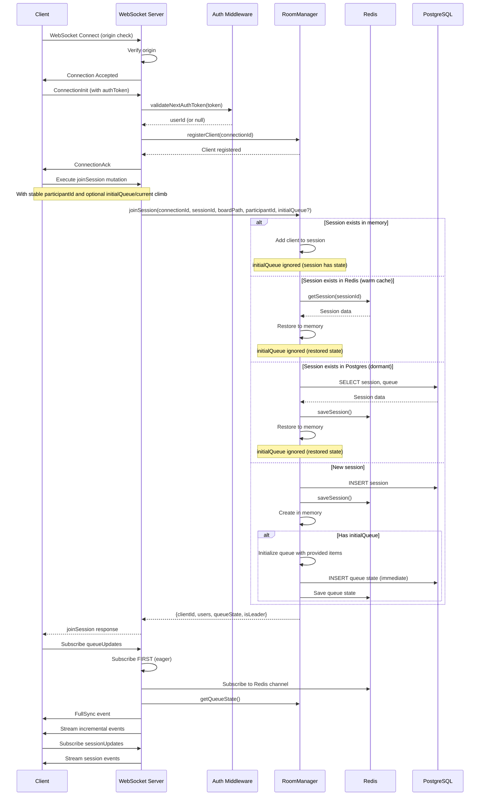

### Key Points

1. **Origin Validation**: WebSocket upgrades are validated against the allowed-origins list (`BOARDSESH_URL` + `www.` variant, Vercel/homelab preview patterns, dev origins). Two additional paths are accepted: connections with **no** `Origin` header (native/direct clients), and genuine **same-origin** upgrades where the `Origin`'s hostname equals the request's `Host` header (`isSameOriginUpgrade` in `handlers/cors.ts`). The same-origin path is why the React Native **Android** app connects — RN derives `Origin` from the `wss://` URL (`https://ws.boardsesh.com`, the backend's own host, never on the website allow-list) — and why preview WS hosts (`{N}.ws.preview.boardsesh.com`) work without per-PR config. It's safe against cross-site WebSocket hijacking because a cross-site attacker's `Origin` is its own domain, and WS auth is token-based (`connectionParams`), not cookie-based. Rejected upgrades log `{ origin, host, userAgent, forwardedFor, remoteAddress }` for attribution.
2. **Authentication**: Auth token passed in `connectionParams` — web supplies a static `authToken` string; mobile supplies an async `connectionParams` provider (re-reads the token from secure storage on every reconnect). Both paths and the `shouldRetry` predicate (mobile rejects 4401 auth-error close codes) are handled by the shared `createGraphQLClient` factory in `@boardsesh/graphql-client`.
3. **Eager Subscription**: Queue subscription starts BEFORE fetching state to prevent race conditions
4. **Session Restoration**: Sessions can be restored from Redis (warm cache) or PostgreSQL (dormant durable state)
5. **Stable Participant Identity (authenticated only)**: Authenticated clients bind `participantId` to their verified `userId`, so reconnects across socket drops update the same participant row (peers see `UserPresenceChanged`, not `UserLeft` + `UserJoined`). Anonymous clients bind `participantId` to their `connectionId` instead — a client-supplied participantId is intentionally rejected on the server (it would let any session member impersonate any other participant, since `SessionUser.id` is broadcast to peers). Each anonymous WebSocket drop therefore appears as a fresh participant.
6. **Initial Queue Seeding**: When creating a new session, clients can provide `initialQueue` and `initialCurrentClimb` to seed the session with an existing local queue (e.g., when starting party mode with climbs already queued)
7. **Atomic Join**: `JOIN_SESSION_SCRIPT` is a single Lua call that writes the connection hash, session-members set, participant hash, `sessionParticipants` set, `participantConnections` set, and leader election in one round-trip. Earlier code split this across a Lua script plus a follow-up `multi.exec()`, leaving a brief window where `getSessionMembers` returned `id: connectionId` (the connection-key fallback) before the multi populated `sessionParticipants` and the user reappeared as `id: participantId`.
8. **Grace Window**: When a WebSocket drops, the server keeps the participant in `RECONNECTING` state and starts a 60s grace timer. If a new connection authenticated as the same `userId` (or carrying the same `connectionId` for anonymous reconnects within the WS lifetime) reaches `joinSession` before the timer fires, the existing participant resumes. The timer's "spare" check is **any present participant** — `getSessionParticipants` already prunes truly-absent entries before returning, so anything we still see has at least one live connection or a reconnect in flight. The check used to be `connectionState === 'CONNECTED'` only, which expelled mid-reconnect participants under their in-flight rejoin.
9. **TTL Refresh**: `REFRESH_TTL_SCRIPT` runs on every connection-level refresh and bumps the TTL on the connection hash, the session-members set, the `sessionParticipants` set, the participant hash, the participant-connections set, **and the session-leader key**. The connection TTL is now aligned with the session-membership TTL (4h) so a long-idle leader's connection hash can't expire while the session keys still point at it. Without the leader-key refresh, a long-running session that's been quiet but never lost its leader would drop the leader key when the original election TTL expires and clients would see a surprise `LeaderChanged` mid-session.
10. **Authoritative Leader Check**: Authorization for destructive operations (e.g. `endSession`) compares the caller's `connectionId` against the leader-key value from Redis (`distributedState.getSessionLeader`). `SessionUser.isLeader` derived from `getSessionMembers` can be momentarily stale during handoff — a participant whose local entry still says `isLeader=true` would otherwise authorize the action after the leader has already moved on.

### Initial Queue Seeding

When a user starts party mode while they already have climbs in their local queue, the client sends the existing queue along with the `joinSession` mutation. This ensures users don't lose their queued climbs when transitioning to party mode.

**GraphQL Mutation Parameters:**

```graphql
mutation JoinSession(
  $sessionId: ID!
  $boardPath: String!
  $username: String
  $avatarUrl: String
  $participantId: ID                       # Optional: stable anonymous participant identity
  $initialQueue: [ClimbQueueItemInput!]    # Optional: existing queue items
  $initialCurrentClimb: ClimbQueueItemInput # Optional: current climb
  $sessionName: String                      # Optional: display name for the session
) {
  joinSession(
    sessionId: $sessionId
    boardPath: $boardPath
    username: $username
    avatarUrl: $avatarUrl
    participantId: $participantId
    initialQueue: $initialQueue
    initialCurrentClimb: $initialCurrentClimb
    sessionName: $sessionName
  ) { ... }
}
```

**Behavior:**

- `initialQueue`, `initialCurrentClimb`, and `sessionName` are **only applied when creating a new session**
- If joining an existing session (active, warm, or dormant), these values are ignored and the existing session state is used
- `participantId` is optional for backward compatibility, but current clients always send it for anonymous sessions so reconnects preserve identity
- The queue is persisted immediately to Postgres (not debounced) to ensure durability for new sessions
- All users who join after the initial seed will receive the seeded queue state

**Client Flow (PersistentSessionContext):**

1. User calls `startSession()` which generates a new session ID
2. Client stores current queue in `pendingInitialQueue` via `setInitialQueueForSession()`
3. On WebSocket connection, the `joinSession` mutation includes the initial queue data
4. Server initializes the new session with the provided queue items
5. Client clears `pendingInitialQueue` after successful join

### Session Path Continuity

The WebSocket connection should remain stable when users navigate within the same board configuration. This is controlled by the **base board path** concept.

**URL Structure:**

```
/{board}/{layout}/{size}/{sets}/{angle}/{view}/{climb}
  │       │        │      │      │       │       │
  └───────┴────────┴──────┴──────┴───────┴───────┴──── Dynamic segments
  │       │        │      │      │
  └───────┴────────┴──────┴──────┴──────────────────── Base board path (session identity)
```

**What triggers session reconnection:**
| Change Type | Reconnects? | Reason |
|-------------|-------------|--------|
| Different board (kilter vs tension) | ✅ Yes | Different physical board |
| Different layout | ✅ Yes | Different hold arrangement |
| Different size | ✅ Yes | Different board dimensions |
| Different sets | ✅ Yes | Different hold selection |
| Different angle | ❌ No | Board angle is adjustable during session |
| Different view (/list, /play, /create) | ❌ No | Just navigation state |
| Different climb (in /play view) | ❌ No | Just viewing different climb |

**Implementation:**
The `getBaseBoardPath()` utility in `url-utils.ts` extracts the stable board configuration path by stripping:

- `/play/[climb_uuid]` - climb being viewed
- `/view/[climb_slug]` - climbs list with the play drawer pre-opened on a specific climb
- `/list`, `/create` - view type
- `/{angle}` - board angle (numeric segment at end)

This ensures `BoardSessionBridge` only calls `activateSession()` when the actual board configuration changes, not when users swipe between climbs or adjust the board angle.

---

## Backend URL Resolution

The WebSocket backend URL is resolved at runtime by `packages/web/app/lib/backend-url.ts` rather than relying solely on the build-time `NEXT_PUBLIC_WS_URL` environment variable. This is necessary because production and branch deploy previews can serve a build whose baked fallback is missing or points at local development.

### Preview Domain Pattern

Branch deploy previews use per-PR subdomains:

| Service      | Domain pattern                 | Example (PR #42)              |
| ------------ | ------------------------------ | ----------------------------- |
| Web frontend | `{N}.preview.boardsesh.com`    | `42.preview.boardsesh.com`    |
| WS backend   | `{N}.ws.preview.boardsesh.com` | `42.ws.preview.boardsesh.com` |

The runtime resolver maps the frontend hostname to the backend:

```
42.preview.boardsesh.com  →  wss://42.ws.preview.boardsesh.com/graphql
```

### Client-Side Resolution Order

`getBackendWsUrl()` checks these sources in order and returns the first match:

1. **Host-derived URL** -- if the page hostname is `boardsesh.com` / `www.boardsesh.com` or matches `{N}.preview.boardsesh.com`, the backend URL is derived automatically. No build-time config needed.
2. **`NEXT_PUBLIC_WS_URL` build-time fallback** -- the standard env var baked into the Next.js client bundle at build time. Used for any hostname that doesn't match a known pattern.

On the server side (SSR), only the build-time env var is used.

### Preview Deploy Infrastructure

```
                                Internet
                                   │
                       ┌───────────▼───────────┐
                       │   Main Traefik Proxy   │
                       │  (boardsesh.com infra) │
                       └───────┬───────┬────────┘
                               │       │
        *.preview.boardsesh.com│       │*.ws.preview.boardsesh.com
                               │       │
                       ┌───────▼───────▼────────┐
                       │  Branch-Deploy VM       │
                       │  Traefik Proxy          │
                       └───────┬───────┬────────┘
                               │       │
                    ┌──────────▼──┐ ┌──▼──────────┐
                    │ PR #42 Web  │ │ PR #42 WS   │
                    │ Container   │ │ Container    │
                    └─────────────┘ └──────────────┘
```

The main Traefik instance routes `*.preview.boardsesh.com` and `*.ws.preview.boardsesh.com` traffic to a dedicated branch-deploy VM. A second Traefik instance on that VM routes to the per-PR containers using the numeric prefix as the routing key.

### Local dev: WSS via Tailscale cert

`vp run dev` will provision a TLS cert for your Tailscale hostname (one-time, via `tailscale cert`) and start both the Next.js web server and the backend over HTTPS/WSS. That lets real phones on your tailnet hit the dev backend in a secure context — required for shake-to-feedback (DeviceMotion), Web Bluetooth, clipboard, etc.

- Cert cache: `$XDG_CACHE_HOME/boardsesh-dev-certs/<host>.{crt,key}` (fallback `~/.cache/...`), refreshed after 24h.
- Backend flip: `packages/backend/src/server.ts` reads `DEV_HTTPS_CERT_FILE` / `DEV_HTTPS_KEY_FILE` and, when both are present, uses `https.createServer(...)` so WS upgrades ride `wss://` on the same server.
- Web flip: the orchestrator sets the same env vars + `TAILSCALE_HOSTNAME` for the web dev script, which switches `NEXT_PUBLIC_WS_URL` / `NEXTAUTH_URL` / `BASE_URL` to `https://` / `wss://` and passes `--experimental-https --experimental-https-cert --experimental-https-key` to `next dev`.
- Fallback: any failure (Tailscale not installed, not logged in, tailnet missing the HTTPS Certificates feature, operator-permission denied) prints a targeted hint and continues on plain HTTP, so non-Tailscale devs are unaffected. Prod/branch-preview flow above is unchanged.

---

## Session Management

### Session Lifecycle States

```
                    ┌─────────────────────────────────────┐
                    │              Created                │
                    │  - Optional: goal, color, boardIds │
                    │  - Optional: isPermanent flag      │
                    │  - startedAt set on creation       │
                    └──────────────┬──────────────────────┘
                                   │ First user joins
                                   ▼
    ┌──────────────────────────────────────────────┐
    │                   ACTIVE                     │
    │  - Users connected                           │
    │  - Real-time sync enabled                    │
    │  - Redis cache hot                           │
    │  - In-memory session state                   │
    └──────┬───────────────────────┬───────────────┘
           │ Last participant      │ Participant calls endSession
           │ leaves/expires        │
           ▼                       ▼
    ┌──────────────────────────┐   ┌──────────────────────────────┐
    │   GRACE PERIOD (60s)     │   │     ENDED (explicit)         │
    │  - No connected users    │   │  - endedAt set               │
    │  - In-memory state       │   │  - Summary generated         │
    │    retained              │   │  - SessionEnded event sent   │
    │  - Redis session kept    │   │  - Removed from Redis        │
    │  - Postgres row not ended│   │  - Postgres record kept      │
    └────────┬──────┬──────────┘   └──────────────────────────────┘
             │      │ 60s expires
             │      ▼
             │   ┌──────────────────────────────┐
             │   │      WARM (Redis only)       │
             │   │  - In-memory state deleted   │
             │   │  - Redis cache retained (4h) │
             │   │  - Rejoin restores from      │
             │   │    Redis back into memory    │
             │   └──────────┬───────────────────┘
             │              │ Redis TTL expires
             │              ▼
             │   ┌──────────────────────────────┐
             │   │    DORMANT (Postgres only)   │
             │   │  - Redis entry expired       │
             │   │  - Postgres row still active │
             │   │  - Rejoin restores from      │
             │   │    Postgres while status     │
             │   │    is not 'ended'            │
             │   └──────────────────────────────┘
             │
             │ User rejoins within grace
             ▼
    ┌────────────────────┐
    │  Back to ACTIVE    │
    │  (no restoration   │
    │   needed)          │
    └────────────────────┘
```

**Grace Period:** When the last socket on a backend instance drops unexpectedly, the instance enters a 60-second grace period where in-memory state and pending queue writes are preserved. The participant is marked `RECONNECTING`, not removed. If a client reconnects within this window (common during network flaps or page refreshes), the same `participantId` is marked `CONNECTED` and the session is instantly available without the expensive lock + Redis/Postgres restoration cycle. The grace period duration is controlled by `SESSION_GRACE_PERIOD_MS` in `RoomManager`.

Explicit UI actions still leave or end sessions immediately: `leaveSession` removes the participant and emits `UserLeft`; `endSession` is restricted to the session creator or current leader. Passive WebSocket disconnects emit `UserPresenceChanged` first and only emit `UserLeft` if the reconnect timer expires.

If the grace period expires, the session is evicted from memory but remains restorable from Redis until the 4-hour TTL expires. After Redis TTL expiry, the session is still not ended; the next join restores it from Postgres as long as the durable row has not been explicitly marked `ended`.

**Multi-instance grace handling:** Because each instance tracks its own local clients, "the last user disconnected" is a per-instance event — another instance may still host active members. Before tearing down session state (cancelling pending Postgres writes, marking the session inactive in Redis), `leaveSession` in `room-manager/client-lifecycle.ts` queries `distributedState.getSessionMembers(sessionId)` and filters out the leaving connection. The dangerous side-effects (`writeScheduler.cancelPendingWrites`, `redisStore.markInactive`) only fire when no other instance has members. The local grace timer (memory cleanup for this instance's `sessionsMap`) still runs regardless. The filter relies on the invariant that `SessionUser.id` returned by `getSessionMembers` is the connection ID (see `distributed-state/session-ops.ts:181`); the regression test `leave-session-multi-instance.test.ts` pins this.

### Session Properties

Sessions support the following configurable properties set at creation time:

| Property      | Type      | Description                                                                            |
| ------------- | --------- | -------------------------------------------------------------------------------------- |
| `goal`        | `String?` | Free-text session goal (max 500 chars), displayed in the session header                |
| `color`       | `String?` | Hex color code for multi-session display (e.g., `#FF5722`)                             |
| `isPermanent` | `Boolean` | Optional flag for long-lived kiosk-style sessions, persisted with the session metadata |
| `isPublic`    | `Boolean` | Whether the session appears in discovery (default: true)                               |
| `boardIds`    | `[Int]?`  | Multi-board support — links session to specific boards within a gym                    |

### Session Ending and Summaries

Sessions end one of two ways: an explicit `endSession` call from a client, or the backend's inactivity sweep (see below). Last-user disconnects, grace-period expiry, and Redis TTL expiry do not mark a session as ended; they only evict hot state and force later restoration from Redis or Postgres.

When a session ends via `endSession`:

- `endedAt` timestamp is recorded in Postgres
- A `SessionEnded` event is broadcast to all connected clients
- A `SessionSummary` is generated and returned to the caller

#### Inactivity sweep (auto-finish)

`RoomManager.initialize()` starts a background interval (`INACTIVITY_SWEEP_INTERVAL_MS`, currently 1 minute) that calls `endStaleInactiveSessions(INACTIVITY_THRESHOLD_MS)` from `session-discovery.ts`. The sweep marks every session where `status='active' AND isPermanent=false AND lastActivity < NOW() - 1 hour` as `status='ended'` and stamps `endedAt`. Permanent sessions are exempt. The sweep does no Redis or `WriteScheduler` cleanup — by definition no clients are connected (otherwise `lastActivity` would have been refreshed via the debounced queue-write path), so there's no hot state to evict.

In multi-instance deploys the sweep wraps its `UPDATE` in a Postgres transaction-scoped advisory lock (`pg_try_advisory_xact_lock`) so only one instance runs the work per tick — losers see `locked=false` and return 0. The lock is a fan-out optimisation, not a correctness requirement (the `UPDATE` predicate is idempotent). Lock-key numbering convention: app-level advisory locks in the backend live in the reserved range `19550000–19559999` (seeded from issue #1955); `INACTIVITY_SWEEP_LOCK_KEY = 19551850` is the only slot in use today. New advisory locks should pick another unused integer in that range and document what they're for next to the constant.

Because the sweep mutates rows asynchronously to any connected clients, no `SessionEnded` broadcast is emitted. Instead, the client surfaces it lazily on the next app open:

1. `useQueueStorage.restoreState` waits for `useWsAuthToken` to resolve, then runs a pre-flight `GET_SESSION_SUMMARY` query against the persisted session.
2. If the response's `summary.endedAt` is truthy, `ACTIVE_SESSION_KEY` is cleared from IndexedDB and `setAutoFinishedSummary` opens the root `SessionSummaryDialog` in `autoFinished` mode.
3. The dialog title becomes "Session Finished"; HealthKit auto-sync and the save button behave the same as a manually-ended session — the workout happened regardless of how it was closed.

**Session Summary** includes:

- Total sends and attempts across all participants
- Grade distribution (sends grouped by difficulty grade)
- Hardest climb sent (with climb name and grade)
- Per-participant stats (sends, attempts, display name, avatar)
- Session duration (calculated from `startedAt` to `endedAt`)
- Session goal (if set)

The frontend displays the summary in a dialog when the session ends, and optionally as a feed item in the activity feed.

### Multi-Board Sessions

Sessions can be linked to multiple boards within the same gym via the `sessionBoards` junction table. This is validated at creation time:

- All `boardIds` must exist in the `userBoards` table
- All boards must belong to the same gym (different gyms are rejected)

### Leader Election

Leader state is retained for compatibility and UI flags, and it is an authorization boundary for ending sessions over WebSocket: `endSession` requires the caller to be the session creator or the current leader. HTTP callers must be the authenticated session creator.

Leader election uses Redis-backed atomic operations for consistency across instances:

**Single Instance Mode:**

- First client to join becomes leader
- On leader disconnect, earliest connected client is elected

**Multi-Instance Mode (Distributed):**

- Uses Lua scripts for atomic leader election
- Leader stored in Redis: `boardsesh:session:{id}:leader`
- Consistent across all backend instances

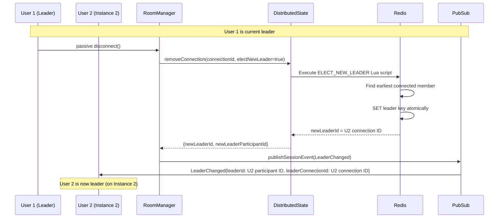

**Lua Script Atomicity:**

```lua
-- ELECT_NEW_LEADER_SCRIPT
-- Gets all session members, filters out leaving connection
-- Sorts by connectedAt, picks earliest
-- Atomically sets new leader
```

### Wall Driver (queue-control-bar pivot)

Wall-control authority is a **separate concept from leader**. The "driver" is the participant currently authorized to drive the wall (broadcast the lit climb), introduced by the queue-control-bar pivot's lightbulb gesture. Decoupling it from `isLeader` keeps the legacy leader plumbing — auth on `endSession`, OG share-image headline, presentation state — untouched. See `docs/queue-control-bar-pivot.md` for the user-facing model.

- **Storage:** `boardsesh:session:{id}:driver` holds the driver's stable `participantId` (or is absent / empty when the wall is unclaimed). Distinct from `boardsesh:session:{id}:leader`, which holds a connection id.
- **Set / yank:** the `takeControl(climb?: ClimbQueueItemInput): Session!` mutation overwrites the driver atomically via Redis `SET ... GET` (single round-trip) — yank-on-press by design. Any session participant may call. The previous-driver value returned by the atomic swap drives the `DriverChanged` publish decision: the event fires only on transitions (no broadcast for a self-reclaim).
- **Release:** the `releaseControl: Session!` mutation clears the driver only when the caller is the current driver (conditional `WATCH`+`MULTI` so a stale release from a non-driver is a no-op). Publishes `DriverChanged { driverParticipantId: null }` only when the clear actually happened.
- **Disconnect cleanup:** when the driver-holding participant fully leaves the session — explicit `leaveSession` with `participantFullyLeft` _or_ grace-timer eviction (`onParticipantExpired` in `client-lifecycle.ts`) — the room manager runs `clearSessionDriverIf(sessionId, leavingParticipantId)` and publishes `DriverChanged { driverParticipantId: null }`. A non-driver leaving never touches the driver key.
- **Cross-instance ordering:** disconnect publishes `UserLeft` synchronously and then fires the conditional driver-clear async (`void this.releaseDriverIfMatches(...)`). Within a single instance the order is preserved; across instances the two events flow through Redis pub/sub independently and their relative arrival order at a remote subscriber is not guaranteed. The spec tolerates this because presence and driver are independent state machines.
- **No auto-election:** unlike leader, the driver role is _not_ re-elected on disconnect. The wall goes "no driver" until someone presses the lightbulb. Phase 4's `NO_BLE` advance-mutation handling deals with the "no driver + BLE up" case silently server-side; users don't see internal driver-absent UI.

### Session boardPath sync (angle sharing)

The session's `boardPath` is the route string the host first joined / created on (`/{board}/{layout}/{size}/{sets}/{angle}/...`). Today the **angle** segment is the only piece that changes after creation — group-session feedback (tester quote: "the app seems to return to 40° as I navigate around") drove the move from "device-local angle" to "session-shared angle." The flow:

- **Mutation:** `setSessionBoardPath(boardPath: String!): Session!` accepts a full path, validates via `BoardPathSchema`, persists via `roomManager.updateSessionBoardPathIfChanged` (read-then-write, non-atomic — see the JSDoc in `session-discovery.ts` for the accepted contract), and publishes `SessionBoardPathChanged` only when the stored value actually moved (idempotent on no-op writes). Any participant may call — angle is presentational and doesn't drive BLE hold positions, so the pivot's "only driver moves the wall" rule doesn't apply.
- **Optimistic-UI shape:** returns `Session!` for symmetry with `takeControl` / `releaseControl` / `setSessionBoardSerial`. The client's angle selector pushes the URL locally for instant feedback (`router.push(newPath)`) and then fires the mutation; the round-trip is best-effort, errors are swallowed.
- **Event:** `SessionBoardPathChanged { boardPath, changedByParticipantId }` fans out via `pubsub.publishSessionEvent` to every session subscriber. The `changedByParticipantId` lets the originating client suppress the echo (the local `router.push` already landed) — remote clients call `router.replace(newPath)` to follow. The replace (not push) is intentional: a remote-driven sync shouldn't add to the back-stack.
- **Client wiring:** `setSessionBoardPath` lives on `PersistentSessionApi` (`use-queue-mutations.ts`). The follow-up `router.replace` is wired in `BoardSessionBridge` — it subscribes to session events via `subscribeToSessionEvents`, filters on `__typename === 'SessionBoardPathChanged'`, and replaces the URL when the originator isn't the local participant. The existing pathname-watching effect in the bridge then re-activates `activeSession` with the new pathname, so `activeSession.boardPath` and downstream consumers (queue bridge angle, log paths) stay in sync.
- **Race contract:** the read-then-write helper trades atomicity for simplicity. Two concurrent angle taps can both publish (the client treats duplicate `router.replace` to the same URL as a no-op), and the realistic write pressure is one tap at a time per device. If a future caller can't tolerate double-publish, tighten to a single-statement CTE per the `session-discovery.ts` JSDoc.

### Session Update Events

`sessionUpdates(sessionId)` emits membership/lifecycle events and live stats updates.

| Event                     | When emitted                                                                                                                                                                         | Key fields                                                                                                                                                                                  |
| ------------------------- | ------------------------------------------------------------------------------------------------------------------------------------------------------------------------------------ | ------------------------------------------------------------------------------------------------------------------------------------------------------------------------------------------- |
| `UserJoined`              | A new participant joins the session                                                                                                                                                  | `user` with `connectionState`                                                                                                                                                               |
| `UserPresenceChanged`     | A known participant reconnects or drops                                                                                                                                              | `user` with `connectionState` (`CONNECTED` or `RECONNECTING`)                                                                                                                               |
| `UserLeft`                | A participant explicitly leaves or expires                                                                                                                                           | `userId`                                                                                                                                                                                    |
| `LeaderChanged`           | Leader election selects a new leader after explicit leave, passive disconnect, or stale-member cleanup                                                                               | `leaderId` is the stable `SessionUser.id`; `leaderConnectionId` is present for current-client connection checks                                                                             |
| `DriverChanged`           | Wall-control authority transfers via `takeControl` / `releaseControl`, or the holding participant disconnects                                                                        | `driverParticipantId` is the stable `SessionUser.id` of the new driver, or `null` when the wall has been released / unclaimed                                                               |
| `SessionBoardPathChanged` | Any participant changes the session's stored boardPath via the `setSessionBoardPath` mutation (today: angle changes through the angle selector — see "Session boardPath sync" below) | `boardPath` is the full route string (`/<board>/<layout>/<size>/<sets>/<angle>/...`); `changedByParticipantId` carries the originator so the sending client can echo-suppress its own event |
| `SessionEnded`            | Session is ended explicitly                                                                                                                                                          | `reason`, `newPath`                                                                                                                                                                         |
| `SessionStatsUpdated`     | A tick is saved for an active party session                                                                                                                                          | `totalSends`, `totalFlashes`, `totalAttempts`, `tickCount`, `participants`, `gradeDistribution`, `boardTypes`, `hardestGrade`, `durationMinutes`, `goal`, `ticks`                           |

`SessionStatsUpdated` payloads include full `ticks` rows so clients can update charts and climbs/attempt lists without issuing an extra session detail refetch. On the client, `useEventProcessor` patches the `SESSION_DETAIL_QUERY_KEY(sessionId)` React Query cache entry directly with the new stats and ticks — there is no separate `liveSessionStats` merge layer, so any component subscribed via `useSessionDetail` re-renders from the updated cache automatically.

**UserJoined / UserLeft identifier contract:** The `user.id` field in `UserJoined` and the `userId` field in `UserLeft` both carry the **WebSocket connection ID**, not the stable database user UUID. The schema-field name `userId` predates the distinction and is a misnomer — renaming it is a breaking change for clients and out of scope. The web client populates its participant list from `UserJoined.user.id` and filters on disconnect with `u.id !== event.userId` (`use-session-lifecycle.ts:562`), so the two events must agree on shape. If you need the stable user UUID downstream (auth checks, tick attribution), use `ctx.userId` on the backend — which auth middleware sets and resolvers must not overwrite — or include `SessionUser.userId` in the payload explicitly (it is a separate field).

**`ctx.userId` lifecycle:** Auth middleware sets `ctx.userId` once at connection time to the stable database user UUID (or `undefined` for unauthenticated clients). Session-related resolvers (`joinSession`, `createSession`) must not overwrite this field — they only update `ctx.sessionId`. An earlier bug clobbered `ctx.userId` with the connection ID inside `joinSession`, breaking every downstream resolver that read `ctx.userId` (ESP32 auto-authorize, climb / tick mutations, controller queries). The regression test `session-context.test.ts` pins the correct behaviour.

---

## Queue State Synchronization

### Event Types

| Event                 | Description             | Fields                                                       |
| --------------------- | ----------------------- | ------------------------------------------------------------ |
| `FullSync`            | Complete state snapshot | `sequence`, `state` (queue + currentClimb + `stateHash`)     |
| `QueueItemAdded`      | Item added to queue     | `sequence`, `stateHash`, `item`, `position`                  |
| `QueueItemRemoved`    | Item removed from queue | `sequence`, `stateHash`, `uuid`                              |
| `QueueReordered`      | Item moved in queue     | `sequence`, `stateHash`, `uuid`, `oldIndex`, `newIndex`      |
| `CurrentClimbChanged` | Active climb changed    | `sequence`, `stateHash`, `item`, `clientId`, `correlationId` |
| `ClimbMirrored`       | Mirror state toggled    | `sequence`, `stateHash`, `uuid`, `mirrored`                  |

Every delta event carries the post-event `stateHash`. Clients must store that hash after accepting the matching `sequence`; the periodic hash watchdog compares the local queue hash against this last accepted server hash. Updating the hash only on `FullSync` is incorrect and can create a resync loop after ordinary delta traffic.

### Queue Mutations

| Mutation                   | Event emitted                       | Notes                                                                                                                                                                                                                                                                                                                                                                                                                    |
| -------------------------- | ----------------------------------- | ------------------------------------------------------------------------------------------------------------------------------------------------------------------------------------------------------------------------------------------------------------------------------------------------------------------------------------------------------------------------------------------------------------------------ |
| `addQueueItem`             | `QueueItemAdded`                    | Appends to queue or inserts at `position`. Idempotent on `item.uuid` — duplicate adds are collapsed server-side during offline reconciliation.                                                                                                                                                                                                                                                                           |
| `removeQueueItem`          | `QueueItemRemoved`                  | Removes by queue-item uuid and clears current climb if it removed the active item.                                                                                                                                                                                                                                                                                                                                       |
| `reorderQueue`             | `QueueReordered`                    | Moves a queue item to a new index.                                                                                                                                                                                                                                                                                                                                                                                       |
| `setCurrentClimbQueueItem` | `CurrentClimbChanged`               | Activates an existing queue item by uuid.                                                                                                                                                                                                                                                                                                                                                                                |
| `setCurrentClimb`          | `CurrentClimbChanged` or `FullSync` | Emits `CurrentClimbChanged` when only the active climb changes. Emits `FullSync` when `shouldAddToQueue` adds a new queue item and activates it in the same mutation, because one sequence now represents both queue membership and current-climb state. Playlist activation may bypass this mutation and call `setQueue` instead when it needs to insert the active climb while replacing future suggested queue items. |
| `replaceQueueItem`         | `FullSync`                          | Replaces the climb inside an existing queue slot in place, preserving position and the queue-item uuid. Used by the create-climb form to push saves of the currently-authored climb to peers without reshuffling the queue. Emits `FullSync` rather than a narrow delta because replace is infrequent and simpler to reconcile.                                                                                          |
| `mirrorCurrentClimb`       | `ClimbMirrored`                     | Flips the mirror flag on the current climb and the matching queue item.                                                                                                                                                                                                                                                                                                                                                  |
| `setQueue`                 | `FullSync`                          | Bulk replaces queue + current climb. Used for offline → online reconciliation and playlist activation updates that must atomically preserve queue history, keep manually queued future items, and drop stale future suggested items.                                                                                                                                                                                     |

### Tick Mode and Queue Bar Freeze

When a user opens the inline tick bar (to log a send/flash/attempt for the current climb), the queue control bar freezes navigation to prevent the active climb from changing mid-tick. This is implemented client-side in `queue-control-bar.tsx`:

- **Freeze trigger**: Opening tick mode sets `activeDrawer: 'tick'` in the queue bar state.
- **Frozen behaviour**: While tick mode is open, swipe navigation and prev/next buttons on the queue bar are disabled. The bar continues to display the climb being ticked, even if other participants change the current climb via WebSocket.
- **Unfreeze**: Closing tick mode (via the close button, swipe-to-dismiss, or after saving) unfreezes the bar and syncs back to the latest server state.
- **Unmount guarantee**: `QuickTickBar` unmounts when tick mode closes. Internal refs (e.g. `tickTargetTaken`) rely on this unmount to reset — they are not explicitly cleared.

This prevents data-loss scenarios where a user is mid-tick and a peer's navigation changes the climb, which would cause the tick to be saved against the wrong climb.

### Optimistic Updates with Correlation IDs

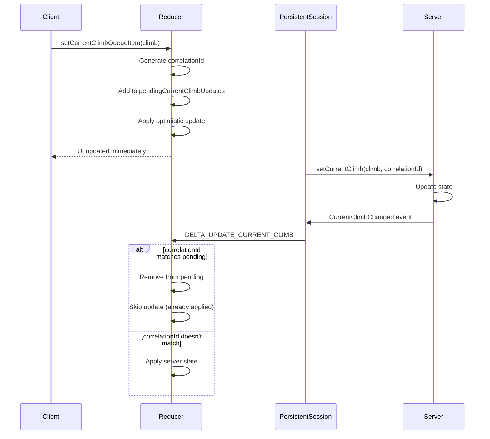

### Sequence Gap Detection

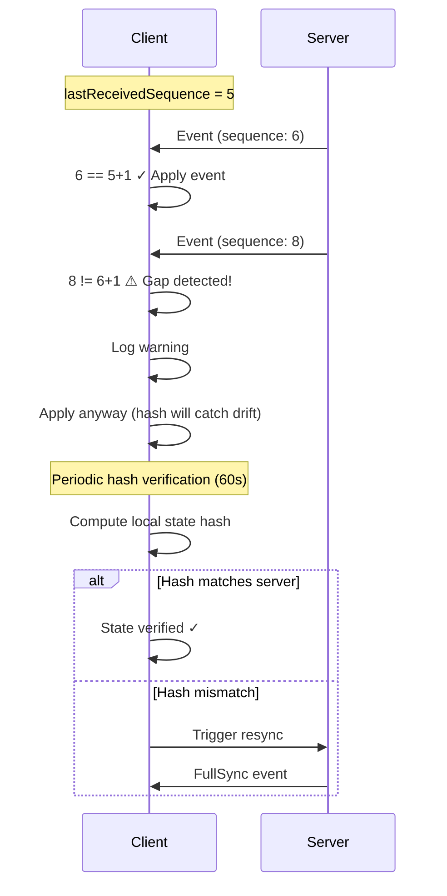

---

## Multi-Instance Support

The backend supports horizontal scaling with multiple instances behind a load balancer. **No sticky sessions are required** - any instance can handle any client.

### Architecture

```
┌─────────────────────────────────────────────────────────────────┐
│                        Load Balancer                             │
│              (No sticky sessions required)                       │
└─────────────────────────────────────────────────────────────────┘
           │                    │                    │
    ┌──────▼───────┐    ┌──────▼───────┐    ┌──────▼───────┐
    │  Instance A  │    │  Instance B  │    │  Instance C  │
    │              │    │              │    │              │
    │ DistState ───┼────┼──────────────┼────┼─── Redis ◄──┤
    │  Manager     │    │              │    │              │
    └──────────────┘    └──────────────┘    └──────────────┘
```

### DistributedStateManager

The `DistributedStateManager` enables true horizontal scaling:

| Feature             | Description                                         |
| ------------------- | --------------------------------------------------- |
| Connection Tracking | All connections visible across instances via Redis  |
| Session Membership  | Aggregated user list from all instances             |
| Leader Election     | Atomic Lua scripts ensure consistent leader         |
| Instance Heartbeat  | 30s heartbeat detects dead instances                |
| WebSocket Ping/Pong | 30s ping detects dead connections on live instances |
| Graceful Cleanup    | Connections cleaned up on instance shutdown         |

### Redis Pub/Sub for Cross-Instance Events

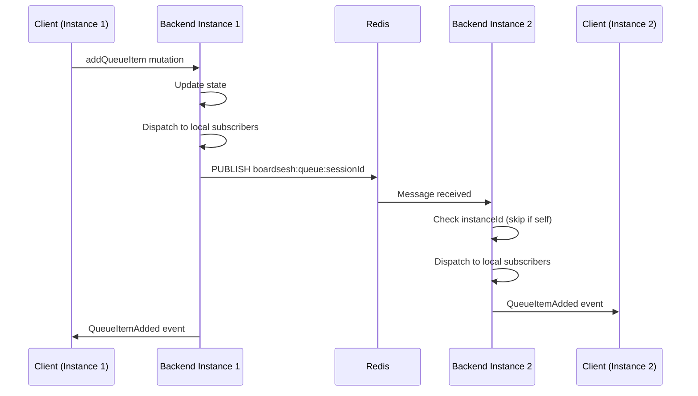

### Cross-Instance Session Membership Validation

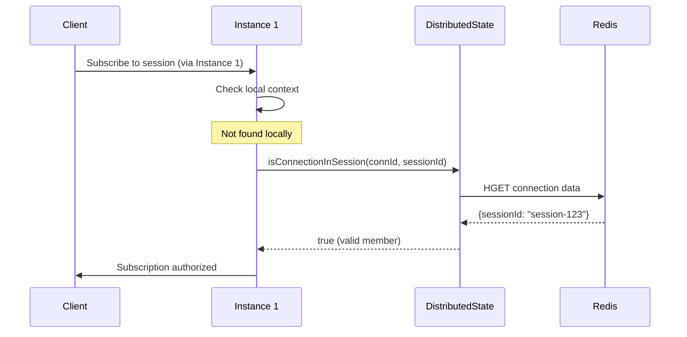

### Channel Naming Convention

- Queue events: `boardsesh:queue:{sessionId}`
- Session events: `boardsesh:session:{sessionId}`
- Notification events: `boardsesh:notifications:{userId}` (per-user, authenticated)
- Comment live updates: `boardsesh:comments:{entityType}:{entityId}` (per-entity, public)

### Event Buffer for Delta Sync

Events are buffered in Redis for reconnection recovery:

```
boardsesh:session:{sessionId}:events
├── Most recent event (index 0)
├── ...
└── Oldest event (max 100 events, 5 min TTL)
```

On reconnect, the web client calls `eventsReplay(sessionId, sinceSequence)` when the sequence gap is between 1 and 100 events. Replay is accepted only when the returned events cover every sequence from `sinceSequence + 1` through `currentSequence`, except that a `FullSync` event covers all earlier missing sequence numbers up to its own sequence. Empty or partial replay responses fall back to a fresh `FullSync`.

The `EVENTS_REPLAY` query uses the same GraphQL aliases as `queueUpdates` (`addedItem: item`, `currentItem: item`) so the event processor can apply live and replayed events through the same code path.

---

## Failure States and Recovery

### 1. Client Disconnection

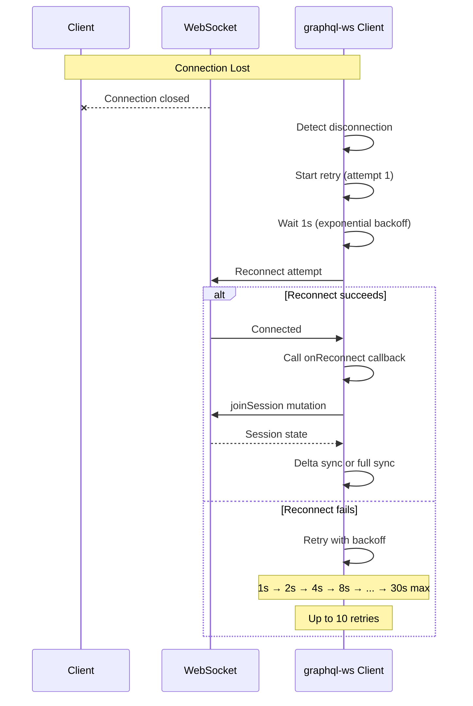

**Recovery mechanism:**

- Exponential backoff: 1s, 2s, 4s, 8s, 16s, 30s (max)
- Up to 10 retry attempts
- On reconnection: re-join session with the same `participantId` and sync state
- Delta sync attempted if gap ≤ 100 events and the replay buffer has contiguous coverage
- Falls back to full sync if the gap is too large, replay is incomplete, or the local hash disagrees despite no sequence gap
- Queue and session subscription `error`/`complete` callbacks schedule a reconnect/resubscribe pass, so a completed subscription does not leave the client silently joined but deaf to future events
- Client-side supervisor detects stale connections and triggers reconnect (see [Client-Side Connection Supervisor](#client-side-connection-supervisor))

**Offline queue support:**

While disconnected (`isDisconnected` state in `useMutationGuard`), the client can continue operating on its local queue. The mutation guard allows local mutations once the session has been connected at least once:

- **All mutations** apply to local state immediately via the reducer
- **Additions** (addToQueue, setCurrentClimb) are buffered in a 500-item offline buffer (`useOfflineQueueBuffer`) for reconciliation on reconnect
- **Other mutations** (removeFromQueue, setQueue, setCurrentClimbQueueItem, mirrorClimb) apply locally only — they are not buffered because reconciling removals/reorders across multiple users is conflict-prone
- **Playlist suggestion source** changes are local-only UI state. Offline playlist activation can still replace local suggested items, but the source itself is not sent to the backend during reconciliation.
- **IndexedDB persistence** is enabled during offline party mode so the queue survives app restarts

On reconnect, the reconciliation hook (`useOfflineReconciliation`) waits for the FullSync event and then chooses a strategy:

- **Client wins** (full local state pushed via `setQueue`): when only 1 user is in the session, or when the server sequence number hasn't changed (no one else modified the queue while we were offline)
- **Server wins with additions merge** (default): server queue state is authoritative; only buffered additions are pushed via individual idempotent `addQueueItem` calls
- **Safety timeout**: if no FullSync arrives within 15 seconds, falls back to additions-only reconciliation against the current local queue

The FullSync handler in the event processor also merges offline-buffered items into the displayed queue for visual continuity — items the user added offline don't briefly disappear during the reconciliation window.

The UI shows the normal queue controls with a "Disconnected" indicator (CloudOff icon) instead of the blocking "Reconnecting..." spinner, so users can keep interacting.

### 2. Redis Connection Failure

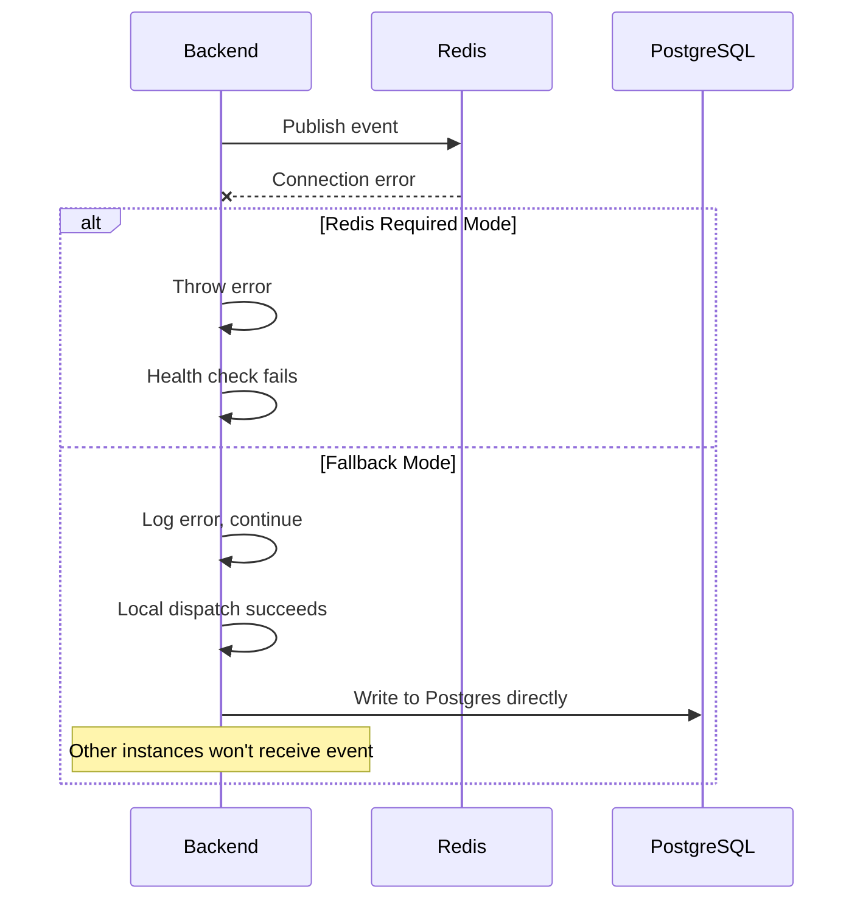

**Key behavior:**

- If `REDIS_URL` is configured, Redis is **required** (fail-closed)
- Without Redis config: local-only mode (single instance)
- Publish failures logged but don't block local dispatch
- Health endpoint reports Redis status

### 3. PostgreSQL Write Failure

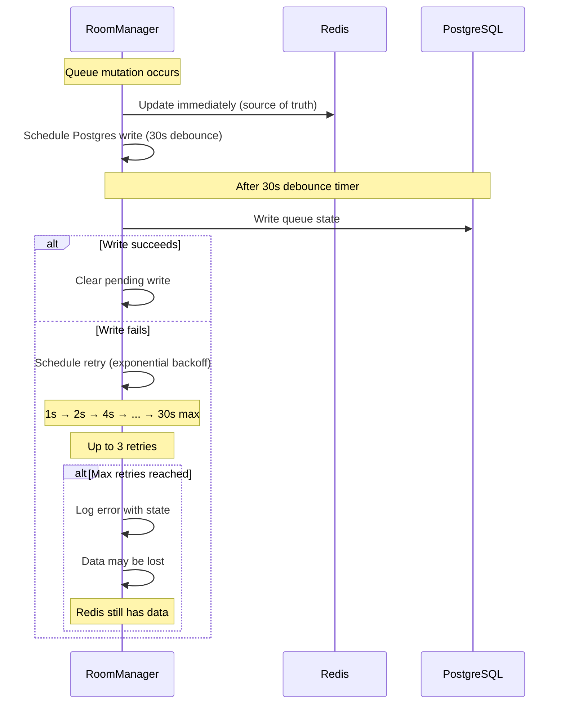

**Mitigation:**

- Redis is the real-time source of truth
- Postgres writes are debounced (30s) and retried
- Graceful shutdown flushes all pending writes
- Session can be recovered from Redis (4h TTL)

### 4. Session Restoration Race Condition

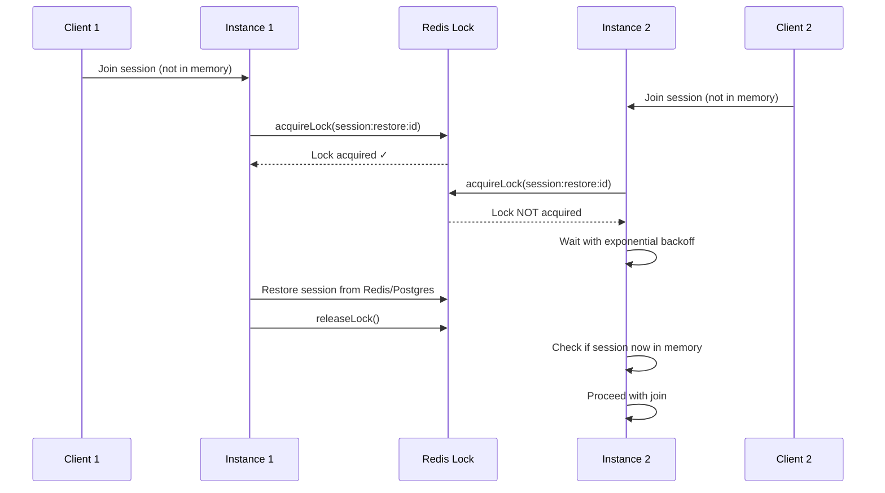

**Lock mechanism:**

- Redis-based distributed lock (10s TTL)
- Lua script ensures only owner can release
- Backoff waiting: 50ms → 100ms → 200ms → ... (5 attempts)

### 5. State Hash Mismatch (Drift Detection)

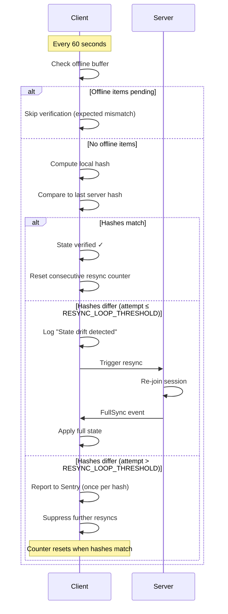

**Guard conditions:**

- **Offline buffer skip:** The FullSync handler merges offline-buffered items into the local queue for visual continuity, but the server hash doesn't include them. The watchdog skips verification while `offlineBufferRef.current` is non-empty. Reconciliation will push the items to the server and clear the buffer, at which point normal verification resumes.
- **Resync loop cap:** After `RESYNC_LOOP_THRESHOLD` (3) consecutive resyncs for the same server hash, the watchdog stops triggering resyncs and reports to Sentry. Repeating the same resync won't fix the underlying issue. The counter resets when hashes eventually match.

**Additional checks:**

- Current climb must exist in queue
- Sequence numbers must increment by 1
- Hash updated after each delta event

### 6. Queue Item Corruption Detection

The client detects and recovers from corrupted queue items (null/undefined entries) that may occur due to server bugs, network issues, or state corruption.

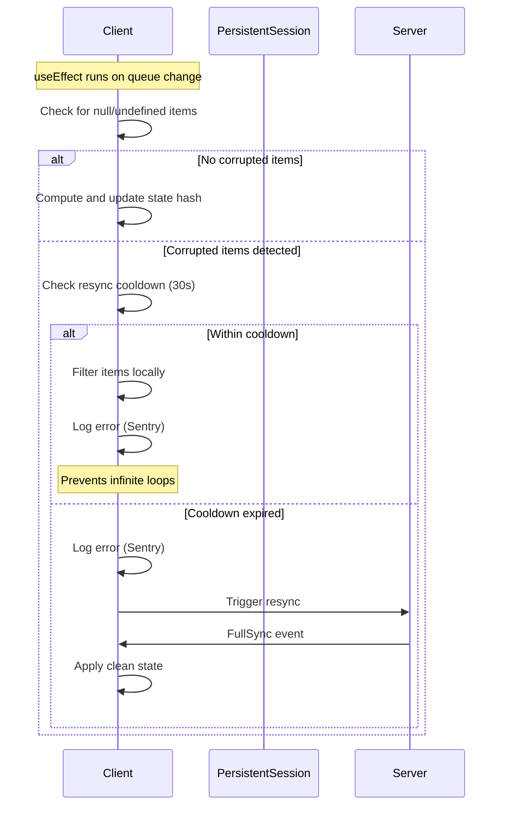

**Corruption sources:**

- Server sends malformed queue data
- State corruption during delta sync
- Race conditions in event handling

**Detection points:**

1. **FullSync handler**: Filters null items when receiving initial/full state
2. **QueueItemAdded handler**: Skips events with null items
3. **State hash effect**: Detects corruption in current queue state

**Resync cooldown:**

- 30 second cooldown between corruption-triggered resyncs
- Prevents infinite loop if server keeps returning corrupted data
- During cooldown: filter corrupted items locally instead of resyncing
- All corruption events logged at `logger.error` level (see [Backend Logging](./logging.md)) for Sentry visibility

**Implementation:**

- `computeQueueStateHash()` defensively filters null/undefined items
- `isFilteringCorruptedItemsRef` prevents useEffect re-trigger loops
- `lastCorruptionResyncRef` tracks cooldown timing

### 7. Subscription Error / Complete

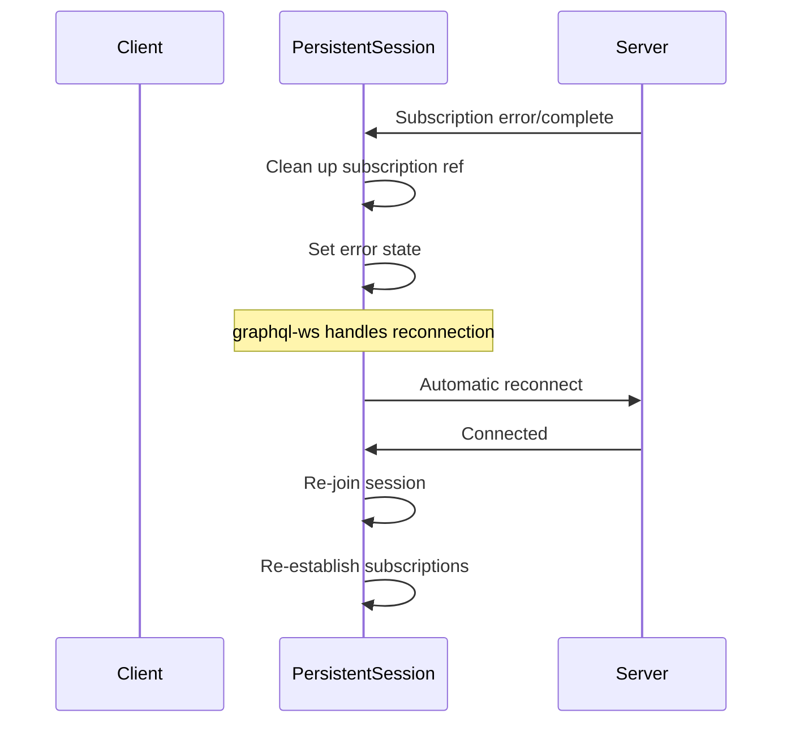

---

## Client-Side Connection Supervisor

The `WebSocketConnectionManager` (`packages/web/app/components/connection-manager/websocket-connection-manager.ts`) is a singleton that sits between the raw `graphql-ws` clients and the React UI. It provides health monitoring, staleness detection, and a unified connection state for the reconnect UX.

### Architecture

```
graphql-ws Client(s)
        │
        │  on('connected' | 'closed' | 'ping' | 'pong' | 'error' | ...)
        ▼
┌──────────────────────────────┐
│  WebSocketConnectionManager  │  (singleton)
│                              │
│  - Registered clients map    │
│  - Primary name selection    │
│  - Health check interval     │
│  - Visibility change handler │
└──────────┬───────────────────┘
           │  subscribe(snapshot)
           ▼
┌──────────────────────────────┐
│  WebSocketConnectionProvider │  (React context)
│                              │
│  - Exposes state, error,     │
│    lastActivity, name        │
│  - forceReconnect() action   │
└──────────────────────────────┘
```

### Connection States

| State          | Meaning                                         |
| -------------- | ----------------------------------------------- |
| `idle`         | No clients registered                           |
| `connecting`   | Client is establishing a WebSocket connection   |
| `connected`    | Client connected and receiving keep-alive pongs |
| `reconnecting` | Connection lost — `graphql-ws` is retrying      |
| `stale`        | No activity received within `STALE_GRACE_MS`    |
| `error`        | Client reported an error event                  |

### Health Check

A 1-second interval (`HEALTH_CHECK_INTERVAL_MS`) monitors each registered client:

1. If `document.visibilityState !== 'visible'`, skip (avoid terminating background tabs).
2. If `Date.now() - lastActivity > STALE_GRACE_MS` (25s), mark the client as `reconnecting` and call `client.terminate()` to force a fresh connection.

This catches silent connection deaths that are common on iOS Safari when the app is backgrounded and the OS kills the socket without a close frame.

### Visibility Change Handler

When the page returns to the foreground (`visibilitychange` → `visible`):

- If the primary client's `lastActivity` exceeds `STALE_GRACE_MS`, or its state is `error`/`reconnecting`, immediately call `forceReconnect()`.

This provides instant recovery when users switch back to the Boardsesh tab.

### Multi-Client Support

Multiple `graphql-ws` clients can be registered simultaneously (e.g., one for queue subscriptions, one for session control). Each is tracked independently with its own state and activity timestamp. The `primaryName` determines which client's state is surfaced to the UI — it auto-promotes to `'session'` on registration and can be switched via `setPrimaryName()`.

### Lifecycle

- **Registration**: `registerClient(client, name)` attaches event listeners and returns an `unregister` function.
- **Unregister**: Removes all event listeners and deletes the client from the map. When the last client is removed, state returns to `idle`.
- **Dispose**: `dispose()` removes the `visibilitychange` listener and clears the health check interval. Used during HMR teardown.

### SSR Shim

On the server (`typeof window === 'undefined'`), the exported `connectionManager` is a no-op shim with the same interface, returning `idle` state. This allows importing in server components without conditional guards.

### Reconnect UX

The `QueueControlBar` reads connection state from the provider. When `state` is `reconnecting`, `stale`, or `error`:

1. The normal climb info is replaced with a spinner and "Reconnecting..." / "Connection error – retrying..." message.
2. A "Cancel" button reveals a confirmation row: "Leave session" (calls `endSession` or `disconnect`) vs "Keep reconnecting".
3. When the connection recovers, the bar automatically returns to normal.

---

## Data Persistence Strategy

### Hybrid Storage Architecture

```
┌─────────────────────────────────────────────────────────────────┐
│                         Write Path                               │
├─────────────────────────────────────────────────────────────────┤
│                                                                  │
│   Queue Mutation ──────► Redis (immediate)                       │
│         │                                                        │
│         └──────────────► Postgres (30s debounced)                │
│                                                                  │
└─────────────────────────────────────────────────────────────────┘

┌─────────────────────────────────────────────────────────────────┐
│                         Read Path                                │
├─────────────────────────────────────────────────────────────────┤
│                                                                  │
│   Get State ──► Redis (hot cache) ──► Postgres (cold storage)   │
│                      │                       │                   │
│                      ▼                       ▼                   │
│                 Active sessions         Dormant sessions         │
│                 (< 4 hours)             (> 4 hours)              │
│                                                                  │
└─────────────────────────────────────────────────────────────────┘
```

### Postgres-Only Fallback (Single Instance Mode)

When Redis is unavailable, RoomManager falls back to **Postgres-only mode**:

- Queue mutations write **directly to Postgres** (no debouncing, since there's no Redis to serve as a fast read layer)
- Session restoration from Redis is skipped; only Postgres restoration is available
- Distributed state (cross-instance leader election, connection tracking) is disabled
- This mode only supports a single backend instance (no horizontal scaling)

### Session State Tiers

| Tier     | Storage           | TTL        | Use Case                                                                           |
| -------- | ----------------- | ---------- | ---------------------------------------------------------------------------------- |
| **Hot**  | In-Memory + Redis | 4 hours    | Active sessions with connected users                                               |
| **Warm** | Redis only        | 4 hours    | No connected users, but fast restoration is still available                        |
| **Cold** | PostgreSQL        | Indefinite | Durable session rows, including dormant sessions restorable until explicitly ended |

### Participant Tracking (Postgres)

Session participation is tracked in two layers:

| Layer                     | Table / Key                           | Granularity               | Lifetime           |
| ------------------------- | ------------------------------------- | ------------------------- | ------------------ |
| **Real-time** (Redis)     | `boardsesh:session:{id}:participants` | Per stable participant ID | Ephemeral (4h TTL) |
| **Historical** (Postgres) | `board_session_participants`          | Per authenticated user    | Permanent          |

**`board_session_participants`** records one row per (session_id, user_id) with a `joined_at` timestamp. It is upserted (`ON CONFLICT DO NOTHING`) when an authenticated user joins a session. Rows are never deleted on disconnect — they serve as a permanent historical record of who participated.

> **Note:** The legacy `board_session_clients` table (one row per WebSocket connection) is no longer written to. Leader state is managed exclusively in Redis via the `DistributedStateManager`.

### Key Redis Data Structures

**Session State (RedisSessionStore):**

```
boardsesh:session:{id}              # Hash - session data (queue, version, etc.)
boardsesh:session:{id}:users        # Hash - connected users (legacy)
boardsesh:session:{id}:events       # List - event buffer (delta sync)
boardsesh:session:active            # Set - active session IDs
boardsesh:session:recent            # Sorted Set - recent sessions (by time)
boardsesh:lock:session:restore:{id} # String - distributed lock (10s TTL)
```

**Distributed State (DistributedStateManager):**

```
boardsesh:conn:{connectionId}       # Hash - connection data (1h TTL, refreshed on activity)
boardsesh:session:{id}:members      # Set - connection IDs in session (4h TTL)
boardsesh:session:{id}:participants # Set - stable participant IDs in session (4h TTL)
boardsesh:participant:{id}:{pid}    # Hash - participant presence data and connectionState
boardsesh:participant:{id}:{pid}:connections # Set - live connection IDs for one participant
boardsesh:session:{id}:leader       # String - leader connection ID (4h TTL)
boardsesh:instance:{id}:conns       # Set - connections owned by instance (2h TTL, refreshed on heartbeat)
boardsesh:instance:{id}:heartbeat   # String - instance heartbeat timestamp (60s TTL, refreshed every 30s)
```

**Pub/Sub Channels:**

```
boardsesh:queue:{sessionId}         # Queue events (add, remove, reorder, etc.)
boardsesh:session:{sessionId}       # Session events (join, leave, leader change)
```

### Graceful Shutdown

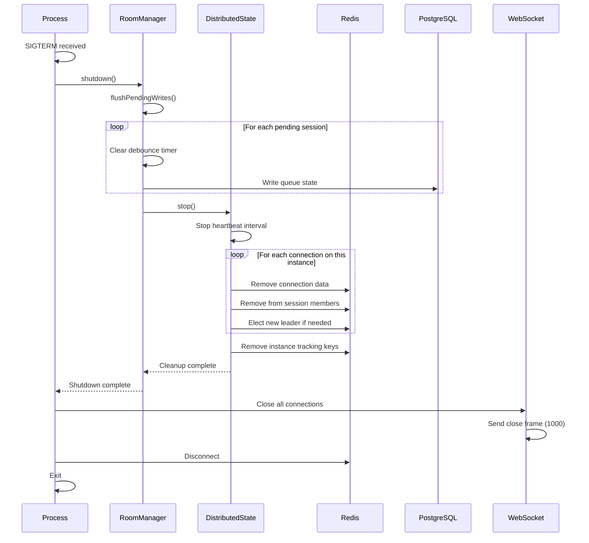

### Dead Connection and Instance Detection

The system uses multiple layers to detect and clean up dead connections:

**1. WebSocket Ping/Pong (30s interval)**

The WebSocket server pings every connected client every 30 seconds. If a client doesn't respond with a pong before the next ping cycle, the socket is terminated. This detects half-open TCP connections caused by network drops (phone sleep, WiFi switch, browser tab killed without close frame). When `terminate()` is called, the `ws` close event fires, graphql-ws triggers `onDisconnect`, and the existing Redis cleanup runs. Dead connections are detected within 30–60 seconds.

**2. Instance Heartbeat (60s TTL, refreshed every 30s)**

```
boardsesh:instance:{id}:heartbeat = timestamp (60s TTL)
```

When an instance dies unexpectedly, its heartbeat key expires after 60 seconds.

**3. Active Dead Instance Cleanup**

The `DistributedStateManager` actively discovers and cleans up dead instances:

- **On startup**: `cleanupDeadInstanceConnections()` runs asynchronously after the first heartbeat
- **Periodically**: Piggybacks on the 30s heartbeat cycle, running every 4th heartbeat (~2 minutes)

The cleanup process:

1. SCANs for `boardsesh:instance:*:conns` keys
2. Checks if the corresponding heartbeat key exists (skip current instance)
3. For each dead instance: fetches its connection IDs, groups by session
4. Deletes all orphaned connection hashes and instance tracking keys
5. Runs `PRUNE_STALE_SESSION_MEMBERS_SCRIPT` (Lua) per affected session to atomically remove stale members and re-elect leader if needed

**4. Active Session Stale Member Cleanup**

On the same ~2 minute cadence, each instance also prunes stale members from sessions it participates in. This catches edge cases where a connection on the current instance died between ping intervals (e.g., race between ping check and socket termination).

**5. Self-Healing Reads**

Even between cleanup cycles, stale entries never inflate participant counts:

- `getSessionMemberCount()` pipelines `EXISTS` checks against each member's connection hash — only live connections are counted
- `getSessionMembers()` filters out members whose connection data is missing **and** fires a background cleanup to remove stale IDs from the Redis set
- `hasSessionMembers()` delegates to the filtered count

**6. TTL Self-Healing (defense in depth)**

| Key                                 | TTL        | Refreshed                |
| ----------------------------------- | ---------- | ------------------------ |
| `boardsesh:conn:{id}`               | 1 hour     | On client activity       |
| `boardsesh:instance:{id}:conns`     | 2 hours    | On every heartbeat (30s) |
| `boardsesh:instance:{id}:heartbeat` | 60 seconds | Every 30s                |
| `boardsesh:session:{id}:members`    | 4 hours    | On join/leave/refresh    |

Even if all active cleanup fails, orphaned data expires naturally via these TTLs.

---

## Controller Events (ESP32 Integration)

The backend supports ESP32 controllers that bridge between official Kilter/Tension apps and BoardSesh sessions. Controllers receive LED updates and can send detected climbs back to the session.

### Authentication

Controllers authenticate using API keys passed in the WebSocket connection params (not in GraphQL variables):

```javascript
// graphql-ws protocol connection_init
{
  "type": "connection_init",
  "payload": {
    "controllerApiKey": "your-64-char-hex-key"
  }
}
```

The backend extracts this from `connectionParams.controllerApiKey` during the `onConnect` hook and stores `controllerId` and `controllerApiKey` in the connection context.

### Authorization Flow

1. **User Registration** (Web UI)
   - User visits Settings > ESP32 Controllers
   - Clicks "Add Controller" and configures board type, layout, size, sets
   - Receives a 64-character hex API key (shown once, must save it)

2. **Session Authorization** (Automatic)
   - When user calls `joinSession` mutation (authenticated)
   - Backend auto-authorizes all user's controllers for that session
   - Sets `authorizedSessionId` column in database

3. **Controller Connection** (ESP32)
   - ESP32 connects with API key in `connection_init` payload
   - Backend validates key and populates context with controller info

4. **Subscription Authorization**
   - Controller subscribes to `controllerEvents(sessionId)`
   - Backend verifies controller is authorized for that session
   - Throws error if not: "Controller not authorized for session"

5. **Mutation Authorization**
   - Controller calls `setClimbFromLedPositions(sessionId, frames)`
   - Backend verifies session authorization before processing

### Controller Subscription

```graphql
subscription ControllerEvents($sessionId: ID!) {
  controllerEvents(sessionId: $sessionId) {
    ... on LedUpdate {
      commands {
        position
        r
        g
        b
      }
      climbUuid
      climbName
      climbGrade
      boardPath
      angle
    }
    ... on ControllerPing {
      timestamp
    }
  }
}
```

### Events

| Event                 | Description                                                  |
| --------------------- | ------------------------------------------------------------ |
| `LedUpdate`           | LED commands for current climb (RGB values and positions)    |
| `ControllerQueueSync` | Full queue state sync (sent on connection and queue changes) |
| `ControllerPing`      | Keep-alive ping (not currently implemented)                  |

### LedUpdate Fields

| Field           | Type   | Description                                                                                                                                                                |
| --------------- | ------ | -------------------------------------------------------------------------------------------------------------------------------------------------------------------------- |
| `commands`      | Array  | LED positions with RGB values                                                                                                                                              |
| `queueItemUuid` | String | UUID of the queue item (for navigation)                                                                                                                                    |
| `climbUuid`     | String | Unique identifier for the climb                                                                                                                                            |
| `climbName`     | String | Display name of the climb                                                                                                                                                  |
| `climbGrade`    | String | The climb difficulty/grade (e.g., "V5", "6a/V3")                                                                                                                           |
| `gradeColor`    | String | Hex color for the grade (e.g., "#00FF00")                                                                                                                                  |
| `boardPath`     | String | Board configuration path for context-aware operations (e.g., "kilter/1/12/1,2,3/40")                                                                                       |
| `angle`         | Int    | Board angle in degrees                                                                                                                                                     |
| `clientId`      | String | Identifier of client that initiated the change (used by ESP32 to decide whether to disconnect BLE client - if clientId matches ESP32's MAC, it was self-initiated via BLE) |
| `navigation`    | Object | Navigation context with previousClimbs, nextClimb, currentIndex, totalCount                                                                                                |

### ControllerQueueSync Fields

| Field          | Type  | Description                                                        |
| -------------- | ----- | ------------------------------------------------------------------ |
| `queue`        | Array | Array of queue items with uuid, climbUuid, name, grade, gradeColor |
| `currentIndex` | Int   | Index of the current climb in the queue (-1 if none)               |

### LED Color Mapping

| Hold State | RGB Value             |
| ---------- | --------------------- |
| STARTING   | (0, 255, 0) Green     |
| FINISH     | (255, 0, 255) Magenta |
| HAND       | (0, 255, 255) Cyan    |
| FOOT       | (255, 170, 0) Orange  |

### Controller Mutations

```graphql
# Send detected climb from Bluetooth
mutation SetClimbFromLeds($sessionId: ID!, $frames: String) {
  setClimbFromLedPositions(sessionId: $sessionId, frames: $frames) {
    matched
    climbUuid
    climbName
  }
}

# Navigate queue via hardware buttons (previous/next)
# queueItemUuid is preferred for direct navigation (most reliable)
# direction is used as fallback when queueItemUuid not found
mutation NavigateQueue($sessionId: ID!, $direction: String!, $queueItemUuid: String) {
  navigateQueue(sessionId: $sessionId, direction: $direction, queueItemUuid: $queueItemUuid) {
    uuid
    climb {
      name
      difficulty
    }
  }
}

# Heartbeat to update lastSeenAt
mutation Heartbeat($sessionId: ID!) {
  controllerHeartbeat(sessionId: $sessionId)
}
```

### Queue Navigation

The `navigateQueue` mutation allows ESP32 controllers to browse the queue via hardware buttons:

| Parameter       | Type    | Description                                                |
| --------------- | ------- | ---------------------------------------------------------- |
| `sessionId`     | ID!     | Session to navigate within                                 |
| `direction`     | String! | "next" or "previous" (fallback if queueItemUuid not found) |
| `queueItemUuid` | String  | Direct navigation to specific queue item (preferred)       |

**Navigation Flow:**

1. ESP32 maintains local queue state from `ControllerQueueSync` events
2. On button press, ESP32 calculates the target item locally (optimistic update)
3. ESP32 sends `navigateQueue` with the target `queueItemUuid`
4. Backend updates current climb and broadcasts `CurrentClimbChanged`
5. ESP32 receives `LedUpdate` with new climb data

**Debounce Behavior:**

- Navigation mutations are debounced with a 100ms delay to prevent WebSocket disconnection from rapid button presses
- UI updates immediately (optimistic), but only ONE mutation is sent after 100ms of button inactivity
- Example: Pressing "next" 10 times quickly results in 10 immediate display updates but only 1 mutation (to the final position)
- During rapid navigation, incoming `LedUpdate` events skip queue index sync to preserve optimistic state
- Only one mutation can be in-flight at a time; new mutations wait for the previous to complete

### Manual Authorization

If auto-authorization doesn't apply (e.g., controller owner is not in session), use:

```graphql
mutation AuthorizeController($controllerId: ID!, $sessionId: ID!) {
  authorizeControllerForSession(controllerId: $controllerId, sessionId: $sessionId)
}
```

Requires user authentication and controller ownership.

---

## Configuration

### Environment Variables

| Variable        | Description             | Default                |
| --------------- | ----------------------- | ---------------------- |
| `REDIS_URL`     | Redis connection string | None (local-only mode) |
| `PORT`          | HTTP/WS server port     | 8080                   |
| `BOARDSESH_URL` | Allowed CORS origin     | https://boardsesh.com  |

### Timeouts and Limits

| Setting                 | Value   | Purpose                                   |
| ----------------------- | ------- | ----------------------------------------- |
| Retry attempts          | 10      | WebSocket reconnection                    |
| Max retry delay         | 30s     | Exponential backoff cap                   |
| Keep-alive interval     | 10s     | Connection health check                   |
| Mutation timeout        | 30s     | Prevent hanging mutations                 |
| Redis TTL               | 4 hours | Session cache expiry                      |
| Postgres debounce       | 30s     | Batch writes                              |
| Event buffer size       | 100     | Delta sync limit                          |
| Event buffer TTL        | 5 min   | Old events cleanup                        |
| Hash verification       | 60s     | State drift detection                     |
| Subscription queue      | 1000    | Max pending events                        |
| Connection TTL          | 1 hour  | Distributed connection expiry             |
| WebSocket ping interval | 30s     | Dead connection detection                 |
| Instance heartbeat      | 30s     | Heartbeat update interval                 |
| Instance heartbeat TTL  | 60s     | Dead instance detection                   |
| Session members TTL     | 4 hours | Matches session TTL                       |
| Session grace period    | 60s     | In-memory retention after last disconnect |

---

## iOS Live Activity Integration

On iOS, the JavaScript webapp runs inside a single Capacitor webview and owns the `graphql-ws` WebSocket connection (same client as the browser path). A separate native `SessionWebSocketManager` holds its own `URLSessionWebSocketTask` purely to feed the Live Activity widget — the JS-side WebSocket is suspended when the phone is locked, so without the native connection the lock-screen widget would freeze the moment the app goes to background. APNs push notifications carry the same queue updates to the Live Activity once both the app and the native WS are suspended (see [Live Activity Push Notifications](#live-activity-push-notifications-apns) below).

The earlier multi-webview + native-WebSocket bridge architecture (Capacitor plugin proxying the JS layer through `URLSessionWebSocketTask`) was removed when main reverted the multi-webview / native tab bar work (#1803). Today there is no `NativeWebSocketPlugin` and no JS-side `NativeWSClient`; iOS uses the same browser-based `graphql-ws` client as web and Android.

### Architecture

```
JS webview (graphql-ws Client)
  │ subscribes to queueUpdates(sessionId:)
  │ runs mutations + receives delta events
  ▼
GraphQL Backend ◄────────────────────────┐
  │                                      │
  │ in parallel, while the app is        │
  │ foregrounded:                        │
  ▼                                      │
SessionWebSocketManager (native)         │
  │ second graphql-ws connection         │
  │ same queueUpdates subscription       │
  │ onQueueStateChanged callback         │
  ▼                                      │
LiveActivityManager.updateActivity(...)  │
  │ Activity.update(content)             │
  ▼                                      │
Lock Screen / Dynamic Island             │
  ▲                                      │
  │ when the phone is locked, native     │
  │ WS dies; the Live Activity widget    │
  │ is refreshed instead by APNs pushes  │
  │ delivered to its ActivityKit         │
  │ pushType: .token callback ───────────┘
```

### Why a Second Connection (and Not a Bridge)

A bridge would be cheaper on the server side, but the trade-offs ended up favouring two independent connections:

- The webview can rebuild its WebSocket from JS state in milliseconds; the native side wakes from background separately and reuses a long-lived task. Coupling them through a bridge meant a webview reload could cascade into a native reconnect (or vice versa) and observed in production as bursts of disconnect / reconnect storms.
- Live Activity push tokens live on the native side. Keeping the ActivityKit lifecycle co-located with the connection that drives it is simpler than synchronising it across the bridge.
- The 2× server connection cost is bounded — only foregrounded iOS sessions pay it, and even then the second connection consumes only what's needed to drive Live Activity updates.

### Native Live Activity WebSocket — Scope

`SessionWebSocketManager` is purposely narrow:

- One `URLSessionWebSocketTask`, one `queueUpdates(sessionId:)` subscription, one `onQueueStateChanged` callback.
- No external-subscription registration API — the JS side does all of its own subscribing.
- The same `graphql-transport-ws` handshake (`connection_init` with optional `authToken`, `connection_ack`, `subscribe`, `next`, `complete`, ping/pong) as the JS client.
- Exponential reconnection backoff: 1s, 2s, 4s, 8s, 16s, capped at 30s. Reconnect stops on intentional disconnect (`endSession`, app termination).
- Stale-date handling: 3-minute stale window refreshed every 60s by the ping timer. After force-quit or crash, the Live Activity goes stale within 3 minutes instead of lingering for 30.

### Thread Safety

All mutable state in `SessionWebSocketManager` is protected by a serial `DispatchQueue` (`stateQueue`). Publicly exposed properties (`isConnected`, `reconnectAttempt`, `sessionId`, `authToken`, …) use thread-safe computed accessors that read through `stateQueue.sync`. Internal code on `stateQueue` accesses the backing `_`-prefixed properties directly to avoid reentrant deadlock (`DispatchQueue` is not reentrant). Delegate callbacks (`onQueueStateChanged`) are dispatched to the main queue so Capacitor / UIKit calls never block `stateQueue`.

### App Group + Keychain Shared State

The main app and widget extension share data through two channels:

**App Group (`group.com.boardsesh.app`) UserDefaults** — board details, queue, and ephemeral navigation state. Stored in plaintext on disk inside the App Group container; appropriate for non-secret data only.

| Key                                                         | Type       | Purpose                                           |
| ----------------------------------------------------------- | ---------- | ------------------------------------------------- |
| `bs_queue_items`                                            | JSON array | Serialized `SharedQueueItem` list                 |
| `bs_current_index`                                          | Int        | Current position in queue                         |
| `bs_session_id`                                             | String     | Active session identifier                         |
| `bs_server_url`                                             | String     | Backend URL for thumbnail fetching                |
| `bs_board_name`, `bs_layout_id`, `bs_size_id`, `bs_set_ids` | String/Int | Board details for thumbnail URL construction      |
| `bs_pending_action`                                         | String     | Widget→app navigation request ("next"/"previous") |

**Shared Keychain (`group.com.boardsesh.app` access group)** — Bearer credentials only. Encrypted at rest, hardware-backed, accessible only to processes that declare the `keychain-access-groups` entitlement. Accessibility is `kSecAttrAccessibleAfterFirstUnlockThisDeviceOnly` so the widget extension can read them while the device is locked (after the first post-boot unlock), without syncing them into iCloud Keychain backups.

| Key (account name)   | Stored by            | Read by              | Purpose                                                                                  |
| -------------------- | -------------------- | -------------------- | ---------------------------------------------------------------------------------------- |
| `bs_auth_token`      | `LiveActivityPlugin` | `LiveActivityPlugin` | User's Bearer token attached to GraphQL `register…`/`unregister…ActivityPushToken` calls |
| `bs_live_push_token` | `LiveActivityPlugin` | `WidgetNetworking`   | APNs Live Activity push token used as the Bearer credential on `/api/widget/navigate`    |

Earlier builds wrote both credentials to App Group UserDefaults. The current `LiveActivityPlugin.endSession()` clears those legacy keys on top of the new keychain delete so an upgrade doesn't leave plaintext tokens behind.

The helper lives in `mobile/ios/App/App/SharedKeychain.swift`. The `keychain-access-groups` entitlement is declared in `App.entitlements` and `BoardseshWidgets.entitlements`.

### Widget Button Flow

Lock-screen widget taps (next/prev climb) do NOT go through the native WebSocket. They hit the backend directly via `/api/widget/navigate` (see [Widget Navigation REST Endpoint](#widget-navigation-rest-endpoint)) because the widget extension can't talk to `SessionWebSocketManager` (different process). The backend updates the queue, publishes a `CurrentClimbChanged` event, and the APNs hook fans the change back out to every device's Live Activity.

### Lifecycle

- **Start** — `LiveActivityPlugin.startSession()` stores board details in App Group UserDefaults, writes the auth token to the shared keychain, installs the `onQueueStateChanged` callback before connecting `SessionWebSocketManager`, then starts the Live Activity with `pushType: .token`. The push-token handler is passed into `Activity.request(...)` atomically so ActivityKit's first emission isn't dropped.
- **End** — `LiveActivityPlugin.endSession()` fires `unregisterActivityPushToken` on the backend (best-effort), clears the keychain entries, removes the App Group queue keys, ends all Live Activities, and disconnects `SessionWebSocketManager`.
- **Force-quit / crash** — `SceneDelegate.sceneDidDisconnect` and `AppDelegate.applicationWillTerminate` attempt the same cleanup but aren't reliably called. The 3-minute stale window from the Live Activity manager and the orphaned-activity cleanup in `SceneDelegate.sceneWillEnterForeground` / `scene(_:willConnectTo:)` handle the leftovers on next launch.

## Live Activity Push Notifications (APNs)

When the app is fully foregrounded, queue mutations land via the JS WebSocket; when the app is backgrounded or terminated, the native WS goes silent and the **Live Activity widget is kept fresh by APNs push notifications**.

### Backend Send Path

```
GraphQL mutation (e.g. setCurrentClimb)
  │ resolver updates state via RoomManager
  ▼
pubsub.publishQueueEvent(sessionId, event)
  │ runs the per-event subscriber fan-out as usual,
  │ then fires the externally registered hook (if any)
  ▼
queueEventHook = sendLiveActivityUpdate(...)  ← installed in server.ts
  │ packs a LiveActivityContentState (current climb name,
  │ grade, angle, index, totals, hasNext/hasPrevious, climbUuid)
  │ debounces ~1s per session to coalesce bursts
  ▼
APNs HTTP/2 send
  │ topic:      {APNS_BUNDLE_ID}.push-type.liveactivity
  │ pushType:   liveactivity
  │ payload:    { aps: { timestamp, event: "update", content-state } }
  ▼
Apple Push Notification service
  ▼
ActivityKit on every device that registered a token for this session
```

`apns/index.ts` is **configured-or-noop**: if any of `APNS_KEY_ID`, `APNS_TEAM_ID`, `APNS_KEY_CONTENTS`, `APNS_BUNDLE_ID`, or `APNS_PRODUCTION` is missing, all public functions short-circuit and the rest of the backend keeps running normally. The boot log warns when env is missing (see `packages/backend/src/server.ts` startup section).

### Server-Side Analytics

Live Activity actions that happen outside the web view are captured server-side through PostHog when `POSTHOG_PROJECT_KEY` is configured. The backend can also fall back to `NEXT_PUBLIC_POSTHOG_KEY` for compatibility with the web build env, but `POSTHOG_PROJECT_KEY` is the preferred runtime variable. `POSTHOG_HOST` defaults to `https://us.i.posthog.com`, and `POSTHOG_ENVIRONMENT` can override the event `environment` property. If `POSTHOG_ENVIRONMENT` is unset, the backend falls back to `SENTRY_ENVIRONMENT`, then `NODE_ENV`, then `development`. Server events are sent directly rather than through the browser `/api/posthog/*` proxy.

Event taxonomy:

- `Live Activity Started`: emitted after `registerActivityPushToken` successfully upserts a token; attributed to the authenticated `userId`.
- `Live Activity Ended`: emitted after explicit unregister and when a session end cleans up still-registered tokens; attributed to `activity_push_tokens.user_id` when available.
- `Live Activity Widget Navigation`: emitted for attributed widget next/previous attempts, including success, rate limit, wrong-session, empty-queue, target-out-of-bounds, and server-error outcomes.
- `Live Activity Widget Navigation Attribution Gap`: emitted as an aggregate, session-scoped event when a widget token row authorizes navigation but has no `user_id` yet. Token rows created before `activity_push_tokens.user_id` was added still authorize navigation and emit this gap metric until that device re-registers and the row gains user attribution.
- `Live Activity Push Delivery`: emitted once per APNs send batch with token/sent/failed/stale counts only. It uses a session-scoped distinct ID with PostHog person-profile processing disabled.

Analytics intentionally excludes APNs tokens, bearer tokens, user emails, climb names, and queue item names. Existing token rows from before the `activity_push_tokens.user_id` migration continue to work; they gain user attribution the next time the device registers.

### Event Types That Trigger a Push

`APNS_RELEVANT_EVENTS` in `server.ts` controls which `publishQueueEvent` types fan out to APNs:

- `CurrentClimbChanged`
- `FullSync`
- `QueueItemAdded`
- `QueueItemRemoved`
- `QueueReordered`

Other event types (`ClimbMirrored`, etc.) intentionally don't push so the lock-screen widget doesn't flicker for cosmetic state.

### Publisher-Side Semantics (Multi-Instance)

The hook fires only on the instance that calls `publishQueueEvent`. It is **not** invoked from `dispatchToLocalQueueSubscribers` when a Redis fan-out message arrives from another instance — that path bypasses the hook intentionally so a single event published in a 3-instance cluster does not produce 3 redundant APNs sends.

Implication: every backend instance that can publish queue mutations should have APNs env vars configured. If env is missing on the publishing instance, the hook still runs but every `sendLiveActivityUpdate` call becomes a no-op via the `configured` flag.

### Ending the Activity

`endSession` mutation calls the APNs service with `event: "end"`, which fires the same APNs send shape but tells ActivityKit to dismiss the widget. Local `LiveActivityManager.endAllActivities()` covers the path where the session ends from the foregrounded app.

## Activity Push Token Lifecycle

```
ActivityKit (iOS)
  │ Activity.request(..., pushType: .token)
  │ emits a token via activity.pushTokenUpdates AsyncSequence
  ▼
LiveActivityManager.deliverPushTokenUpdate(token)
  │ hops into the actor for Swift 6 strict-concurrency safety
  │ calls onPushTokenUpdate(token) on the LiveActivityPlugin handler
  ▼
LiveActivityPlugin pushTokenHandler
  │ single tokenQueue.sync block writes _currentPushToken AND reads
  │ (_currentSessionId, _currentServerUrl) — one critical section so
  │ ActivityKit delivering the token on any thread can't deadlock
  │ writes token to SharedKeychain.livePushTokenKey
  ▼
POST /graphql registerActivityPushToken(sessionId, token)
  │ Authorization: Bearer <app auth token from keychain>
  ▼
Backend resolver (packages/backend/src/graphql/resolvers/sessions/push-tokens.ts)
  │ - require authentication (ctx.userId)
  │ - validate APNs token format ([0-9a-fA-F]{32,128})
  │ - rate limit (token bucket 5 capacity / 1 refill per 2s)
  │ - verify participant via board_session_participants
  │ - upsert into activity_push_tokens inside a transaction:
  │     pg_advisory_xact_lock(hashtext(sessionId))
  │     count rows for sessionId
  │     if >= MAX_TOKENS_PER_SESSION (8), delete oldest
  │     insert with ON CONFLICT (token) DO UPDATE
  ▼
activity_push_tokens table (DB)
```

### Per-Session Cap and TOCTOU Avoidance

The 8-tokens-per-session cap is enforced under a Postgres advisory lock (`pg_advisory_xact_lock(hashtext(sessionId))`) so concurrent register calls for the same session serialize. Without the lock, two requests could both observe `count = cap - 1`, both skip the eviction, and both insert, leaving the session at `cap + 1` rows. The lock is per-transaction, so it auto-releases on commit or rollback.

### Unregister

`unregisterActivityPushToken(sessionId, token)` is the symmetric mutation. The delete is scoped to `(token, sessionId)` so an attacker holding a leaked token cannot wipe another session's registrations. Same auth + participant + rate-limit checks apply.

## Widget Navigation REST Endpoint

Lock-screen widget extensions cannot reach the JS webapp or its WebSocket. Instead, the Next / Previous buttons hit a dedicated REST endpoint:

```
POST /api/widget/navigate
  Authorization: Bearer <APNs Live Activity push token>
  Content-Type: application/json

  { "sessionId": "<id>", "action": "next" | "previous", "currentIndex": <int ≥ 0> }
```

### Auth

The Bearer credential is the device's APNs Live Activity push token — the same value the widget pulled from `SharedKeychain.livePushTokenKey`. The handler looks up `(token, sessionId)` in `activity_push_tokens`; an unknown token returns 401, while a known token bound to a different session returns 410 so the widget can re-register. Treating the push token as the credential keeps the widget extension out of the user-auth path entirely (it never sees the user's Bearer token) and is safe because the token is already a per-session, per-device secret.

### Validation

- `sessionId`: non-empty string
- `action`: `"next"` or `"previous"`
- `currentIndex`: integer, `>= 0`
- Request body capped at 4 KB

Anything else returns 400.

### Rate Limiting

Per-session token bucket — capacity 2, refill 1 per 1.5s. Burst clicks are smoothed; sustained tapping caps at ~40 req/min per session. Returns 429 when the bucket is empty. The session-scoped bucket means one device can't deny service for another.

### Server-Authoritative Navigation

The handler does NOT trust the `currentIndex` from the widget — it fetches the server's queue state via `roomManager.getQueueState(sessionId)`, computes the target index from `action` (wrapping at boundaries for `next`, clamped to 0 for `previous`), and calls `navigateToQueueItem` (shared with the `setCurrentClimb` GraphQL mutation). That function does optimistic-lock retry against the room manager and publishes the resulting `CurrentClimbChanged` via `pubsub.publishQueueEvent`, which fans out to JS subscribers and triggers the APNs push hook described above.

The `currentIndex` field in the request is validated for shape only; the handler reads server state for the actual position.

### Why HTTP and Not a GraphQL Mutation

A GraphQL mutation would require either the JS GraphQL client (not available in the widget process) or hand-rolled GraphQL-over-HTTP in Swift. The REST handler is simpler, cheaper, and lets us keep the widget extension free of GraphQL tooling. The downside — a second endpoint surface to keep in sync — is small for one operation.

## Related Files

### Backend

- `packages/backend/src/websocket/setup.ts` - WebSocket server configuration
- `packages/backend/src/pubsub/index.ts` - Event pub/sub system + `setQueueEventHook`
- `packages/backend/src/pubsub/redis-adapter.ts` - Redis pub/sub adapter
- `packages/backend/src/services/room-manager.ts` - Session & queue management
- `packages/backend/src/services/redis-session-store.ts` - Redis session persistence
- `packages/backend/src/services/distributed-state.ts` - Multi-instance state management
- `packages/backend/src/services/queue-navigation.ts` - Shared queue-navigation logic (used by `setCurrentClimb` and `/api/widget/navigate`)
- `packages/backend/src/services/apns/index.ts` - APNs HTTP/2 send + 5s debounce + Live Activity content state assembly
- `packages/backend/src/handlers/widget-navigate.ts` - REST handler for `POST /api/widget/navigate`
- `packages/backend/src/graphql/resolvers/queue/` - Queue mutations & subscriptions
- `packages/backend/src/graphql/resolvers/sessions/` - Session mutations & subscriptions
- `packages/backend/src/graphql/resolvers/sessions/push-tokens.ts` - `registerActivityPushToken` / `unregisterActivityPushToken` resolvers with the per-session cap + advisory-lock TOCTOU fix
- `packages/backend/src/graphql/resolvers/shared/helpers.ts` - Cross-instance auth validation
- `packages/db/src/schema/app/activity-push-tokens.ts` - Drizzle schema for the `activity_push_tokens` table

### Frontend

- `packages/web/app/lib/backend-url.ts` - Runtime backend URL resolver (preview deploys, dev overrides)
- `packages/shared/graphql-client/` - Platform-agnostic `graphql-ws` helpers (`execute`, `subscribe`, `createGraphQLClient`, `GraphQLOperationError`). Web and the React Native mobile app both consume this; web passes its `SafeWebSocket` wrapper + `connectionManager` registration via the `webSocketImpl` / `onClientCreated` hooks.
- `packages/web/app/components/graphql-queue/graphql-client.ts` - Thin web wrapper around `@boardsesh/graphql-client` that adds the `SafeWebSocket` DOM-error suppression and `connectionManager` registration. Also re-exports the shared primitives for legacy relative imports.
- `packages/web/app/components/connection-manager/websocket-connection-manager.ts` - Connection state tracking
- `packages/web/app/components/persistent-session/hooks/use-session-lifecycle.ts` - Session lifecycle
- `packages/web/app/components/persistent-session/hooks/use-queue-mutations.ts` - Queue mutations
- `packages/web/app/components/graphql-queue/use-queue-session.ts` - Session hook
- `packages/web/app/components/persistent-session/persistent-session-context.tsx` - Root-level session management (split into ActionsContext + StateContext for render performance)
- `packages/web/app/components/graphql-queue/QueueContext.tsx` - Queue state context (split into ActionsContext + DataContext; actions use `latestRef` pattern for stable callback identity)

### Native iOS

- `mobile/ios/App/App/SessionWebSocketManager.swift` - Native graphql-ws client used only to drive Live Activity updates while the app is foregrounded
- `mobile/ios/App/App/LiveActivityPlugin.swift` - Capacitor plugin: start/end session, update activity, observe + forward APNs push tokens to the backend
- `mobile/ios/App/App/LiveActivityManager.swift` - ActivityKit lifecycle (`pushType: .token`, push-token observer, stale-date refresh)
- `mobile/ios/App/App/SharedConstants.swift` - App Group ID and non-secret UserDefaults keys + helpers
- `mobile/ios/App/App/SharedKeychain.swift` - Shared-access-group Keychain helper for auth + push tokens
- `mobile/ios/App/App/App.entitlements` - App Group, `aps-environment`, `keychain-access-groups` declarations
- `mobile/ios/App/App/ThumbnailFetcher.swift` - Board-render thumbnail fetching and caching
- `mobile/ios/App/BoardseshWidgets/BoardseshWidgets.entitlements` - Widget extension entitlements (App Group + Keychain access group)
- `mobile/ios/App/BoardseshWidgets/NextClimbIntent.swift` - Widget Next button App Intent
- `mobile/ios/App/BoardseshWidgets/PreviousClimbIntent.swift` - Widget Previous button App Intent
- `mobile/ios/App/BoardseshWidgets/WidgetNetworking.swift` - HTTP client that calls `/api/widget/navigate` from the widget extension
- `packages/web/app/lib/live-activity/use-live-activity.ts` - React hook bridging queue state to the native Live Activity plugin

### Shared

- `packages/shared-schema/src/schema.ts` - GraphQL schema definition
- `packages/shared-schema/src/types.ts` - TypeScript types

## Onboarding tour integration points

The onboarding tour (see `packages/web/app/components/onboarding/`) drives the real session UI with mock data so a new user can see what a populated party session looks like without creating one. A few escape hatches in the session-related components exist solely for the tour — do not remove them thinking they are dead code:

- **`SeshSettingsDrawer` — `tourMockSession?: SessionDetail` prop.** When set, the drawer skips its GraphQL `sessionDetail` query, bypasses the `activeSession` guard, hides the Stop-session button, and swaps the real invite link / QR for a non-URL preview string (`boardsesh:onboarding-tour-preview`). It renders entirely from the mock object generated by `packages/web/app/components/onboarding/mock-session-detail.ts`.
- **`SeshSettingsDrawer` / `SessionDetailContent` — `tourActiveSection?: 'invite' | 'activity' | 'analytics' | null` prop.** Threads down to `CollapsibleSection`'s `forcedActiveKey`, which forces a specific section open and disables the user's collapse/expand interaction while the tour is driving it.
- **`CollapsibleSection` — `forcedActiveKey?: string | null` prop.** Controlled-mode override used by the tour to walk the user through Invite → Activity → Analytics in sequence. When unset, the section is uncontrolled (existing behaviour).
- **`QueueControlBar` — `TOUR_CLOSE_PLAY_VIEW_EVENT` window event (`onboarding:close-play-view`).** The bar closes the play drawer on demand so the session overview can be shown without stacking.
- **`QueueControlBar` session mini-bar — `data-tour-anchor="session-mini-bar"`.** Placed on the always-rendered `.sessionHeaderInner` wrapper so the anchor resolves whether or not a real `activeSession` exists. The "Open your session" step anchors here.
- **`ClimbsList` — `TOUR_CLIMB_LIST_PICK_EVENT` window event (`onboarding:climb-list-pick`).** Dispatched when the user explicitly taps a climb card while the tour is on the `climb-list` step. The provider advances on this signal rather than on `currentClimb` observation, so async queue hydration into a newly-created session can't falsely skip the step.
- **`PlayViewDrawer` — `TOUR_OPEN_PLAY_QUEUE_EVENT` + `TOUR_CLOSE_PLAY_QUEUE_EVENT` window events.** Let the tour open/close the nested queue drawer inside the play view. On tour-driven open, the nested `QueueDrawer` is mounted with `initialShowHistory=true` so every queued climb is visible regardless of which one is currently active.

All of the above are cheap conditional paths — they only branch when the matching prop/event is present. They do not affect the WebSocket flow or any real-session behaviour.

The event constants live in `packages/web/app/components/onboarding/onboarding-tour-events.ts`. The state machine and side-effect dispatcher live in `packages/web/app/components/onboarding/onboarding-tour-provider.tsx`.
